# Logitic regression for spam detection

```python
import matplotlib.pyplot as plt
import numpy as np
import numpy.random
import numpy.linalg
import scipy.io
import scipy.stats
import sklearn.metrics
from IPython import get_ipython

%matplotlib notebook


def nextplot():
    inNotebook = "IPKernelApp" in get_ipython().config
    if inNotebook:
        plt.figure()  # this creates a new plot
    else:
        plt.clf()  # and this clears the current one
```

# Load the data


```python
data = scipy.io.loadmat("data/spamData.mat")
X = data["Xtrain"]
N = X.shape[0]
D = X.shape[1]
Xtest = data["Xtest"]
Ntest = Xtest.shape[0]
y = data["ytrain"].squeeze().astype(int)
ytest = data["ytest"].squeeze().astype(int)

features = np.array(
    [
        "word_freq_make",
        "word_freq_address",
        "word_freq_all",
        "word_freq_3d",
        "word_freq_our",
        "word_freq_over",
        "word_freq_remove",
        "word_freq_internet",
        "word_freq_order",
        "word_freq_mail",
        "word_freq_receive",
        "word_freq_will",
        "word_freq_people",
        "word_freq_report",
        "word_freq_addresses",
        "word_freq_free",
        "word_freq_business",
        "word_freq_email",
        "word_freq_you",
        "word_freq_credit",
        "word_freq_your",
        "word_freq_font",
        "word_freq_000",
        "word_freq_money",
        "word_freq_hp",
        "word_freq_hpl",
        "word_freq_george",
        "word_freq_650",
        "word_freq_lab",
        "word_freq_labs",
        "word_freq_telnet",
        "word_freq_857",
        "word_freq_data",
        "word_freq_415",
        "word_freq_85",
        "word_freq_technology",
        "word_freq_1999",
        "word_freq_parts",
        "word_freq_pm",
        "word_freq_direct",
        "word_freq_cs",
        "word_freq_meeting",
        "word_freq_original",
        "word_freq_project",
        "word_freq_re",
        "word_freq_edu",
        "word_freq_table",
        "word_freq_conference",
        "char_freq_;",
        "char_freq_(",
        "char_freq_[",
        "char_freq_!",
        "char_freq_$",
        "char_freq_#",
        "capital_run_length_average",
        "capital_run_length_longest",
        "capital_run_length_total",
    ]
)
```

# 1. Dataset Statistics


```python
# look some dataset statistics
scipy.stats.describe(X)
```


    DescribeResult(nobs=3065, minmax=(array([0., 0., 0., 0., 0., 0., 0., 0., 0., 0., 0., 0., 0., 0., 0., 0., 0.,
           0., 0., 0., 0., 0., 0., 0., 0., 0., 0., 0., 0., 0., 0., 0., 0., 0.,
           0., 0., 0., 0., 0., 0., 0., 0., 0., 0., 0., 0., 0., 0., 0., 0., 0.,
           0., 0., 0., 1., 1., 1.]), array([4.5400e+00, 1.4280e+01, 5.1000e+00, 4.2810e+01, 9.0900e+00,
           3.5700e+00, 7.2700e+00, 1.1110e+01, 3.3300e+00, 1.8180e+01,
           2.0000e+00, 9.6700e+00, 5.5500e+00, 5.5500e+00, 2.8600e+00,
           1.0160e+01, 7.1400e+00, 9.0900e+00, 1.8750e+01, 6.3200e+00,
           1.1110e+01, 1.7100e+01, 5.4500e+00, 9.0900e+00, 2.0000e+01,
           1.4280e+01, 3.3330e+01, 4.7600e+00, 1.4280e+01, 4.7600e+00,
           4.7600e+00, 4.7600e+00, 1.8180e+01, 4.7600e+00, 2.0000e+01,
           7.6900e+00, 6.8900e+00, 7.4000e+00, 9.7500e+00, 4.7600e+00,
           7.1400e+00, 1.4280e+01, 3.5700e+00, 2.0000e+01, 2.1420e+01,
           1.6700e+01, 2.1200e+00, 1.0000e+01, 4.3850e+00, 9.7520e+00,
           4.0810e+00, 3.2478e+01, 6.0030e+00, 1.9829e+01, 1.1025e+03,
           9.9890e+03, 1.5841e+04])), mean=array([1.10818923e-01, 2.28486134e-01, 2.74153344e-01, 6.29690049e-02,
           3.17787928e-01, 9.57553018e-02, 1.13546493e-01, 1.07216966e-01,
           8.89233279e-02, 2.41719413e-01, 5.81305057e-02, 5.37432300e-01,
           9.26231648e-02, 4.96639478e-02, 5.07210440e-02, 2.35334421e-01,
           1.47197390e-01, 1.86600326e-01, 1.66121044e+00, 7.63066884e-02,
           8.19592170e-01, 1.22727569e-01, 1.02006525e-01, 8.90799347e-02,
           5.29800979e-01, 2.62071778e-01, 7.71507341e-01, 1.14323002e-01,
           1.09487765e-01, 9.92952692e-02, 6.28156607e-02, 4.90342577e-02,
           9.27471452e-02, 4.96019576e-02, 1.02156607e-01, 9.93050571e-02,
           1.43285481e-01, 1.24274062e-02, 7.55921697e-02, 6.60456770e-02,
           4.63360522e-02, 1.32176183e-01, 4.88580750e-02, 7.11876020e-02,
           3.06590538e-01, 1.79794454e-01, 5.28874388e-03, 3.13768352e-02,
           3.79543230e-02, 1.38396411e-01, 1.81830343e-02, 2.65470799e-01,
           7.91275693e-02, 5.34218597e-02, 4.90062936e+00, 5.26750408e+01,
           2.82203915e+02]), variance=array([1.07094140e-01, 1.88742036e+00, 2.34317437e-01, 1.78161723e+00,
           4.40325719e-01, 6.79193461e-02, 1.39844435e-01, 1.72001423e-01,
           6.97247542e-02, 4.69800274e-01, 3.58302179e-02, 7.59167719e-01,
           9.28365241e-02, 8.26118648e-02, 7.00470321e-02, 4.29393369e-01,
           2.00636301e-01, 2.92991898e-01, 3.18992370e+00, 1.65626303e-01,
           1.44315254e+00, 1.01505046e+00, 1.19749530e-01, 1.43862796e-01,
           2.45800502e+00, 7.38036013e-01, 1.13920029e+01, 2.31010973e-01,
           4.31507668e-01, 1.90528093e-01, 1.24671084e-01, 1.07425177e-01,
           2.95159161e-01, 1.07745599e-01, 3.08154062e-01, 1.67896547e-01,
           1.85791650e-01, 4.34829439e-02, 1.42525114e-01, 1.16865102e-01,
           1.50361473e-01, 6.09903912e-01, 5.73945833e-02, 3.19259425e-01,
           1.01935877e+00, 8.17471270e-01, 4.63438951e-03, 7.50333517e-02,
           5.54612799e-02, 7.77968333e-02, 1.48045497e-02, 7.59181612e-01,
           6.74541224e-02, 2.69600271e-01, 7.42311765e+02, 4.86573219e+04,
           3.68952901e+05]), skewness=array([ 5.92257918,  9.5555492 ,  2.94110789, 27.15035267,  4.22000271,
            4.55490419,  6.21454549, 10.63604439,  4.44795353,  9.63368819,
            5.1601559 ,  3.12797362,  7.99555783, 10.07103212,  6.44051978,
            5.9017492 ,  5.71193665,  5.63845456,  1.6918398 ,  8.05102821,
            2.36131511,  9.70708774,  5.74851972, 13.62929854,  5.51200726,
            5.77490458,  5.72163481,  5.84582426, 11.30526457,  6.67894971,
            8.78006633, 10.35563132, 16.1291286 , 10.31146394, 17.98980105,
            7.86085564,  5.29526945, 27.69555992, 10.51869112,  9.12514394,
           12.60532735,  9.42688905,  7.88762618, 19.69945392,  9.63372543,
            8.97501221, 18.94255005, 20.98217881, 14.12336521, 16.36382061,
           21.32440567, 21.32959254, 10.88427173, 26.25786993, 27.34951229,
           31.14016596,  9.80477376]), kurtosis=array([  51.71558405,   93.89016173,   13.18839908,  785.40163828,
             28.69487647,   31.20576951,   66.53150801,  198.68010939,
             28.29530115,  185.40607771,   34.48800593,   15.18712484,
            109.66544541,  138.05561341,   44.19188958,   55.62892   ,
             47.49151277,   52.75647121,    6.32523058,   77.87379384,
              8.48736408,  103.7022867 ,   49.37553046,  272.09125904,
             42.43992409,   49.41302953,   33.63974328,   39.86629858,
            166.19735746,   53.12216402,   91.72439904,  124.79234055,
            433.42661801,  123.97955409,  555.16708959,   86.72460731,
             43.92486688,  865.39968623,  181.33012173,  100.87592785,
            189.11563172,  111.21705016,   81.96093958,  567.75150773,
            147.5283386 ,  107.79164424,  445.8361165 ,  634.57001982,
            228.75884956,  499.07842266,  588.19774644,  688.05527222,
            184.31757803,  851.48819158,  954.59095344, 1348.49464105,
            183.78053905]))


```python
scipy.stats.describe(y)
```


    DescribeResult(nobs=3065, minmax=(0, 1), mean=0.39738988580750406, variance=0.23954932085067238, skewness=0.41936632478193103, kurtosis=-1.824131885638896)


```python
# plot the distribution of all features
nextplot()
densities = [scipy.stats.gaussian_kde(X[:, j]) for j in range(D)]
xs = np.linspace(0, np.max(X), 200)
for j in range(D):
    plt.plot(xs, densities[j](xs), label=j)
plt.legend(ncol=5)
```


    <matplotlib.legend.Legend at 0x20dd2b93be0>


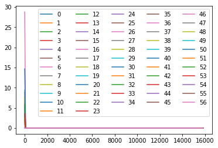


```python
# plot the distribution of all features to get the view of jump
nextplot()
densities = [scipy.stats.gaussian_kde(X[:, j]) for j in range(D)]
xs = np.linspace(0,np.max(X), 5)
for j in range(D):
    plt.plot(xs, densities[j](xs), label=j)
plt.legend(ncol=5)
```


    <matplotlib.legend.Legend at 0x20dd4089438>


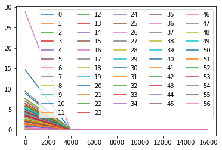


```python
# Let's compute z-scores; create two new variables Xz and Xtestz.
Xz = scipy.stats.zscore(X)
#normalize test set using parametrs used for training set
Xtestz = Xtest 
for feature in range(57):
    Xtestz[:,feature] = (Xtest[:,feature] - np.mean(X[:,feature]))/np.std(X[:,feature])
```


```python
# Let's check. Xz and Xtestz refer to the normalized datasets just created. We
# will use them throughout.
np.mean(Xz, axis=0)  # should be all 0
```


    array([ 1.85459768e-17,  9.27298839e-18, -5.56379304e-17, -9.27298839e-18,
            5.56379304e-17,  3.70919536e-17,  0.00000000e+00, -7.41839072e-17,
            5.56379304e-17,  0.00000000e+00, -1.85459768e-17, -2.43415945e-17,
           -4.63649420e-17,  1.85459768e-17,  1.85459768e-17,  3.70919536e-17,
           -3.70919536e-17, -9.27298839e-17, -1.66913791e-16,  9.27298839e-18,
            1.85459768e-17,  9.27298839e-18, -5.56379304e-17, -1.85459768e-17,
           -6.49109188e-17, -3.70919536e-17, -1.85459768e-17,  1.85459768e-17,
           -2.78189652e-17,  4.63649420e-17, -1.85459768e-17,  5.56379304e-17,
            0.00000000e+00, -1.85459768e-17,  3.70919536e-17,  1.85459768e-17,
           -9.27298839e-18,  4.63649420e-18,  1.85459768e-17,  9.27298839e-18,
            2.31824710e-17, -2.78189652e-17, -9.27298839e-18,  4.63649420e-18,
           -9.27298839e-18, -9.27298839e-18,  1.39094826e-17, -2.78189652e-17,
           -3.70919536e-17, -6.49109188e-17,  4.63649420e-18,  3.70919536e-17,
           -3.70919536e-17,  9.27298839e-18, -9.27298839e-18,  9.27298839e-18,
           -7.41839072e-17])


```python
np.var(Xz, axis=0)  # should be all 1
```


    array([1., 1., 1., 1., 1., 1., 1., 1., 1., 1., 1., 1., 1., 1., 1., 1., 1.,
           1., 1., 1., 1., 1., 1., 1., 1., 1., 1., 1., 1., 1., 1., 1., 1., 1.,
           1., 1., 1., 1., 1., 1., 1., 1., 1., 1., 1., 1., 1., 1., 1., 1., 1.,
           1., 1., 1., 1., 1., 1.])


```python
np.mean(Xtestz, axis=0)  # what do you get here?
```


    array([-5.73600192e-02, -3.37389835e-02,  4.02481250e-02,  5.51233798e-03,
           -2.51229644e-02,  1.67364997e-03,  5.29785531e-03, -1.38875040e-02,
            1.29802458e-02, -1.00804532e-02,  2.68026912e-02,  1.46804853e-02,
            1.28455840e-02,  9.34193448e-02, -1.71666713e-02,  6.17841473e-02,
           -3.08405298e-02, -1.02710095e-02,  1.49139906e-03,  6.82438979e-02,
           -2.45179646e-02, -4.53675036e-03, -3.12737328e-03,  4.09841941e-02,
            3.76515934e-02,  1.15494599e-02, -3.73018154e-03,  6.55839018e-02,
           -4.82178216e-02,  2.44089391e-02,  1.64408852e-02, -1.81514851e-02,
            2.47142980e-02, -1.61248615e-02,  1.75684573e-02, -1.33686432e-02,
           -4.40153254e-02,  1.11212504e-02,  2.40959269e-02, -1.06211719e-02,
           -2.06246544e-02,  6.23149655e-04, -3.45073187e-02,  4.24615929e-02,
           -1.59254291e-02,  9.77429328e-05,  6.85319587e-03,  5.38462415e-03,
            7.89156240e-03,  6.81007462e-03, -2.97234292e-02,  1.23785037e-02,
           -3.82610483e-02, -5.29891640e-02,  3.19860888e-02, -6.82149671e-03,
            5.35333143e-03])


```python
np.var(Xtestz, axis=0)
```


    array([0.61068019, 0.64746339, 1.25293677, 1.2774661 , 1.08119249,
           1.31173762, 1.28697678, 0.80611698, 1.33973062, 0.65533893,
           1.40034314, 0.93450565, 0.92877323, 2.0728468 , 0.86981179,
           2.75968123, 0.94816223, 0.88879741, 0.96502082, 2.70171906,
           0.99741759, 1.1098788 , 1.07414603, 2.08336518, 1.40816544,
           1.19772845, 0.9862879 , 1.76326753, 0.44704368, 1.28342341,
           1.91457064, 1.01476883, 1.14073258, 1.02208023, 0.75850361,
           0.89687605, 0.89454052, 1.35876298, 1.97554069, 1.14319113,
           0.60370645, 0.89279613, 0.61835224, 1.633395  , 1.01236044,
           1.04674566, 1.76525404, 1.2642542 , 1.20646248, 0.81912474,
           0.42556335, 0.62984245, 0.68863812, 0.05099329, 2.06687781,
           0.34306778, 0.98979083])


```python
np.sum(Xz ** 3)  # should be: 1925261.15
```


    1925261.1560010156


```python
# plot the distribution of all features
nextplot()
densities = [scipy.stats.gaussian_kde(Xz[:, j]) for j in range(D)]
xs = np.linspace(0,np.max(Xz), 200)
for j in range(D):
    plt.plot(xs, densities[j](xs), label=j)
plt.legend(ncol=5)
```


    <matplotlib.legend.Legend at 0x20dd428f780>


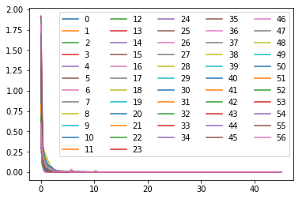


```python
# plot the distribution of all features to get the view of jump
nextplot()
densities = [scipy.stats.gaussian_kde(Xz[:, j]) for j in range(D)]
xs = np.linspace(0,np.max(Xz), 5)
for j in range(D):
    plt.plot(xs, densities[j](xs), label=j)
plt.legend(ncol=5)
```


    <matplotlib.legend.Legend at 0x20dd45ecda0>


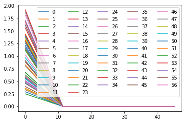


# 2. Maximum Likelihood Estimation

## Helper functions


```python
def logsumexp(x):
    """Computes log(sum(exp(x)).

    Uses offset trick to reduce risk of numeric over- or underflow. When x is a
    1D ndarray, computes logsumexp of its entries. When x is a 2D ndarray,
    computes logsumexp of each column.

    Keyword arguments:
    x : a 1D or 2D ndarray
    """
    offset = np.max(x, axis=0)
    return offset + np.log(np.sum(np.exp(x - offset), axis=0))
```


```python
# Define the logistic function. Make sure it operates on both scalars
# and vectors.
def sigma(x):
    # YOUR CODE HERE
    return 1 / (1 + np.exp(-x))
```


```python
# this should give:
# [0.5, array([0.26894142, 0.5, 0.73105858])]
[sigma(0), sigma(np.array([-1, 0, 1]))]
```


    [0.5, array([0.26894142, 0.5       , 0.73105858])]


```python
# Define the logarithm of the logistic function. Make sure it operates on both
# scalars and vectors. Perhaps helpful: isinstance(x, np.ndarray).
def logsigma(x):
    # YOUR CODE HERE
    return np.log( 1 / (1 + np.exp(-x)))
```


```python
# this should give:
# [-0.69314718055994529, array([-1.31326169, -0.69314718, -0.31326169])]
[logsigma(0), logsigma(np.array([-1, 0, 1]))]
```


    [-0.6931471805599453, array([-1.31326169, -0.69314718, -0.31326169])]


## 2b Log-likelihood and gradient


```python
def l(y, X, w):
    """Log-likelihood of the logistic regression model.

    Parameters
    ----------
    y : ndarray of shape (N,)
        Binary labels (either 0 or 1).
    X : ndarray of shape (N,D)
        Design matrix.
    w : ndarray of shape (D,)
        Weight vector.
    """
    # YOUR CODE HERE
    neta = np.matmul(X,w) 
    
    ll = np.sum(
                y[:]*logsigma(neta[:])
                + 
                (1- y[:])*logsigma(-neta[:])
            )             
          
    return(ll)
```


```python
# this should give:
# -47066.641667825766
l(y, Xz, np.linspace(-5, 5, D))
```


    -47066.641667825774


```python
def dl(y, X, w):
    """Gradient of the log-likelihood of the logistic regression model.

    Parameters
    ----------
    y : ndarray of shape (N,)
        Binary labels (either 0 or 1).
    X : ndarray of shape (N,D)
        Design matrix.
    w : ndarray of shape (D,)
        Weight vector.

    Returns
    -------
    ndarray of shape (D,)
    """
    # YOUR CODE HERE
    neta = np.matmul(X,w) 
    p_i = sigma(neta)
    error = y - p_i
    dl = np.dot(error,X)
        
    return (dl)
    

```


```python
# this should give:
# array([  551.33985842,   143.84116318,   841.83373606,   156.87237578,
#          802.61217579,   795.96202907,   920.69045803,   621.96516752,
#          659.18724769,   470.81259805,   771.32406968,   352.40325626,
#          455.66972482,   234.36600888,   562.45454038,   864.83981264,
#          787.19723703,   649.48042176,   902.6478154 ,   544.00539886,
#         1174.78638035,   120.3598967 ,   839.61141672,   633.30453444,
#         -706.66815087,  -630.2039816 ,  -569.3451386 ,  -527.50996698,
#         -359.53701083,  -476.64334832,  -411.60620464,  -375.11950586,
#         -345.37195689,  -376.22044258,  -407.31761977,  -456.23251936,
#         -596.86960184,  -107.97072355,  -394.82170044,  -229.18125598,
#         -288.46356547,  -362.13402385,  -450.87896465,  -277.03932676,
#         -414.99293368,  -452.28771693,  -167.54649092,  -270.9043748 ,
#         -252.20140951,  -357.72497343,  -259.12468742,   418.35938483,
#          604.54173228,    43.10390907,   152.24258478,   378.16731033,
#          416.12032881])
dl(y, Xz, np.linspace(-5, 5, D))
```


    array([ 551.33985842,  143.84116318,  841.83373606,  156.87237578,
            802.61217579,  795.96202907,  920.69045803,  621.96516752,
            659.18724769,  470.81259805,  771.32406968,  352.40325626,
            455.66972482,  234.36600888,  562.45454038,  864.83981264,
            787.19723703,  649.48042176,  902.6478154 ,  544.00539886,
           1174.78638035,  120.3598967 ,  839.61141672,  633.30453444,
           -706.66815087, -630.2039816 , -569.3451386 , -527.50996698,
           -359.53701083, -476.64334832, -411.60620464, -375.11950586,
           -345.37195689, -376.22044258, -407.31761977, -456.23251936,
           -596.86960184, -107.97072355, -394.82170044, -229.18125598,
           -288.46356547, -362.13402385, -450.87896465, -277.03932676,
           -414.99293368, -452.28771693, -167.54649092, -270.9043748 ,
           -252.20140951, -357.72497343, -259.12468742,  418.35938483,
            604.54173228,   43.10390907,  152.24258478,  378.16731033,
            416.12032881])


## 2c Gradient descent


```python
# you don't need to modify this function
def optimize(obj_up, theta0, nepochs=50, eps0=0.01, verbose=True):
    """Iteratively minimize a function.

    We use it here to run either gradient descent or stochastic gradient
    descent, using arbitrarly optimization criteria.

    Parameters
    ----------
    obj_up  : a tuple of form (f, update) containing two functions f and update.
              f(theta) computes the value of the objective function.
              update(theta,eps) performs an epoch of parameter update with step size
              eps and returns the result.
    theta0  : ndarray of shape (D,)
              Initial parameter vector.
    nepochs : int
              How many epochs (calls to update) to run.
    eps0    : float
              Initial step size.
    verbose : boolean
              Whether to print progress information.

    Returns
    -------
    A triple consisting of the fitted parameter vector, the values of the
    objective function after every epoch, and the step sizes that were used.
    """

    f, update = obj_up

    # initialize results
    theta = theta0
    values = np.zeros(nepochs + 1)
    eps = np.zeros(nepochs + 1)
    values[0] = f(theta0)
    eps[0] = eps0

    # now run the update function nepochs times
    for epoch in range(nepochs):
        if verbose:
            print(
                "Epoch {:3d}: f={:10.3f}, eps={:10.9f}".format(
                    epoch, values[epoch], eps[epoch]
                )
            )
        theta = update(theta, eps[epoch])

        # we use the bold driver heuristic
        values[epoch + 1] = f(theta)
        if values[epoch] < values[epoch + 1]:
            eps[epoch + 1] = eps[epoch] / 2.0
        else:
            eps[epoch + 1] = eps[epoch] * 1.05

    # all done
    if verbose:
        print("Result after {} epochs: f={}".format(nepochs, values[-1]))
    return theta, values, eps
```


```python
# define the objective and update function for one gradient-descent epoch for
# fitting an MLE estimate of logistic regression with gradient descent (should
# return a tuple of two functions; see optimize)
def gd(y, X):
    def objective(w):
        # YOUR CODE HERE
        return(-l(y, X, w))

    def update(w, eps):
        # YOUR CODE HERE
        w = w + eps* dl(y, X, w)
        return(w)
    return (objective, update)
```


```python
# this should give
# [47066.641667825766,
#  array([  4.13777838e+01,  -1.56745627e+01,   5.75882538e+01,
#           1.14225143e+01,   5.54249703e+01,   5.99229049e+01,
#           7.11220141e+01,   4.84761728e+01,   5.78067289e+01,
#           4.54794720e+01,   7.14638492e+01,   1.51369386e+01,
#           3.36375739e+01,   2.15061217e+01,   5.78014255e+01,
#           6.72743066e+01,   7.00829312e+01,   5.29328088e+01,
#           6.16042473e+01,   5.50018510e+01,   8.94624817e+01,
#           2.74784480e+01,   8.51763599e+01,   5.60363965e+01,
#          -2.55865589e+01,  -1.53788213e+01,  -4.67015412e+01,
#          -2.50356570e+00,  -3.85357592e+00,  -2.21819155e+00,
#           3.32098671e+00,   3.86933390e+00,  -2.00309898e+01,
#           3.84684492e+00,  -2.19847927e-01,  -1.29775457e+00,
#          -1.28374302e+01,  -2.78303173e+00,  -5.61671182e+00,
#           1.73657121e+01,  -6.81197570e+00,  -1.20249002e+01,
#           2.65789491e+00,  -1.39557852e+01,  -2.01135653e+01,
#          -2.72134051e+01,  -9.45952961e-01,  -1.02239111e+01,
#           1.52794293e-04,  -5.18938123e-01,  -3.19717561e+00,
#           4.62953437e+01,   7.87893022e+01,   1.88618651e+01,
#           2.85195027e+01,   5.04698358e+01,   6.41240689e+01])
f, update = gd(y, Xz)
[f(np.linspace(-5, 5, D)), update(np.linspace(-5, -5, D), 0.1)]
```


    [47066.641667825774,
     array([ 4.13777838e+01, -1.56745627e+01,  5.75882538e+01,  1.14225143e+01,
             5.54249703e+01,  5.99229049e+01,  7.11220141e+01,  4.84761728e+01,
             5.78067289e+01,  4.54794720e+01,  7.14638492e+01,  1.51369386e+01,
             3.36375739e+01,  2.15061217e+01,  5.78014255e+01,  6.72743066e+01,
             7.00829312e+01,  5.29328088e+01,  6.16042473e+01,  5.50018510e+01,
             8.94624817e+01,  2.74784480e+01,  8.51763599e+01,  5.60363965e+01,
            -2.55865589e+01, -1.53788213e+01, -4.67015412e+01, -2.50356570e+00,
            -3.85357592e+00, -2.21819155e+00,  3.32098671e+00,  3.86933390e+00,
            -2.00309898e+01,  3.84684492e+00, -2.19847927e-01, -1.29775457e+00,
            -1.28374302e+01, -2.78303173e+00, -5.61671182e+00,  1.73657121e+01,
            -6.81197570e+00, -1.20249002e+01,  2.65789491e+00, -1.39557852e+01,
            -2.01135653e+01, -2.72134051e+01, -9.45952961e-01, -1.02239111e+01,
             1.52794293e-04, -5.18938123e-01, -3.19717561e+00,  4.62953437e+01,
             7.87893022e+01,  1.88618651e+01,  2.85195027e+01,  5.04698358e+01,
             6.41240689e+01])]


```python
# you can run gradient descent!
numpy.random.seed(0)
w0 = np.random.normal(size=D)
wz_gd, vz_gd, ez_gd = optimize(gd(y, Xz), w0, nepochs=500)
```

    Epoch   0: f=  6636.208, eps=0.010000000
    Epoch   1: f=  4216.957, eps=0.010500000
    Epoch   2: f=  2657.519, eps=0.011025000
    Epoch   3: f=  1926.135, eps=0.011576250
    Epoch   4: f=  1449.495, eps=0.012155063
    Epoch   5: f=  1207.529, eps=0.012762816
    Epoch   6: f=  1052.489, eps=0.013400956
    Epoch   7: f=   957.275, eps=0.014071004
    Epoch   8: f=   899.610, eps=0.014774554
    Epoch   9: f=   882.904, eps=0.015513282
    Epoch  10: f=  1017.083, eps=0.007756641
    Epoch  11: f=   840.760, eps=0.008144473
    Epoch  12: f=   805.649, eps=0.008551697
    Epoch  13: f=   822.108, eps=0.004275848
    Epoch  14: f=   746.377, eps=0.004489641
    Epoch  15: f=   735.803, eps=0.004714123
    Epoch  16: f=   729.780, eps=0.004949829
    Epoch  17: f=   724.467, eps=0.005197320
    Epoch  18: f=   719.408, eps=0.005457186
    Epoch  19: f=   714.564, eps=0.005730046
    Epoch  20: f=   709.932, eps=0.006016548
    Epoch  21: f=   705.514, eps=0.006317375
    Epoch  22: f=   701.321, eps=0.006633244
    Epoch  23: f=   697.373, eps=0.006964906
    Epoch  24: f=   693.728, eps=0.007313152
    Epoch  25: f=   690.591, eps=0.007678809
    Epoch  26: f=   688.614, eps=0.008062750
    Epoch  27: f=   688.607, eps=0.008465887
    Epoch  28: f=   690.854, eps=0.004232944
    Epoch  29: f=   679.967, eps=0.004444591
    Epoch  30: f=   678.649, eps=0.004666820
    Epoch  31: f=   677.447, eps=0.004900161
    Epoch  32: f=   676.292, eps=0.005145169
    Epoch  33: f=   675.182, eps=0.005402428
    Epoch  34: f=   674.120, eps=0.005672549
    Epoch  35: f=   673.114, eps=0.005956177
    Epoch  36: f=   672.177, eps=0.006253986
    Epoch  37: f=   671.334, eps=0.006566685
    Epoch  38: f=   670.656, eps=0.006895019
    Epoch  39: f=   670.397, eps=0.007239770
    Epoch  40: f=   671.342, eps=0.003619885
    Epoch  41: f=   668.932, eps=0.003800879
    Epoch  42: f=   668.378, eps=0.003990923
    Epoch  43: f=   668.027, eps=0.004190469
    Epoch  44: f=   667.720, eps=0.004399993
    Epoch  45: f=   667.433, eps=0.004619993
    Epoch  46: f=   667.159, eps=0.004850992
    Epoch  47: f=   666.897, eps=0.005093542
    Epoch  48: f=   666.650, eps=0.005348219
    Epoch  49: f=   666.417, eps=0.005615630
    Epoch  50: f=   666.201, eps=0.005896411
    Epoch  51: f=   666.008, eps=0.006191232
    Epoch  52: f=   665.858, eps=0.006500794
    Epoch  53: f=   665.812, eps=0.006825833
    Epoch  54: f=   666.068, eps=0.003412917
    Epoch  55: f=   665.424, eps=0.003583562
    Epoch  56: f=   665.290, eps=0.003762741
    Epoch  57: f=   665.204, eps=0.003950878
    Epoch  58: f=   665.128, eps=0.004148421
    Epoch  59: f=   665.054, eps=0.004355843
    Epoch  60: f=   664.982, eps=0.004573635
    Epoch  61: f=   664.911, eps=0.004802316
    Epoch  62: f=   664.842, eps=0.005042432
    Epoch  63: f=   664.773, eps=0.005294554
    Epoch  64: f=   664.707, eps=0.005559282
    Epoch  65: f=   664.641, eps=0.005837246
    Epoch  66: f=   664.578, eps=0.006129108
    Epoch  67: f=   664.518, eps=0.006435563
    Epoch  68: f=   664.467, eps=0.006757341
    Epoch  69: f=   664.446, eps=0.007095208
    Epoch  70: f=   664.544, eps=0.003547604
    Epoch  71: f=   664.339, eps=0.003724984
    Epoch  72: f=   664.278, eps=0.003911234
    Epoch  73: f=   664.239, eps=0.004106795
    Epoch  74: f=   664.206, eps=0.004312135
    Epoch  75: f=   664.173, eps=0.004527742
    Epoch  76: f=   664.139, eps=0.004754129
    Epoch  77: f=   664.106, eps=0.004991835
    Epoch  78: f=   664.072, eps=0.005241427
    Epoch  79: f=   664.037, eps=0.005503499
    Epoch  80: f=   664.002, eps=0.005778674
    Epoch  81: f=   663.967, eps=0.006067607
    Epoch  82: f=   663.936, eps=0.006370988
    Epoch  83: f=   663.918, eps=0.006689537
    Epoch  84: f=   663.948, eps=0.003344768
    Epoch  85: f=   663.839, eps=0.003512007
    Epoch  86: f=   663.807, eps=0.003687607
    Epoch  87: f=   663.783, eps=0.003871988
    Epoch  88: f=   663.760, eps=0.004065587
    Epoch  89: f=   663.737, eps=0.004268866
    Epoch  90: f=   663.713, eps=0.004482310
    Epoch  91: f=   663.688, eps=0.004706425
    Epoch  92: f=   663.661, eps=0.004941746
    Epoch  93: f=   663.634, eps=0.005188834
    Epoch  94: f=   663.606, eps=0.005448275
    Epoch  95: f=   663.576, eps=0.005720689
    Epoch  96: f=   663.546, eps=0.006006724
    Epoch  97: f=   663.514, eps=0.006307060
    Epoch  98: f=   663.482, eps=0.006622413
    Epoch  99: f=   663.451, eps=0.006953533
    Epoch 100: f=   663.427, eps=0.007301210
    Epoch 101: f=   663.442, eps=0.003650605
    Epoch 102: f=   663.371, eps=0.003833135
    Epoch 103: f=   663.340, eps=0.004024792
    Epoch 104: f=   663.316, eps=0.004226032
    Epoch 105: f=   663.294, eps=0.004437333
    Epoch 106: f=   663.271, eps=0.004659200
    Epoch 107: f=   663.248, eps=0.004892160
    Epoch 108: f=   663.223, eps=0.005136768
    Epoch 109: f=   663.198, eps=0.005393606
    Epoch 110: f=   663.172, eps=0.005663287
    Epoch 111: f=   663.146, eps=0.005946451
    Epoch 112: f=   663.121, eps=0.006243773
    Epoch 113: f=   663.102, eps=0.006555962
    Epoch 114: f=   663.108, eps=0.003277981
    Epoch 115: f=   663.042, eps=0.003441880
    Epoch 116: f=   663.019, eps=0.003613974
    Epoch 117: f=   663.001, eps=0.003794673
    Epoch 118: f=   662.982, eps=0.003984406
    Epoch 119: f=   662.963, eps=0.004183627
    Epoch 120: f=   662.943, eps=0.004392808
    Epoch 121: f=   662.922, eps=0.004612449
    Epoch 122: f=   662.900, eps=0.004843071
    Epoch 123: f=   662.877, eps=0.005085225
    Epoch 124: f=   662.853, eps=0.005339486
    Epoch 125: f=   662.828, eps=0.005606460
    Epoch 126: f=   662.802, eps=0.005886783
    Epoch 127: f=   662.774, eps=0.006181122
    Epoch 128: f=   662.745, eps=0.006490178
    Epoch 129: f=   662.715, eps=0.006814687
    Epoch 130: f=   662.685, eps=0.007155422
    Epoch 131: f=   662.659, eps=0.007513193
    Epoch 132: f=   662.656, eps=0.007888852
    Epoch 133: f=   662.786, eps=0.003944426
    Epoch 134: f=   662.631, eps=0.004141647
    Epoch 135: f=   662.578, eps=0.004348730
    Epoch 136: f=   662.545, eps=0.004566166
    Epoch 137: f=   662.519, eps=0.004794475
    Epoch 138: f=   662.497, eps=0.005034198
    Epoch 139: f=   662.477, eps=0.005285908
    Epoch 140: f=   662.462, eps=0.005550204
    Epoch 141: f=   662.457, eps=0.005827714
    Epoch 142: f=   662.476, eps=0.002913857
    Epoch 143: f=   662.373, eps=0.003059550
    Epoch 144: f=   662.355, eps=0.003212527
    Epoch 145: f=   662.340, eps=0.003373154
    Epoch 146: f=   662.325, eps=0.003541811
    Epoch 147: f=   662.310, eps=0.003718902
    Epoch 148: f=   662.293, eps=0.003904847
    Epoch 149: f=   662.276, eps=0.004100089
    Epoch 150: f=   662.257, eps=0.004305094
    Epoch 151: f=   662.238, eps=0.004520348
    Epoch 152: f=   662.218, eps=0.004746366
    Epoch 153: f=   662.197, eps=0.004983684
    Epoch 154: f=   662.175, eps=0.005232868
    Epoch 155: f=   662.152, eps=0.005494512
    Epoch 156: f=   662.128, eps=0.005769237
    Epoch 157: f=   662.103, eps=0.006057699
    Epoch 158: f=   662.076, eps=0.006360584
    Epoch 159: f=   662.048, eps=0.006678613
    Epoch 160: f=   662.019, eps=0.007012544
    Epoch 161: f=   661.989, eps=0.007363171
    Epoch 162: f=   661.957, eps=0.007731330
    Epoch 163: f=   661.924, eps=0.008117896
    Epoch 164: f=   661.890, eps=0.008523791
    Epoch 165: f=   661.859, eps=0.008949981
    Epoch 166: f=   661.868, eps=0.004474990
    Epoch 167: f=   661.834, eps=0.004698740
    Epoch 168: f=   661.809, eps=0.004933677
    Epoch 169: f=   661.791, eps=0.005180361
    Epoch 170: f=   661.780, eps=0.005439379
    Epoch 171: f=   661.784, eps=0.002719689
    Epoch 172: f=   661.698, eps=0.002855674
    Epoch 173: f=   661.685, eps=0.002998458
    Epoch 174: f=   661.672, eps=0.003148380
    Epoch 175: f=   661.659, eps=0.003305799
    Epoch 176: f=   661.645, eps=0.003471089
    Epoch 177: f=   661.630, eps=0.003644644
    Epoch 178: f=   661.615, eps=0.003826876
    Epoch 179: f=   661.599, eps=0.004018220
    Epoch 180: f=   661.582, eps=0.004219131
    Epoch 181: f=   661.564, eps=0.004430087
    Epoch 182: f=   661.546, eps=0.004651592
    Epoch 183: f=   661.526, eps=0.004884171
    Epoch 184: f=   661.506, eps=0.005128380
    Epoch 185: f=   661.485, eps=0.005384799
    Epoch 186: f=   661.462, eps=0.005654039
    Epoch 187: f=   661.439, eps=0.005936741
    Epoch 188: f=   661.414, eps=0.006233578
    Epoch 189: f=   661.388, eps=0.006545257
    Epoch 190: f=   661.361, eps=0.006872520
    Epoch 191: f=   661.333, eps=0.007216146
    Epoch 192: f=   661.303, eps=0.007576953
    Epoch 193: f=   661.272, eps=0.007955801
    Epoch 194: f=   661.240, eps=0.008353591
    Epoch 195: f=   661.206, eps=0.008771270
    Epoch 196: f=   661.170, eps=0.009209834
    Epoch 197: f=   661.133, eps=0.009670325
    Epoch 198: f=   661.097, eps=0.010153842
    Epoch 199: f=   661.093, eps=0.010661534
    Epoch 200: f=   661.463, eps=0.005330767
    Epoch 201: f=   661.555, eps=0.002665383
    Epoch 202: f=   660.978, eps=0.002798653
    Epoch 203: f=   660.966, eps=0.002938585
    Epoch 204: f=   660.955, eps=0.003085514
    Epoch 205: f=   660.942, eps=0.003239790
    Epoch 206: f=   660.929, eps=0.003401780
    Epoch 207: f=   660.916, eps=0.003571869
    Epoch 208: f=   660.902, eps=0.003750462
    Epoch 209: f=   660.887, eps=0.003937985
    Epoch 210: f=   660.871, eps=0.004134885
    Epoch 211: f=   660.855, eps=0.004341629
    Epoch 212: f=   660.837, eps=0.004558710
    Epoch 213: f=   660.819, eps=0.004786646
    Epoch 214: f=   660.801, eps=0.005025978
    Epoch 215: f=   660.781, eps=0.005277277
    Epoch 216: f=   660.760, eps=0.005541141
    Epoch 217: f=   660.738, eps=0.005818198
    Epoch 218: f=   660.715, eps=0.006109108
    Epoch 219: f=   660.691, eps=0.006414563
    Epoch 220: f=   660.666, eps=0.006735291
    Epoch 221: f=   660.640, eps=0.007072056
    Epoch 222: f=   660.612, eps=0.007425659
    Epoch 223: f=   660.583, eps=0.007796941
    Epoch 224: f=   660.553, eps=0.008186788
    Epoch 225: f=   660.521, eps=0.008596128
    Epoch 226: f=   660.488, eps=0.009025934
    Epoch 227: f=   660.453, eps=0.009477231
    Epoch 228: f=   660.417, eps=0.009951093
    Epoch 229: f=   660.379, eps=0.010448647
    Epoch 230: f=   660.344, eps=0.010971080
    Epoch 231: f=   660.362, eps=0.005485540
    Epoch 232: f=   660.377, eps=0.002742770
    Epoch 233: f=   660.267, eps=0.002879908
    Epoch 234: f=   660.254, eps=0.003023904
    Epoch 235: f=   660.243, eps=0.003175099
    Epoch 236: f=   660.231, eps=0.003333854
    Epoch 237: f=   660.218, eps=0.003500547
    Epoch 238: f=   660.205, eps=0.003675574
    Epoch 239: f=   660.191, eps=0.003859353
    Epoch 240: f=   660.176, eps=0.004052320
    Epoch 241: f=   660.161, eps=0.004254936
    Epoch 242: f=   660.145, eps=0.004467683
    Epoch 243: f=   660.128, eps=0.004691067
    Epoch 244: f=   660.111, eps=0.004925621
    Epoch 245: f=   660.092, eps=0.005171902
    Epoch 246: f=   660.073, eps=0.005430497
    Epoch 247: f=   660.052, eps=0.005702022
    Epoch 248: f=   660.031, eps=0.005987123
    Epoch 249: f=   660.009, eps=0.006286479
    Epoch 250: f=   659.985, eps=0.006600803
    Epoch 251: f=   659.961, eps=0.006930843
    Epoch 252: f=   659.935, eps=0.007277385
    Epoch 253: f=   659.908, eps=0.007641254
    Epoch 254: f=   659.880, eps=0.008023317
    Epoch 255: f=   659.850, eps=0.008424483
    Epoch 256: f=   659.819, eps=0.008845707
    Epoch 257: f=   659.787, eps=0.009287992
    Epoch 258: f=   659.754, eps=0.009752392
    Epoch 259: f=   659.737, eps=0.010240012
    Epoch 260: f=   659.888, eps=0.005120006
    Epoch 261: f=   659.906, eps=0.002560003
    Epoch 262: f=   659.651, eps=0.002688003
    Epoch 263: f=   659.641, eps=0.002822403
    Epoch 264: f=   659.631, eps=0.002963523
    Epoch 265: f=   659.620, eps=0.003111700
    Epoch 266: f=   659.609, eps=0.003267285
    Epoch 267: f=   659.597, eps=0.003430649
    Epoch 268: f=   659.585, eps=0.003602181
    Epoch 269: f=   659.572, eps=0.003782290
    Epoch 270: f=   659.558, eps=0.003971405
    Epoch 271: f=   659.543, eps=0.004169975
    Epoch 272: f=   659.528, eps=0.004378474
    Epoch 273: f=   659.513, eps=0.004597397
    Epoch 274: f=   659.496, eps=0.004827267
    Epoch 275: f=   659.479, eps=0.005068631
    Epoch 276: f=   659.460, eps=0.005322062
    Epoch 277: f=   659.441, eps=0.005588165
    Epoch 278: f=   659.421, eps=0.005867574
    Epoch 279: f=   659.400, eps=0.006160952
    Epoch 280: f=   659.378, eps=0.006469000
    Epoch 281: f=   659.355, eps=0.006792450
    Epoch 282: f=   659.331, eps=0.007132072
    Epoch 283: f=   659.305, eps=0.007488676
    Epoch 284: f=   659.279, eps=0.007863110
    Epoch 285: f=   659.251, eps=0.008256265
    Epoch 286: f=   659.222, eps=0.008669078
    Epoch 287: f=   659.191, eps=0.009102532
    Epoch 288: f=   659.159, eps=0.009557659
    Epoch 289: f=   659.125, eps=0.010035542
    Epoch 290: f=   659.090, eps=0.010537319
    Epoch 291: f=   659.053, eps=0.011064185
    Epoch 292: f=   659.016, eps=0.011617394
    Epoch 293: f=   658.992, eps=0.012198264
    Epoch 294: f=   659.226, eps=0.006099132
    Epoch 295: f=   659.526, eps=0.003049566
    Epoch 296: f=   658.916, eps=0.003202044
    Epoch 297: f=   658.891, eps=0.003362147
    Epoch 298: f=   658.878, eps=0.003530254
    Epoch 299: f=   658.865, eps=0.003706767
    Epoch 300: f=   658.852, eps=0.003892105
    Epoch 301: f=   658.839, eps=0.004086710
    Epoch 302: f=   658.825, eps=0.004291046
    Epoch 303: f=   658.810, eps=0.004505598
    Epoch 304: f=   658.795, eps=0.004730878
    Epoch 305: f=   658.778, eps=0.004967422
    Epoch 306: f=   658.761, eps=0.005215793
    Epoch 307: f=   658.743, eps=0.005476582
    Epoch 308: f=   658.725, eps=0.005750412
    Epoch 309: f=   658.705, eps=0.006037932
    Epoch 310: f=   658.684, eps=0.006339829
    Epoch 311: f=   658.663, eps=0.006656820
    Epoch 312: f=   658.640, eps=0.006989661
    Epoch 313: f=   658.617, eps=0.007339144
    Epoch 314: f=   658.593, eps=0.007706101
    Epoch 315: f=   658.573, eps=0.008091406
    Epoch 316: f=   658.582, eps=0.004045703
    Epoch 317: f=   658.544, eps=0.004247988
    Epoch 318: f=   658.521, eps=0.004460388
    Epoch 319: f=   658.503, eps=0.004683407
    Epoch 320: f=   658.486, eps=0.004917578
    Epoch 321: f=   658.470, eps=0.005163456
    Epoch 322: f=   658.455, eps=0.005421629
    Epoch 323: f=   658.443, eps=0.005692711
    Epoch 324: f=   658.436, eps=0.005977346
    Epoch 325: f=   658.450, eps=0.002988673
    Epoch 326: f=   658.381, eps=0.003138107
    Epoch 327: f=   658.368, eps=0.003295012
    Epoch 328: f=   658.356, eps=0.003459763
    Epoch 329: f=   658.345, eps=0.003632751
    Epoch 330: f=   658.333, eps=0.003814388
    Epoch 331: f=   658.320, eps=0.004005108
    Epoch 332: f=   658.307, eps=0.004205363
    Epoch 333: f=   658.293, eps=0.004415631
    Epoch 334: f=   658.278, eps=0.004636413
    Epoch 335: f=   658.263, eps=0.004868234
    Epoch 336: f=   658.247, eps=0.005111645
    Epoch 337: f=   658.230, eps=0.005367228
    Epoch 338: f=   658.212, eps=0.005635589
    Epoch 339: f=   658.193, eps=0.005917368
    Epoch 340: f=   658.174, eps=0.006213237
    Epoch 341: f=   658.153, eps=0.006523899
    Epoch 342: f=   658.132, eps=0.006850094
    Epoch 343: f=   658.109, eps=0.007192598
    Epoch 344: f=   658.086, eps=0.007552228
    Epoch 345: f=   658.061, eps=0.007929840
    Epoch 346: f=   658.036, eps=0.008326332
    Epoch 347: f=   658.017, eps=0.008742648
    Epoch 348: f=   658.040, eps=0.004371324
    Epoch 349: f=   658.004, eps=0.004589890
    Epoch 350: f=   657.981, eps=0.004819385
    Epoch 351: f=   657.965, eps=0.005060354
    Epoch 352: f=   657.954, eps=0.005313372
    Epoch 353: f=   657.953, eps=0.005579040
    Epoch 354: f=   657.969, eps=0.002789520
    Epoch 355: f=   657.876, eps=0.002928996
    Epoch 356: f=   657.864, eps=0.003075446
    Epoch 357: f=   657.854, eps=0.003229218
    Epoch 358: f=   657.844, eps=0.003390679
    Epoch 359: f=   657.833, eps=0.003560213
    Epoch 360: f=   657.821, eps=0.003738224
    Epoch 361: f=   657.809, eps=0.003925135
    Epoch 362: f=   657.797, eps=0.004121392
    Epoch 363: f=   657.783, eps=0.004327461
    Epoch 364: f=   657.770, eps=0.004543834
    Epoch 365: f=   657.755, eps=0.004771026
    Epoch 366: f=   657.740, eps=0.005009577
    Epoch 367: f=   657.724, eps=0.005260056
    Epoch 368: f=   657.707, eps=0.005523059
    Epoch 369: f=   657.689, eps=0.005799212
    Epoch 370: f=   657.671, eps=0.006089173
    Epoch 371: f=   657.651, eps=0.006393631
    Epoch 372: f=   657.631, eps=0.006713313
    Epoch 373: f=   657.609, eps=0.007048978
    Epoch 374: f=   657.587, eps=0.007401427
    Epoch 375: f=   657.564, eps=0.007771499
    Epoch 376: f=   657.539, eps=0.008160074
    Epoch 377: f=   657.513, eps=0.008568077
    Epoch 378: f=   657.486, eps=0.008996481
    Epoch 379: f=   657.460, eps=0.009446305
    Epoch 380: f=   657.445, eps=0.009918621
    Epoch 381: f=   657.554, eps=0.004959310
    Epoch 382: f=   657.540, eps=0.005207276
    Epoch 383: f=   657.567, eps=0.002603638
    Epoch 384: f=   657.357, eps=0.002733820
    Epoch 385: f=   657.348, eps=0.002870511
    Epoch 386: f=   657.339, eps=0.003014036
    Epoch 387: f=   657.330, eps=0.003164738
    Epoch 388: f=   657.320, eps=0.003322975
    Epoch 389: f=   657.310, eps=0.003489124
    Epoch 390: f=   657.299, eps=0.003663580
    Epoch 391: f=   657.287, eps=0.003846759
    Epoch 392: f=   657.275, eps=0.004039097
    Epoch 393: f=   657.263, eps=0.004241052
    Epoch 394: f=   657.250, eps=0.004453104
    Epoch 395: f=   657.236, eps=0.004675760
    Epoch 396: f=   657.221, eps=0.004909548
    Epoch 397: f=   657.206, eps=0.005155025
    Epoch 398: f=   657.190, eps=0.005412776
    Epoch 399: f=   657.173, eps=0.005683415
    Epoch 400: f=   657.156, eps=0.005967586
    Epoch 401: f=   657.138, eps=0.006265965
    Epoch 402: f=   657.118, eps=0.006579263
    Epoch 403: f=   657.098, eps=0.006908226
    Epoch 404: f=   657.077, eps=0.007253638
    Epoch 405: f=   657.054, eps=0.007616320
    Epoch 406: f=   657.031, eps=0.007997136
    Epoch 407: f=   657.007, eps=0.008396992
    Epoch 408: f=   656.981, eps=0.008816842
    Epoch 409: f=   656.954, eps=0.009257684
    Epoch 410: f=   656.926, eps=0.009720568
    Epoch 411: f=   656.896, eps=0.010206597
    Epoch 412: f=   656.866, eps=0.010716927
    Epoch 413: f=   656.838, eps=0.011252773
    Epoch 414: f=   656.871, eps=0.005626387
    Epoch 415: f=   656.908, eps=0.002813193
    Epoch 416: f=   656.776, eps=0.002953853
    Epoch 417: f=   656.765, eps=0.003101546
    Epoch 418: f=   656.755, eps=0.003256623
    Epoch 419: f=   656.745, eps=0.003419454
    Epoch 420: f=   656.735, eps=0.003590427
    Epoch 421: f=   656.724, eps=0.003769948
    Epoch 422: f=   656.713, eps=0.003958445
    Epoch 423: f=   656.701, eps=0.004156368
    Epoch 424: f=   656.689, eps=0.004364186
    Epoch 425: f=   656.676, eps=0.004582395
    Epoch 426: f=   656.662, eps=0.004811515
    Epoch 427: f=   656.648, eps=0.005052091
    Epoch 428: f=   656.632, eps=0.005304695
    Epoch 429: f=   656.617, eps=0.005569930
    Epoch 430: f=   656.600, eps=0.005848427
    Epoch 431: f=   656.583, eps=0.006140848
    Epoch 432: f=   656.564, eps=0.006447890
    Epoch 433: f=   656.545, eps=0.006770285
    Epoch 434: f=   656.525, eps=0.007108799
    Epoch 435: f=   656.504, eps=0.007464239
    Epoch 436: f=   656.482, eps=0.007837451
    Epoch 437: f=   656.459, eps=0.008229324
    Epoch 438: f=   656.435, eps=0.008640790
    Epoch 439: f=   656.410, eps=0.009072829
    Epoch 440: f=   656.388, eps=0.009526471
    Epoch 441: f=   656.406, eps=0.004763235
    Epoch 442: f=   656.387, eps=0.005001397
    Epoch 443: f=   656.379, eps=0.005251467
    Epoch 444: f=   656.381, eps=0.002625734
    Epoch 445: f=   656.303, eps=0.002757020
    Epoch 446: f=   656.295, eps=0.002894871
    Epoch 447: f=   656.286, eps=0.003039615
    Epoch 448: f=   656.277, eps=0.003191596
    Epoch 449: f=   656.268, eps=0.003351175
    Epoch 450: f=   656.258, eps=0.003518734
    Epoch 451: f=   656.248, eps=0.003694671
    Epoch 452: f=   656.237, eps=0.003879404
    Epoch 453: f=   656.226, eps=0.004073375
    Epoch 454: f=   656.214, eps=0.004277043
    Epoch 455: f=   656.202, eps=0.004490895
    Epoch 456: f=   656.189, eps=0.004715440
    Epoch 457: f=   656.175, eps=0.004951212
    Epoch 458: f=   656.161, eps=0.005198773
    Epoch 459: f=   656.145, eps=0.005458711
    Epoch 460: f=   656.130, eps=0.005731647
    Epoch 461: f=   656.113, eps=0.006018229
    Epoch 462: f=   656.096, eps=0.006319141
    Epoch 463: f=   656.077, eps=0.006635098
    Epoch 464: f=   656.058, eps=0.006966853
    Epoch 465: f=   656.038, eps=0.007315195
    Epoch 466: f=   656.017, eps=0.007680955
    Epoch 467: f=   655.995, eps=0.008065003
    Epoch 468: f=   655.972, eps=0.008468253
    Epoch 469: f=   655.948, eps=0.008891666
    Epoch 470: f=   655.923, eps=0.009336249
    Epoch 471: f=   655.896, eps=0.009803061
    Epoch 472: f=   655.868, eps=0.010293215
    Epoch 473: f=   655.841, eps=0.010807875
    Epoch 474: f=   655.835, eps=0.011348269
    Epoch 475: f=   656.135, eps=0.005674135
    Epoch 476: f=   656.301, eps=0.002837067
    Epoch 477: f=   655.760, eps=0.002978921
    Epoch 478: f=   655.744, eps=0.003127867
    Epoch 479: f=   655.735, eps=0.003284260
    Epoch 480: f=   655.725, eps=0.003448473
    Epoch 481: f=   655.716, eps=0.003620897
    Epoch 482: f=   655.705, eps=0.003801941
    Epoch 483: f=   655.695, eps=0.003992039
    Epoch 484: f=   655.684, eps=0.004191640
    Epoch 485: f=   655.672, eps=0.004401222
    Epoch 486: f=   655.659, eps=0.004621284
    Epoch 487: f=   655.646, eps=0.004852348
    Epoch 488: f=   655.633, eps=0.005094965
    Epoch 489: f=   655.619, eps=0.005349713
    Epoch 490: f=   655.604, eps=0.005617199
    Epoch 491: f=   655.588, eps=0.005898059
    Epoch 492: f=   655.571, eps=0.006192962
    Epoch 493: f=   655.554, eps=0.006502610
    Epoch 494: f=   655.536, eps=0.006827741
    Epoch 495: f=   655.517, eps=0.007169128
    Epoch 496: f=   655.497, eps=0.007527584
    Epoch 497: f=   655.476, eps=0.007903963
    Epoch 498: f=   655.454, eps=0.008299161
    Epoch 499: f=   655.432, eps=0.008714119
    Result after 500 epochs: f=655.4134964699493
    


```python
# look at how gradient descent made progess
# YOUR CODE HERE
plt.plot(range(501),vz_gd)
plt.xlabel('epochs')
plt.ylabel('objective function value')
```


    Text(0,0.5,'objective function value')


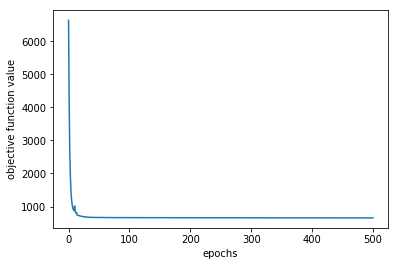


```python
plt.plot(range(30),vz_gd[0:30])
plt.xlabel('epochs')
plt.ylabel('objective function value')
```


    Text(0,0.5,'objective function value')


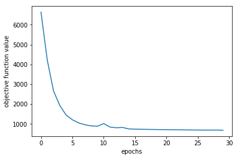


## 2d Stochastic gradient descent


```python
def sgdepoch(y, X, w, eps):
    """Run one SGD epoch and return the updated weight vector. """
    # Run N stochastic gradient steps (without replacement). Do not rescale each
    # step by factor N (i.e., proceed differently than in the lecture slides).
    # YOUR CODE HERE
    samples = np.random.choice(len(X),size =len(X),replace = False)
    for sample in samples:
        w = w + eps* dl(y[sample], X[sample], w)
    return (w)
```


```python
# when you run this multiple times, with 50% probability you should get the
# following result (there is one other result which is very close):
# array([ -3.43689655e+02,  -1.71161311e+02,  -5.71093536e+02,
#         -5.16478220e+01,   4.66294348e+02,  -3.71589878e+02,
#          5.21493183e+02,   1.25699230e+03,   8.33804130e+02,
#          5.63185399e+02,   1.32761302e+03,  -2.64104011e+02,
#          7.10693307e+02,  -1.75497331e+02,  -1.94174427e+02,
#          1.11641507e+02,  -3.30817509e+02,  -3.46754913e+02,
#          8.48722111e+02,  -1.89136304e+02,  -4.25693844e+02,
#         -1.23084189e+02,  -2.95894797e+02,  -2.35789333e+02,
#         -3.38695243e+02,  -3.05642830e+02,  -2.28975383e+02,
#         -2.38075137e+02,  -1.66702530e+02,  -2.27341599e+02,
#         -1.77575620e+02,  -1.49093855e+02,  -1.70028859e+02,
#         -1.50243833e+02,  -1.82986008e+02,  -2.41143708e+02,
#         -3.31047159e+02,  -5.79991185e+01,  -1.98477863e+02,
#         -1.91264948e+02,  -1.17371919e+02,  -1.66953779e+02,
#         -2.01472565e+02,  -1.23330949e+02,  -3.00857740e+02,
#         -1.95853348e+02,  -7.44868073e+01,  -1.11172370e+02,
#         -1.57618226e+02,  -1.25729512e+00,  -1.45536466e+02,
#         -1.43362438e+02,  -3.00429708e+02,  -9.84391082e+01,
#         -4.54152047e+01,  -5.26492232e+01,  -1.45175427e+02])
sgdepoch(y[1:3], Xz[1:3, :], np.linspace(-5, 5, D), 1000)
```


    array([-3.43689655e+02, -1.71161311e+02, -5.71093536e+02, -5.16478220e+01,
            4.66294348e+02, -3.71589878e+02,  5.21493183e+02,  1.25699230e+03,
            8.33804130e+02,  5.63185399e+02,  1.32761302e+03, -2.64104011e+02,
            7.10693307e+02, -1.75497331e+02, -1.94174427e+02,  1.11641507e+02,
           -3.30817509e+02, -3.46754913e+02,  8.48722111e+02, -1.89136304e+02,
           -4.25693844e+02, -1.23084189e+02, -2.95894797e+02, -2.35789333e+02,
           -3.38695243e+02, -3.05642830e+02, -2.28975383e+02, -2.38075137e+02,
           -1.66702530e+02, -2.27341599e+02, -1.77575620e+02, -1.49093855e+02,
           -1.70028859e+02, -1.50243833e+02, -1.82986008e+02, -2.41143708e+02,
           -3.31047159e+02, -5.79991185e+01, -1.98477863e+02, -1.91264948e+02,
           -1.17371919e+02, -1.66953779e+02, -2.01472565e+02, -1.23330949e+02,
           -3.00857740e+02, -1.95853348e+02, -7.44868073e+01, -1.11172370e+02,
           -1.57618226e+02, -1.25729512e+00, -1.45536466e+02, -1.43362438e+02,
           -3.00429708e+02, -9.84391082e+01, -4.54152047e+01, -5.26492232e+01,
           -1.45175427e+02])


```python
# define the objective and update function for one gradient-descent epoch for
# fitting an MLE estimate of logistic regression with stochastic gradient descent
# (should return a tuple of two functions; see optimize)
def sgd(y, X):
    def objective(w):
        # YOUR CODE HERE
        return(-l(y, X, w))

    def update(w, eps):
        return sgdepoch(y, X, w, eps)

    return (objective, update)
```


```python
# with 50% probability, you should get:
# [40.864973045695081,
#  array([ -3.43689655e+02,  -1.71161311e+02,  -5.71093536e+02,
#          -5.16478220e+01,   4.66294348e+02,  -3.71589878e+02,
#           5.21493183e+02,   1.25699230e+03,   8.33804130e+02,
#           5.63185399e+02,   1.32761302e+03,  -2.64104011e+02,
#           7.10693307e+02,  -1.75497331e+02,  -1.94174427e+02,
#           1.11641507e+02,  -3.30817509e+02,  -3.46754913e+02,
#           8.48722111e+02,  -1.89136304e+02,  -4.25693844e+02,
#          -1.23084189e+02,  -2.95894797e+02,  -2.35789333e+02,
#          -3.38695243e+02,  -3.05642830e+02,  -2.28975383e+02,
#          -2.38075137e+02,  -1.66702530e+02,  -2.27341599e+02,
#          -1.77575620e+02,  -1.49093855e+02,  -1.70028859e+02,
#          -1.50243833e+02,  -1.82986008e+02,  -2.41143708e+02,
#          -3.31047159e+02,  -5.79991185e+01,  -1.98477863e+02,
#          -1.91264948e+02,  -1.17371919e+02,  -1.66953779e+02,
#          -2.01472565e+02,  -1.23330949e+02,  -3.00857740e+02,
#          -1.95853348e+02,  -7.44868073e+01,  -1.11172370e+02,
#          -1.57618226e+02,  -1.25729512e+00,  -1.45536466e+02,
#          -1.43362438e+02,  -3.00429708e+02,  -9.84391082e+01,
#          -4.54152047e+01,  -5.26492232e+01,  -1.45175427e+02])]
f, update = sgd(y[1:3], Xz[1:3, :])
[f(np.linspace(-5, 5, D)), update(np.linspace(-5, 5, D), 1000)]
```


    [40.86497304569508,
     array([-3.43689655e+02, -1.71161311e+02, -5.71093536e+02, -5.16478220e+01,
             4.66294348e+02, -3.71589878e+02,  5.21493183e+02,  1.25699230e+03,
             8.33804130e+02,  5.63185399e+02,  1.32761302e+03, -2.64104011e+02,
             7.10693307e+02, -1.75497331e+02, -1.94174427e+02,  1.11641507e+02,
            -3.30817509e+02, -3.46754913e+02,  8.48722111e+02, -1.89136304e+02,
            -4.25693844e+02, -1.23084189e+02, -2.95894797e+02, -2.35789333e+02,
            -3.38695243e+02, -3.05642830e+02, -2.28975383e+02, -2.38075137e+02,
            -1.66702530e+02, -2.27341599e+02, -1.77575620e+02, -1.49093855e+02,
            -1.70028859e+02, -1.50243833e+02, -1.82986008e+02, -2.41143708e+02,
            -3.31047159e+02, -5.79991185e+01, -1.98477863e+02, -1.91264948e+02,
            -1.17371919e+02, -1.66953779e+02, -2.01472565e+02, -1.23330949e+02,
            -3.00857740e+02, -1.95853348e+02, -7.44868073e+01, -1.11172370e+02,
            -1.57618226e+02, -1.25729512e+00, -1.45536466e+02, -1.43362438e+02,
            -3.00429708e+02, -9.84391082e+01, -4.54152047e+01, -5.26492232e+01,
            -1.45175427e+02])]


```python
# you can run stochastic gradient descent!
wz_sgd, vz_sgd, ez_sgd = optimize(sgd(y, Xz), w0, nepochs=500)
```

    Epoch   0: f=  6636.208, eps=0.010000000
    Epoch   1: f=   958.654, eps=0.010500000
    Epoch   2: f=   786.651, eps=0.011025000
    Epoch   3: f=   738.739, eps=0.011576250
    Epoch   4: f=   718.166, eps=0.012155063
    Epoch   5: f=   709.413, eps=0.012762816
    Epoch   6: f=   696.048, eps=0.013400956
    Epoch   7: f=   701.674, eps=0.006700478
    Epoch   8: f=   686.406, eps=0.007035502
    Epoch   9: f=   683.692, eps=0.007387277
    Epoch  10: f=   684.500, eps=0.003693639
    Epoch  11: f=   679.969, eps=0.003878321
    Epoch  12: f=   679.230, eps=0.004072237
    Epoch  13: f=   678.181, eps=0.004275848
    Epoch  14: f=   677.570, eps=0.004489641
    Epoch  15: f=   676.763, eps=0.004714123
    Epoch  16: f=   675.966, eps=0.004949829
    Epoch  17: f=   676.625, eps=0.002474914
    Epoch  18: f=   675.185, eps=0.002598660
    Epoch  19: f=   674.531, eps=0.002728593
    Epoch  20: f=   674.095, eps=0.002865023
    Epoch  21: f=   673.692, eps=0.003008274
    Epoch  22: f=   673.359, eps=0.003158688
    Epoch  23: f=   673.075, eps=0.003316622
    Epoch  24: f=   672.914, eps=0.003482453
    Epoch  25: f=   672.549, eps=0.003656576
    Epoch  26: f=   672.208, eps=0.003839405
    Epoch  27: f=   672.128, eps=0.004031375
    Epoch  28: f=   671.943, eps=0.004232944
    Epoch  29: f=   671.364, eps=0.004444591
    Epoch  30: f=   671.437, eps=0.002222295
    Epoch  31: f=   670.780, eps=0.002333410
    Epoch  32: f=   670.619, eps=0.002450081
    Epoch  33: f=   670.405, eps=0.002572585
    Epoch  34: f=   670.230, eps=0.002701214
    Epoch  35: f=   670.065, eps=0.002836275
    Epoch  36: f=   669.883, eps=0.002978088
    Epoch  37: f=   669.804, eps=0.003126993
    Epoch  38: f=   669.708, eps=0.003283342
    Epoch  39: f=   669.592, eps=0.003447510
    Epoch  40: f=   669.531, eps=0.003619885
    Epoch  41: f=   669.408, eps=0.003800879
    Epoch  42: f=   669.209, eps=0.003990923
    Epoch  43: f=   669.264, eps=0.001995462
    Epoch  44: f=   668.761, eps=0.002095235
    Epoch  45: f=   668.598, eps=0.002199996
    Epoch  46: f=   668.608, eps=0.001099998
    Epoch  47: f=   668.502, eps=0.001154998
    Epoch  48: f=   668.400, eps=0.001212748
    Epoch  49: f=   668.324, eps=0.001273385
    Epoch  50: f=   668.278, eps=0.001337055
    Epoch  51: f=   668.235, eps=0.001403907
    Epoch  52: f=   668.189, eps=0.001474103
    Epoch  53: f=   668.134, eps=0.001547808
    Epoch  54: f=   668.080, eps=0.001625198
    Epoch  55: f=   668.035, eps=0.001706458
    Epoch  56: f=   667.966, eps=0.001791781
    Epoch  57: f=   667.927, eps=0.001881370
    Epoch  58: f=   667.878, eps=0.001975439
    Epoch  59: f=   667.813, eps=0.002074211
    Epoch  60: f=   667.757, eps=0.002177921
    Epoch  61: f=   667.722, eps=0.002286817
    Epoch  62: f=   667.667, eps=0.002401158
    Epoch  63: f=   667.613, eps=0.002521216
    Epoch  64: f=   667.515, eps=0.002647277
    Epoch  65: f=   667.483, eps=0.002779641
    Epoch  66: f=   667.370, eps=0.002918623
    Epoch  67: f=   667.319, eps=0.003064554
    Epoch  68: f=   667.369, eps=0.001532277
    Epoch  69: f=   667.264, eps=0.001608891
    Epoch  70: f=   667.200, eps=0.001689335
    Epoch  71: f=   667.172, eps=0.001773802
    Epoch  72: f=   667.112, eps=0.001862492
    Epoch  73: f=   667.006, eps=0.001955617
    Epoch  74: f=   667.045, eps=0.000977808
    Epoch  75: f=   666.973, eps=0.001026699
    Epoch  76: f=   666.911, eps=0.001078034
    Epoch  77: f=   666.884, eps=0.001131935
    Epoch  78: f=   666.844, eps=0.001188532
    Epoch  79: f=   666.823, eps=0.001247959
    Epoch  80: f=   666.794, eps=0.001310357
    Epoch  81: f=   666.766, eps=0.001375875
    Epoch  82: f=   666.745, eps=0.001444668
    Epoch  83: f=   666.708, eps=0.001516902
    Epoch  84: f=   666.707, eps=0.001592747
    Epoch  85: f=   666.649, eps=0.001672384
    Epoch  86: f=   666.632, eps=0.001756003
    Epoch  87: f=   666.610, eps=0.001843804
    Epoch  88: f=   666.579, eps=0.001935994
    Epoch  89: f=   666.532, eps=0.002032793
    Epoch  90: f=   666.482, eps=0.002134433
    Epoch  91: f=   666.461, eps=0.002241155
    Epoch  92: f=   666.440, eps=0.002353213
    Epoch  93: f=   666.365, eps=0.002470873
    Epoch  94: f=   666.433, eps=0.001235437
    Epoch  95: f=   666.342, eps=0.001297208
    Epoch  96: f=   666.294, eps=0.001362069
    Epoch  97: f=   666.259, eps=0.001430172
    Epoch  98: f=   666.240, eps=0.001501681
    Epoch  99: f=   666.209, eps=0.001576765
    Epoch 100: f=   666.185, eps=0.001655603
    Epoch 101: f=   666.153, eps=0.001738383
    Epoch 102: f=   666.153, eps=0.001825303
    Epoch 103: f=   666.166, eps=0.000912651
    Epoch 104: f=   666.137, eps=0.000958284
    Epoch 105: f=   666.104, eps=0.001006198
    Epoch 106: f=   666.091, eps=0.001056508
    Epoch 107: f=   666.047, eps=0.001109333
    Epoch 108: f=   666.025, eps=0.001164800
    Epoch 109: f=   666.006, eps=0.001223040
    Epoch 110: f=   665.992, eps=0.001284192
    Epoch 111: f=   665.967, eps=0.001348402
    Epoch 112: f=   665.966, eps=0.001415822
    Epoch 113: f=   665.960, eps=0.001486613
    Epoch 114: f=   665.916, eps=0.001560943
    Epoch 115: f=   665.935, eps=0.000780472
    Epoch 116: f=   665.913, eps=0.000819495
    Epoch 117: f=   665.879, eps=0.000860470
    Epoch 118: f=   665.865, eps=0.000903494
    Epoch 119: f=   665.855, eps=0.000948668
    Epoch 120: f=   665.834, eps=0.000996102
    Epoch 121: f=   665.824, eps=0.001045907
    Epoch 122: f=   665.811, eps=0.001098202
    Epoch 123: f=   665.786, eps=0.001153112
    Epoch 124: f=   665.777, eps=0.001210768
    Epoch 125: f=   665.778, eps=0.000605384
    Epoch 126: f=   665.761, eps=0.000635653
    Epoch 127: f=   665.745, eps=0.000667436
    Epoch 128: f=   665.737, eps=0.000700808
    Epoch 129: f=   665.725, eps=0.000735848
    Epoch 130: f=   665.716, eps=0.000772640
    Epoch 131: f=   665.704, eps=0.000811272
    Epoch 132: f=   665.700, eps=0.000851836
    Epoch 133: f=   665.687, eps=0.000894428
    Epoch 134: f=   665.676, eps=0.000939149
    Epoch 135: f=   665.662, eps=0.000986107
    Epoch 136: f=   665.651, eps=0.001035412
    Epoch 137: f=   665.640, eps=0.001087182
    Epoch 138: f=   665.630, eps=0.001141542
    Epoch 139: f=   665.614, eps=0.001198619
    Epoch 140: f=   665.602, eps=0.001258550
    Epoch 141: f=   665.586, eps=0.001321477
    Epoch 142: f=   665.573, eps=0.001387551
    Epoch 143: f=   665.570, eps=0.001456928
    Epoch 144: f=   665.538, eps=0.001529775
    Epoch 145: f=   665.519, eps=0.001606264
    Epoch 146: f=   665.536, eps=0.000803132
    Epoch 147: f=   665.500, eps=0.000843288
    Epoch 148: f=   665.486, eps=0.000885453
    Epoch 149: f=   665.471, eps=0.000929725
    Epoch 150: f=   665.461, eps=0.000976212
    Epoch 151: f=   665.451, eps=0.001025022
    Epoch 152: f=   665.439, eps=0.001076273
    Epoch 153: f=   665.432, eps=0.001130087
    Epoch 154: f=   665.418, eps=0.001186591
    Epoch 155: f=   665.420, eps=0.000593296
    Epoch 156: f=   665.403, eps=0.000622961
    Epoch 157: f=   665.393, eps=0.000654109
    Epoch 158: f=   665.383, eps=0.000686814
    Epoch 159: f=   665.376, eps=0.000721155
    Epoch 160: f=   665.366, eps=0.000757212
    Epoch 161: f=   665.357, eps=0.000795073
    Epoch 162: f=   665.350, eps=0.000834827
    Epoch 163: f=   665.344, eps=0.000876568
    Epoch 164: f=   665.333, eps=0.000920396
    Epoch 165: f=   665.325, eps=0.000966416
    Epoch 166: f=   665.316, eps=0.001014737
    Epoch 167: f=   665.313, eps=0.001065474
    Epoch 168: f=   665.296, eps=0.001118748
    Epoch 169: f=   665.280, eps=0.001174685
    Epoch 170: f=   665.267, eps=0.001233419
    Epoch 171: f=   665.265, eps=0.001295090
    Epoch 172: f=   665.251, eps=0.001359845
    Epoch 173: f=   665.235, eps=0.001427837
    Epoch 174: f=   665.250, eps=0.000713918
    Epoch 175: f=   665.225, eps=0.000749614
    Epoch 176: f=   665.214, eps=0.000787095
    Epoch 177: f=   665.202, eps=0.000826450
    Epoch 178: f=   665.192, eps=0.000867772
    Epoch 179: f=   665.190, eps=0.000911161
    Epoch 180: f=   665.176, eps=0.000956719
    Epoch 181: f=   665.166, eps=0.001004555
    Epoch 182: f=   665.151, eps=0.001054783
    Epoch 183: f=   665.146, eps=0.001107522
    Epoch 184: f=   665.138, eps=0.001162898
    Epoch 185: f=   665.121, eps=0.001221043
    Epoch 186: f=   665.106, eps=0.001282095
    Epoch 187: f=   665.099, eps=0.001346200
    Epoch 188: f=   665.096, eps=0.001413510
    Epoch 189: f=   665.087, eps=0.001484185
    Epoch 190: f=   665.082, eps=0.001558394
    Epoch 191: f=   665.062, eps=0.001636314
    Epoch 192: f=   665.038, eps=0.001718130
    Epoch 193: f=   665.037, eps=0.001804036
    Epoch 194: f=   665.042, eps=0.000902018
    Epoch 195: f=   665.013, eps=0.000947119
    Epoch 196: f=   664.992, eps=0.000994475
    Epoch 197: f=   664.982, eps=0.001044199
    Epoch 198: f=   664.975, eps=0.001096409
    Epoch 199: f=   664.970, eps=0.001151229
    Epoch 200: f=   664.960, eps=0.001208791
    Epoch 201: f=   664.939, eps=0.001269230
    Epoch 202: f=   664.944, eps=0.000634615
    Epoch 203: f=   664.928, eps=0.000666346
    Epoch 204: f=   664.916, eps=0.000699663
    Epoch 205: f=   664.908, eps=0.000734646
    Epoch 206: f=   664.900, eps=0.000771379
    Epoch 207: f=   664.891, eps=0.000809948
    Epoch 208: f=   664.886, eps=0.000850445
    Epoch 209: f=   664.876, eps=0.000892967
    Epoch 210: f=   664.870, eps=0.000937616
    Epoch 211: f=   664.863, eps=0.000984496
    Epoch 212: f=   664.856, eps=0.001033721
    Epoch 213: f=   664.847, eps=0.001085407
    Epoch 214: f=   664.842, eps=0.001139678
    Epoch 215: f=   664.840, eps=0.001196661
    Epoch 216: f=   664.823, eps=0.001256494
    Epoch 217: f=   664.812, eps=0.001319319
    Epoch 218: f=   664.828, eps=0.000659660
    Epoch 219: f=   664.812, eps=0.000692643
    Epoch 220: f=   664.796, eps=0.000727275
    Epoch 221: f=   664.785, eps=0.000763638
    Epoch 222: f=   664.779, eps=0.000801820
    Epoch 223: f=   664.769, eps=0.000841911
    Epoch 224: f=   664.763, eps=0.000884007
    Epoch 225: f=   664.757, eps=0.000928207
    Epoch 226: f=   664.747, eps=0.000974618
    Epoch 227: f=   664.740, eps=0.001023349
    Epoch 228: f=   664.730, eps=0.001074516
    Epoch 229: f=   664.721, eps=0.001128242
    Epoch 230: f=   664.713, eps=0.001184654
    Epoch 231: f=   664.707, eps=0.001243887
    Epoch 232: f=   664.706, eps=0.001306081
    Epoch 233: f=   664.685, eps=0.001371385
    Epoch 234: f=   664.690, eps=0.000685692
    Epoch 235: f=   664.680, eps=0.000719977
    Epoch 236: f=   664.675, eps=0.000755976
    Epoch 237: f=   664.666, eps=0.000793775
    Epoch 238: f=   664.659, eps=0.000833463
    Epoch 239: f=   664.653, eps=0.000875137
    Epoch 240: f=   664.636, eps=0.000918893
    Epoch 241: f=   664.634, eps=0.000964838
    Epoch 242: f=   664.624, eps=0.001013080
    Epoch 243: f=   664.614, eps=0.001063734
    Epoch 244: f=   664.608, eps=0.001116921
    Epoch 245: f=   664.598, eps=0.001172767
    Epoch 246: f=   664.592, eps=0.001231405
    Epoch 247: f=   664.588, eps=0.001292975
    Epoch 248: f=   664.581, eps=0.001357624
    Epoch 249: f=   664.579, eps=0.001425505
    Epoch 250: f=   664.566, eps=0.001496781
    Epoch 251: f=   664.579, eps=0.000748390
    Epoch 252: f=   664.553, eps=0.000785810
    Epoch 253: f=   664.543, eps=0.000825100
    Epoch 254: f=   664.524, eps=0.000866355
    Epoch 255: f=   664.517, eps=0.000909673
    Epoch 256: f=   664.511, eps=0.000955157
    Epoch 257: f=   664.504, eps=0.001002915
    Epoch 258: f=   664.495, eps=0.001053060
    Epoch 259: f=   664.488, eps=0.001105713
    Epoch 260: f=   664.479, eps=0.001160999
    Epoch 261: f=   664.480, eps=0.000580500
    Epoch 262: f=   664.474, eps=0.000609525
    Epoch 263: f=   664.467, eps=0.000640001
    Epoch 264: f=   664.459, eps=0.000672001
    Epoch 265: f=   664.453, eps=0.000705601
    Epoch 266: f=   664.448, eps=0.000740881
    Epoch 267: f=   664.441, eps=0.000777925
    Epoch 268: f=   664.436, eps=0.000816821
    Epoch 269: f=   664.430, eps=0.000857662
    Epoch 270: f=   664.428, eps=0.000900545
    Epoch 271: f=   664.417, eps=0.000945573
    Epoch 272: f=   664.413, eps=0.000992851
    Epoch 273: f=   664.404, eps=0.001042494
    Epoch 274: f=   664.399, eps=0.001094618
    Epoch 275: f=   664.393, eps=0.001149349
    Epoch 276: f=   664.391, eps=0.001206817
    Epoch 277: f=   664.388, eps=0.001267158
    Epoch 278: f=   664.377, eps=0.001330516
    Epoch 279: f=   664.378, eps=0.000665258
    Epoch 280: f=   664.370, eps=0.000698521
    Epoch 281: f=   664.359, eps=0.000733447
    Epoch 282: f=   664.351, eps=0.000770119
    Epoch 283: f=   664.349, eps=0.000808625
    Epoch 284: f=   664.343, eps=0.000849056
    Epoch 285: f=   664.332, eps=0.000891509
    Epoch 286: f=   664.326, eps=0.000936084
    Epoch 287: f=   664.318, eps=0.000982889
    Epoch 288: f=   664.314, eps=0.001032033
    Epoch 289: f=   664.310, eps=0.001083635
    Epoch 290: f=   664.297, eps=0.001137817
    Epoch 291: f=   664.292, eps=0.001194707
    Epoch 292: f=   664.287, eps=0.001254443
    Epoch 293: f=   664.275, eps=0.001317165
    Epoch 294: f=   664.261, eps=0.001383023
    Epoch 295: f=   664.263, eps=0.000691512
    Epoch 296: f=   664.250, eps=0.000726087
    Epoch 297: f=   664.244, eps=0.000762391
    Epoch 298: f=   664.237, eps=0.000800511
    Epoch 299: f=   664.233, eps=0.000840537
    Epoch 300: f=   664.226, eps=0.000882563
    Epoch 301: f=   664.219, eps=0.000926692
    Epoch 302: f=   664.214, eps=0.000973026
    Epoch 303: f=   664.211, eps=0.001021678
    Epoch 304: f=   664.198, eps=0.001072761
    Epoch 305: f=   664.193, eps=0.001126399
    Epoch 306: f=   664.189, eps=0.001182719
    Epoch 307: f=   664.187, eps=0.001241855
    Epoch 308: f=   664.198, eps=0.000620928
    Epoch 309: f=   664.177, eps=0.000651974
    Epoch 310: f=   664.168, eps=0.000684573
    Epoch 311: f=   664.162, eps=0.000718801
    Epoch 312: f=   664.156, eps=0.000754742
    Epoch 313: f=   664.147, eps=0.000792479
    Epoch 314: f=   664.142, eps=0.000832103
    Epoch 315: f=   664.137, eps=0.000873708
    Epoch 316: f=   664.131, eps=0.000917393
    Epoch 317: f=   664.127, eps=0.000963263
    Epoch 318: f=   664.121, eps=0.001011426
    Epoch 319: f=   664.115, eps=0.001061997
    Epoch 320: f=   664.108, eps=0.001115097
    Epoch 321: f=   664.116, eps=0.000557548
    Epoch 322: f=   664.105, eps=0.000585426
    Epoch 323: f=   664.096, eps=0.000614697
    Epoch 324: f=   664.088, eps=0.000645432
    Epoch 325: f=   664.083, eps=0.000677704
    Epoch 326: f=   664.078, eps=0.000711589
    Epoch 327: f=   664.071, eps=0.000747168
    Epoch 328: f=   664.069, eps=0.000784527
    Epoch 329: f=   664.064, eps=0.000823753
    Epoch 330: f=   664.057, eps=0.000864941
    Epoch 331: f=   664.050, eps=0.000908188
    Epoch 332: f=   664.048, eps=0.000953597
    Epoch 333: f=   664.044, eps=0.001001277
    Epoch 334: f=   664.043, eps=0.001051341
    Epoch 335: f=   664.028, eps=0.001103908
    Epoch 336: f=   664.029, eps=0.000551954
    Epoch 337: f=   664.022, eps=0.000579552
    Epoch 338: f=   664.016, eps=0.000608529
    Epoch 339: f=   664.014, eps=0.000638956
    Epoch 340: f=   664.006, eps=0.000670903
    Epoch 341: f=   664.003, eps=0.000704449
    Epoch 342: f=   664.003, eps=0.000739671
    Epoch 343: f=   664.000, eps=0.000776655
    Epoch 344: f=   663.994, eps=0.000815487
    Epoch 345: f=   663.984, eps=0.000856262
    Epoch 346: f=   663.979, eps=0.000899075
    Epoch 347: f=   663.980, eps=0.000449537
    Epoch 348: f=   663.976, eps=0.000472014
    Epoch 349: f=   663.971, eps=0.000495615
    Epoch 350: f=   663.967, eps=0.000520396
    Epoch 351: f=   663.963, eps=0.000546416
    Epoch 352: f=   663.960, eps=0.000573736
    Epoch 353: f=   663.953, eps=0.000602423
    Epoch 354: f=   663.947, eps=0.000632544
    Epoch 355: f=   663.943, eps=0.000664171
    Epoch 356: f=   663.939, eps=0.000697380
    Epoch 357: f=   663.934, eps=0.000732249
    Epoch 358: f=   663.931, eps=0.000768861
    Epoch 359: f=   663.928, eps=0.000807305
    Epoch 360: f=   663.924, eps=0.000847670
    Epoch 361: f=   663.918, eps=0.000890053
    Epoch 362: f=   663.918, eps=0.000445027
    Epoch 363: f=   663.913, eps=0.000467278
    Epoch 364: f=   663.910, eps=0.000490642
    Epoch 365: f=   663.907, eps=0.000515174
    Epoch 366: f=   663.901, eps=0.000540933
    Epoch 367: f=   663.897, eps=0.000567979
    Epoch 368: f=   663.893, eps=0.000596378
    Epoch 369: f=   663.890, eps=0.000626197
    Epoch 370: f=   663.886, eps=0.000657507
    Epoch 371: f=   663.882, eps=0.000690382
    Epoch 372: f=   663.877, eps=0.000724902
    Epoch 373: f=   663.877, eps=0.000761147
    Epoch 374: f=   663.874, eps=0.000799204
    Epoch 375: f=   663.869, eps=0.000839164
    Epoch 376: f=   663.861, eps=0.000881122
    Epoch 377: f=   663.855, eps=0.000925178
    Epoch 378: f=   663.850, eps=0.000971437
    Epoch 379: f=   663.843, eps=0.001020009
    Epoch 380: f=   663.841, eps=0.001071010
    Epoch 381: f=   663.841, eps=0.001124560
    Epoch 382: f=   663.837, eps=0.001180788
    Epoch 383: f=   663.832, eps=0.001239828
    Epoch 384: f=   663.818, eps=0.001301819
    Epoch 385: f=   663.807, eps=0.001366910
    Epoch 386: f=   663.813, eps=0.000683455
    Epoch 387: f=   663.800, eps=0.000717628
    Epoch 388: f=   663.794, eps=0.000753509
    Epoch 389: f=   663.788, eps=0.000791185
    Epoch 390: f=   663.781, eps=0.000830744
    Epoch 391: f=   663.778, eps=0.000872281
    Epoch 392: f=   663.777, eps=0.000915895
    Epoch 393: f=   663.766, eps=0.000961690
    Epoch 394: f=   663.762, eps=0.001009774
    Epoch 395: f=   663.757, eps=0.001060263
    Epoch 396: f=   663.747, eps=0.001113276
    Epoch 397: f=   663.745, eps=0.001168940
    Epoch 398: f=   663.740, eps=0.001227387
    Epoch 399: f=   663.758, eps=0.000613693
    Epoch 400: f=   663.745, eps=0.000644378
    Epoch 401: f=   663.735, eps=0.000676597
    Epoch 402: f=   663.729, eps=0.000710427
    Epoch 403: f=   663.730, eps=0.000355213
    Epoch 404: f=   663.723, eps=0.000372974
    Epoch 405: f=   663.718, eps=0.000391623
    Epoch 406: f=   663.712, eps=0.000411204
    Epoch 407: f=   663.709, eps=0.000431764
    Epoch 408: f=   663.704, eps=0.000453352
    Epoch 409: f=   663.701, eps=0.000476020
    Epoch 410: f=   663.698, eps=0.000499821
    Epoch 411: f=   663.694, eps=0.000524812
    Epoch 412: f=   663.691, eps=0.000551053
    Epoch 413: f=   663.686, eps=0.000578605
    Epoch 414: f=   663.683, eps=0.000607536
    Epoch 415: f=   663.678, eps=0.000637912
    Epoch 416: f=   663.675, eps=0.000669808
    Epoch 417: f=   663.669, eps=0.000703298
    Epoch 418: f=   663.666, eps=0.000738463
    Epoch 419: f=   663.660, eps=0.000775386
    Epoch 420: f=   663.656, eps=0.000814156
    Epoch 421: f=   663.651, eps=0.000854863
    Epoch 422: f=   663.645, eps=0.000897607
    Epoch 423: f=   663.640, eps=0.000942487
    Epoch 424: f=   663.634, eps=0.000989611
    Epoch 425: f=   663.632, eps=0.001039092
    Epoch 426: f=   663.632, eps=0.000519546
    Epoch 427: f=   663.626, eps=0.000545523
    Epoch 428: f=   663.622, eps=0.000572799
    Epoch 429: f=   663.615, eps=0.000601439
    Epoch 430: f=   663.611, eps=0.000631511
    Epoch 431: f=   663.607, eps=0.000663087
    Epoch 432: f=   663.604, eps=0.000696241
    Epoch 433: f=   663.600, eps=0.000731053
    Epoch 434: f=   663.598, eps=0.000767606
    Epoch 435: f=   663.592, eps=0.000805986
    Epoch 436: f=   663.588, eps=0.000846286
    Epoch 437: f=   663.582, eps=0.000888600
    Epoch 438: f=   663.579, eps=0.000933030
    Epoch 439: f=   663.574, eps=0.000979681
    Epoch 440: f=   663.575, eps=0.000489841
    Epoch 441: f=   663.570, eps=0.000514333
    Epoch 442: f=   663.567, eps=0.000540049
    Epoch 443: f=   663.561, eps=0.000567052
    Epoch 444: f=   663.556, eps=0.000595404
    Epoch 445: f=   663.553, eps=0.000625175
    Epoch 446: f=   663.549, eps=0.000656433
    Epoch 447: f=   663.547, eps=0.000689255
    Epoch 448: f=   663.542, eps=0.000723718
    Epoch 449: f=   663.537, eps=0.000759904
    Epoch 450: f=   663.532, eps=0.000797899
    Epoch 451: f=   663.529, eps=0.000837794
    Epoch 452: f=   663.525, eps=0.000879684
    Epoch 453: f=   663.523, eps=0.000923668
    Epoch 454: f=   663.517, eps=0.000969851
    Epoch 455: f=   663.510, eps=0.001018344
    Epoch 456: f=   663.514, eps=0.000509172
    Epoch 457: f=   663.510, eps=0.000534630
    Epoch 458: f=   663.505, eps=0.000561362
    Epoch 459: f=   663.499, eps=0.000589430
    Epoch 460: f=   663.496, eps=0.000618902
    Epoch 461: f=   663.490, eps=0.000649847
    Epoch 462: f=   663.489, eps=0.000682339
    Epoch 463: f=   663.486, eps=0.000716456
    Epoch 464: f=   663.479, eps=0.000752279
    Epoch 465: f=   663.476, eps=0.000789893
    Epoch 466: f=   663.468, eps=0.000829387
    Epoch 467: f=   663.463, eps=0.000870857
    Epoch 468: f=   663.460, eps=0.000914399
    Epoch 469: f=   663.456, eps=0.000960119
    Epoch 470: f=   663.455, eps=0.001008125
    Epoch 471: f=   663.446, eps=0.001058532
    Epoch 472: f=   663.438, eps=0.001111458
    Epoch 473: f=   663.432, eps=0.001167031
    Epoch 474: f=   663.428, eps=0.001225383
    Epoch 475: f=   663.418, eps=0.001286652
    Epoch 476: f=   663.417, eps=0.001350984
    Epoch 477: f=   663.423, eps=0.000675492
    Epoch 478: f=   663.418, eps=0.000709267
    Epoch 479: f=   663.409, eps=0.000744730
    Epoch 480: f=   663.403, eps=0.000781967
    Epoch 481: f=   663.396, eps=0.000821065
    Epoch 482: f=   663.393, eps=0.000862118
    Epoch 483: f=   663.388, eps=0.000905224
    Epoch 484: f=   663.384, eps=0.000950485
    Epoch 485: f=   663.377, eps=0.000998010
    Epoch 486: f=   663.363, eps=0.001047910
    Epoch 487: f=   663.362, eps=0.001100306
    Epoch 488: f=   663.356, eps=0.001155321
    Epoch 489: f=   663.358, eps=0.000577660
    Epoch 490: f=   663.351, eps=0.000606543
    Epoch 491: f=   663.343, eps=0.000636871
    Epoch 492: f=   663.342, eps=0.000668714
    Epoch 493: f=   663.339, eps=0.000702150
    Epoch 494: f=   663.336, eps=0.000737257
    Epoch 495: f=   663.333, eps=0.000774120
    Epoch 496: f=   663.322, eps=0.000812826
    Epoch 497: f=   663.317, eps=0.000853468
    Epoch 498: f=   663.314, eps=0.000896141
    Epoch 499: f=   663.311, eps=0.000940948
    Result after 500 epochs: f=663.3023109198814
    


```python
plt.plot(range(501),vz_sgd)
plt.xlabel('epochs')
plt.ylabel('objective function value')
```


    Text(0,0.5,'objective function value')


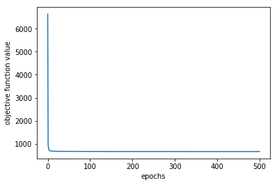


```python
plt.plot(range(30),vz_sgd[0:30])
plt.xlabel('epochs')
plt.ylabel('objective function value')
```


    Text(0,0.5,'objective function value')


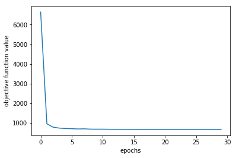


## 2e Compare GD and SGD


```python
plt.plot(range(501),vz_gd,label= 'GD')
plt.plot(range(501),vz_sgd,label = 'SGD')
plt.xlabel('epochs')
plt.ylabel('negative log-likelihood')
plt.legend()
```


    <matplotlib.legend.Legend at 0x20dd49739b0>


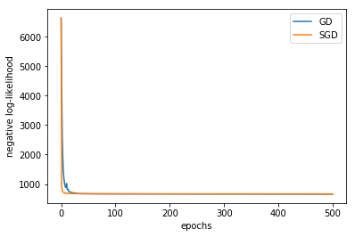


```python
plt.plot(range(30),vz_gd[0:30],label= 'GD')
plt.plot(range(30),vz_sgd[0:30],label = 'SGD')
plt.xlabel('epochs')
plt.ylabel('negative log-likelihood')
plt.legend()
```


    <matplotlib.legend.Legend at 0x20dd49ed978>


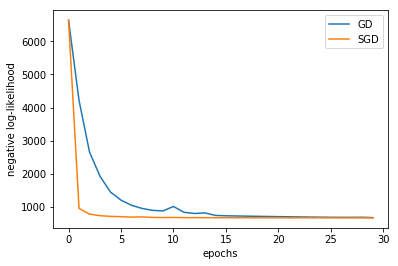


```python
# YOUR CODE HERE
plt.bar(range(D),wz_gd,label='GD')
plt.bar(range(D),wz_sgd,label='SGD')
plt.xlabel('features')
plt.ylabel('weights')
plt.title('GD vs SGD')
plt.legend()
```


    <matplotlib.legend.Legend at 0x20dd4a16048>


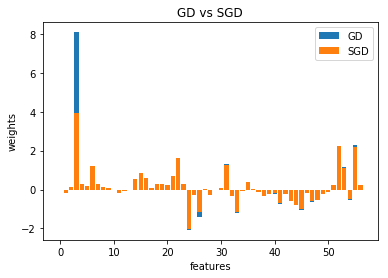


```python
plt.bar(range(D),wz_gd - wz_sgd)
plt.xlabel('features')
plt.ylabel('Difference')
plt.title('Difference in weights (GD-SGD)')

```


    Text(0.5,1,'Difference in weights (GD-SGD)')


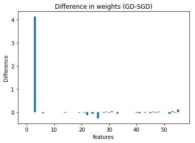


# 3 Prediction


```python
def predict(Xtest, w):
    """Returns vector of predicted confidence values for logistic regression with
weight vector w."""
    # YOUR CODE HERE
    wx = np.dot(Xtestz,w)
    return(sigma(wx))


def classify(Xtest, w):
    """Returns 0/1 vector of predicted class labels for logistic regression with
weight vector w."""
    # YOUR CODE HERE
    y_pred_perc = predict(Xtest, w)
    y_pred = np.where(y_pred_perc > 0.5, 1, 0)
    return(y_pred)
```


```python
# Example: confusion matrix
yhat = predict(Xtestz, wz_gd)
ypred = classify(Xtestz, wz_gd)
print(sklearn.metrics.confusion_matrix(ytest, ypred))  # true x predicted
```

    [[887  54]
     [ 71 524]]
    


```python
# Example: classification report
print(sklearn.metrics.classification_report(ytest, ypred))
```

                  precision    recall  f1-score   support
    
               0       0.93      0.94      0.93       941
               1       0.91      0.88      0.89       595
    
        accuracy                           0.92      1536
       macro avg       0.92      0.91      0.91      1536
    weighted avg       0.92      0.92      0.92      1536
    
    


```python
# Example: precision-recall curve (with annotated thresholds)
nextplot()
precision, recall, thresholds = sklearn.metrics.precision_recall_curve(ytest, yhat)
plt.plot(recall, precision)
for x in np.linspace(0, 1, 10, endpoint=False):
    index = int(x * (precision.size - 1))
    plt.text(recall[index], precision[index], "{:3.2f}".format(thresholds[index]))
plt.xlabel("Recall")
plt.ylabel("Precision")
```


    Text(0,0.5,'Precision')


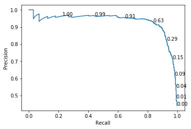


```python
# Explore which features are considered important
# YOUR CODE HERE
#Top 5 important features are as follows
ind = (-np.abs(wz_gd)).argsort()[:5]
print(features[ind])
print(wz_gd[ind])
```

    ['word_freq_3d' 'capital_run_length_longest' 'char_freq_$' 'word_freq_hp'
     'word_freq_000']
    [ 8.08625721  2.31366068  2.18926566 -2.07767632  1.46174692]
    


```python
# Explore which features are considered important
# YOUR CODE HERE
#Top 5 important features are as follows
ind = (-np.abs(wz_gd)).argsort()[-5:]
print(features[ind])
print(wz_gd[ind])
```

    ['word_freq_telnet' 'word_freq_labs' 'word_freq_report' 'word_freq_make'
     'word_freq_650']
    [ 0.04183004 -0.03122582 -0.01094792 -0.00886806 -0.00147368]
    

# 4 Maximum Aposteriori Estimation

## 4a Gradient Descent


```python
def l_l2(y, X, w, lambda_):
    """Log-density of posterior of logistic regression with weights w and L2
regularization parameter lambda_"""
    # YOUR CODE HERE
    l_l2= l(y, X, w) - lambda_/2* np.dot(w,w)           
    return(l_l2)
    
```


```python
# this should give:
# [-47066.641667825766, -47312.623810682911]
[l_l2(y, Xz, np.linspace(-5, 5, D), 0), l_l2(y, Xz, np.linspace(-5, 5, D), 1)]
```


    [-47066.641667825774, -47312.62381068292]


```python
def dl_l2(y, X, w, lambda_):
    """Gradient of log-density of posterior of logistic regression with weights w
and L2 regularization parameter lambda_."""
    # YOUR CODE HERE
    dl_l2 = dl(y, X, w) - lambda_ * w
    
    return(dl_l2)
```


```python
# this should give:
# [array([  551.33985842,   143.84116318,   841.83373606,   156.87237578,
#           802.61217579,   795.96202907,   920.69045803,   621.96516752,
#           659.18724769,   470.81259805,   771.32406968,   352.40325626,
#           455.66972482,   234.36600888,   562.45454038,   864.83981264,
#           787.19723703,   649.48042176,   902.6478154 ,   544.00539886,
#          1174.78638035,   120.3598967 ,   839.61141672,   633.30453444,
#          -706.66815087,  -630.2039816 ,  -569.3451386 ,  -527.50996698,
#          -359.53701083,  -476.64334832,  -411.60620464,  -375.11950586,
#          -345.37195689,  -376.22044258,  -407.31761977,  -456.23251936,
#          -596.86960184,  -107.97072355,  -394.82170044,  -229.18125598,
#          -288.46356547,  -362.13402385,  -450.87896465,  -277.03932676,
#          -414.99293368,  -452.28771693,  -167.54649092,  -270.9043748 ,
#          -252.20140951,  -357.72497343,  -259.12468742,   418.35938483,
#           604.54173228,    43.10390907,   152.24258478,   378.16731033,
#           416.12032881]),
#  array([  556.33985842,   148.66259175,   846.4765932 ,   161.33666149,
#           806.89789007,   800.06917193,   924.61902946,   625.71516752,
#           662.75867626,   474.20545519,   774.5383554 ,   355.43897054,
#           458.52686767,   237.04458031,   564.95454038,   867.16124121,
#           789.34009417,   651.44470748,   904.43352968,   545.61254171,
#          1176.21495178,   121.6098967 ,   840.68284529,   634.19739158,
#          -705.95386516,  -629.66826731,  -568.98799574,  -527.33139555,
#          -359.53701083,  -476.82191975,  -411.9633475 ,  -375.65522015,
#          -346.08624261,  -377.11329972,  -408.38904835,  -457.48251936,
#          -598.29817327,  -109.57786641,  -396.60741472,  -231.14554169,
#          -290.60642261,  -364.45545242,  -453.37896465,  -279.71789819,
#          -417.85007654,  -455.32343122,  -170.76077664,  -274.29723194,
#          -255.77283808,  -361.47497343,  -263.05325885,   414.25224198,
#           600.25601799,    38.63962335,   147.59972763,   373.34588176,
#           411.12032881])]
[dl_l2(y, Xz, np.linspace(-5, 5, D), 0), dl_l2(y, Xz, np.linspace(-5, 5, D), 1)]
```


    [array([ 551.33985842,  143.84116318,  841.83373606,  156.87237578,
             802.61217579,  795.96202907,  920.69045803,  621.96516752,
             659.18724769,  470.81259805,  771.32406968,  352.40325626,
             455.66972482,  234.36600888,  562.45454038,  864.83981264,
             787.19723703,  649.48042176,  902.6478154 ,  544.00539886,
            1174.78638035,  120.3598967 ,  839.61141672,  633.30453444,
            -706.66815087, -630.2039816 , -569.3451386 , -527.50996698,
            -359.53701083, -476.64334832, -411.60620464, -375.11950586,
            -345.37195689, -376.22044258, -407.31761977, -456.23251936,
            -596.86960184, -107.97072355, -394.82170044, -229.18125598,
            -288.46356547, -362.13402385, -450.87896465, -277.03932676,
            -414.99293368, -452.28771693, -167.54649092, -270.9043748 ,
            -252.20140951, -357.72497343, -259.12468742,  418.35938483,
             604.54173228,   43.10390907,  152.24258478,  378.16731033,
             416.12032881]),
     array([ 556.33985842,  148.66259175,  846.4765932 ,  161.33666149,
             806.89789007,  800.06917193,  924.61902946,  625.71516752,
             662.75867626,  474.20545519,  774.5383554 ,  355.43897054,
             458.52686767,  237.04458031,  564.95454038,  867.16124121,
             789.34009417,  651.44470748,  904.43352968,  545.61254171,
            1176.21495178,  121.6098967 ,  840.68284529,  634.19739158,
            -705.95386516, -629.66826731, -568.98799574, -527.33139555,
            -359.53701083, -476.82191975, -411.9633475 , -375.65522015,
            -346.08624261, -377.11329972, -408.38904835, -457.48251936,
            -598.29817327, -109.57786641, -396.60741472, -231.14554169,
            -290.60642261, -364.45545242, -453.37896465, -279.71789819,
            -417.85007654, -455.32343122, -170.76077664, -274.29723194,
            -255.77283808, -361.47497343, -263.05325885,  414.25224198,
             600.25601799,   38.63962335,  147.59972763,  373.34588176,
             411.12032881])]


```python
# now define the (f,update) tuple for optimize for logistic regression, L2
# regularization, and gradient descent
def gd_l2(y, X, lambda_):
    # YOUR CODE HERE
    def objective(w):
        # YOUR CODE HERE
        return(-l_l2(y, X, w,lambda_))

    def update(w,eps):
        # YOUR CODE HERE
        w = w + eps*dl_l2(y, X, w,lambda_)
        return(w)

    return (objective, update)
```


```python
# let's run!
lambda_ = 100
wz_gd_l2, vz_gd_l2, ez_gd_l2 = optimize(gd_l2(y, Xz, lambda_), w0, nepochs=500)
```

    Epoch   0: f=  9992.358, eps=0.010000000
    Epoch   1: f= 23977.384, eps=0.005000000
    Epoch   2: f=  5534.851, eps=0.005250000
    Epoch   3: f=  1427.453, eps=0.005512500
    Epoch   4: f=  1131.716, eps=0.005788125
    Epoch   5: f=  1540.933, eps=0.002894063
    Epoch   6: f=  1323.168, eps=0.003038766
    Epoch   7: f=  1049.068, eps=0.003190704
    Epoch   8: f=  1067.960, eps=0.001595352
    Epoch   9: f=   989.861, eps=0.001675120
    Epoch  10: f=   988.742, eps=0.001758876
    Epoch  11: f=   988.585, eps=0.001846819
    Epoch  12: f=   988.539, eps=0.001939160
    Epoch  13: f=   988.522, eps=0.002036118
    Epoch  14: f=   988.516, eps=0.002137924
    Epoch  15: f=   988.513, eps=0.002244820
    Epoch  16: f=   988.512, eps=0.002357061
    Epoch  17: f=   988.512, eps=0.002474914
    Epoch  18: f=   988.512, eps=0.002598660
    Epoch  19: f=   988.512, eps=0.002728593
    Epoch  20: f=   988.512, eps=0.002865023
    Epoch  21: f=   988.512, eps=0.003008274
    Epoch  22: f=   988.512, eps=0.003158688
    Epoch  23: f=   988.512, eps=0.003316622
    Epoch  24: f=   988.512, eps=0.001658311
    Epoch  25: f=   988.512, eps=0.001741227
    Epoch  26: f=   988.512, eps=0.001828288
    Epoch  27: f=   988.512, eps=0.001919702
    Epoch  28: f=   988.512, eps=0.002015687
    Epoch  29: f=   988.512, eps=0.002116472
    Epoch  30: f=   988.512, eps=0.002222295
    Epoch  31: f=   988.512, eps=0.002333410
    Epoch  32: f=   988.512, eps=0.002450081
    Epoch  33: f=   988.512, eps=0.002572585
    Epoch  34: f=   988.512, eps=0.002701214
    Epoch  35: f=   988.512, eps=0.002836275
    Epoch  36: f=   988.512, eps=0.002978088
    Epoch  37: f=   988.512, eps=0.003126993
    Epoch  38: f=   988.512, eps=0.003283342
    Epoch  39: f=   988.512, eps=0.003447510
    Epoch  40: f=   988.512, eps=0.003619885
    Epoch  41: f=   988.512, eps=0.001809943
    Epoch  42: f=   988.512, eps=0.001900440
    Epoch  43: f=   988.512, eps=0.001995462
    Epoch  44: f=   988.512, eps=0.002095235
    Epoch  45: f=   988.512, eps=0.002199996
    Epoch  46: f=   988.512, eps=0.002309996
    Epoch  47: f=   988.512, eps=0.002425496
    Epoch  48: f=   988.512, eps=0.002546771
    Epoch  49: f=   988.512, eps=0.001273385
    Epoch  50: f=   988.512, eps=0.001337055
    Epoch  51: f=   988.512, eps=0.001403907
    Epoch  52: f=   988.512, eps=0.001474103
    Epoch  53: f=   988.512, eps=0.001547808
    Epoch  54: f=   988.512, eps=0.001625198
    Epoch  55: f=   988.512, eps=0.001706458
    Epoch  56: f=   988.512, eps=0.001791781
    Epoch  57: f=   988.512, eps=0.001881370
    Epoch  58: f=   988.512, eps=0.001975439
    Epoch  59: f=   988.512, eps=0.000987719
    Epoch  60: f=   988.512, eps=0.001037105
    Epoch  61: f=   988.512, eps=0.000518553
    Epoch  62: f=   988.512, eps=0.000544480
    Epoch  63: f=   988.512, eps=0.000571704
    Epoch  64: f=   988.512, eps=0.000285852
    Epoch  65: f=   988.512, eps=0.000300145
    Epoch  66: f=   988.512, eps=0.000315152
    Epoch  67: f=   988.512, eps=0.000330910
    Epoch  68: f=   988.512, eps=0.000347455
    Epoch  69: f=   988.512, eps=0.000364828
    Epoch  70: f=   988.512, eps=0.000383069
    Epoch  71: f=   988.512, eps=0.000402223
    Epoch  72: f=   988.512, eps=0.000201111
    Epoch  73: f=   988.512, eps=0.000211167
    Epoch  74: f=   988.512, eps=0.000221725
    Epoch  75: f=   988.512, eps=0.000232812
    Epoch  76: f=   988.512, eps=0.000116406
    Epoch  77: f=   988.512, eps=0.000122226
    Epoch  78: f=   988.512, eps=0.000128337
    Epoch  79: f=   988.512, eps=0.000064169
    Epoch  80: f=   988.512, eps=0.000067377
    Epoch  81: f=   988.512, eps=0.000033689
    Epoch  82: f=   988.512, eps=0.000035373
    Epoch  83: f=   988.512, eps=0.000037142
    Epoch  84: f=   988.512, eps=0.000018571
    Epoch  85: f=   988.512, eps=0.000019499
    Epoch  86: f=   988.512, eps=0.000009750
    Epoch  87: f=   988.512, eps=0.000010237
    Epoch  88: f=   988.512, eps=0.000010749
    Epoch  89: f=   988.512, eps=0.000011286
    Epoch  90: f=   988.512, eps=0.000011851
    Epoch  91: f=   988.512, eps=0.000012443
    Epoch  92: f=   988.512, eps=0.000006222
    Epoch  93: f=   988.512, eps=0.000006533
    Epoch  94: f=   988.512, eps=0.000006859
    Epoch  95: f=   988.512, eps=0.000007202
    Epoch  96: f=   988.512, eps=0.000003601
    Epoch  97: f=   988.512, eps=0.000001801
    Epoch  98: f=   988.512, eps=0.000001891
    Epoch  99: f=   988.512, eps=0.000001985
    Epoch 100: f=   988.512, eps=0.000002084
    Epoch 101: f=   988.512, eps=0.000002189
    Epoch 102: f=   988.512, eps=0.000002298
    Epoch 103: f=   988.512, eps=0.000001149
    Epoch 104: f=   988.512, eps=0.000000575
    Epoch 105: f=   988.512, eps=0.000000603
    Epoch 106: f=   988.512, eps=0.000000302
    Epoch 107: f=   988.512, eps=0.000000317
    Epoch 108: f=   988.512, eps=0.000000158
    Epoch 109: f=   988.512, eps=0.000000166
    Epoch 110: f=   988.512, eps=0.000000083
    Epoch 111: f=   988.512, eps=0.000000087
    Epoch 112: f=   988.512, eps=0.000000092
    Epoch 113: f=   988.512, eps=0.000000046
    Epoch 114: f=   988.512, eps=0.000000048
    Epoch 115: f=   988.512, eps=0.000000051
    Epoch 116: f=   988.512, eps=0.000000053
    Epoch 117: f=   988.512, eps=0.000000056
    Epoch 118: f=   988.512, eps=0.000000028
    Epoch 119: f=   988.512, eps=0.000000029
    Epoch 120: f=   988.512, eps=0.000000015
    Epoch 121: f=   988.512, eps=0.000000015
    Epoch 122: f=   988.512, eps=0.000000016
    Epoch 123: f=   988.512, eps=0.000000017
    Epoch 124: f=   988.512, eps=0.000000018
    Epoch 125: f=   988.512, eps=0.000000009
    Epoch 126: f=   988.512, eps=0.000000009
    Epoch 127: f=   988.512, eps=0.000000010
    Epoch 128: f=   988.512, eps=0.000000010
    Epoch 129: f=   988.512, eps=0.000000005
    Epoch 130: f=   988.512, eps=0.000000005
    Epoch 131: f=   988.512, eps=0.000000006
    Epoch 132: f=   988.512, eps=0.000000003
    Epoch 133: f=   988.512, eps=0.000000003
    Epoch 134: f=   988.512, eps=0.000000003
    Epoch 135: f=   988.512, eps=0.000000003
    Epoch 136: f=   988.512, eps=0.000000003
    Epoch 137: f=   988.512, eps=0.000000004
    Epoch 138: f=   988.512, eps=0.000000004
    Epoch 139: f=   988.512, eps=0.000000004
    Epoch 140: f=   988.512, eps=0.000000004
    Epoch 141: f=   988.512, eps=0.000000004
    Epoch 142: f=   988.512, eps=0.000000005
    Epoch 143: f=   988.512, eps=0.000000005
    Epoch 144: f=   988.512, eps=0.000000005
    Epoch 145: f=   988.512, eps=0.000000005
    Epoch 146: f=   988.512, eps=0.000000006
    Epoch 147: f=   988.512, eps=0.000000006
    Epoch 148: f=   988.512, eps=0.000000006
    Epoch 149: f=   988.512, eps=0.000000006
    Epoch 150: f=   988.512, eps=0.000000007
    Epoch 151: f=   988.512, eps=0.000000003
    Epoch 152: f=   988.512, eps=0.000000004
    Epoch 153: f=   988.512, eps=0.000000004
    Epoch 154: f=   988.512, eps=0.000000004
    Epoch 155: f=   988.512, eps=0.000000004
    Epoch 156: f=   988.512, eps=0.000000002
    Epoch 157: f=   988.512, eps=0.000000002
    Epoch 158: f=   988.512, eps=0.000000002
    Epoch 159: f=   988.512, eps=0.000000002
    Epoch 160: f=   988.512, eps=0.000000003
    Epoch 161: f=   988.512, eps=0.000000003
    Epoch 162: f=   988.512, eps=0.000000003
    Epoch 163: f=   988.512, eps=0.000000003
    Epoch 164: f=   988.512, eps=0.000000003
    Epoch 165: f=   988.512, eps=0.000000003
    Epoch 166: f=   988.512, eps=0.000000003
    Epoch 167: f=   988.512, eps=0.000000004
    Epoch 168: f=   988.512, eps=0.000000004
    Epoch 169: f=   988.512, eps=0.000000004
    Epoch 170: f=   988.512, eps=0.000000002
    Epoch 171: f=   988.512, eps=0.000000002
    Epoch 172: f=   988.512, eps=0.000000002
    Epoch 173: f=   988.512, eps=0.000000002
    Epoch 174: f=   988.512, eps=0.000000002
    Epoch 175: f=   988.512, eps=0.000000001
    Epoch 176: f=   988.512, eps=0.000000001
    Epoch 177: f=   988.512, eps=0.000000001
    Epoch 178: f=   988.512, eps=0.000000001
    Epoch 179: f=   988.512, eps=0.000000001
    Epoch 180: f=   988.512, eps=0.000000001
    Epoch 181: f=   988.512, eps=0.000000001
    Epoch 182: f=   988.512, eps=0.000000001
    Epoch 183: f=   988.512, eps=0.000000001
    Epoch 184: f=   988.512, eps=0.000000001
    Epoch 185: f=   988.512, eps=0.000000001
    Epoch 186: f=   988.512, eps=0.000000001
    Epoch 187: f=   988.512, eps=0.000000001
    Epoch 188: f=   988.512, eps=0.000000001
    Epoch 189: f=   988.512, eps=0.000000001
    Epoch 190: f=   988.512, eps=0.000000001
    Epoch 191: f=   988.512, eps=0.000000001
    Epoch 192: f=   988.512, eps=0.000000001
    Epoch 193: f=   988.512, eps=0.000000001
    Epoch 194: f=   988.512, eps=0.000000001
    Epoch 195: f=   988.512, eps=0.000000002
    Epoch 196: f=   988.512, eps=0.000000002
    Epoch 197: f=   988.512, eps=0.000000002
    Epoch 198: f=   988.512, eps=0.000000002
    Epoch 199: f=   988.512, eps=0.000000002
    Epoch 200: f=   988.512, eps=0.000000002
    Epoch 201: f=   988.512, eps=0.000000002
    Epoch 202: f=   988.512, eps=0.000000002
    Epoch 203: f=   988.512, eps=0.000000002
    Epoch 204: f=   988.512, eps=0.000000002
    Epoch 205: f=   988.512, eps=0.000000002
    Epoch 206: f=   988.512, eps=0.000000003
    Epoch 207: f=   988.512, eps=0.000000003
    Epoch 208: f=   988.512, eps=0.000000003
    Epoch 209: f=   988.512, eps=0.000000003
    Epoch 210: f=   988.512, eps=0.000000001
    Epoch 211: f=   988.512, eps=0.000000002
    Epoch 212: f=   988.512, eps=0.000000002
    Epoch 213: f=   988.512, eps=0.000000002
    Epoch 214: f=   988.512, eps=0.000000002
    Epoch 215: f=   988.512, eps=0.000000002
    Epoch 216: f=   988.512, eps=0.000000002
    Epoch 217: f=   988.512, eps=0.000000002
    Epoch 218: f=   988.512, eps=0.000000001
    Epoch 219: f=   988.512, eps=0.000000001
    Epoch 220: f=   988.512, eps=0.000000001
    Epoch 221: f=   988.512, eps=0.000000001
    Epoch 222: f=   988.512, eps=0.000000001
    Epoch 223: f=   988.512, eps=0.000000001
    Epoch 224: f=   988.512, eps=0.000000001
    Epoch 225: f=   988.512, eps=0.000000001
    Epoch 226: f=   988.512, eps=0.000000001
    Epoch 227: f=   988.512, eps=0.000000000
    Epoch 228: f=   988.512, eps=0.000000000
    Epoch 229: f=   988.512, eps=0.000000000
    Epoch 230: f=   988.512, eps=0.000000000
    Epoch 231: f=   988.512, eps=0.000000000
    Epoch 232: f=   988.512, eps=0.000000000
    Epoch 233: f=   988.512, eps=0.000000000
    Epoch 234: f=   988.512, eps=0.000000000
    Epoch 235: f=   988.512, eps=0.000000000
    Epoch 236: f=   988.512, eps=0.000000000
    Epoch 237: f=   988.512, eps=0.000000000
    Epoch 238: f=   988.512, eps=0.000000000
    Epoch 239: f=   988.512, eps=0.000000000
    Epoch 240: f=   988.512, eps=0.000000000
    Epoch 241: f=   988.512, eps=0.000000000
    Epoch 242: f=   988.512, eps=0.000000000
    Epoch 243: f=   988.512, eps=0.000000000
    Epoch 244: f=   988.512, eps=0.000000000
    Epoch 245: f=   988.512, eps=0.000000000
    Epoch 246: f=   988.512, eps=0.000000000
    Epoch 247: f=   988.512, eps=0.000000000
    Epoch 248: f=   988.512, eps=0.000000000
    Epoch 249: f=   988.512, eps=0.000000000
    Epoch 250: f=   988.512, eps=0.000000000
    Epoch 251: f=   988.512, eps=0.000000000
    Epoch 252: f=   988.512, eps=0.000000000
    Epoch 253: f=   988.512, eps=0.000000000
    Epoch 254: f=   988.512, eps=0.000000000
    Epoch 255: f=   988.512, eps=0.000000000
    Epoch 256: f=   988.512, eps=0.000000000
    Epoch 257: f=   988.512, eps=0.000000000
    Epoch 258: f=   988.512, eps=0.000000000
    Epoch 259: f=   988.512, eps=0.000000000
    Epoch 260: f=   988.512, eps=0.000000000
    Epoch 261: f=   988.512, eps=0.000000000
    Epoch 262: f=   988.512, eps=0.000000000
    Epoch 263: f=   988.512, eps=0.000000000
    Epoch 264: f=   988.512, eps=0.000000000
    Epoch 265: f=   988.512, eps=0.000000000
    Epoch 266: f=   988.512, eps=0.000000000
    Epoch 267: f=   988.512, eps=0.000000000
    Epoch 268: f=   988.512, eps=0.000000000
    Epoch 269: f=   988.512, eps=0.000000000
    Epoch 270: f=   988.512, eps=0.000000000
    Epoch 271: f=   988.512, eps=0.000000000
    Epoch 272: f=   988.512, eps=0.000000000
    Epoch 273: f=   988.512, eps=0.000000000
    Epoch 274: f=   988.512, eps=0.000000000
    Epoch 275: f=   988.512, eps=0.000000000
    Epoch 276: f=   988.512, eps=0.000000000
    Epoch 277: f=   988.512, eps=0.000000000
    Epoch 278: f=   988.512, eps=0.000000000
    Epoch 279: f=   988.512, eps=0.000000001
    Epoch 280: f=   988.512, eps=0.000000001
    Epoch 281: f=   988.512, eps=0.000000001
    Epoch 282: f=   988.512, eps=0.000000001
    Epoch 283: f=   988.512, eps=0.000000001
    Epoch 284: f=   988.512, eps=0.000000001
    Epoch 285: f=   988.512, eps=0.000000001
    Epoch 286: f=   988.512, eps=0.000000001
    Epoch 287: f=   988.512, eps=0.000000001
    Epoch 288: f=   988.512, eps=0.000000001
    Epoch 289: f=   988.512, eps=0.000000001
    Epoch 290: f=   988.512, eps=0.000000001
    Epoch 291: f=   988.512, eps=0.000000001
    Epoch 292: f=   988.512, eps=0.000000001
    Epoch 293: f=   988.512, eps=0.000000001
    Epoch 294: f=   988.512, eps=0.000000001
    Epoch 295: f=   988.512, eps=0.000000001
    Epoch 296: f=   988.512, eps=0.000000001
    Epoch 297: f=   988.512, eps=0.000000001
    Epoch 298: f=   988.512, eps=0.000000001
    Epoch 299: f=   988.512, eps=0.000000001
    Epoch 300: f=   988.512, eps=0.000000001
    Epoch 301: f=   988.512, eps=0.000000001
    Epoch 302: f=   988.512, eps=0.000000002
    Epoch 303: f=   988.512, eps=0.000000002
    Epoch 304: f=   988.512, eps=0.000000002
    Epoch 305: f=   988.512, eps=0.000000002
    Epoch 306: f=   988.512, eps=0.000000002
    Epoch 307: f=   988.512, eps=0.000000002
    Epoch 308: f=   988.512, eps=0.000000002
    Epoch 309: f=   988.512, eps=0.000000002
    Epoch 310: f=   988.512, eps=0.000000002
    Epoch 311: f=   988.512, eps=0.000000002
    Epoch 312: f=   988.512, eps=0.000000003
    Epoch 313: f=   988.512, eps=0.000000003
    Epoch 314: f=   988.512, eps=0.000000003
    Epoch 315: f=   988.512, eps=0.000000003
    Epoch 316: f=   988.512, eps=0.000000003
    Epoch 317: f=   988.512, eps=0.000000003
    Epoch 318: f=   988.512, eps=0.000000003
    Epoch 319: f=   988.512, eps=0.000000004
    Epoch 320: f=   988.512, eps=0.000000004
    Epoch 321: f=   988.512, eps=0.000000004
    Epoch 322: f=   988.512, eps=0.000000004
    Epoch 323: f=   988.512, eps=0.000000004
    Epoch 324: f=   988.512, eps=0.000000002
    Epoch 325: f=   988.512, eps=0.000000002
    Epoch 326: f=   988.512, eps=0.000000001
    Epoch 327: f=   988.512, eps=0.000000001
    Epoch 328: f=   988.512, eps=0.000000001
    Epoch 329: f=   988.512, eps=0.000000001
    Epoch 330: f=   988.512, eps=0.000000001
    Epoch 331: f=   988.512, eps=0.000000001
    Epoch 332: f=   988.512, eps=0.000000002
    Epoch 333: f=   988.512, eps=0.000000002
    Epoch 334: f=   988.512, eps=0.000000002
    Epoch 335: f=   988.512, eps=0.000000002
    Epoch 336: f=   988.512, eps=0.000000002
    Epoch 337: f=   988.512, eps=0.000000001
    Epoch 338: f=   988.512, eps=0.000000001
    Epoch 339: f=   988.512, eps=0.000000001
    Epoch 340: f=   988.512, eps=0.000000001
    Epoch 341: f=   988.512, eps=0.000000001
    Epoch 342: f=   988.512, eps=0.000000001
    Epoch 343: f=   988.512, eps=0.000000001
    Epoch 344: f=   988.512, eps=0.000000001
    Epoch 345: f=   988.512, eps=0.000000001
    Epoch 346: f=   988.512, eps=0.000000001
    Epoch 347: f=   988.512, eps=0.000000001
    Epoch 348: f=   988.512, eps=0.000000002
    Epoch 349: f=   988.512, eps=0.000000002
    Epoch 350: f=   988.512, eps=0.000000002
    Epoch 351: f=   988.512, eps=0.000000002
    Epoch 352: f=   988.512, eps=0.000000001
    Epoch 353: f=   988.512, eps=0.000000001
    Epoch 354: f=   988.512, eps=0.000000001
    Epoch 355: f=   988.512, eps=0.000000001
    Epoch 356: f=   988.512, eps=0.000000001
    Epoch 357: f=   988.512, eps=0.000000001
    Epoch 358: f=   988.512, eps=0.000000001
    Epoch 359: f=   988.512, eps=0.000000001
    Epoch 360: f=   988.512, eps=0.000000001
    Epoch 361: f=   988.512, eps=0.000000001
    Epoch 362: f=   988.512, eps=0.000000001
    Epoch 363: f=   988.512, eps=0.000000001
    Epoch 364: f=   988.512, eps=0.000000001
    Epoch 365: f=   988.512, eps=0.000000001
    Epoch 366: f=   988.512, eps=0.000000001
    Epoch 367: f=   988.512, eps=0.000000001
    Epoch 368: f=   988.512, eps=0.000000001
    Epoch 369: f=   988.512, eps=0.000000001
    Epoch 370: f=   988.512, eps=0.000000001
    Epoch 371: f=   988.512, eps=0.000000001
    Epoch 372: f=   988.512, eps=0.000000001
    Epoch 373: f=   988.512, eps=0.000000001
    Epoch 374: f=   988.512, eps=0.000000001
    Epoch 375: f=   988.512, eps=0.000000001
    Epoch 376: f=   988.512, eps=0.000000001
    Epoch 377: f=   988.512, eps=0.000000001
    Epoch 378: f=   988.512, eps=0.000000002
    Epoch 379: f=   988.512, eps=0.000000002
    Epoch 380: f=   988.512, eps=0.000000002
    Epoch 381: f=   988.512, eps=0.000000002
    Epoch 382: f=   988.512, eps=0.000000002
    Epoch 383: f=   988.512, eps=0.000000002
    Epoch 384: f=   988.512, eps=0.000000002
    Epoch 385: f=   988.512, eps=0.000000002
    Epoch 386: f=   988.512, eps=0.000000002
    Epoch 387: f=   988.512, eps=0.000000002
    Epoch 388: f=   988.512, eps=0.000000003
    Epoch 389: f=   988.512, eps=0.000000003
    Epoch 390: f=   988.512, eps=0.000000003
    Epoch 391: f=   988.512, eps=0.000000003
    Epoch 392: f=   988.512, eps=0.000000001
    Epoch 393: f=   988.512, eps=0.000000002
    Epoch 394: f=   988.512, eps=0.000000002
    Epoch 395: f=   988.512, eps=0.000000001
    Epoch 396: f=   988.512, eps=0.000000001
    Epoch 397: f=   988.512, eps=0.000000001
    Epoch 398: f=   988.512, eps=0.000000001
    Epoch 399: f=   988.512, eps=0.000000001
    Epoch 400: f=   988.512, eps=0.000000000
    Epoch 401: f=   988.512, eps=0.000000001
    Epoch 402: f=   988.512, eps=0.000000001
    Epoch 403: f=   988.512, eps=0.000000001
    Epoch 404: f=   988.512, eps=0.000000001
    Epoch 405: f=   988.512, eps=0.000000000
    Epoch 406: f=   988.512, eps=0.000000000
    Epoch 407: f=   988.512, eps=0.000000000
    Epoch 408: f=   988.512, eps=0.000000000
    Epoch 409: f=   988.512, eps=0.000000000
    Epoch 410: f=   988.512, eps=0.000000000
    Epoch 411: f=   988.512, eps=0.000000000
    Epoch 412: f=   988.512, eps=0.000000000
    Epoch 413: f=   988.512, eps=0.000000000
    Epoch 414: f=   988.512, eps=0.000000000
    Epoch 415: f=   988.512, eps=0.000000000
    Epoch 416: f=   988.512, eps=0.000000000
    Epoch 417: f=   988.512, eps=0.000000000
    Epoch 418: f=   988.512, eps=0.000000000
    Epoch 419: f=   988.512, eps=0.000000000
    Epoch 420: f=   988.512, eps=0.000000000
    Epoch 421: f=   988.512, eps=0.000000000
    Epoch 422: f=   988.512, eps=0.000000000
    Epoch 423: f=   988.512, eps=0.000000000
    Epoch 424: f=   988.512, eps=0.000000000
    Epoch 425: f=   988.512, eps=0.000000000
    Epoch 426: f=   988.512, eps=0.000000000
    Epoch 427: f=   988.512, eps=0.000000000
    Epoch 428: f=   988.512, eps=0.000000000
    Epoch 429: f=   988.512, eps=0.000000000
    Epoch 430: f=   988.512, eps=0.000000000
    Epoch 431: f=   988.512, eps=0.000000000
    Epoch 432: f=   988.512, eps=0.000000000
    Epoch 433: f=   988.512, eps=0.000000000
    Epoch 434: f=   988.512, eps=0.000000000
    Epoch 435: f=   988.512, eps=0.000000000
    Epoch 436: f=   988.512, eps=0.000000000
    Epoch 437: f=   988.512, eps=0.000000000
    Epoch 438: f=   988.512, eps=0.000000000
    Epoch 439: f=   988.512, eps=0.000000000
    Epoch 440: f=   988.512, eps=0.000000000
    Epoch 441: f=   988.512, eps=0.000000000
    Epoch 442: f=   988.512, eps=0.000000000
    Epoch 443: f=   988.512, eps=0.000000000
    Epoch 444: f=   988.512, eps=0.000000000
    Epoch 445: f=   988.512, eps=0.000000000
    Epoch 446: f=   988.512, eps=0.000000000
    Epoch 447: f=   988.512, eps=0.000000000
    Epoch 448: f=   988.512, eps=0.000000000
    Epoch 449: f=   988.512, eps=0.000000000
    Epoch 450: f=   988.512, eps=0.000000000
    Epoch 451: f=   988.512, eps=0.000000000
    Epoch 452: f=   988.512, eps=0.000000000
    Epoch 453: f=   988.512, eps=0.000000000
    Epoch 454: f=   988.512, eps=0.000000000
    Epoch 455: f=   988.512, eps=0.000000000
    Epoch 456: f=   988.512, eps=0.000000000
    Epoch 457: f=   988.512, eps=0.000000000
    Epoch 458: f=   988.512, eps=0.000000000
    Epoch 459: f=   988.512, eps=0.000000000
    Epoch 460: f=   988.512, eps=0.000000000
    Epoch 461: f=   988.512, eps=0.000000000
    Epoch 462: f=   988.512, eps=0.000000000
    Epoch 463: f=   988.512, eps=0.000000000
    Epoch 464: f=   988.512, eps=0.000000000
    Epoch 465: f=   988.512, eps=0.000000000
    Epoch 466: f=   988.512, eps=0.000000000
    Epoch 467: f=   988.512, eps=0.000000000
    Epoch 468: f=   988.512, eps=0.000000000
    Epoch 469: f=   988.512, eps=0.000000000
    Epoch 470: f=   988.512, eps=0.000000000
    Epoch 471: f=   988.512, eps=0.000000000
    Epoch 472: f=   988.512, eps=0.000000000
    Epoch 473: f=   988.512, eps=0.000000000
    Epoch 474: f=   988.512, eps=0.000000000
    Epoch 475: f=   988.512, eps=0.000000000
    Epoch 476: f=   988.512, eps=0.000000000
    Epoch 477: f=   988.512, eps=0.000000000
    Epoch 478: f=   988.512, eps=0.000000000
    Epoch 479: f=   988.512, eps=0.000000000
    Epoch 480: f=   988.512, eps=0.000000000
    Epoch 481: f=   988.512, eps=0.000000000
    Epoch 482: f=   988.512, eps=0.000000000
    Epoch 483: f=   988.512, eps=0.000000000
    Epoch 484: f=   988.512, eps=0.000000000
    Epoch 485: f=   988.512, eps=0.000000000
    Epoch 486: f=   988.512, eps=0.000000000
    Epoch 487: f=   988.512, eps=0.000000000
    Epoch 488: f=   988.512, eps=0.000000000
    Epoch 489: f=   988.512, eps=0.000000000
    Epoch 490: f=   988.512, eps=0.000000000
    Epoch 491: f=   988.512, eps=0.000000000
    Epoch 492: f=   988.512, eps=0.000000000
    Epoch 493: f=   988.512, eps=0.000000000
    Epoch 494: f=   988.512, eps=0.000000000
    Epoch 495: f=   988.512, eps=0.000000000
    Epoch 496: f=   988.512, eps=0.000000000
    Epoch 497: f=   988.512, eps=0.000000000
    Epoch 498: f=   988.512, eps=0.000000000
    Epoch 499: f=   988.512, eps=0.000000000
    Result after 500 epochs: f=988.5118396027029
    


```python
yhat = predict(Xtestz, wz_gd_l2)
ypred = classify(Xtestz, wz_gd_l2)
print(sklearn.metrics.classification_report(ytest, ypred))
```

                  precision    recall  f1-score   support
    
               0       0.93      0.94      0.93       941
               1       0.90      0.89      0.89       595
    
        accuracy                           0.92      1536
       macro avg       0.91      0.91      0.91      1536
    weighted avg       0.92      0.92      0.92      1536
    
    

## 4b Effect of Prior


```python
# YOUR CODE HERE
acc = []
sum_w = []
lambdas = [1,5,10,15,25,30,35,40,45,50,75,100,150,200,300,400,500]
for lambda_ in lambdas:
    wz_gd_l2_, vz_gd_l2_, ez_gd_l2_ = optimize(gd_l2(y, Xz, lambda_), w0, nepochs=500)
    yhat = predict(Xtestz, wz_gd_l2_)
    ypred = classify(Xtestz, wz_gd_l2_)
    acc.append(sklearn.metrics.accuracy_score(ytest, ypred))
    sum_w.append(sum(np.abs(wz_gd_l2_)))

```

    Epoch   0: f=  6669.770, eps=0.010000000
    Epoch   1: f=  4383.683, eps=0.010500000
    Epoch   2: f=  2752.887, eps=0.011025000
    Epoch   3: f=  1974.583, eps=0.011576250
    Epoch   4: f=  1475.521, eps=0.012155063
    Epoch   5: f=  1220.853, eps=0.012762816
    Epoch   6: f=  1057.063, eps=0.013400956
    Epoch   7: f=   957.284, eps=0.014071004
    Epoch   8: f=   900.055, eps=0.014774554
    Epoch   9: f=   877.595, eps=0.015513282
    Epoch  10: f=   909.332, eps=0.007756641
    Epoch  11: f=   822.850, eps=0.008144473
    Epoch  12: f=   781.300, eps=0.008551697
    Epoch  13: f=   798.122, eps=0.004275848
    Epoch  14: f=   738.850, eps=0.004489641
    Epoch  15: f=   731.040, eps=0.004714123
    Epoch  16: f=   726.009, eps=0.004949829
    Epoch  17: f=   721.535, eps=0.005197320
    Epoch  18: f=   717.358, eps=0.005457186
    Epoch  19: f=   713.453, eps=0.005730046
    Epoch  20: f=   709.837, eps=0.006016548
    Epoch  21: f=   706.559, eps=0.006317375
    Epoch  22: f=   703.753, eps=0.006633244
    Epoch  23: f=   701.690, eps=0.006964906
    Epoch  24: f=   700.826, eps=0.007313152
    Epoch  25: f=   701.209, eps=0.003656576
    Epoch  26: f=   694.511, eps=0.003839405
    Epoch  27: f=   693.303, eps=0.004031375
    Epoch  28: f=   692.297, eps=0.004232944
    Epoch  29: f=   691.359, eps=0.004444591
    Epoch  30: f=   690.473, eps=0.004666820
    Epoch  31: f=   689.637, eps=0.004900161
    Epoch  32: f=   688.852, eps=0.005145169
    Epoch  33: f=   688.122, eps=0.005402428
    Epoch  34: f=   687.450, eps=0.005672549
    Epoch  35: f=   686.842, eps=0.005956177
    Epoch  36: f=   686.310, eps=0.006253986
    Epoch  37: f=   685.885, eps=0.006566685
    Epoch  38: f=   685.676, eps=0.006895019
    Epoch  39: f=   686.028, eps=0.003447510
    Epoch  40: f=   684.915, eps=0.003619885
    Epoch  41: f=   684.667, eps=0.003800879
    Epoch  42: f=   684.504, eps=0.003990923
    Epoch  43: f=   684.364, eps=0.004190469
    Epoch  44: f=   684.236, eps=0.004399993
    Epoch  45: f=   684.119, eps=0.004619993
    Epoch  46: f=   684.011, eps=0.004850992
    Epoch  47: f=   683.911, eps=0.005093542
    Epoch  48: f=   683.821, eps=0.005348219
    Epoch  49: f=   683.739, eps=0.005615630
    Epoch  50: f=   683.666, eps=0.005896411
    Epoch  51: f=   683.605, eps=0.006191232
    Epoch  52: f=   683.563, eps=0.006500794
    Epoch  53: f=   683.568, eps=0.003250397
    Epoch  54: f=   683.465, eps=0.003412917
    Epoch  55: f=   683.432, eps=0.003583562
    Epoch  56: f=   683.408, eps=0.003762741
    Epoch  57: f=   683.386, eps=0.003950878
    Epoch  58: f=   683.365, eps=0.004148421
    Epoch  59: f=   683.345, eps=0.004355843
    Epoch  60: f=   683.326, eps=0.004573635
    Epoch  61: f=   683.307, eps=0.004802316
    Epoch  62: f=   683.290, eps=0.005042432
    Epoch  63: f=   683.273, eps=0.005294554
    Epoch  64: f=   683.257, eps=0.005559282
    Epoch  65: f=   683.241, eps=0.005837246
    Epoch  66: f=   683.227, eps=0.006129108
    Epoch  67: f=   683.213, eps=0.006435563
    Epoch  68: f=   683.200, eps=0.006757341
    Epoch  69: f=   683.191, eps=0.007095208
    Epoch  70: f=   683.191, eps=0.003547604
    Epoch  71: f=   683.172, eps=0.003724984
    Epoch  72: f=   683.164, eps=0.003911234
    Epoch  73: f=   683.158, eps=0.004106795
    Epoch  74: f=   683.152, eps=0.004312135
    Epoch  75: f=   683.146, eps=0.004527742
    Epoch  76: f=   683.140, eps=0.004754129
    Epoch  77: f=   683.134, eps=0.004991835
    Epoch  78: f=   683.128, eps=0.005241427
    Epoch  79: f=   683.122, eps=0.005503499
    Epoch  80: f=   683.117, eps=0.005778674
    Epoch  81: f=   683.111, eps=0.006067607
    Epoch  82: f=   683.107, eps=0.006370988
    Epoch  83: f=   683.105, eps=0.006689537
    Epoch  84: f=   683.113, eps=0.003344768
    Epoch  85: f=   683.093, eps=0.003512007
    Epoch  86: f=   683.087, eps=0.003687607
    Epoch  87: f=   683.084, eps=0.003871988
    Epoch  88: f=   683.080, eps=0.004065587
    Epoch  89: f=   683.077, eps=0.004268866
    Epoch  90: f=   683.074, eps=0.004482310
    Epoch  91: f=   683.070, eps=0.004706425
    Epoch  92: f=   683.067, eps=0.004941746
    Epoch  93: f=   683.063, eps=0.005188834
    Epoch  94: f=   683.059, eps=0.005448275
    Epoch  95: f=   683.056, eps=0.005720689
    Epoch  96: f=   683.052, eps=0.006006724
    Epoch  97: f=   683.048, eps=0.006307060
    Epoch  98: f=   683.044, eps=0.006622413
    Epoch  99: f=   683.042, eps=0.006953533
    Epoch 100: f=   683.044, eps=0.003476767
    Epoch 101: f=   683.035, eps=0.003650605
    Epoch 102: f=   683.032, eps=0.003833135
    Epoch 103: f=   683.029, eps=0.004024792
    Epoch 104: f=   683.027, eps=0.004226032
    Epoch 105: f=   683.024, eps=0.004437333
    Epoch 106: f=   683.022, eps=0.004659200
    Epoch 107: f=   683.019, eps=0.004892160
    Epoch 108: f=   683.017, eps=0.005136768
    Epoch 109: f=   683.014, eps=0.005393606
    Epoch 110: f=   683.011, eps=0.005663287
    Epoch 111: f=   683.009, eps=0.005946451
    Epoch 112: f=   683.006, eps=0.006243773
    Epoch 113: f=   683.004, eps=0.006555962
    Epoch 114: f=   683.003, eps=0.006883760
    Epoch 115: f=   683.008, eps=0.003441880
    Epoch 116: f=   682.997, eps=0.003613974
    Epoch 117: f=   682.994, eps=0.003794673
    Epoch 118: f=   682.992, eps=0.003984406
    Epoch 119: f=   682.990, eps=0.004183627
    Epoch 120: f=   682.988, eps=0.004392808
    Epoch 121: f=   682.986, eps=0.004612449
    Epoch 122: f=   682.984, eps=0.004843071
    Epoch 123: f=   682.982, eps=0.005085225
    Epoch 124: f=   682.980, eps=0.005339486
    Epoch 125: f=   682.978, eps=0.005606460
    Epoch 126: f=   682.976, eps=0.005886783
    Epoch 127: f=   682.974, eps=0.006181122
    Epoch 128: f=   682.972, eps=0.006490178
    Epoch 129: f=   682.971, eps=0.006814687
    Epoch 130: f=   682.975, eps=0.003407344
    Epoch 131: f=   682.967, eps=0.003577711
    Epoch 132: f=   682.964, eps=0.003756596
    Epoch 133: f=   682.963, eps=0.003944426
    Epoch 134: f=   682.961, eps=0.004141647
    Epoch 135: f=   682.960, eps=0.004348730
    Epoch 136: f=   682.958, eps=0.004566166
    Epoch 137: f=   682.957, eps=0.004794475
    Epoch 138: f=   682.955, eps=0.005034198
    Epoch 139: f=   682.954, eps=0.005285908
    Epoch 140: f=   682.952, eps=0.005550204
    Epoch 141: f=   682.950, eps=0.005827714
    Epoch 142: f=   682.948, eps=0.006119100
    Epoch 143: f=   682.947, eps=0.006425055
    Epoch 144: f=   682.946, eps=0.006746307
    Epoch 145: f=   682.946, eps=0.003373154
    Epoch 146: f=   682.942, eps=0.003541811
    Epoch 147: f=   682.941, eps=0.003718902
    Epoch 148: f=   682.940, eps=0.003904847
    Epoch 149: f=   682.939, eps=0.004100089
    Epoch 150: f=   682.938, eps=0.004305094
    Epoch 151: f=   682.936, eps=0.004520348
    Epoch 152: f=   682.935, eps=0.004746366
    Epoch 153: f=   682.934, eps=0.004983684
    Epoch 154: f=   682.933, eps=0.005232868
    Epoch 155: f=   682.931, eps=0.005494512
    Epoch 156: f=   682.930, eps=0.005769237
    Epoch 157: f=   682.929, eps=0.006057699
    Epoch 158: f=   682.927, eps=0.006360584
    Epoch 159: f=   682.926, eps=0.006678613
    Epoch 160: f=   682.925, eps=0.007012544
    Epoch 161: f=   682.925, eps=0.003506272
    Epoch 162: f=   682.922, eps=0.003681586
    Epoch 163: f=   682.921, eps=0.003865665
    Epoch 164: f=   682.920, eps=0.004058948
    Epoch 165: f=   682.919, eps=0.004261896
    Epoch 166: f=   682.918, eps=0.004474990
    Epoch 167: f=   682.917, eps=0.004698740
    Epoch 168: f=   682.916, eps=0.004933677
    Epoch 169: f=   682.915, eps=0.005180361
    Epoch 170: f=   682.914, eps=0.005439379
    Epoch 171: f=   682.913, eps=0.005711348
    Epoch 172: f=   682.912, eps=0.005996915
    Epoch 173: f=   682.911, eps=0.006296761
    Epoch 174: f=   682.910, eps=0.006611599
    Epoch 175: f=   682.910, eps=0.006942179
    Epoch 176: f=   682.914, eps=0.003471089
    Epoch 177: f=   682.908, eps=0.003644644
    Epoch 178: f=   682.907, eps=0.003826876
    Epoch 179: f=   682.906, eps=0.004018220
    Epoch 180: f=   682.905, eps=0.004219131
    Epoch 181: f=   682.904, eps=0.004430087
    Epoch 182: f=   682.903, eps=0.004651592
    Epoch 183: f=   682.903, eps=0.004884171
    Epoch 184: f=   682.902, eps=0.005128380
    Epoch 185: f=   682.901, eps=0.005384799
    Epoch 186: f=   682.900, eps=0.005654039
    Epoch 187: f=   682.899, eps=0.005936741
    Epoch 188: f=   682.899, eps=0.006233578
    Epoch 189: f=   682.898, eps=0.006545257
    Epoch 190: f=   682.899, eps=0.003272628
    Epoch 191: f=   682.896, eps=0.003436260
    Epoch 192: f=   682.896, eps=0.003608073
    Epoch 193: f=   682.895, eps=0.003788476
    Epoch 194: f=   682.895, eps=0.003977900
    Epoch 195: f=   682.894, eps=0.004176795
    Epoch 196: f=   682.893, eps=0.004385635
    Epoch 197: f=   682.893, eps=0.004604917
    Epoch 198: f=   682.892, eps=0.004835163
    Epoch 199: f=   682.892, eps=0.005076921
    Epoch 200: f=   682.891, eps=0.005330767
    Epoch 201: f=   682.890, eps=0.005597305
    Epoch 202: f=   682.890, eps=0.005877170
    Epoch 203: f=   682.889, eps=0.006171029
    Epoch 204: f=   682.888, eps=0.006479580
    Epoch 205: f=   682.887, eps=0.006803559
    Epoch 206: f=   682.887, eps=0.007143737
    Epoch 207: f=   682.887, eps=0.007500924
    Epoch 208: f=   682.889, eps=0.003750462
    Epoch 209: f=   682.886, eps=0.003937985
    Epoch 210: f=   682.885, eps=0.004134885
    Epoch 211: f=   682.884, eps=0.004341629
    Epoch 212: f=   682.883, eps=0.004558710
    Epoch 213: f=   682.883, eps=0.004786646
    Epoch 214: f=   682.882, eps=0.005025978
    Epoch 215: f=   682.882, eps=0.005277277
    Epoch 216: f=   682.882, eps=0.005541141
    Epoch 217: f=   682.881, eps=0.005818198
    Epoch 218: f=   682.881, eps=0.002909099
    Epoch 219: f=   682.880, eps=0.003054554
    Epoch 220: f=   682.880, eps=0.003207282
    Epoch 221: f=   682.879, eps=0.003367646
    Epoch 222: f=   682.879, eps=0.003536028
    Epoch 223: f=   682.879, eps=0.003712829
    Epoch 224: f=   682.878, eps=0.003898471
    Epoch 225: f=   682.878, eps=0.004093394
    Epoch 226: f=   682.878, eps=0.004298064
    Epoch 227: f=   682.877, eps=0.004512967
    Epoch 228: f=   682.877, eps=0.004738616
    Epoch 229: f=   682.876, eps=0.004975546
    Epoch 230: f=   682.876, eps=0.005224324
    Epoch 231: f=   682.876, eps=0.005485540
    Epoch 232: f=   682.875, eps=0.005759817
    Epoch 233: f=   682.875, eps=0.006047808
    Epoch 234: f=   682.874, eps=0.006350198
    Epoch 235: f=   682.874, eps=0.006667708
    Epoch 236: f=   682.873, eps=0.007001093
    Epoch 237: f=   682.873, eps=0.007351148
    Epoch 238: f=   682.872, eps=0.007718705
    Epoch 239: f=   682.872, eps=0.008104641
    Epoch 240: f=   682.871, eps=0.008509873
    Epoch 241: f=   682.871, eps=0.008935366
    Epoch 242: f=   682.873, eps=0.004467683
    Epoch 243: f=   682.872, eps=0.004691067
    Epoch 244: f=   682.871, eps=0.004925621
    Epoch 245: f=   682.871, eps=0.005171902
    Epoch 246: f=   682.872, eps=0.002585951
    Epoch 247: f=   682.869, eps=0.002715248
    Epoch 248: f=   682.868, eps=0.002851011
    Epoch 249: f=   682.868, eps=0.002993561
    Epoch 250: f=   682.868, eps=0.003143239
    Epoch 251: f=   682.868, eps=0.003300401
    Epoch 252: f=   682.868, eps=0.003465421
    Epoch 253: f=   682.868, eps=0.003638693
    Epoch 254: f=   682.867, eps=0.003820627
    Epoch 255: f=   682.867, eps=0.004011659
    Epoch 256: f=   682.867, eps=0.004212241
    Epoch 257: f=   682.867, eps=0.004422854
    Epoch 258: f=   682.866, eps=0.004643996
    Epoch 259: f=   682.866, eps=0.004876196
    Epoch 260: f=   682.866, eps=0.005120006
    Epoch 261: f=   682.866, eps=0.005376006
    Epoch 262: f=   682.865, eps=0.005644806
    Epoch 263: f=   682.865, eps=0.005927047
    Epoch 264: f=   682.865, eps=0.006223399
    Epoch 265: f=   682.865, eps=0.006534569
    Epoch 266: f=   682.864, eps=0.006861297
    Epoch 267: f=   682.864, eps=0.007204362
    Epoch 268: f=   682.864, eps=0.007564580
    Epoch 269: f=   682.863, eps=0.007942809
    Epoch 270: f=   682.863, eps=0.008339950
    Epoch 271: f=   682.863, eps=0.008756947
    Epoch 272: f=   682.862, eps=0.009194795
    Epoch 273: f=   682.862, eps=0.009654535
    Epoch 274: f=   682.862, eps=0.010137261
    Epoch 275: f=   682.861, eps=0.010644124
    Epoch 276: f=   682.862, eps=0.005322062
    Epoch 277: f=   682.862, eps=0.002661031
    Epoch 278: f=   682.860, eps=0.002794083
    Epoch 279: f=   682.860, eps=0.002933787
    Epoch 280: f=   682.860, eps=0.003080476
    Epoch 281: f=   682.860, eps=0.003234500
    Epoch 282: f=   682.860, eps=0.003396225
    Epoch 283: f=   682.860, eps=0.003566036
    Epoch 284: f=   682.860, eps=0.003744338
    Epoch 285: f=   682.860, eps=0.003931555
    Epoch 286: f=   682.860, eps=0.004128133
    Epoch 287: f=   682.859, eps=0.004334539
    Epoch 288: f=   682.859, eps=0.004551266
    Epoch 289: f=   682.859, eps=0.004778830
    Epoch 290: f=   682.859, eps=0.005017771
    Epoch 291: f=   682.859, eps=0.005268660
    Epoch 292: f=   682.859, eps=0.005532093
    Epoch 293: f=   682.859, eps=0.005808697
    Epoch 294: f=   682.858, eps=0.006099132
    Epoch 295: f=   682.858, eps=0.006404089
    Epoch 296: f=   682.858, eps=0.006724293
    Epoch 297: f=   682.858, eps=0.007060508
    Epoch 298: f=   682.858, eps=0.007413533
    Epoch 299: f=   682.857, eps=0.007784210
    Epoch 300: f=   682.857, eps=0.008173420
    Epoch 301: f=   682.857, eps=0.008582091
    Epoch 302: f=   682.857, eps=0.009011196
    Epoch 303: f=   682.857, eps=0.009461756
    Epoch 304: f=   682.856, eps=0.009934843
    Epoch 305: f=   682.857, eps=0.004967422
    Epoch 306: f=   682.857, eps=0.005215793
    Epoch 307: f=   682.857, eps=0.002607896
    Epoch 308: f=   682.856, eps=0.002738291
    Epoch 309: f=   682.856, eps=0.002875206
    Epoch 310: f=   682.856, eps=0.003018966
    Epoch 311: f=   682.856, eps=0.003169914
    Epoch 312: f=   682.856, eps=0.003328410
    Epoch 313: f=   682.856, eps=0.003494831
    Epoch 314: f=   682.856, eps=0.003669572
    Epoch 315: f=   682.855, eps=0.003853051
    Epoch 316: f=   682.855, eps=0.004045703
    Epoch 317: f=   682.855, eps=0.004247988
    Epoch 318: f=   682.855, eps=0.004460388
    Epoch 319: f=   682.855, eps=0.004683407
    Epoch 320: f=   682.855, eps=0.004917578
    Epoch 321: f=   682.855, eps=0.005163456
    Epoch 322: f=   682.855, eps=0.005421629
    Epoch 323: f=   682.855, eps=0.005692711
    Epoch 324: f=   682.855, eps=0.005977346
    Epoch 325: f=   682.855, eps=0.006276214
    Epoch 326: f=   682.854, eps=0.006590024
    Epoch 327: f=   682.854, eps=0.006919525
    Epoch 328: f=   682.854, eps=0.007265502
    Epoch 329: f=   682.854, eps=0.007628777
    Epoch 330: f=   682.854, eps=0.008010216
    Epoch 331: f=   682.854, eps=0.008410726
    Epoch 332: f=   682.854, eps=0.008831263
    Epoch 333: f=   682.854, eps=0.009272826
    Epoch 334: f=   682.854, eps=0.009736467
    Epoch 335: f=   682.853, eps=0.010223291
    Epoch 336: f=   682.853, eps=0.010734455
    Epoch 337: f=   682.854, eps=0.005367228
    Epoch 338: f=   682.855, eps=0.002683614
    Epoch 339: f=   682.853, eps=0.002817794
    Epoch 340: f=   682.853, eps=0.002958684
    Epoch 341: f=   682.853, eps=0.003106618
    Epoch 342: f=   682.853, eps=0.003261949
    Epoch 343: f=   682.853, eps=0.003425047
    Epoch 344: f=   682.853, eps=0.003596299
    Epoch 345: f=   682.853, eps=0.003776114
    Epoch 346: f=   682.853, eps=0.003964920
    Epoch 347: f=   682.853, eps=0.004163166
    Epoch 348: f=   682.853, eps=0.004371324
    Epoch 349: f=   682.853, eps=0.004589890
    Epoch 350: f=   682.853, eps=0.004819385
    Epoch 351: f=   682.853, eps=0.005060354
    Epoch 352: f=   682.852, eps=0.005313372
    Epoch 353: f=   682.852, eps=0.005579040
    Epoch 354: f=   682.852, eps=0.005857992
    Epoch 355: f=   682.852, eps=0.006150892
    Epoch 356: f=   682.852, eps=0.006458437
    Epoch 357: f=   682.852, eps=0.006781358
    Epoch 358: f=   682.852, eps=0.007120426
    Epoch 359: f=   682.852, eps=0.007476448
    Epoch 360: f=   682.852, eps=0.007850270
    Epoch 361: f=   682.852, eps=0.008242783
    Epoch 362: f=   682.852, eps=0.008654923
    Epoch 363: f=   682.852, eps=0.009087669
    Epoch 364: f=   682.852, eps=0.009542052
    Epoch 365: f=   682.852, eps=0.004771026
    Epoch 366: f=   682.852, eps=0.005009577
    Epoch 367: f=   682.852, eps=0.005260056
    Epoch 368: f=   682.852, eps=0.002630028
    Epoch 369: f=   682.851, eps=0.002761530
    Epoch 370: f=   682.851, eps=0.002899606
    Epoch 371: f=   682.851, eps=0.003044586
    Epoch 372: f=   682.851, eps=0.003196816
    Epoch 373: f=   682.851, eps=0.003356656
    Epoch 374: f=   682.851, eps=0.003524489
    Epoch 375: f=   682.851, eps=0.003700714
    Epoch 376: f=   682.851, eps=0.003885749
    Epoch 377: f=   682.851, eps=0.004080037
    Epoch 378: f=   682.851, eps=0.004284039
    Epoch 379: f=   682.851, eps=0.004498241
    Epoch 380: f=   682.851, eps=0.004723153
    Epoch 381: f=   682.851, eps=0.004959310
    Epoch 382: f=   682.851, eps=0.005207276
    Epoch 383: f=   682.851, eps=0.005467640
    Epoch 384: f=   682.851, eps=0.005741022
    Epoch 385: f=   682.851, eps=0.006028073
    Epoch 386: f=   682.851, eps=0.006329476
    Epoch 387: f=   682.851, eps=0.006645950
    Epoch 388: f=   682.851, eps=0.006978248
    Epoch 389: f=   682.851, eps=0.007327160
    Epoch 390: f=   682.851, eps=0.007693518
    Epoch 391: f=   682.851, eps=0.008078194
    Epoch 392: f=   682.851, eps=0.008482104
    Epoch 393: f=   682.851, eps=0.008906209
    Epoch 394: f=   682.851, eps=0.009351519
    Epoch 395: f=   682.851, eps=0.009819095
    Epoch 396: f=   682.851, eps=0.010310050
    Epoch 397: f=   682.851, eps=0.005155025
    Epoch 398: f=   682.851, eps=0.002577512
    Epoch 399: f=   682.850, eps=0.002706388
    Epoch 400: f=   682.850, eps=0.002841708
    Epoch 401: f=   682.850, eps=0.002983793
    Epoch 402: f=   682.850, eps=0.003132983
    Epoch 403: f=   682.850, eps=0.003289632
    Epoch 404: f=   682.850, eps=0.003454113
    Epoch 405: f=   682.850, eps=0.003626819
    Epoch 406: f=   682.850, eps=0.003808160
    Epoch 407: f=   682.850, eps=0.003998568
    Epoch 408: f=   682.850, eps=0.004198496
    Epoch 409: f=   682.850, eps=0.004408421
    Epoch 410: f=   682.850, eps=0.004628842
    Epoch 411: f=   682.850, eps=0.004860284
    Epoch 412: f=   682.850, eps=0.005103298
    Epoch 413: f=   682.850, eps=0.005358463
    Epoch 414: f=   682.850, eps=0.005626387
    Epoch 415: f=   682.850, eps=0.005907706
    Epoch 416: f=   682.850, eps=0.006203091
    Epoch 417: f=   682.850, eps=0.006513246
    Epoch 418: f=   682.850, eps=0.006838908
    Epoch 419: f=   682.850, eps=0.007180853
    Epoch 420: f=   682.850, eps=0.007539896
    Epoch 421: f=   682.850, eps=0.007916891
    Epoch 422: f=   682.850, eps=0.008312735
    Epoch 423: f=   682.850, eps=0.008728372
    Epoch 424: f=   682.850, eps=0.009164791
    Epoch 425: f=   682.850, eps=0.009623030
    Epoch 426: f=   682.850, eps=0.010104182
    Epoch 427: f=   682.850, eps=0.010609391
    Epoch 428: f=   682.850, eps=0.011139860
    Epoch 429: f=   682.850, eps=0.005569930
    Epoch 430: f=   682.850, eps=0.002784965
    Epoch 431: f=   682.850, eps=0.002924213
    Epoch 432: f=   682.850, eps=0.003070424
    Epoch 433: f=   682.850, eps=0.003223945
    Epoch 434: f=   682.850, eps=0.003385142
    Epoch 435: f=   682.850, eps=0.003554400
    Epoch 436: f=   682.850, eps=0.003732120
    Epoch 437: f=   682.850, eps=0.003918726
    Epoch 438: f=   682.850, eps=0.004114662
    Epoch 439: f=   682.850, eps=0.004320395
    Epoch 440: f=   682.850, eps=0.004536415
    Epoch 441: f=   682.850, eps=0.004763235
    Epoch 442: f=   682.850, eps=0.005001397
    Epoch 443: f=   682.850, eps=0.005251467
    Epoch 444: f=   682.850, eps=0.005514040
    Epoch 445: f=   682.850, eps=0.005789742
    Epoch 446: f=   682.850, eps=0.006079230
    Epoch 447: f=   682.850, eps=0.006383191
    Epoch 448: f=   682.850, eps=0.006702351
    Epoch 449: f=   682.850, eps=0.007037468
    Epoch 450: f=   682.850, eps=0.007389342
    Epoch 451: f=   682.850, eps=0.007758809
    Epoch 452: f=   682.850, eps=0.008146749
    Epoch 453: f=   682.850, eps=0.008554086
    Epoch 454: f=   682.850, eps=0.008981791
    Epoch 455: f=   682.850, eps=0.004490895
    Epoch 456: f=   682.850, eps=0.004715440
    Epoch 457: f=   682.850, eps=0.004951212
    Epoch 458: f=   682.850, eps=0.002475606
    Epoch 459: f=   682.850, eps=0.002599386
    Epoch 460: f=   682.850, eps=0.002729356
    Epoch 461: f=   682.850, eps=0.002865824
    Epoch 462: f=   682.850, eps=0.003009115
    Epoch 463: f=   682.850, eps=0.003159570
    Epoch 464: f=   682.850, eps=0.003317549
    Epoch 465: f=   682.850, eps=0.003483426
    Epoch 466: f=   682.850, eps=0.003657598
    Epoch 467: f=   682.850, eps=0.003840478
    Epoch 468: f=   682.850, eps=0.004032501
    Epoch 469: f=   682.850, eps=0.004234127
    Epoch 470: f=   682.850, eps=0.004445833
    Epoch 471: f=   682.849, eps=0.004668125
    Epoch 472: f=   682.849, eps=0.004901531
    Epoch 473: f=   682.849, eps=0.005146607
    Epoch 474: f=   682.849, eps=0.005403938
    Epoch 475: f=   682.849, eps=0.005674135
    Epoch 476: f=   682.849, eps=0.005957841
    Epoch 477: f=   682.849, eps=0.006255733
    Epoch 478: f=   682.849, eps=0.006568520
    Epoch 479: f=   682.849, eps=0.006896946
    Epoch 480: f=   682.849, eps=0.007241793
    Epoch 481: f=   682.849, eps=0.007603883
    Epoch 482: f=   682.849, eps=0.007984077
    Epoch 483: f=   682.849, eps=0.008383281
    Epoch 484: f=   682.849, eps=0.008802445
    Epoch 485: f=   682.849, eps=0.009242567
    Epoch 486: f=   682.849, eps=0.009704696
    Epoch 487: f=   682.849, eps=0.010189930
    Epoch 488: f=   682.849, eps=0.010699427
    Epoch 489: f=   682.849, eps=0.011234398
    Epoch 490: f=   682.849, eps=0.011796118
    Epoch 491: f=   682.849, eps=0.005898059
    Epoch 492: f=   682.849, eps=0.002949030
    Epoch 493: f=   682.849, eps=0.003096481
    Epoch 494: f=   682.849, eps=0.003251305
    Epoch 495: f=   682.849, eps=0.003413870
    Epoch 496: f=   682.849, eps=0.003584564
    Epoch 497: f=   682.849, eps=0.003763792
    Epoch 498: f=   682.849, eps=0.003951982
    Epoch 499: f=   682.849, eps=0.004149581
    Result after 500 epochs: f=682.8492956819674
    Epoch   0: f=  6804.016, eps=0.010000000
    Epoch   1: f=  5050.300, eps=0.010500000
    Epoch   2: f=  3076.838, eps=0.011025000
    Epoch   3: f=  2083.891, eps=0.011576250
    Epoch   4: f=  1499.379, eps=0.012155063
    Epoch   5: f=  1195.530, eps=0.012762816
    Epoch   6: f=  1019.030, eps=0.013400956
    Epoch   7: f=   953.913, eps=0.014071004
    Epoch   8: f=  1182.814, eps=0.007035502
    Epoch   9: f=  1289.182, eps=0.003517751
    Epoch  10: f=   932.116, eps=0.003693639
    Epoch  11: f=   816.850, eps=0.003878321
    Epoch  12: f=   787.315, eps=0.004072237
    Epoch  13: f=   773.170, eps=0.004275848
    Epoch  14: f=   763.643, eps=0.004489641
    Epoch  15: f=   756.260, eps=0.004714123
    Epoch  16: f=   750.180, eps=0.004949829
    Epoch  17: f=   745.068, eps=0.005197320
    Epoch  18: f=   740.749, eps=0.005457186
    Epoch  19: f=   737.116, eps=0.005730046
    Epoch  20: f=   734.094, eps=0.006016548
    Epoch  21: f=   731.615, eps=0.006317375
    Epoch  22: f=   729.613, eps=0.006633244
    Epoch  23: f=   728.024, eps=0.006964906
    Epoch  24: f=   726.785, eps=0.007313152
    Epoch  25: f=   725.842, eps=0.007678809
    Epoch  26: f=   725.176, eps=0.008062750
    Epoch  27: f=   725.006, eps=0.008465887
    Epoch  28: f=   727.355, eps=0.004232944
    Epoch  29: f=   726.206, eps=0.004444591
    Epoch  30: f=   725.706, eps=0.004666820
    Epoch  31: f=   725.729, eps=0.002333410
    Epoch  32: f=   723.693, eps=0.002450081
    Epoch  33: f=   723.635, eps=0.002572585
    Epoch  34: f=   723.580, eps=0.002701214
    Epoch  35: f=   723.526, eps=0.002836275
    Epoch  36: f=   723.474, eps=0.002978088
    Epoch  37: f=   723.424, eps=0.003126993
    Epoch  38: f=   723.374, eps=0.003283342
    Epoch  39: f=   723.326, eps=0.003447510
    Epoch  40: f=   723.278, eps=0.003619885
    Epoch  41: f=   723.232, eps=0.003800879
    Epoch  42: f=   723.187, eps=0.003990923
    Epoch  43: f=   723.143, eps=0.004190469
    Epoch  44: f=   723.101, eps=0.004399993
    Epoch  45: f=   723.059, eps=0.004619993
    Epoch  46: f=   723.019, eps=0.004850992
    Epoch  47: f=   722.979, eps=0.005093542
    Epoch  48: f=   722.941, eps=0.005348219
    Epoch  49: f=   722.903, eps=0.005615630
    Epoch  50: f=   722.867, eps=0.005896411
    Epoch  51: f=   722.832, eps=0.006191232
    Epoch  52: f=   722.798, eps=0.006500794
    Epoch  53: f=   722.765, eps=0.006825833
    Epoch  54: f=   722.733, eps=0.007167125
    Epoch  55: f=   722.703, eps=0.007525481
    Epoch  56: f=   722.674, eps=0.007901755
    Epoch  57: f=   722.646, eps=0.008296843
    Epoch  58: f=   722.620, eps=0.008711685
    Epoch  59: f=   722.595, eps=0.009147269
    Epoch  60: f=   722.571, eps=0.009604633
    Epoch  61: f=   722.549, eps=0.010084864
    Epoch  62: f=   722.529, eps=0.010589108
    Epoch  63: f=   722.511, eps=0.011118563
    Epoch  64: f=   722.509, eps=0.011674491
    Epoch  65: f=   722.778, eps=0.005837246
    Epoch  66: f=   723.237, eps=0.002918623
    Epoch  67: f=   722.536, eps=0.003064554
    Epoch  68: f=   722.472, eps=0.003217782
    Epoch  69: f=   722.461, eps=0.003378671
    Epoch  70: f=   722.456, eps=0.003547604
    Epoch  71: f=   722.452, eps=0.003724984
    Epoch  72: f=   722.448, eps=0.003911234
    Epoch  73: f=   722.445, eps=0.004106795
    Epoch  74: f=   722.441, eps=0.004312135
    Epoch  75: f=   722.438, eps=0.004527742
    Epoch  76: f=   722.434, eps=0.004754129
    Epoch  77: f=   722.431, eps=0.004991835
    Epoch  78: f=   722.427, eps=0.005241427
    Epoch  79: f=   722.424, eps=0.005503499
    Epoch  80: f=   722.421, eps=0.005778674
    Epoch  81: f=   722.418, eps=0.006067607
    Epoch  82: f=   722.416, eps=0.006370988
    Epoch  83: f=   722.416, eps=0.003185494
    Epoch  84: f=   722.410, eps=0.003344768
    Epoch  85: f=   722.408, eps=0.003512007
    Epoch  86: f=   722.407, eps=0.003687607
    Epoch  87: f=   722.405, eps=0.003871988
    Epoch  88: f=   722.404, eps=0.004065587
    Epoch  89: f=   722.402, eps=0.004268866
    Epoch  90: f=   722.401, eps=0.004482310
    Epoch  91: f=   722.399, eps=0.004706425
    Epoch  92: f=   722.398, eps=0.004941746
    Epoch  93: f=   722.396, eps=0.005188834
    Epoch  94: f=   722.395, eps=0.005448275
    Epoch  95: f=   722.393, eps=0.005720689
    Epoch  96: f=   722.392, eps=0.006006724
    Epoch  97: f=   722.391, eps=0.006307060
    Epoch  98: f=   722.390, eps=0.006622413
    Epoch  99: f=   722.392, eps=0.003311206
    Epoch 100: f=   722.388, eps=0.003476767
    Epoch 101: f=   722.387, eps=0.003650605
    Epoch 102: f=   722.386, eps=0.003833135
    Epoch 103: f=   722.385, eps=0.004024792
    Epoch 104: f=   722.385, eps=0.004226032
    Epoch 105: f=   722.384, eps=0.004437333
    Epoch 106: f=   722.383, eps=0.004659200
    Epoch 107: f=   722.383, eps=0.004892160
    Epoch 108: f=   722.382, eps=0.005136768
    Epoch 109: f=   722.382, eps=0.005393606
    Epoch 110: f=   722.381, eps=0.005663287
    Epoch 111: f=   722.381, eps=0.005946451
    Epoch 112: f=   722.381, eps=0.002973225
    Epoch 113: f=   722.380, eps=0.003121887
    Epoch 114: f=   722.379, eps=0.003277981
    Epoch 115: f=   722.379, eps=0.003441880
    Epoch 116: f=   722.379, eps=0.003613974
    Epoch 117: f=   722.378, eps=0.003794673
    Epoch 118: f=   722.378, eps=0.003984406
    Epoch 119: f=   722.378, eps=0.004183627
    Epoch 120: f=   722.378, eps=0.004392808
    Epoch 121: f=   722.377, eps=0.004612449
    Epoch 122: f=   722.377, eps=0.004843071
    Epoch 123: f=   722.377, eps=0.005085225
    Epoch 124: f=   722.376, eps=0.005339486
    Epoch 125: f=   722.376, eps=0.005606460
    Epoch 126: f=   722.376, eps=0.005886783
    Epoch 127: f=   722.376, eps=0.006181122
    Epoch 128: f=   722.375, eps=0.006490178
    Epoch 129: f=   722.375, eps=0.006814687
    Epoch 130: f=   722.375, eps=0.007155422
    Epoch 131: f=   722.375, eps=0.003577711
    Epoch 132: f=   722.375, eps=0.003756596
    Epoch 133: f=   722.375, eps=0.003944426
    Epoch 134: f=   722.374, eps=0.004141647
    Epoch 135: f=   722.374, eps=0.004348730
    Epoch 136: f=   722.374, eps=0.004566166
    Epoch 137: f=   722.374, eps=0.004794475
    Epoch 138: f=   722.374, eps=0.005034198
    Epoch 139: f=   722.374, eps=0.005285908
    Epoch 140: f=   722.374, eps=0.005550204
    Epoch 141: f=   722.374, eps=0.002775102
    Epoch 142: f=   722.374, eps=0.002913857
    Epoch 143: f=   722.373, eps=0.003059550
    Epoch 144: f=   722.373, eps=0.003212527
    Epoch 145: f=   722.373, eps=0.003373154
    Epoch 146: f=   722.373, eps=0.003541811
    Epoch 147: f=   722.373, eps=0.003718902
    Epoch 148: f=   722.373, eps=0.003904847
    Epoch 149: f=   722.373, eps=0.004100089
    Epoch 150: f=   722.373, eps=0.004305094
    Epoch 151: f=   722.373, eps=0.004520348
    Epoch 152: f=   722.373, eps=0.004746366
    Epoch 153: f=   722.373, eps=0.004983684
    Epoch 154: f=   722.373, eps=0.005232868
    Epoch 155: f=   722.373, eps=0.005494512
    Epoch 156: f=   722.373, eps=0.005769237
    Epoch 157: f=   722.373, eps=0.006057699
    Epoch 158: f=   722.373, eps=0.006360584
    Epoch 159: f=   722.373, eps=0.006678613
    Epoch 160: f=   722.373, eps=0.007012544
    Epoch 161: f=   722.373, eps=0.007363171
    Epoch 162: f=   722.373, eps=0.007731330
    Epoch 163: f=   722.373, eps=0.003865665
    Epoch 164: f=   722.372, eps=0.004058948
    Epoch 165: f=   722.372, eps=0.004261896
    Epoch 166: f=   722.372, eps=0.004474990
    Epoch 167: f=   722.372, eps=0.004698740
    Epoch 168: f=   722.372, eps=0.004933677
    Epoch 169: f=   722.372, eps=0.005180361
    Epoch 170: f=   722.372, eps=0.002590180
    Epoch 171: f=   722.372, eps=0.002719689
    Epoch 172: f=   722.372, eps=0.002855674
    Epoch 173: f=   722.372, eps=0.002998458
    Epoch 174: f=   722.372, eps=0.003148380
    Epoch 175: f=   722.372, eps=0.003305799
    Epoch 176: f=   722.372, eps=0.003471089
    Epoch 177: f=   722.372, eps=0.003644644
    Epoch 178: f=   722.372, eps=0.003826876
    Epoch 179: f=   722.372, eps=0.004018220
    Epoch 180: f=   722.372, eps=0.004219131
    Epoch 181: f=   722.372, eps=0.004430087
    Epoch 182: f=   722.372, eps=0.004651592
    Epoch 183: f=   722.372, eps=0.004884171
    Epoch 184: f=   722.372, eps=0.005128380
    Epoch 185: f=   722.372, eps=0.005384799
    Epoch 186: f=   722.372, eps=0.005654039
    Epoch 187: f=   722.372, eps=0.005936741
    Epoch 188: f=   722.372, eps=0.006233578
    Epoch 189: f=   722.372, eps=0.006545257
    Epoch 190: f=   722.372, eps=0.006872520
    Epoch 191: f=   722.372, eps=0.007216146
    Epoch 192: f=   722.372, eps=0.007576953
    Epoch 193: f=   722.372, eps=0.007955801
    Epoch 194: f=   722.372, eps=0.008353591
    Epoch 195: f=   722.372, eps=0.008771270
    Epoch 196: f=   722.372, eps=0.004385635
    Epoch 197: f=   722.372, eps=0.004604917
    Epoch 198: f=   722.372, eps=0.004835163
    Epoch 199: f=   722.372, eps=0.002417581
    Epoch 200: f=   722.372, eps=0.002538460
    Epoch 201: f=   722.372, eps=0.002665383
    Epoch 202: f=   722.372, eps=0.002798653
    Epoch 203: f=   722.372, eps=0.002938585
    Epoch 204: f=   722.372, eps=0.003085514
    Epoch 205: f=   722.372, eps=0.003239790
    Epoch 206: f=   722.372, eps=0.003401780
    Epoch 207: f=   722.372, eps=0.003571869
    Epoch 208: f=   722.372, eps=0.003750462
    Epoch 209: f=   722.372, eps=0.003937985
    Epoch 210: f=   722.372, eps=0.004134885
    Epoch 211: f=   722.372, eps=0.004341629
    Epoch 212: f=   722.372, eps=0.004558710
    Epoch 213: f=   722.372, eps=0.004786646
    Epoch 214: f=   722.372, eps=0.005025978
    Epoch 215: f=   722.372, eps=0.005277277
    Epoch 216: f=   722.372, eps=0.005541141
    Epoch 217: f=   722.372, eps=0.005818198
    Epoch 218: f=   722.372, eps=0.006109108
    Epoch 219: f=   722.372, eps=0.006414563
    Epoch 220: f=   722.372, eps=0.006735291
    Epoch 221: f=   722.372, eps=0.007072056
    Epoch 222: f=   722.372, eps=0.007425659
    Epoch 223: f=   722.372, eps=0.007796941
    Epoch 224: f=   722.372, eps=0.008186788
    Epoch 225: f=   722.372, eps=0.008596128
    Epoch 226: f=   722.372, eps=0.009025934
    Epoch 227: f=   722.372, eps=0.009477231
    Epoch 228: f=   722.372, eps=0.009951093
    Epoch 229: f=   722.372, eps=0.004975546
    Epoch 230: f=   722.372, eps=0.002487773
    Epoch 231: f=   722.372, eps=0.002612162
    Epoch 232: f=   722.372, eps=0.002742770
    Epoch 233: f=   722.372, eps=0.002879908
    Epoch 234: f=   722.372, eps=0.003023904
    Epoch 235: f=   722.372, eps=0.003175099
    Epoch 236: f=   722.372, eps=0.003333854
    Epoch 237: f=   722.372, eps=0.003500547
    Epoch 238: f=   722.372, eps=0.003675574
    Epoch 239: f=   722.372, eps=0.003859353
    Epoch 240: f=   722.372, eps=0.004052320
    Epoch 241: f=   722.372, eps=0.004254936
    Epoch 242: f=   722.372, eps=0.004467683
    Epoch 243: f=   722.372, eps=0.004691067
    Epoch 244: f=   722.372, eps=0.004925621
    Epoch 245: f=   722.372, eps=0.005171902
    Epoch 246: f=   722.372, eps=0.005430497
    Epoch 247: f=   722.372, eps=0.005702022
    Epoch 248: f=   722.372, eps=0.005987123
    Epoch 249: f=   722.372, eps=0.006286479
    Epoch 250: f=   722.372, eps=0.006600803
    Epoch 251: f=   722.372, eps=0.006930843
    Epoch 252: f=   722.372, eps=0.007277385
    Epoch 253: f=   722.372, eps=0.007641254
    Epoch 254: f=   722.372, eps=0.008023317
    Epoch 255: f=   722.372, eps=0.008424483
    Epoch 256: f=   722.372, eps=0.008845707
    Epoch 257: f=   722.372, eps=0.009287992
    Epoch 258: f=   722.372, eps=0.004643996
    Epoch 259: f=   722.372, eps=0.004876196
    Epoch 260: f=   722.372, eps=0.002438098
    Epoch 261: f=   722.372, eps=0.002560003
    Epoch 262: f=   722.372, eps=0.002688003
    Epoch 263: f=   722.372, eps=0.002822403
    Epoch 264: f=   722.372, eps=0.002963523
    Epoch 265: f=   722.372, eps=0.003111700
    Epoch 266: f=   722.372, eps=0.003267285
    Epoch 267: f=   722.372, eps=0.003430649
    Epoch 268: f=   722.372, eps=0.003602181
    Epoch 269: f=   722.372, eps=0.003782290
    Epoch 270: f=   722.372, eps=0.003971405
    Epoch 271: f=   722.372, eps=0.004169975
    Epoch 272: f=   722.372, eps=0.004378474
    Epoch 273: f=   722.372, eps=0.004597397
    Epoch 274: f=   722.372, eps=0.004827267
    Epoch 275: f=   722.372, eps=0.005068631
    Epoch 276: f=   722.372, eps=0.005322062
    Epoch 277: f=   722.372, eps=0.005588165
    Epoch 278: f=   722.372, eps=0.005867574
    Epoch 279: f=   722.372, eps=0.006160952
    Epoch 280: f=   722.372, eps=0.006469000
    Epoch 281: f=   722.372, eps=0.006792450
    Epoch 282: f=   722.372, eps=0.007132072
    Epoch 283: f=   722.372, eps=0.007488676
    Epoch 284: f=   722.372, eps=0.007863110
    Epoch 285: f=   722.372, eps=0.008256265
    Epoch 286: f=   722.372, eps=0.008669078
    Epoch 287: f=   722.372, eps=0.009102532
    Epoch 288: f=   722.372, eps=0.009557659
    Epoch 289: f=   722.372, eps=0.010035542
    Epoch 290: f=   722.372, eps=0.005017771
    Epoch 291: f=   722.372, eps=0.002508885
    Epoch 292: f=   722.372, eps=0.002634330
    Epoch 293: f=   722.372, eps=0.002766046
    Epoch 294: f=   722.372, eps=0.002904349
    Epoch 295: f=   722.372, eps=0.003049566
    Epoch 296: f=   722.372, eps=0.003202044
    Epoch 297: f=   722.372, eps=0.003362147
    Epoch 298: f=   722.372, eps=0.003530254
    Epoch 299: f=   722.372, eps=0.003706767
    Epoch 300: f=   722.372, eps=0.003892105
    Epoch 301: f=   722.372, eps=0.004086710
    Epoch 302: f=   722.372, eps=0.004291046
    Epoch 303: f=   722.372, eps=0.004505598
    Epoch 304: f=   722.372, eps=0.004730878
    Epoch 305: f=   722.372, eps=0.004967422
    Epoch 306: f=   722.372, eps=0.005215793
    Epoch 307: f=   722.372, eps=0.005476582
    Epoch 308: f=   722.372, eps=0.005750412
    Epoch 309: f=   722.372, eps=0.006037932
    Epoch 310: f=   722.372, eps=0.006339829
    Epoch 311: f=   722.372, eps=0.006656820
    Epoch 312: f=   722.372, eps=0.006989661
    Epoch 313: f=   722.372, eps=0.007339144
    Epoch 314: f=   722.372, eps=0.007706101
    Epoch 315: f=   722.372, eps=0.008091406
    Epoch 316: f=   722.372, eps=0.008495977
    Epoch 317: f=   722.372, eps=0.008920776
    Epoch 318: f=   722.372, eps=0.004460388
    Epoch 319: f=   722.372, eps=0.004683407
    Epoch 320: f=   722.372, eps=0.004917578
    Epoch 321: f=   722.372, eps=0.002458789
    Epoch 322: f=   722.372, eps=0.002581728
    Epoch 323: f=   722.372, eps=0.002710815
    Epoch 324: f=   722.372, eps=0.002846355
    Epoch 325: f=   722.372, eps=0.002988673
    Epoch 326: f=   722.372, eps=0.003138107
    Epoch 327: f=   722.372, eps=0.003295012
    Epoch 328: f=   722.372, eps=0.003459763
    Epoch 329: f=   722.372, eps=0.003632751
    Epoch 330: f=   722.372, eps=0.003814388
    Epoch 331: f=   722.372, eps=0.004005108
    Epoch 332: f=   722.372, eps=0.004205363
    Epoch 333: f=   722.372, eps=0.004415631
    Epoch 334: f=   722.372, eps=0.004636413
    Epoch 335: f=   722.372, eps=0.004868234
    Epoch 336: f=   722.372, eps=0.005111645
    Epoch 337: f=   722.372, eps=0.005367228
    Epoch 338: f=   722.372, eps=0.005635589
    Epoch 339: f=   722.372, eps=0.005917368
    Epoch 340: f=   722.372, eps=0.006213237
    Epoch 341: f=   722.372, eps=0.006523899
    Epoch 342: f=   722.372, eps=0.006850094
    Epoch 343: f=   722.372, eps=0.007192598
    Epoch 344: f=   722.372, eps=0.007552228
    Epoch 345: f=   722.372, eps=0.007929840
    Epoch 346: f=   722.372, eps=0.008326332
    Epoch 347: f=   722.372, eps=0.008742648
    Epoch 348: f=   722.372, eps=0.009179781
    Epoch 349: f=   722.372, eps=0.009638770
    Epoch 350: f=   722.372, eps=0.004819385
    Epoch 351: f=   722.372, eps=0.002409692
    Epoch 352: f=   722.372, eps=0.002530177
    Epoch 353: f=   722.372, eps=0.002656686
    Epoch 354: f=   722.372, eps=0.002789520
    Epoch 355: f=   722.372, eps=0.002928996
    Epoch 356: f=   722.372, eps=0.003075446
    Epoch 357: f=   722.372, eps=0.003229218
    Epoch 358: f=   722.372, eps=0.003390679
    Epoch 359: f=   722.372, eps=0.003560213
    Epoch 360: f=   722.372, eps=0.003738224
    Epoch 361: f=   722.372, eps=0.003925135
    Epoch 362: f=   722.372, eps=0.004121392
    Epoch 363: f=   722.372, eps=0.004327461
    Epoch 364: f=   722.372, eps=0.004543834
    Epoch 365: f=   722.372, eps=0.004771026
    Epoch 366: f=   722.372, eps=0.005009577
    Epoch 367: f=   722.372, eps=0.005260056
    Epoch 368: f=   722.372, eps=0.005523059
    Epoch 369: f=   722.372, eps=0.005799212
    Epoch 370: f=   722.372, eps=0.006089173
    Epoch 371: f=   722.372, eps=0.006393631
    Epoch 372: f=   722.372, eps=0.006713313
    Epoch 373: f=   722.372, eps=0.007048978
    Epoch 374: f=   722.372, eps=0.007401427
    Epoch 375: f=   722.372, eps=0.007771499
    Epoch 376: f=   722.372, eps=0.008160074
    Epoch 377: f=   722.372, eps=0.008568077
    Epoch 378: f=   722.372, eps=0.008996481
    Epoch 379: f=   722.372, eps=0.009446305
    Epoch 380: f=   722.372, eps=0.009918621
    Epoch 381: f=   722.372, eps=0.004959310
    Epoch 382: f=   722.372, eps=0.002479655
    Epoch 383: f=   722.372, eps=0.002603638
    Epoch 384: f=   722.372, eps=0.002733820
    Epoch 385: f=   722.372, eps=0.002870511
    Epoch 386: f=   722.372, eps=0.003014036
    Epoch 387: f=   722.372, eps=0.003164738
    Epoch 388: f=   722.372, eps=0.003322975
    Epoch 389: f=   722.372, eps=0.003489124
    Epoch 390: f=   722.372, eps=0.003663580
    Epoch 391: f=   722.372, eps=0.003846759
    Epoch 392: f=   722.372, eps=0.004039097
    Epoch 393: f=   722.372, eps=0.004241052
    Epoch 394: f=   722.372, eps=0.004453104
    Epoch 395: f=   722.372, eps=0.004675760
    Epoch 396: f=   722.372, eps=0.004909548
    Epoch 397: f=   722.372, eps=0.005155025
    Epoch 398: f=   722.372, eps=0.005412776
    Epoch 399: f=   722.372, eps=0.005683415
    Epoch 400: f=   722.372, eps=0.005967586
    Epoch 401: f=   722.372, eps=0.006265965
    Epoch 402: f=   722.372, eps=0.006579263
    Epoch 403: f=   722.372, eps=0.006908226
    Epoch 404: f=   722.372, eps=0.007253638
    Epoch 405: f=   722.372, eps=0.007616320
    Epoch 406: f=   722.372, eps=0.007997136
    Epoch 407: f=   722.372, eps=0.008396992
    Epoch 408: f=   722.372, eps=0.008816842
    Epoch 409: f=   722.372, eps=0.009257684
    Epoch 410: f=   722.372, eps=0.009720568
    Epoch 411: f=   722.372, eps=0.004860284
    Epoch 412: f=   722.372, eps=0.002430142
    Epoch 413: f=   722.372, eps=0.002551649
    Epoch 414: f=   722.372, eps=0.002679232
    Epoch 415: f=   722.372, eps=0.002813193
    Epoch 416: f=   722.372, eps=0.002953853
    Epoch 417: f=   722.372, eps=0.003101546
    Epoch 418: f=   722.372, eps=0.003256623
    Epoch 419: f=   722.372, eps=0.003419454
    Epoch 420: f=   722.372, eps=0.003590427
    Epoch 421: f=   722.372, eps=0.003769948
    Epoch 422: f=   722.372, eps=0.003958445
    Epoch 423: f=   722.372, eps=0.004156368
    Epoch 424: f=   722.372, eps=0.004364186
    Epoch 425: f=   722.372, eps=0.004582395
    Epoch 426: f=   722.372, eps=0.004811515
    Epoch 427: f=   722.372, eps=0.005052091
    Epoch 428: f=   722.372, eps=0.005304695
    Epoch 429: f=   722.372, eps=0.005569930
    Epoch 430: f=   722.372, eps=0.005848427
    Epoch 431: f=   722.372, eps=0.006140848
    Epoch 432: f=   722.372, eps=0.006447890
    Epoch 433: f=   722.372, eps=0.006770285
    Epoch 434: f=   722.372, eps=0.007108799
    Epoch 435: f=   722.372, eps=0.007464239
    Epoch 436: f=   722.372, eps=0.007837451
    Epoch 437: f=   722.372, eps=0.008229324
    Epoch 438: f=   722.372, eps=0.008640790
    Epoch 439: f=   722.372, eps=0.009072829
    Epoch 440: f=   722.372, eps=0.009526471
    Epoch 441: f=   722.372, eps=0.004763235
    Epoch 442: f=   722.372, eps=0.005001397
    Epoch 443: f=   722.372, eps=0.002500699
    Epoch 444: f=   722.372, eps=0.002625734
    Epoch 445: f=   722.372, eps=0.002757020
    Epoch 446: f=   722.372, eps=0.002894871
    Epoch 447: f=   722.372, eps=0.003039615
    Epoch 448: f=   722.372, eps=0.003191596
    Epoch 449: f=   722.372, eps=0.003351175
    Epoch 450: f=   722.372, eps=0.003518734
    Epoch 451: f=   722.372, eps=0.003694671
    Epoch 452: f=   722.372, eps=0.003879404
    Epoch 453: f=   722.372, eps=0.004073375
    Epoch 454: f=   722.372, eps=0.004277043
    Epoch 455: f=   722.372, eps=0.004490895
    Epoch 456: f=   722.372, eps=0.004715440
    Epoch 457: f=   722.372, eps=0.004951212
    Epoch 458: f=   722.372, eps=0.005198773
    Epoch 459: f=   722.372, eps=0.005458711
    Epoch 460: f=   722.372, eps=0.005731647
    Epoch 461: f=   722.372, eps=0.006018229
    Epoch 462: f=   722.372, eps=0.006319141
    Epoch 463: f=   722.372, eps=0.006635098
    Epoch 464: f=   722.372, eps=0.006966853
    Epoch 465: f=   722.372, eps=0.007315195
    Epoch 466: f=   722.372, eps=0.007680955
    Epoch 467: f=   722.372, eps=0.008065003
    Epoch 468: f=   722.372, eps=0.008468253
    Epoch 469: f=   722.372, eps=0.008891666
    Epoch 470: f=   722.372, eps=0.009336249
    Epoch 471: f=   722.372, eps=0.004668125
    Epoch 472: f=   722.372, eps=0.002334062
    Epoch 473: f=   722.372, eps=0.002450765
    Epoch 474: f=   722.372, eps=0.002573304
    Epoch 475: f=   722.372, eps=0.002701969
    Epoch 476: f=   722.372, eps=0.002837067
    Epoch 477: f=   722.372, eps=0.002978921
    Epoch 478: f=   722.372, eps=0.003127867
    Epoch 479: f=   722.372, eps=0.003284260
    Epoch 480: f=   722.372, eps=0.003448473
    Epoch 481: f=   722.372, eps=0.003620897
    Epoch 482: f=   722.372, eps=0.003801941
    Epoch 483: f=   722.372, eps=0.003992039
    Epoch 484: f=   722.372, eps=0.001996019
    Epoch 485: f=   722.372, eps=0.002095820
    Epoch 486: f=   722.372, eps=0.002200611
    Epoch 487: f=   722.372, eps=0.002310642
    Epoch 488: f=   722.372, eps=0.002426174
    Epoch 489: f=   722.372, eps=0.002547483
    Epoch 490: f=   722.372, eps=0.002674857
    Epoch 491: f=   722.372, eps=0.002808600
    Epoch 492: f=   722.372, eps=0.002949030
    Epoch 493: f=   722.372, eps=0.001474515
    Epoch 494: f=   722.372, eps=0.001548241
    Epoch 495: f=   722.372, eps=0.001625653
    Epoch 496: f=   722.372, eps=0.000812826
    Epoch 497: f=   722.372, eps=0.000853468
    Epoch 498: f=   722.372, eps=0.000896141
    Epoch 499: f=   722.372, eps=0.000940948
    Result after 500 epochs: f=722.3720587338803
    Epoch   0: f=  6971.823, eps=0.010000000
    Epoch   1: f=  5884.379, eps=0.010500000
    Epoch   2: f=  3362.081, eps=0.011025000
    Epoch   3: f=  2071.367, eps=0.011576250
    Epoch   4: f=  1422.221, eps=0.012155063
    Epoch   5: f=  1117.981, eps=0.012762816
    Epoch   6: f=  1121.186, eps=0.006381408
    Epoch   7: f=  1103.258, eps=0.006700478
    Epoch   8: f=   912.910, eps=0.007035502
    Epoch   9: f=   960.266, eps=0.003517751
    Epoch  10: f=   802.075, eps=0.003693639
    Epoch  11: f=   788.727, eps=0.003878321
    Epoch  12: f=   780.836, eps=0.004072237
    Epoch  13: f=   774.777, eps=0.004275848
    Epoch  14: f=   770.021, eps=0.004489641
    Epoch  15: f=   766.302, eps=0.004714123
    Epoch  16: f=   763.437, eps=0.004949829
    Epoch  17: f=   761.272, eps=0.005197320
    Epoch  18: f=   759.693, eps=0.005457186
    Epoch  19: f=   758.642, eps=0.005730046
    Epoch  20: f=   758.257, eps=0.006016548
    Epoch  21: f=   759.378, eps=0.003008274
    Epoch  22: f=   757.011, eps=0.003158688
    Epoch  23: f=   756.515, eps=0.003316622
    Epoch  24: f=   756.267, eps=0.003482453
    Epoch  25: f=   756.087, eps=0.003656576
    Epoch  26: f=   755.936, eps=0.003839405
    Epoch  27: f=   755.806, eps=0.004031375
    Epoch  28: f=   755.692, eps=0.004232944
    Epoch  29: f=   755.591, eps=0.004444591
    Epoch  30: f=   755.503, eps=0.004666820
    Epoch  31: f=   755.425, eps=0.004900161
    Epoch  32: f=   755.361, eps=0.005145169
    Epoch  33: f=   755.314, eps=0.005402428
    Epoch  34: f=   755.306, eps=0.005672549
    Epoch  35: f=   755.414, eps=0.002836275
    Epoch  36: f=   755.180, eps=0.002978088
    Epoch  37: f=   755.134, eps=0.003126993
    Epoch  38: f=   755.109, eps=0.003283342
    Epoch  39: f=   755.088, eps=0.003447510
    Epoch  40: f=   755.068, eps=0.003619885
    Epoch  41: f=   755.049, eps=0.003800879
    Epoch  42: f=   755.031, eps=0.003990923
    Epoch  43: f=   755.014, eps=0.004190469
    Epoch  44: f=   754.998, eps=0.004399993
    Epoch  45: f=   754.983, eps=0.004619993
    Epoch  46: f=   754.969, eps=0.004850992
    Epoch  47: f=   754.956, eps=0.005093542
    Epoch  48: f=   754.944, eps=0.005348219
    Epoch  49: f=   754.933, eps=0.005615630
    Epoch  50: f=   754.924, eps=0.005896411
    Epoch  51: f=   754.921, eps=0.006191232
    Epoch  52: f=   754.937, eps=0.003095616
    Epoch  53: f=   754.908, eps=0.003250397
    Epoch  54: f=   754.899, eps=0.003412917
    Epoch  55: f=   754.894, eps=0.003583562
    Epoch  56: f=   754.890, eps=0.003762741
    Epoch  57: f=   754.887, eps=0.003950878
    Epoch  58: f=   754.883, eps=0.004148421
    Epoch  59: f=   754.881, eps=0.004355843
    Epoch  60: f=   754.878, eps=0.004573635
    Epoch  61: f=   754.875, eps=0.004802316
    Epoch  62: f=   754.873, eps=0.005042432
    Epoch  63: f=   754.871, eps=0.005294554
    Epoch  64: f=   754.871, eps=0.005559282
    Epoch  65: f=   754.875, eps=0.002779641
    Epoch  66: f=   754.866, eps=0.002918623
    Epoch  67: f=   754.864, eps=0.003064554
    Epoch  68: f=   754.863, eps=0.003217782
    Epoch  69: f=   754.863, eps=0.003378671
    Epoch  70: f=   754.862, eps=0.003547604
    Epoch  71: f=   754.861, eps=0.003724984
    Epoch  72: f=   754.860, eps=0.003911234
    Epoch  73: f=   754.860, eps=0.004106795
    Epoch  74: f=   754.859, eps=0.004312135
    Epoch  75: f=   754.858, eps=0.004527742
    Epoch  76: f=   754.858, eps=0.004754129
    Epoch  77: f=   754.857, eps=0.004991835
    Epoch  78: f=   754.857, eps=0.005241427
    Epoch  79: f=   754.856, eps=0.005503499
    Epoch  80: f=   754.856, eps=0.005778674
    Epoch  81: f=   754.855, eps=0.006067607
    Epoch  82: f=   754.855, eps=0.006370988
    Epoch  83: f=   754.856, eps=0.003185494
    Epoch  84: f=   754.855, eps=0.003344768
    Epoch  85: f=   754.854, eps=0.003512007
    Epoch  86: f=   754.854, eps=0.003687607
    Epoch  87: f=   754.854, eps=0.003871988
    Epoch  88: f=   754.854, eps=0.004065587
    Epoch  89: f=   754.854, eps=0.004268866
    Epoch  90: f=   754.854, eps=0.004482310
    Epoch  91: f=   754.854, eps=0.004706425
    Epoch  92: f=   754.853, eps=0.004941746
    Epoch  93: f=   754.853, eps=0.005188834
    Epoch  94: f=   754.853, eps=0.002594417
    Epoch  95: f=   754.853, eps=0.002724138
    Epoch  96: f=   754.853, eps=0.002860345
    Epoch  97: f=   754.853, eps=0.003003362
    Epoch  98: f=   754.853, eps=0.003153530
    Epoch  99: f=   754.853, eps=0.003311206
    Epoch 100: f=   754.853, eps=0.003476767
    Epoch 101: f=   754.853, eps=0.003650605
    Epoch 102: f=   754.853, eps=0.003833135
    Epoch 103: f=   754.853, eps=0.004024792
    Epoch 104: f=   754.853, eps=0.004226032
    Epoch 105: f=   754.853, eps=0.004437333
    Epoch 106: f=   754.853, eps=0.004659200
    Epoch 107: f=   754.853, eps=0.004892160
    Epoch 108: f=   754.853, eps=0.005136768
    Epoch 109: f=   754.853, eps=0.005393606
    Epoch 110: f=   754.853, eps=0.005663287
    Epoch 111: f=   754.853, eps=0.005946451
    Epoch 112: f=   754.853, eps=0.006243773
    Epoch 113: f=   754.853, eps=0.006555962
    Epoch 114: f=   754.853, eps=0.006883760
    Epoch 115: f=   754.853, eps=0.007227948
    Epoch 116: f=   754.853, eps=0.003613974
    Epoch 117: f=   754.853, eps=0.003794673
    Epoch 118: f=   754.853, eps=0.003984406
    Epoch 119: f=   754.852, eps=0.004183627
    Epoch 120: f=   754.852, eps=0.004392808
    Epoch 121: f=   754.852, eps=0.004612449
    Epoch 122: f=   754.852, eps=0.002306224
    Epoch 123: f=   754.852, eps=0.002421535
    Epoch 124: f=   754.852, eps=0.002542612
    Epoch 125: f=   754.852, eps=0.002669743
    Epoch 126: f=   754.852, eps=0.002803230
    Epoch 127: f=   754.852, eps=0.002943392
    Epoch 128: f=   754.852, eps=0.003090561
    Epoch 129: f=   754.852, eps=0.003245089
    Epoch 130: f=   754.852, eps=0.003407344
    Epoch 131: f=   754.852, eps=0.003577711
    Epoch 132: f=   754.852, eps=0.003756596
    Epoch 133: f=   754.852, eps=0.003944426
    Epoch 134: f=   754.852, eps=0.004141647
    Epoch 135: f=   754.852, eps=0.004348730
    Epoch 136: f=   754.852, eps=0.004566166
    Epoch 137: f=   754.852, eps=0.004794475
    Epoch 138: f=   754.852, eps=0.005034198
    Epoch 139: f=   754.852, eps=0.005285908
    Epoch 140: f=   754.852, eps=0.005550204
    Epoch 141: f=   754.852, eps=0.005827714
    Epoch 142: f=   754.852, eps=0.006119100
    Epoch 143: f=   754.852, eps=0.006425055
    Epoch 144: f=   754.852, eps=0.006746307
    Epoch 145: f=   754.852, eps=0.007083623
    Epoch 146: f=   754.852, eps=0.007437804
    Epoch 147: f=   754.852, eps=0.007809694
    Epoch 148: f=   754.852, eps=0.008200179
    Epoch 149: f=   754.852, eps=0.008610188
    Epoch 150: f=   754.852, eps=0.004305094
    Epoch 151: f=   754.852, eps=0.004520348
    Epoch 152: f=   754.852, eps=0.002260174
    Epoch 153: f=   754.852, eps=0.002373183
    Epoch 154: f=   754.852, eps=0.002491842
    Epoch 155: f=   754.852, eps=0.002616434
    Epoch 156: f=   754.852, eps=0.002747256
    Epoch 157: f=   754.852, eps=0.002884619
    Epoch 158: f=   754.852, eps=0.003028850
    Epoch 159: f=   754.852, eps=0.003180292
    Epoch 160: f=   754.852, eps=0.003339307
    Epoch 161: f=   754.852, eps=0.003506272
    Epoch 162: f=   754.852, eps=0.003681586
    Epoch 163: f=   754.852, eps=0.003865665
    Epoch 164: f=   754.852, eps=0.004058948
    Epoch 165: f=   754.852, eps=0.004261896
    Epoch 166: f=   754.852, eps=0.004474990
    Epoch 167: f=   754.852, eps=0.004698740
    Epoch 168: f=   754.852, eps=0.004933677
    Epoch 169: f=   754.852, eps=0.005180361
    Epoch 170: f=   754.852, eps=0.005439379
    Epoch 171: f=   754.852, eps=0.005711348
    Epoch 172: f=   754.852, eps=0.005996915
    Epoch 173: f=   754.852, eps=0.006296761
    Epoch 174: f=   754.852, eps=0.006611599
    Epoch 175: f=   754.852, eps=0.006942179
    Epoch 176: f=   754.852, eps=0.007289288
    Epoch 177: f=   754.852, eps=0.007653752
    Epoch 178: f=   754.852, eps=0.008036440
    Epoch 179: f=   754.852, eps=0.008438262
    Epoch 180: f=   754.852, eps=0.008860175
    Epoch 181: f=   754.852, eps=0.009303184
    Epoch 182: f=   754.852, eps=0.004651592
    Epoch 183: f=   754.852, eps=0.002325796
    Epoch 184: f=   754.852, eps=0.002442086
    Epoch 185: f=   754.852, eps=0.002564190
    Epoch 186: f=   754.852, eps=0.002692399
    Epoch 187: f=   754.852, eps=0.002827019
    Epoch 188: f=   754.852, eps=0.002968370
    Epoch 189: f=   754.852, eps=0.003116789
    Epoch 190: f=   754.852, eps=0.003272628
    Epoch 191: f=   754.852, eps=0.003436260
    Epoch 192: f=   754.852, eps=0.003608073
    Epoch 193: f=   754.852, eps=0.003788476
    Epoch 194: f=   754.852, eps=0.003977900
    Epoch 195: f=   754.852, eps=0.004176795
    Epoch 196: f=   754.852, eps=0.004385635
    Epoch 197: f=   754.852, eps=0.004604917
    Epoch 198: f=   754.852, eps=0.004835163
    Epoch 199: f=   754.852, eps=0.005076921
    Epoch 200: f=   754.852, eps=0.005330767
    Epoch 201: f=   754.852, eps=0.005597305
    Epoch 202: f=   754.852, eps=0.005877170
    Epoch 203: f=   754.852, eps=0.006171029
    Epoch 204: f=   754.852, eps=0.006479580
    Epoch 205: f=   754.852, eps=0.006803559
    Epoch 206: f=   754.852, eps=0.007143737
    Epoch 207: f=   754.852, eps=0.007500924
    Epoch 208: f=   754.852, eps=0.007875970
    Epoch 209: f=   754.852, eps=0.008269769
    Epoch 210: f=   754.852, eps=0.004134885
    Epoch 211: f=   754.852, eps=0.004341629
    Epoch 212: f=   754.852, eps=0.002170814
    Epoch 213: f=   754.852, eps=0.002279355
    Epoch 214: f=   754.852, eps=0.002393323
    Epoch 215: f=   754.852, eps=0.002512989
    Epoch 216: f=   754.852, eps=0.002638638
    Epoch 217: f=   754.852, eps=0.002770570
    Epoch 218: f=   754.852, eps=0.002909099
    Epoch 219: f=   754.852, eps=0.003054554
    Epoch 220: f=   754.852, eps=0.003207282
    Epoch 221: f=   754.852, eps=0.003367646
    Epoch 222: f=   754.852, eps=0.003536028
    Epoch 223: f=   754.852, eps=0.003712829
    Epoch 224: f=   754.852, eps=0.003898471
    Epoch 225: f=   754.852, eps=0.004093394
    Epoch 226: f=   754.852, eps=0.004298064
    Epoch 227: f=   754.852, eps=0.004512967
    Epoch 228: f=   754.852, eps=0.004738616
    Epoch 229: f=   754.852, eps=0.004975546
    Epoch 230: f=   754.852, eps=0.005224324
    Epoch 231: f=   754.852, eps=0.005485540
    Epoch 232: f=   754.852, eps=0.005759817
    Epoch 233: f=   754.852, eps=0.006047808
    Epoch 234: f=   754.852, eps=0.006350198
    Epoch 235: f=   754.852, eps=0.006667708
    Epoch 236: f=   754.852, eps=0.007001093
    Epoch 237: f=   754.852, eps=0.007351148
    Epoch 238: f=   754.852, eps=0.007718705
    Epoch 239: f=   754.852, eps=0.008104641
    Epoch 240: f=   754.852, eps=0.008509873
    Epoch 241: f=   754.852, eps=0.008935366
    Epoch 242: f=   754.852, eps=0.009382135
    Epoch 243: f=   754.852, eps=0.009851241
    Epoch 244: f=   754.852, eps=0.004925621
    Epoch 245: f=   754.852, eps=0.002462810
    Epoch 246: f=   754.852, eps=0.002585951
    Epoch 247: f=   754.852, eps=0.002715248
    Epoch 248: f=   754.852, eps=0.002851011
    Epoch 249: f=   754.852, eps=0.002993561
    Epoch 250: f=   754.852, eps=0.003143239
    Epoch 251: f=   754.852, eps=0.003300401
    Epoch 252: f=   754.852, eps=0.003465421
    Epoch 253: f=   754.852, eps=0.003638693
    Epoch 254: f=   754.852, eps=0.003820627
    Epoch 255: f=   754.852, eps=0.004011659
    Epoch 256: f=   754.852, eps=0.004212241
    Epoch 257: f=   754.852, eps=0.004422854
    Epoch 258: f=   754.852, eps=0.004643996
    Epoch 259: f=   754.852, eps=0.004876196
    Epoch 260: f=   754.852, eps=0.005120006
    Epoch 261: f=   754.852, eps=0.005376006
    Epoch 262: f=   754.852, eps=0.005644806
    Epoch 263: f=   754.852, eps=0.005927047
    Epoch 264: f=   754.852, eps=0.006223399
    Epoch 265: f=   754.852, eps=0.006534569
    Epoch 266: f=   754.852, eps=0.006861297
    Epoch 267: f=   754.852, eps=0.007204362
    Epoch 268: f=   754.852, eps=0.007564580
    Epoch 269: f=   754.852, eps=0.003782290
    Epoch 270: f=   754.852, eps=0.003971405
    Epoch 271: f=   754.852, eps=0.004169975
    Epoch 272: f=   754.852, eps=0.004378474
    Epoch 273: f=   754.852, eps=0.004597397
    Epoch 274: f=   754.852, eps=0.002298699
    Epoch 275: f=   754.852, eps=0.002413634
    Epoch 276: f=   754.852, eps=0.002534315
    Epoch 277: f=   754.852, eps=0.002661031
    Epoch 278: f=   754.852, eps=0.002794083
    Epoch 279: f=   754.852, eps=0.002933787
    Epoch 280: f=   754.852, eps=0.003080476
    Epoch 281: f=   754.852, eps=0.003234500
    Epoch 282: f=   754.852, eps=0.003396225
    Epoch 283: f=   754.852, eps=0.003566036
    Epoch 284: f=   754.852, eps=0.003744338
    Epoch 285: f=   754.852, eps=0.003931555
    Epoch 286: f=   754.852, eps=0.004128133
    Epoch 287: f=   754.852, eps=0.004334539
    Epoch 288: f=   754.852, eps=0.004551266
    Epoch 289: f=   754.852, eps=0.004778830
    Epoch 290: f=   754.852, eps=0.005017771
    Epoch 291: f=   754.852, eps=0.005268660
    Epoch 292: f=   754.852, eps=0.005532093
    Epoch 293: f=   754.852, eps=0.005808697
    Epoch 294: f=   754.852, eps=0.006099132
    Epoch 295: f=   754.852, eps=0.006404089
    Epoch 296: f=   754.852, eps=0.006724293
    Epoch 297: f=   754.852, eps=0.007060508
    Epoch 298: f=   754.852, eps=0.007413533
    Epoch 299: f=   754.852, eps=0.007784210
    Epoch 300: f=   754.852, eps=0.008173420
    Epoch 301: f=   754.852, eps=0.008582091
    Epoch 302: f=   754.852, eps=0.009011196
    Epoch 303: f=   754.852, eps=0.004505598
    Epoch 304: f=   754.852, eps=0.002252799
    Epoch 305: f=   754.852, eps=0.002365439
    Epoch 306: f=   754.852, eps=0.001182719
    Epoch 307: f=   754.852, eps=0.001241855
    Epoch 308: f=   754.852, eps=0.001303948
    Epoch 309: f=   754.852, eps=0.001369146
    Epoch 310: f=   754.852, eps=0.001437603
    Epoch 311: f=   754.852, eps=0.001509483
    Epoch 312: f=   754.852, eps=0.001584957
    Epoch 313: f=   754.852, eps=0.000792479
    Epoch 314: f=   754.852, eps=0.000832103
    Epoch 315: f=   754.852, eps=0.000873708
    Epoch 316: f=   754.852, eps=0.000917393
    Epoch 317: f=   754.852, eps=0.000963263
    Epoch 318: f=   754.852, eps=0.001011426
    Epoch 319: f=   754.852, eps=0.000505713
    Epoch 320: f=   754.852, eps=0.000530999
    Epoch 321: f=   754.852, eps=0.000557548
    Epoch 322: f=   754.852, eps=0.000585426
    Epoch 323: f=   754.852, eps=0.000614697
    Epoch 324: f=   754.852, eps=0.000645432
    Epoch 325: f=   754.852, eps=0.000677704
    Epoch 326: f=   754.852, eps=0.000711589
    Epoch 327: f=   754.852, eps=0.000747168
    Epoch 328: f=   754.852, eps=0.000784527
    Epoch 329: f=   754.852, eps=0.000823753
    Epoch 330: f=   754.852, eps=0.000864941
    Epoch 331: f=   754.852, eps=0.000432470
    Epoch 332: f=   754.852, eps=0.000454094
    Epoch 333: f=   754.852, eps=0.000227047
    Epoch 334: f=   754.852, eps=0.000238399
    Epoch 335: f=   754.852, eps=0.000250319
    Epoch 336: f=   754.852, eps=0.000125160
    Epoch 337: f=   754.852, eps=0.000131418
    Epoch 338: f=   754.852, eps=0.000137988
    Epoch 339: f=   754.852, eps=0.000144888
    Epoch 340: f=   754.852, eps=0.000152132
    Epoch 341: f=   754.852, eps=0.000159739
    Epoch 342: f=   754.852, eps=0.000167726
    Epoch 343: f=   754.852, eps=0.000176112
    Epoch 344: f=   754.852, eps=0.000184918
    Epoch 345: f=   754.852, eps=0.000194164
    Epoch 346: f=   754.852, eps=0.000203872
    Epoch 347: f=   754.852, eps=0.000214065
    Epoch 348: f=   754.852, eps=0.000224769
    Epoch 349: f=   754.852, eps=0.000236007
    Epoch 350: f=   754.852, eps=0.000247807
    Epoch 351: f=   754.852, eps=0.000123904
    Epoch 352: f=   754.852, eps=0.000130099
    Epoch 353: f=   754.852, eps=0.000136604
    Epoch 354: f=   754.852, eps=0.000068302
    Epoch 355: f=   754.852, eps=0.000071717
    Epoch 356: f=   754.852, eps=0.000035859
    Epoch 357: f=   754.852, eps=0.000037651
    Epoch 358: f=   754.852, eps=0.000039534
    Epoch 359: f=   754.852, eps=0.000041511
    Epoch 360: f=   754.852, eps=0.000043586
    Epoch 361: f=   754.852, eps=0.000045766
    Epoch 362: f=   754.852, eps=0.000048054
    Epoch 363: f=   754.852, eps=0.000050457
    Epoch 364: f=   754.852, eps=0.000052979
    Epoch 365: f=   754.852, eps=0.000055628
    Epoch 366: f=   754.852, eps=0.000058410
    Epoch 367: f=   754.852, eps=0.000061330
    Epoch 368: f=   754.852, eps=0.000064397
    Epoch 369: f=   754.852, eps=0.000067617
    Epoch 370: f=   754.852, eps=0.000033808
    Epoch 371: f=   754.852, eps=0.000035499
    Epoch 372: f=   754.852, eps=0.000037274
    Epoch 373: f=   754.852, eps=0.000039137
    Epoch 374: f=   754.852, eps=0.000019569
    Epoch 375: f=   754.852, eps=0.000020547
    Epoch 376: f=   754.852, eps=0.000010274
    Epoch 377: f=   754.852, eps=0.000010787
    Epoch 378: f=   754.852, eps=0.000011327
    Epoch 379: f=   754.852, eps=0.000011893
    Epoch 380: f=   754.852, eps=0.000012488
    Epoch 381: f=   754.852, eps=0.000013112
    Epoch 382: f=   754.852, eps=0.000006556
    Epoch 383: f=   754.852, eps=0.000006884
    Epoch 384: f=   754.852, eps=0.000007228
    Epoch 385: f=   754.852, eps=0.000007589
    Epoch 386: f=   754.852, eps=0.000007969
    Epoch 387: f=   754.852, eps=0.000003984
    Epoch 388: f=   754.852, eps=0.000004184
    Epoch 389: f=   754.852, eps=0.000004393
    Epoch 390: f=   754.852, eps=0.000004612
    Epoch 391: f=   754.852, eps=0.000002306
    Epoch 392: f=   754.852, eps=0.000002422
    Epoch 393: f=   754.852, eps=0.000002543
    Epoch 394: f=   754.852, eps=0.000002670
    Epoch 395: f=   754.852, eps=0.000002803
    Epoch 396: f=   754.852, eps=0.000002943
    Epoch 397: f=   754.852, eps=0.000003091
    Epoch 398: f=   754.852, eps=0.000001545
    Epoch 399: f=   754.852, eps=0.000001623
    Epoch 400: f=   754.852, eps=0.000001704
    Epoch 401: f=   754.852, eps=0.000001789
    Epoch 402: f=   754.852, eps=0.000001878
    Epoch 403: f=   754.852, eps=0.000001972
    Epoch 404: f=   754.852, eps=0.000002071
    Epoch 405: f=   754.852, eps=0.000002174
    Epoch 406: f=   754.852, eps=0.000001087
    Epoch 407: f=   754.852, eps=0.000001142
    Epoch 408: f=   754.852, eps=0.000001199
    Epoch 409: f=   754.852, eps=0.000000599
    Epoch 410: f=   754.852, eps=0.000000629
    Epoch 411: f=   754.852, eps=0.000000661
    Epoch 412: f=   754.852, eps=0.000000694
    Epoch 413: f=   754.852, eps=0.000000728
    Epoch 414: f=   754.852, eps=0.000000765
    Epoch 415: f=   754.852, eps=0.000000803
    Epoch 416: f=   754.852, eps=0.000000843
    Epoch 417: f=   754.852, eps=0.000000422
    Epoch 418: f=   754.852, eps=0.000000443
    Epoch 419: f=   754.852, eps=0.000000465
    Epoch 420: f=   754.852, eps=0.000000488
    Epoch 421: f=   754.852, eps=0.000000513
    Epoch 422: f=   754.852, eps=0.000000256
    Epoch 423: f=   754.852, eps=0.000000269
    Epoch 424: f=   754.852, eps=0.000000283
    Epoch 425: f=   754.852, eps=0.000000297
    Epoch 426: f=   754.852, eps=0.000000311
    Epoch 427: f=   754.852, eps=0.000000327
    Epoch 428: f=   754.852, eps=0.000000164
    Epoch 429: f=   754.852, eps=0.000000082
    Epoch 430: f=   754.852, eps=0.000000086
    Epoch 431: f=   754.852, eps=0.000000090
    Epoch 432: f=   754.852, eps=0.000000045
    Epoch 433: f=   754.852, eps=0.000000047
    Epoch 434: f=   754.852, eps=0.000000024
    Epoch 435: f=   754.852, eps=0.000000025
    Epoch 436: f=   754.852, eps=0.000000026
    Epoch 437: f=   754.852, eps=0.000000027
    Epoch 438: f=   754.852, eps=0.000000014
    Epoch 439: f=   754.852, eps=0.000000014
    Epoch 440: f=   754.852, eps=0.000000015
    Epoch 441: f=   754.852, eps=0.000000016
    Epoch 442: f=   754.852, eps=0.000000017
    Epoch 443: f=   754.852, eps=0.000000017
    Epoch 444: f=   754.852, eps=0.000000018
    Epoch 445: f=   754.852, eps=0.000000019
    Epoch 446: f=   754.852, eps=0.000000020
    Epoch 447: f=   754.852, eps=0.000000010
    Epoch 448: f=   754.852, eps=0.000000011
    Epoch 449: f=   754.852, eps=0.000000011
    Epoch 450: f=   754.852, eps=0.000000006
    Epoch 451: f=   754.852, eps=0.000000006
    Epoch 452: f=   754.852, eps=0.000000003
    Epoch 453: f=   754.852, eps=0.000000003
    Epoch 454: f=   754.852, eps=0.000000003
    Epoch 455: f=   754.852, eps=0.000000003
    Epoch 456: f=   754.852, eps=0.000000002
    Epoch 457: f=   754.852, eps=0.000000002
    Epoch 458: f=   754.852, eps=0.000000002
    Epoch 459: f=   754.852, eps=0.000000002
    Epoch 460: f=   754.852, eps=0.000000001
    Epoch 461: f=   754.852, eps=0.000000001
    Epoch 462: f=   754.852, eps=0.000000001
    Epoch 463: f=   754.852, eps=0.000000001
    Epoch 464: f=   754.852, eps=0.000000001
    Epoch 465: f=   754.852, eps=0.000000001
    Epoch 466: f=   754.852, eps=0.000000001
    Epoch 467: f=   754.852, eps=0.000000001
    Epoch 468: f=   754.852, eps=0.000000001
    Epoch 469: f=   754.852, eps=0.000000001
    Epoch 470: f=   754.852, eps=0.000000001
    Epoch 471: f=   754.852, eps=0.000000001
    Epoch 472: f=   754.852, eps=0.000000001
    Epoch 473: f=   754.852, eps=0.000000001
    Epoch 474: f=   754.852, eps=0.000000001
    Epoch 475: f=   754.852, eps=0.000000001
    Epoch 476: f=   754.852, eps=0.000000001
    Epoch 477: f=   754.852, eps=0.000000001
    Epoch 478: f=   754.852, eps=0.000000001
    Epoch 479: f=   754.852, eps=0.000000001
    Epoch 480: f=   754.852, eps=0.000000001
    Epoch 481: f=   754.852, eps=0.000000001
    Epoch 482: f=   754.852, eps=0.000000001
    Epoch 483: f=   754.852, eps=0.000000001
    Epoch 484: f=   754.852, eps=0.000000001
    Epoch 485: f=   754.852, eps=0.000000001
    Epoch 486: f=   754.852, eps=0.000000001
    Epoch 487: f=   754.852, eps=0.000000001
    Epoch 488: f=   754.852, eps=0.000000001
    Epoch 489: f=   754.852, eps=0.000000001
    Epoch 490: f=   754.852, eps=0.000000001
    Epoch 491: f=   754.852, eps=0.000000001
    Epoch 492: f=   754.852, eps=0.000000001
    Epoch 493: f=   754.852, eps=0.000000001
    Epoch 494: f=   754.852, eps=0.000000001
    Epoch 495: f=   754.852, eps=0.000000001
    Epoch 496: f=   754.852, eps=0.000000001
    Epoch 497: f=   754.852, eps=0.000000001
    Epoch 498: f=   754.852, eps=0.000000001
    Epoch 499: f=   754.852, eps=0.000000001
    Result after 500 epochs: f=754.8524204027967
    Epoch   0: f=  7139.631, eps=0.010000000
    Epoch   1: f=  6722.010, eps=0.010500000
    Epoch   2: f=  3530.035, eps=0.011025000
    Epoch   3: f=  1953.819, eps=0.011576250
    Epoch   4: f=  1297.903, eps=0.012155063
    Epoch   5: f=  1105.799, eps=0.012762816
    Epoch   6: f=  1651.561, eps=0.006381408
    Epoch   7: f=  2300.500, eps=0.003190704
    Epoch   8: f=  1516.170, eps=0.003350239
    Epoch   9: f=  1094.289, eps=0.003517751
    Epoch  10: f=   897.479, eps=0.003693639
    Epoch  11: f=   833.894, eps=0.003878321
    Epoch  12: f=   810.102, eps=0.004072237
    Epoch  13: f=   798.027, eps=0.004275848
    Epoch  14: f=   791.193, eps=0.004489641
    Epoch  15: f=   787.185, eps=0.004714123
    Epoch  16: f=   784.755, eps=0.004949829
    Epoch  17: f=   783.268, eps=0.005197320
    Epoch  18: f=   782.408, eps=0.005457186
    Epoch  19: f=   782.136, eps=0.005730046
    Epoch  20: f=   783.005, eps=0.002865023
    Epoch  21: f=   781.367, eps=0.003008274
    Epoch  22: f=   781.045, eps=0.003158688
    Epoch  23: f=   780.901, eps=0.003316622
    Epoch  24: f=   780.807, eps=0.003482453
    Epoch  25: f=   780.733, eps=0.003656576
    Epoch  26: f=   780.673, eps=0.003839405
    Epoch  27: f=   780.623, eps=0.004031375
    Epoch  28: f=   780.581, eps=0.004232944
    Epoch  29: f=   780.546, eps=0.004444591
    Epoch  30: f=   780.518, eps=0.004666820
    Epoch  31: f=   780.497, eps=0.004900161
    Epoch  32: f=   780.491, eps=0.005145169
    Epoch  33: f=   780.516, eps=0.002572585
    Epoch  34: f=   780.442, eps=0.002701214
    Epoch  35: f=   780.429, eps=0.002836275
    Epoch  36: f=   780.421, eps=0.002978088
    Epoch  37: f=   780.415, eps=0.003126993
    Epoch  38: f=   780.408, eps=0.003283342
    Epoch  39: f=   780.403, eps=0.003447510
    Epoch  40: f=   780.398, eps=0.003619885
    Epoch  41: f=   780.393, eps=0.003800879
    Epoch  42: f=   780.388, eps=0.003990923
    Epoch  43: f=   780.384, eps=0.004190469
    Epoch  44: f=   780.381, eps=0.004399993
    Epoch  45: f=   780.377, eps=0.004619993
    Epoch  46: f=   780.375, eps=0.004850992
    Epoch  47: f=   780.372, eps=0.005093542
    Epoch  48: f=   780.370, eps=0.005348219
    Epoch  49: f=   780.368, eps=0.005615630
    Epoch  50: f=   780.366, eps=0.005896411
    Epoch  51: f=   780.366, eps=0.006191232
    Epoch  52: f=   780.368, eps=0.003095616
    Epoch  53: f=   780.365, eps=0.003250397
    Epoch  54: f=   780.363, eps=0.003412917
    Epoch  55: f=   780.362, eps=0.003583562
    Epoch  56: f=   780.362, eps=0.003762741
    Epoch  57: f=   780.362, eps=0.003950878
    Epoch  58: f=   780.361, eps=0.004148421
    Epoch  59: f=   780.361, eps=0.004355843
    Epoch  60: f=   780.361, eps=0.004573635
    Epoch  61: f=   780.361, eps=0.004802316
    Epoch  62: f=   780.361, eps=0.002401158
    Epoch  63: f=   780.360, eps=0.002521216
    Epoch  64: f=   780.360, eps=0.002647277
    Epoch  65: f=   780.360, eps=0.002779641
    Epoch  66: f=   780.360, eps=0.002918623
    Epoch  67: f=   780.359, eps=0.003064554
    Epoch  68: f=   780.359, eps=0.003217782
    Epoch  69: f=   780.359, eps=0.003378671
    Epoch  70: f=   780.359, eps=0.003547604
    Epoch  71: f=   780.359, eps=0.003724984
    Epoch  72: f=   780.359, eps=0.003911234
    Epoch  73: f=   780.359, eps=0.004106795
    Epoch  74: f=   780.359, eps=0.004312135
    Epoch  75: f=   780.359, eps=0.004527742
    Epoch  76: f=   780.359, eps=0.004754129
    Epoch  77: f=   780.359, eps=0.004991835
    Epoch  78: f=   780.359, eps=0.005241427
    Epoch  79: f=   780.359, eps=0.005503499
    Epoch  80: f=   780.359, eps=0.005778674
    Epoch  81: f=   780.359, eps=0.006067607
    Epoch  82: f=   780.359, eps=0.006370988
    Epoch  83: f=   780.359, eps=0.006689537
    Epoch  84: f=   780.359, eps=0.007024014
    Epoch  85: f=   780.359, eps=0.003512007
    Epoch  86: f=   780.359, eps=0.003687607
    Epoch  87: f=   780.359, eps=0.003871988
    Epoch  88: f=   780.359, eps=0.004065587
    Epoch  89: f=   780.359, eps=0.004268866
    Epoch  90: f=   780.359, eps=0.002134433
    Epoch  91: f=   780.359, eps=0.002241155
    Epoch  92: f=   780.359, eps=0.002353213
    Epoch  93: f=   780.359, eps=0.002470873
    Epoch  94: f=   780.359, eps=0.002594417
    Epoch  95: f=   780.359, eps=0.002724138
    Epoch  96: f=   780.359, eps=0.002860345
    Epoch  97: f=   780.359, eps=0.003003362
    Epoch  98: f=   780.359, eps=0.003153530
    Epoch  99: f=   780.359, eps=0.003311206
    Epoch 100: f=   780.359, eps=0.003476767
    Epoch 101: f=   780.359, eps=0.003650605
    Epoch 102: f=   780.359, eps=0.003833135
    Epoch 103: f=   780.359, eps=0.004024792
    Epoch 104: f=   780.359, eps=0.004226032
    Epoch 105: f=   780.359, eps=0.004437333
    Epoch 106: f=   780.359, eps=0.004659200
    Epoch 107: f=   780.359, eps=0.004892160
    Epoch 108: f=   780.359, eps=0.005136768
    Epoch 109: f=   780.359, eps=0.005393606
    Epoch 110: f=   780.359, eps=0.005663287
    Epoch 111: f=   780.359, eps=0.005946451
    Epoch 112: f=   780.359, eps=0.006243773
    Epoch 113: f=   780.359, eps=0.006555962
    Epoch 114: f=   780.359, eps=0.006883760
    Epoch 115: f=   780.359, eps=0.007227948
    Epoch 116: f=   780.359, eps=0.007589346
    Epoch 117: f=   780.359, eps=0.007968813
    Epoch 118: f=   780.359, eps=0.008367254
    Epoch 119: f=   780.359, eps=0.004183627
    Epoch 120: f=   780.359, eps=0.002091813
    Epoch 121: f=   780.359, eps=0.002196404
    Epoch 122: f=   780.359, eps=0.002306224
    Epoch 123: f=   780.359, eps=0.002421535
    Epoch 124: f=   780.359, eps=0.002542612
    Epoch 125: f=   780.359, eps=0.002669743
    Epoch 126: f=   780.359, eps=0.002803230
    Epoch 127: f=   780.359, eps=0.002943392
    Epoch 128: f=   780.359, eps=0.003090561
    Epoch 129: f=   780.359, eps=0.003245089
    Epoch 130: f=   780.359, eps=0.003407344
    Epoch 131: f=   780.359, eps=0.003577711
    Epoch 132: f=   780.359, eps=0.003756596
    Epoch 133: f=   780.359, eps=0.003944426
    Epoch 134: f=   780.359, eps=0.004141647
    Epoch 135: f=   780.359, eps=0.004348730
    Epoch 136: f=   780.359, eps=0.004566166
    Epoch 137: f=   780.359, eps=0.004794475
    Epoch 138: f=   780.359, eps=0.005034198
    Epoch 139: f=   780.359, eps=0.005285908
    Epoch 140: f=   780.359, eps=0.005550204
    Epoch 141: f=   780.359, eps=0.005827714
    Epoch 142: f=   780.359, eps=0.006119100
    Epoch 143: f=   780.359, eps=0.006425055
    Epoch 144: f=   780.359, eps=0.006746307
    Epoch 145: f=   780.359, eps=0.007083623
    Epoch 146: f=   780.359, eps=0.007437804
    Epoch 147: f=   780.359, eps=0.007809694
    Epoch 148: f=   780.359, eps=0.008200179
    Epoch 149: f=   780.359, eps=0.008610188
    Epoch 150: f=   780.359, eps=0.009040697
    Epoch 151: f=   780.359, eps=0.004520348
    Epoch 152: f=   780.359, eps=0.002260174
    Epoch 153: f=   780.359, eps=0.002373183
    Epoch 154: f=   780.359, eps=0.002491842
    Epoch 155: f=   780.359, eps=0.002616434
    Epoch 156: f=   780.359, eps=0.002747256
    Epoch 157: f=   780.359, eps=0.002884619
    Epoch 158: f=   780.359, eps=0.003028850
    Epoch 159: f=   780.359, eps=0.003180292
    Epoch 160: f=   780.359, eps=0.003339307
    Epoch 161: f=   780.359, eps=0.003506272
    Epoch 162: f=   780.359, eps=0.003681586
    Epoch 163: f=   780.359, eps=0.003865665
    Epoch 164: f=   780.359, eps=0.004058948
    Epoch 165: f=   780.359, eps=0.004261896
    Epoch 166: f=   780.359, eps=0.004474990
    Epoch 167: f=   780.359, eps=0.004698740
    Epoch 168: f=   780.359, eps=0.004933677
    Epoch 169: f=   780.359, eps=0.005180361
    Epoch 170: f=   780.359, eps=0.005439379
    Epoch 171: f=   780.359, eps=0.005711348
    Epoch 172: f=   780.359, eps=0.005996915
    Epoch 173: f=   780.359, eps=0.006296761
    Epoch 174: f=   780.359, eps=0.006611599
    Epoch 175: f=   780.359, eps=0.006942179
    Epoch 176: f=   780.359, eps=0.007289288
    Epoch 177: f=   780.359, eps=0.003644644
    Epoch 178: f=   780.359, eps=0.003826876
    Epoch 179: f=   780.359, eps=0.004018220
    Epoch 180: f=   780.359, eps=0.004219131
    Epoch 181: f=   780.359, eps=0.004430087
    Epoch 182: f=   780.359, eps=0.002215044
    Epoch 183: f=   780.359, eps=0.002325796
    Epoch 184: f=   780.359, eps=0.002442086
    Epoch 185: f=   780.359, eps=0.002564190
    Epoch 186: f=   780.359, eps=0.002692399
    Epoch 187: f=   780.359, eps=0.002827019
    Epoch 188: f=   780.359, eps=0.002968370
    Epoch 189: f=   780.359, eps=0.003116789
    Epoch 190: f=   780.359, eps=0.003272628
    Epoch 191: f=   780.359, eps=0.003436260
    Epoch 192: f=   780.359, eps=0.003608073
    Epoch 193: f=   780.359, eps=0.003788476
    Epoch 194: f=   780.359, eps=0.003977900
    Epoch 195: f=   780.359, eps=0.004176795
    Epoch 196: f=   780.359, eps=0.004385635
    Epoch 197: f=   780.359, eps=0.004604917
    Epoch 198: f=   780.359, eps=0.004835163
    Epoch 199: f=   780.359, eps=0.005076921
    Epoch 200: f=   780.359, eps=0.005330767
    Epoch 201: f=   780.359, eps=0.005597305
    Epoch 202: f=   780.359, eps=0.005877170
    Epoch 203: f=   780.359, eps=0.006171029
    Epoch 204: f=   780.359, eps=0.006479580
    Epoch 205: f=   780.359, eps=0.006803559
    Epoch 206: f=   780.359, eps=0.007143737
    Epoch 207: f=   780.359, eps=0.007500924
    Epoch 208: f=   780.359, eps=0.007875970
    Epoch 209: f=   780.359, eps=0.008269769
    Epoch 210: f=   780.359, eps=0.004134885
    Epoch 211: f=   780.359, eps=0.002067442
    Epoch 212: f=   780.359, eps=0.002170814
    Epoch 213: f=   780.359, eps=0.002279355
    Epoch 214: f=   780.359, eps=0.002393323
    Epoch 215: f=   780.359, eps=0.001196661
    Epoch 216: f=   780.359, eps=0.001256494
    Epoch 217: f=   780.359, eps=0.001319319
    Epoch 218: f=   780.359, eps=0.001385285
    Epoch 219: f=   780.359, eps=0.000692643
    Epoch 220: f=   780.359, eps=0.000727275
    Epoch 221: f=   780.359, eps=0.000363637
    Epoch 222: f=   780.359, eps=0.000381819
    Epoch 223: f=   780.359, eps=0.000400910
    Epoch 224: f=   780.359, eps=0.000200455
    Epoch 225: f=   780.359, eps=0.000210478
    Epoch 226: f=   780.359, eps=0.000105239
    Epoch 227: f=   780.359, eps=0.000110501
    Epoch 228: f=   780.359, eps=0.000116026
    Epoch 229: f=   780.359, eps=0.000058013
    Epoch 230: f=   780.359, eps=0.000060914
    Epoch 231: f=   780.359, eps=0.000063959
    Epoch 232: f=   780.359, eps=0.000031980
    Epoch 233: f=   780.359, eps=0.000033579
    Epoch 234: f=   780.359, eps=0.000035258
    Epoch 235: f=   780.359, eps=0.000037020
    Epoch 236: f=   780.359, eps=0.000038871
    Epoch 237: f=   780.359, eps=0.000040815
    Epoch 238: f=   780.359, eps=0.000042856
    Epoch 239: f=   780.359, eps=0.000044999
    Epoch 240: f=   780.359, eps=0.000022499
    Epoch 241: f=   780.359, eps=0.000023624
    Epoch 242: f=   780.359, eps=0.000024805
    Epoch 243: f=   780.359, eps=0.000012403
    Epoch 244: f=   780.359, eps=0.000006201
    Epoch 245: f=   780.359, eps=0.000006511
    Epoch 246: f=   780.359, eps=0.000006837
    Epoch 247: f=   780.359, eps=0.000003419
    Epoch 248: f=   780.359, eps=0.000003589
    Epoch 249: f=   780.359, eps=0.000003769
    Epoch 250: f=   780.359, eps=0.000003957
    Epoch 251: f=   780.359, eps=0.000004155
    Epoch 252: f=   780.359, eps=0.000002078
    Epoch 253: f=   780.359, eps=0.000002181
    Epoch 254: f=   780.359, eps=0.000002291
    Epoch 255: f=   780.359, eps=0.000001145
    Epoch 256: f=   780.359, eps=0.000001203
    Epoch 257: f=   780.359, eps=0.000001263
    Epoch 258: f=   780.359, eps=0.000000631
    Epoch 259: f=   780.359, eps=0.000000663
    Epoch 260: f=   780.359, eps=0.000000696
    Epoch 261: f=   780.359, eps=0.000000348
    Epoch 262: f=   780.359, eps=0.000000365
    Epoch 263: f=   780.359, eps=0.000000384
    Epoch 264: f=   780.359, eps=0.000000403
    Epoch 265: f=   780.359, eps=0.000000201
    Epoch 266: f=   780.359, eps=0.000000212
    Epoch 267: f=   780.359, eps=0.000000222
    Epoch 268: f=   780.359, eps=0.000000111
    Epoch 269: f=   780.359, eps=0.000000117
    Epoch 270: f=   780.359, eps=0.000000122
    Epoch 271: f=   780.359, eps=0.000000129
    Epoch 272: f=   780.359, eps=0.000000135
    Epoch 273: f=   780.359, eps=0.000000142
    Epoch 274: f=   780.359, eps=0.000000149
    Epoch 275: f=   780.359, eps=0.000000074
    Epoch 276: f=   780.359, eps=0.000000078
    Epoch 277: f=   780.359, eps=0.000000082
    Epoch 278: f=   780.359, eps=0.000000086
    Epoch 279: f=   780.359, eps=0.000000090
    Epoch 280: f=   780.359, eps=0.000000095
    Epoch 281: f=   780.359, eps=0.000000047
    Epoch 282: f=   780.359, eps=0.000000050
    Epoch 283: f=   780.359, eps=0.000000025
    Epoch 284: f=   780.359, eps=0.000000026
    Epoch 285: f=   780.359, eps=0.000000013
    Epoch 286: f=   780.359, eps=0.000000014
    Epoch 287: f=   780.359, eps=0.000000007
    Epoch 288: f=   780.359, eps=0.000000007
    Epoch 289: f=   780.359, eps=0.000000008
    Epoch 290: f=   780.359, eps=0.000000008
    Epoch 291: f=   780.359, eps=0.000000008
    Epoch 292: f=   780.359, eps=0.000000009
    Epoch 293: f=   780.359, eps=0.000000009
    Epoch 294: f=   780.359, eps=0.000000010
    Epoch 295: f=   780.359, eps=0.000000010
    Epoch 296: f=   780.359, eps=0.000000011
    Epoch 297: f=   780.359, eps=0.000000005
    Epoch 298: f=   780.359, eps=0.000000006
    Epoch 299: f=   780.359, eps=0.000000006
    Epoch 300: f=   780.359, eps=0.000000006
    Epoch 301: f=   780.359, eps=0.000000006
    Epoch 302: f=   780.359, eps=0.000000007
    Epoch 303: f=   780.359, eps=0.000000007
    Epoch 304: f=   780.359, eps=0.000000007
    Epoch 305: f=   780.359, eps=0.000000008
    Epoch 306: f=   780.359, eps=0.000000008
    Epoch 307: f=   780.359, eps=0.000000009
    Epoch 308: f=   780.359, eps=0.000000004
    Epoch 309: f=   780.359, eps=0.000000005
    Epoch 310: f=   780.359, eps=0.000000005
    Epoch 311: f=   780.359, eps=0.000000005
    Epoch 312: f=   780.359, eps=0.000000005
    Epoch 313: f=   780.359, eps=0.000000003
    Epoch 314: f=   780.359, eps=0.000000003
    Epoch 315: f=   780.359, eps=0.000000003
    Epoch 316: f=   780.359, eps=0.000000003
    Epoch 317: f=   780.359, eps=0.000000003
    Epoch 318: f=   780.359, eps=0.000000003
    Epoch 319: f=   780.359, eps=0.000000004
    Epoch 320: f=   780.359, eps=0.000000004
    Epoch 321: f=   780.359, eps=0.000000004
    Epoch 322: f=   780.359, eps=0.000000004
    Epoch 323: f=   780.359, eps=0.000000004
    Epoch 324: f=   780.359, eps=0.000000005
    Epoch 325: f=   780.359, eps=0.000000005
    Epoch 326: f=   780.359, eps=0.000000005
    Epoch 327: f=   780.359, eps=0.000000005
    Epoch 328: f=   780.359, eps=0.000000003
    Epoch 329: f=   780.359, eps=0.000000003
    Epoch 330: f=   780.359, eps=0.000000001
    Epoch 331: f=   780.359, eps=0.000000001
    Epoch 332: f=   780.359, eps=0.000000002
    Epoch 333: f=   780.359, eps=0.000000002
    Epoch 334: f=   780.359, eps=0.000000001
    Epoch 335: f=   780.359, eps=0.000000001
    Epoch 336: f=   780.359, eps=0.000000001
    Epoch 337: f=   780.359, eps=0.000000001
    Epoch 338: f=   780.359, eps=0.000000001
    Epoch 339: f=   780.359, eps=0.000000001
    Epoch 340: f=   780.359, eps=0.000000001
    Epoch 341: f=   780.359, eps=0.000000001
    Epoch 342: f=   780.359, eps=0.000000001
    Epoch 343: f=   780.359, eps=0.000000001
    Epoch 344: f=   780.359, eps=0.000000001
    Epoch 345: f=   780.359, eps=0.000000001
    Epoch 346: f=   780.359, eps=0.000000001
    Epoch 347: f=   780.359, eps=0.000000000
    Epoch 348: f=   780.359, eps=0.000000000
    Epoch 349: f=   780.359, eps=0.000000000
    Epoch 350: f=   780.359, eps=0.000000000
    Epoch 351: f=   780.359, eps=0.000000000
    Epoch 352: f=   780.359, eps=0.000000000
    Epoch 353: f=   780.359, eps=0.000000000
    Epoch 354: f=   780.359, eps=0.000000000
    Epoch 355: f=   780.359, eps=0.000000000
    Epoch 356: f=   780.359, eps=0.000000000
    Epoch 357: f=   780.359, eps=0.000000000
    Epoch 358: f=   780.359, eps=0.000000000
    Epoch 359: f=   780.359, eps=0.000000000
    Epoch 360: f=   780.359, eps=0.000000000
    Epoch 361: f=   780.359, eps=0.000000000
    Epoch 362: f=   780.359, eps=0.000000000
    Epoch 363: f=   780.359, eps=0.000000000
    Epoch 364: f=   780.359, eps=0.000000000
    Epoch 365: f=   780.359, eps=0.000000000
    Epoch 366: f=   780.359, eps=0.000000000
    Epoch 367: f=   780.359, eps=0.000000000
    Epoch 368: f=   780.359, eps=0.000000000
    Epoch 369: f=   780.359, eps=0.000000000
    Epoch 370: f=   780.359, eps=0.000000000
    Epoch 371: f=   780.359, eps=0.000000000
    Epoch 372: f=   780.359, eps=0.000000000
    Epoch 373: f=   780.359, eps=0.000000000
    Epoch 374: f=   780.359, eps=0.000000000
    Epoch 375: f=   780.359, eps=0.000000000
    Epoch 376: f=   780.359, eps=0.000000000
    Epoch 377: f=   780.359, eps=0.000000000
    Epoch 378: f=   780.359, eps=0.000000000
    Epoch 379: f=   780.359, eps=0.000000000
    Epoch 380: f=   780.359, eps=0.000000000
    Epoch 381: f=   780.359, eps=0.000000000
    Epoch 382: f=   780.359, eps=0.000000000
    Epoch 383: f=   780.359, eps=0.000000000
    Epoch 384: f=   780.359, eps=0.000000000
    Epoch 385: f=   780.359, eps=0.000000000
    Epoch 386: f=   780.359, eps=0.000000000
    Epoch 387: f=   780.359, eps=0.000000000
    Epoch 388: f=   780.359, eps=0.000000000
    Epoch 389: f=   780.359, eps=0.000000000
    Epoch 390: f=   780.359, eps=0.000000000
    Epoch 391: f=   780.359, eps=0.000000000
    Epoch 392: f=   780.359, eps=0.000000000
    Epoch 393: f=   780.359, eps=0.000000000
    Epoch 394: f=   780.359, eps=0.000000000
    Epoch 395: f=   780.359, eps=0.000000000
    Epoch 396: f=   780.359, eps=0.000000000
    Epoch 397: f=   780.359, eps=0.000000000
    Epoch 398: f=   780.359, eps=0.000000000
    Epoch 399: f=   780.359, eps=0.000000000
    Epoch 400: f=   780.359, eps=0.000000000
    Epoch 401: f=   780.359, eps=0.000000000
    Epoch 402: f=   780.359, eps=0.000000000
    Epoch 403: f=   780.359, eps=0.000000000
    Epoch 404: f=   780.359, eps=0.000000000
    Epoch 405: f=   780.359, eps=0.000000000
    Epoch 406: f=   780.359, eps=0.000000000
    Epoch 407: f=   780.359, eps=0.000000000
    Epoch 408: f=   780.359, eps=0.000000000
    Epoch 409: f=   780.359, eps=0.000000000
    Epoch 410: f=   780.359, eps=0.000000000
    Epoch 411: f=   780.359, eps=0.000000000
    Epoch 412: f=   780.359, eps=0.000000000
    Epoch 413: f=   780.359, eps=0.000000000
    Epoch 414: f=   780.359, eps=0.000000000
    Epoch 415: f=   780.359, eps=0.000000000
    Epoch 416: f=   780.359, eps=0.000000000
    Epoch 417: f=   780.359, eps=0.000000000
    Epoch 418: f=   780.359, eps=0.000000000
    Epoch 419: f=   780.359, eps=0.000000000
    Epoch 420: f=   780.359, eps=0.000000000
    Epoch 421: f=   780.359, eps=0.000000000
    Epoch 422: f=   780.359, eps=0.000000000
    Epoch 423: f=   780.359, eps=0.000000000
    Epoch 424: f=   780.359, eps=0.000000000
    Epoch 425: f=   780.359, eps=0.000000000
    Epoch 426: f=   780.359, eps=0.000000000
    Epoch 427: f=   780.359, eps=0.000000000
    Epoch 428: f=   780.359, eps=0.000000000
    Epoch 429: f=   780.359, eps=0.000000000
    Epoch 430: f=   780.359, eps=0.000000000
    Epoch 431: f=   780.359, eps=0.000000000
    Epoch 432: f=   780.359, eps=0.000000000
    Epoch 433: f=   780.359, eps=0.000000000
    Epoch 434: f=   780.359, eps=0.000000000
    Epoch 435: f=   780.359, eps=0.000000000
    Epoch 436: f=   780.359, eps=0.000000000
    Epoch 437: f=   780.359, eps=0.000000000
    Epoch 438: f=   780.359, eps=0.000000000
    Epoch 439: f=   780.359, eps=0.000000000
    Epoch 440: f=   780.359, eps=0.000000000
    Epoch 441: f=   780.359, eps=0.000000000
    Epoch 442: f=   780.359, eps=0.000000000
    Epoch 443: f=   780.359, eps=0.000000000
    Epoch 444: f=   780.359, eps=0.000000000
    Epoch 445: f=   780.359, eps=0.000000000
    Epoch 446: f=   780.359, eps=0.000000000
    Epoch 447: f=   780.359, eps=0.000000000
    Epoch 448: f=   780.359, eps=0.000000000
    Epoch 449: f=   780.359, eps=0.000000000
    Epoch 450: f=   780.359, eps=0.000000000
    Epoch 451: f=   780.359, eps=0.000000000
    Epoch 452: f=   780.359, eps=0.000000000
    Epoch 453: f=   780.359, eps=0.000000000
    Epoch 454: f=   780.359, eps=0.000000000
    Epoch 455: f=   780.359, eps=0.000000000
    Epoch 456: f=   780.359, eps=0.000000000
    Epoch 457: f=   780.359, eps=0.000000000
    Epoch 458: f=   780.359, eps=0.000000000
    Epoch 459: f=   780.359, eps=0.000000000
    Epoch 460: f=   780.359, eps=0.000000000
    Epoch 461: f=   780.359, eps=0.000000000
    Epoch 462: f=   780.359, eps=0.000000001
    Epoch 463: f=   780.359, eps=0.000000000
    Epoch 464: f=   780.359, eps=0.000000000
    Epoch 465: f=   780.359, eps=0.000000000
    Epoch 466: f=   780.359, eps=0.000000000
    Epoch 467: f=   780.359, eps=0.000000000
    Epoch 468: f=   780.359, eps=0.000000000
    Epoch 469: f=   780.359, eps=0.000000000
    Epoch 470: f=   780.359, eps=0.000000000
    Epoch 471: f=   780.359, eps=0.000000000
    Epoch 472: f=   780.359, eps=0.000000000
    Epoch 473: f=   780.359, eps=0.000000000
    Epoch 474: f=   780.359, eps=0.000000000
    Epoch 475: f=   780.359, eps=0.000000000
    Epoch 476: f=   780.359, eps=0.000000000
    Epoch 477: f=   780.359, eps=0.000000000
    Epoch 478: f=   780.359, eps=0.000000000
    Epoch 479: f=   780.359, eps=0.000000000
    Epoch 480: f=   780.359, eps=0.000000000
    Epoch 481: f=   780.359, eps=0.000000000
    Epoch 482: f=   780.359, eps=0.000000000
    Epoch 483: f=   780.359, eps=0.000000000
    Epoch 484: f=   780.359, eps=0.000000000
    Epoch 485: f=   780.359, eps=0.000000000
    Epoch 486: f=   780.359, eps=0.000000000
    Epoch 487: f=   780.359, eps=0.000000000
    Epoch 488: f=   780.359, eps=0.000000000
    Epoch 489: f=   780.359, eps=0.000000000
    Epoch 490: f=   780.359, eps=0.000000000
    Epoch 491: f=   780.359, eps=0.000000000
    Epoch 492: f=   780.359, eps=0.000000000
    Epoch 493: f=   780.359, eps=0.000000000
    Epoch 494: f=   780.359, eps=0.000000000
    Epoch 495: f=   780.359, eps=0.000000000
    Epoch 496: f=   780.359, eps=0.000000000
    Epoch 497: f=   780.359, eps=0.000000000
    Epoch 498: f=   780.359, eps=0.000000000
    Epoch 499: f=   780.359, eps=0.000000000
    Result after 500 epochs: f=780.3586628069414
    Epoch   0: f=  7475.246, eps=0.010000000
    Epoch   1: f=  8418.898, eps=0.005000000
    Epoch   2: f=  5661.787, eps=0.005250000
    Epoch   3: f=  3795.287, eps=0.005512500
    Epoch   4: f=  2526.963, eps=0.005788125
    Epoch   5: f=  1712.573, eps=0.006077531
    Epoch   6: f=  1264.535, eps=0.006381408
    Epoch   7: f=  1023.556, eps=0.006700478
    Epoch   8: f=   910.938, eps=0.007035502
    Epoch   9: f=   891.763, eps=0.007387277
    Epoch  10: f=  1033.121, eps=0.003693639
    Epoch  11: f=   993.962, eps=0.003878321
    Epoch  12: f=   859.730, eps=0.004072237
    Epoch  13: f=   850.481, eps=0.004275848
    Epoch  14: f=   849.740, eps=0.004489641
    Epoch  15: f=   868.221, eps=0.002244820
    Epoch  16: f=   822.605, eps=0.002357061
    Epoch  17: f=   821.811, eps=0.002474914
    Epoch  18: f=   821.539, eps=0.002598660
    Epoch  19: f=   821.366, eps=0.002728593
    Epoch  20: f=   821.240, eps=0.002865023
    Epoch  21: f=   821.146, eps=0.003008274
    Epoch  22: f=   821.073, eps=0.003158688
    Epoch  23: f=   821.017, eps=0.003316622
    Epoch  24: f=   820.972, eps=0.003482453
    Epoch  25: f=   820.937, eps=0.003656576
    Epoch  26: f=   820.910, eps=0.003839405
    Epoch  27: f=   820.888, eps=0.004031375
    Epoch  28: f=   820.870, eps=0.004232944
    Epoch  29: f=   820.856, eps=0.004444591
    Epoch  30: f=   820.846, eps=0.004666820
    Epoch  31: f=   820.837, eps=0.004900161
    Epoch  32: f=   820.831, eps=0.005145169
    Epoch  33: f=   820.826, eps=0.005402428
    Epoch  34: f=   820.822, eps=0.005672549
    Epoch  35: f=   820.819, eps=0.005956177
    Epoch  36: f=   820.818, eps=0.006253986
    Epoch  37: f=   820.819, eps=0.003126993
    Epoch  38: f=   820.817, eps=0.003283342
    Epoch  39: f=   820.816, eps=0.003447510
    Epoch  40: f=   820.815, eps=0.003619885
    Epoch  41: f=   820.815, eps=0.003800879
    Epoch  42: f=   820.814, eps=0.003990923
    Epoch  43: f=   820.814, eps=0.001995462
    Epoch  44: f=   820.813, eps=0.002095235
    Epoch  45: f=   820.813, eps=0.002199996
    Epoch  46: f=   820.813, eps=0.002309996
    Epoch  47: f=   820.813, eps=0.002425496
    Epoch  48: f=   820.813, eps=0.002546771
    Epoch  49: f=   820.813, eps=0.002674109
    Epoch  50: f=   820.813, eps=0.002807815
    Epoch  51: f=   820.813, eps=0.002948206
    Epoch  52: f=   820.813, eps=0.003095616
    Epoch  53: f=   820.812, eps=0.003250397
    Epoch  54: f=   820.812, eps=0.003412917
    Epoch  55: f=   820.812, eps=0.003583562
    Epoch  56: f=   820.812, eps=0.003762741
    Epoch  57: f=   820.812, eps=0.003950878
    Epoch  58: f=   820.812, eps=0.004148421
    Epoch  59: f=   820.812, eps=0.004355843
    Epoch  60: f=   820.812, eps=0.004573635
    Epoch  61: f=   820.812, eps=0.004802316
    Epoch  62: f=   820.812, eps=0.005042432
    Epoch  63: f=   820.812, eps=0.005294554
    Epoch  64: f=   820.812, eps=0.005559282
    Epoch  65: f=   820.812, eps=0.005837246
    Epoch  66: f=   820.812, eps=0.006129108
    Epoch  67: f=   820.812, eps=0.006435563
    Epoch  68: f=   820.812, eps=0.006757341
    Epoch  69: f=   820.812, eps=0.007095208
    Epoch  70: f=   820.812, eps=0.007449969
    Epoch  71: f=   820.812, eps=0.003724984
    Epoch  72: f=   820.812, eps=0.003911234
    Epoch  73: f=   820.812, eps=0.001955617
    Epoch  74: f=   820.812, eps=0.002053398
    Epoch  75: f=   820.812, eps=0.002156068
    Epoch  76: f=   820.812, eps=0.002263871
    Epoch  77: f=   820.812, eps=0.002377064
    Epoch  78: f=   820.812, eps=0.002495918
    Epoch  79: f=   820.812, eps=0.002620714
    Epoch  80: f=   820.812, eps=0.002751749
    Epoch  81: f=   820.812, eps=0.002889337
    Epoch  82: f=   820.812, eps=0.003033804
    Epoch  83: f=   820.812, eps=0.003185494
    Epoch  84: f=   820.812, eps=0.003344768
    Epoch  85: f=   820.812, eps=0.003512007
    Epoch  86: f=   820.812, eps=0.003687607
    Epoch  87: f=   820.812, eps=0.003871988
    Epoch  88: f=   820.812, eps=0.004065587
    Epoch  89: f=   820.812, eps=0.004268866
    Epoch  90: f=   820.812, eps=0.004482310
    Epoch  91: f=   820.812, eps=0.004706425
    Epoch  92: f=   820.812, eps=0.004941746
    Epoch  93: f=   820.812, eps=0.005188834
    Epoch  94: f=   820.812, eps=0.005448275
    Epoch  95: f=   820.812, eps=0.005720689
    Epoch  96: f=   820.812, eps=0.006006724
    Epoch  97: f=   820.812, eps=0.006307060
    Epoch  98: f=   820.812, eps=0.006622413
    Epoch  99: f=   820.812, eps=0.006953533
    Epoch 100: f=   820.812, eps=0.007301210
    Epoch 101: f=   820.812, eps=0.007666271
    Epoch 102: f=   820.812, eps=0.003833135
    Epoch 103: f=   820.812, eps=0.004024792
    Epoch 104: f=   820.812, eps=0.002012396
    Epoch 105: f=   820.812, eps=0.002113016
    Epoch 106: f=   820.812, eps=0.002218667
    Epoch 107: f=   820.812, eps=0.002329600
    Epoch 108: f=   820.812, eps=0.002446080
    Epoch 109: f=   820.812, eps=0.002568384
    Epoch 110: f=   820.812, eps=0.002696803
    Epoch 111: f=   820.812, eps=0.002831643
    Epoch 112: f=   820.812, eps=0.002973225
    Epoch 113: f=   820.812, eps=0.003121887
    Epoch 114: f=   820.812, eps=0.003277981
    Epoch 115: f=   820.812, eps=0.003441880
    Epoch 116: f=   820.812, eps=0.003613974
    Epoch 117: f=   820.812, eps=0.003794673
    Epoch 118: f=   820.812, eps=0.003984406
    Epoch 119: f=   820.812, eps=0.004183627
    Epoch 120: f=   820.812, eps=0.004392808
    Epoch 121: f=   820.812, eps=0.004612449
    Epoch 122: f=   820.812, eps=0.004843071
    Epoch 123: f=   820.812, eps=0.005085225
    Epoch 124: f=   820.812, eps=0.005339486
    Epoch 125: f=   820.812, eps=0.005606460
    Epoch 126: f=   820.812, eps=0.005886783
    Epoch 127: f=   820.812, eps=0.006181122
    Epoch 128: f=   820.812, eps=0.006490178
    Epoch 129: f=   820.812, eps=0.006814687
    Epoch 130: f=   820.812, eps=0.007155422
    Epoch 131: f=   820.812, eps=0.007513193
    Epoch 132: f=   820.812, eps=0.003756596
    Epoch 133: f=   820.812, eps=0.001878298
    Epoch 134: f=   820.812, eps=0.001972213
    Epoch 135: f=   820.812, eps=0.002070824
    Epoch 136: f=   820.812, eps=0.002174365
    Epoch 137: f=   820.812, eps=0.002283083
    Epoch 138: f=   820.812, eps=0.002397237
    Epoch 139: f=   820.812, eps=0.002517099
    Epoch 140: f=   820.812, eps=0.002642954
    Epoch 141: f=   820.812, eps=0.002775102
    Epoch 142: f=   820.812, eps=0.002913857
    Epoch 143: f=   820.812, eps=0.003059550
    Epoch 144: f=   820.812, eps=0.003212527
    Epoch 145: f=   820.812, eps=0.003373154
    Epoch 146: f=   820.812, eps=0.003541811
    Epoch 147: f=   820.812, eps=0.003718902
    Epoch 148: f=   820.812, eps=0.001859451
    Epoch 149: f=   820.812, eps=0.001952423
    Epoch 150: f=   820.812, eps=0.002050045
    Epoch 151: f=   820.812, eps=0.002152547
    Epoch 152: f=   820.812, eps=0.002260174
    Epoch 153: f=   820.812, eps=0.001130087
    Epoch 154: f=   820.812, eps=0.001186591
    Epoch 155: f=   820.812, eps=0.001245921
    Epoch 156: f=   820.812, eps=0.001308217
    Epoch 157: f=   820.812, eps=0.000654109
    Epoch 158: f=   820.812, eps=0.000686814
    Epoch 159: f=   820.812, eps=0.000343407
    Epoch 160: f=   820.812, eps=0.000360577
    Epoch 161: f=   820.812, eps=0.000180289
    Epoch 162: f=   820.812, eps=0.000189303
    Epoch 163: f=   820.812, eps=0.000198768
    Epoch 164: f=   820.812, eps=0.000208707
    Epoch 165: f=   820.812, eps=0.000219142
    Epoch 166: f=   820.812, eps=0.000230099
    Epoch 167: f=   820.812, eps=0.000115050
    Epoch 168: f=   820.812, eps=0.000120802
    Epoch 169: f=   820.812, eps=0.000126842
    Epoch 170: f=   820.812, eps=0.000133184
    Epoch 171: f=   820.812, eps=0.000066592
    Epoch 172: f=   820.812, eps=0.000069922
    Epoch 173: f=   820.812, eps=0.000073418
    Epoch 174: f=   820.812, eps=0.000077089
    Epoch 175: f=   820.812, eps=0.000080943
    Epoch 176: f=   820.812, eps=0.000084990
    Epoch 177: f=   820.812, eps=0.000089240
    Epoch 178: f=   820.812, eps=0.000044620
    Epoch 179: f=   820.812, eps=0.000046851
    Epoch 180: f=   820.812, eps=0.000023425
    Epoch 181: f=   820.812, eps=0.000024597
    Epoch 182: f=   820.812, eps=0.000025827
    Epoch 183: f=   820.812, eps=0.000012913
    Epoch 184: f=   820.812, eps=0.000013559
    Epoch 185: f=   820.812, eps=0.000014237
    Epoch 186: f=   820.812, eps=0.000007118
    Epoch 187: f=   820.812, eps=0.000007474
    Epoch 188: f=   820.812, eps=0.000003737
    Epoch 189: f=   820.812, eps=0.000003924
    Epoch 190: f=   820.812, eps=0.000004120
    Epoch 191: f=   820.812, eps=0.000004326
    Epoch 192: f=   820.812, eps=0.000002163
    Epoch 193: f=   820.812, eps=0.000002271
    Epoch 194: f=   820.812, eps=0.000001136
    Epoch 195: f=   820.812, eps=0.000001192
    Epoch 196: f=   820.812, eps=0.000001252
    Epoch 197: f=   820.812, eps=0.000001315
    Epoch 198: f=   820.812, eps=0.000001380
    Epoch 199: f=   820.812, eps=0.000001449
    Epoch 200: f=   820.812, eps=0.000000725
    Epoch 201: f=   820.812, eps=0.000000761
    Epoch 202: f=   820.812, eps=0.000000380
    Epoch 203: f=   820.812, eps=0.000000399
    Epoch 204: f=   820.812, eps=0.000000419
    Epoch 205: f=   820.812, eps=0.000000440
    Epoch 206: f=   820.812, eps=0.000000220
    Epoch 207: f=   820.812, eps=0.000000110
    Epoch 208: f=   820.812, eps=0.000000116
    Epoch 209: f=   820.812, eps=0.000000058
    Epoch 210: f=   820.812, eps=0.000000061
    Epoch 211: f=   820.812, eps=0.000000064
    Epoch 212: f=   820.812, eps=0.000000067
    Epoch 213: f=   820.812, eps=0.000000033
    Epoch 214: f=   820.812, eps=0.000000035
    Epoch 215: f=   820.812, eps=0.000000018
    Epoch 216: f=   820.812, eps=0.000000018
    Epoch 217: f=   820.812, eps=0.000000019
    Epoch 218: f=   820.812, eps=0.000000020
    Epoch 219: f=   820.812, eps=0.000000021
    Epoch 220: f=   820.812, eps=0.000000011
    Epoch 221: f=   820.812, eps=0.000000011
    Epoch 222: f=   820.812, eps=0.000000012
    Epoch 223: f=   820.812, eps=0.000000006
    Epoch 224: f=   820.812, eps=0.000000006
    Epoch 225: f=   820.812, eps=0.000000006
    Epoch 226: f=   820.812, eps=0.000000003
    Epoch 227: f=   820.812, eps=0.000000003
    Epoch 228: f=   820.812, eps=0.000000004
    Epoch 229: f=   820.812, eps=0.000000002
    Epoch 230: f=   820.812, eps=0.000000002
    Epoch 231: f=   820.812, eps=0.000000002
    Epoch 232: f=   820.812, eps=0.000000001
    Epoch 233: f=   820.812, eps=0.000000001
    Epoch 234: f=   820.812, eps=0.000000001
    Epoch 235: f=   820.812, eps=0.000000001
    Epoch 236: f=   820.812, eps=0.000000000
    Epoch 237: f=   820.812, eps=0.000000000
    Epoch 238: f=   820.812, eps=0.000000000
    Epoch 239: f=   820.812, eps=0.000000000
    Epoch 240: f=   820.812, eps=0.000000000
    Epoch 241: f=   820.812, eps=0.000000000
    Epoch 242: f=   820.812, eps=0.000000000
    Epoch 243: f=   820.812, eps=0.000000000
    Epoch 244: f=   820.812, eps=0.000000000
    Epoch 245: f=   820.812, eps=0.000000000
    Epoch 246: f=   820.812, eps=0.000000000
    Epoch 247: f=   820.812, eps=0.000000000
    Epoch 248: f=   820.812, eps=0.000000000
    Epoch 249: f=   820.812, eps=0.000000000
    Epoch 250: f=   820.812, eps=0.000000000
    Epoch 251: f=   820.812, eps=0.000000000
    Epoch 252: f=   820.812, eps=0.000000000
    Epoch 253: f=   820.812, eps=0.000000000
    Epoch 254: f=   820.812, eps=0.000000000
    Epoch 255: f=   820.812, eps=0.000000000
    Epoch 256: f=   820.812, eps=0.000000000
    Epoch 257: f=   820.812, eps=0.000000000
    Epoch 258: f=   820.812, eps=0.000000000
    Epoch 259: f=   820.812, eps=0.000000000
    Epoch 260: f=   820.812, eps=0.000000000
    Epoch 261: f=   820.812, eps=0.000000000
    Epoch 262: f=   820.812, eps=0.000000000
    Epoch 263: f=   820.812, eps=0.000000000
    Epoch 264: f=   820.812, eps=0.000000000
    Epoch 265: f=   820.812, eps=0.000000000
    Epoch 266: f=   820.812, eps=0.000000000
    Epoch 267: f=   820.812, eps=0.000000000
    Epoch 268: f=   820.812, eps=0.000000000
    Epoch 269: f=   820.812, eps=0.000000000
    Epoch 270: f=   820.812, eps=0.000000000
    Epoch 271: f=   820.812, eps=0.000000000
    Epoch 272: f=   820.812, eps=0.000000000
    Epoch 273: f=   820.812, eps=0.000000000
    Epoch 274: f=   820.812, eps=0.000000000
    Epoch 275: f=   820.812, eps=0.000000000
    Epoch 276: f=   820.812, eps=0.000000000
    Epoch 277: f=   820.812, eps=0.000000000
    Epoch 278: f=   820.812, eps=0.000000000
    Epoch 279: f=   820.812, eps=0.000000000
    Epoch 280: f=   820.812, eps=0.000000000
    Epoch 281: f=   820.812, eps=0.000000000
    Epoch 282: f=   820.812, eps=0.000000000
    Epoch 283: f=   820.812, eps=0.000000000
    Epoch 284: f=   820.812, eps=0.000000000
    Epoch 285: f=   820.812, eps=0.000000000
    Epoch 286: f=   820.812, eps=0.000000000
    Epoch 287: f=   820.812, eps=0.000000000
    Epoch 288: f=   820.812, eps=0.000000000
    Epoch 289: f=   820.812, eps=0.000000000
    Epoch 290: f=   820.812, eps=0.000000000
    Epoch 291: f=   820.812, eps=0.000000000
    Epoch 292: f=   820.812, eps=0.000000000
    Epoch 293: f=   820.812, eps=0.000000000
    Epoch 294: f=   820.812, eps=0.000000000
    Epoch 295: f=   820.812, eps=0.000000000
    Epoch 296: f=   820.812, eps=0.000000000
    Epoch 297: f=   820.812, eps=0.000000000
    Epoch 298: f=   820.812, eps=0.000000000
    Epoch 299: f=   820.812, eps=0.000000000
    Epoch 300: f=   820.812, eps=0.000000000
    Epoch 301: f=   820.812, eps=0.000000000
    Epoch 302: f=   820.812, eps=0.000000000
    Epoch 303: f=   820.812, eps=0.000000000
    Epoch 304: f=   820.812, eps=0.000000000
    Epoch 305: f=   820.812, eps=0.000000000
    Epoch 306: f=   820.812, eps=0.000000000
    Epoch 307: f=   820.812, eps=0.000000000
    Epoch 308: f=   820.812, eps=0.000000000
    Epoch 309: f=   820.812, eps=0.000000000
    Epoch 310: f=   820.812, eps=0.000000000
    Epoch 311: f=   820.812, eps=0.000000000
    Epoch 312: f=   820.812, eps=0.000000000
    Epoch 313: f=   820.812, eps=0.000000000
    Epoch 314: f=   820.812, eps=0.000000000
    Epoch 315: f=   820.812, eps=0.000000000
    Epoch 316: f=   820.812, eps=0.000000000
    Epoch 317: f=   820.812, eps=0.000000000
    Epoch 318: f=   820.812, eps=0.000000000
    Epoch 319: f=   820.812, eps=0.000000000
    Epoch 320: f=   820.812, eps=0.000000000
    Epoch 321: f=   820.812, eps=0.000000000
    Epoch 322: f=   820.812, eps=0.000000000
    Epoch 323: f=   820.812, eps=0.000000000
    Epoch 324: f=   820.812, eps=0.000000000
    Epoch 325: f=   820.812, eps=0.000000000
    Epoch 326: f=   820.812, eps=0.000000000
    Epoch 327: f=   820.812, eps=0.000000000
    Epoch 328: f=   820.812, eps=0.000000000
    Epoch 329: f=   820.812, eps=0.000000000
    Epoch 330: f=   820.812, eps=0.000000000
    Epoch 331: f=   820.812, eps=0.000000000
    Epoch 332: f=   820.812, eps=0.000000000
    Epoch 333: f=   820.812, eps=0.000000000
    Epoch 334: f=   820.812, eps=0.000000000
    Epoch 335: f=   820.812, eps=0.000000000
    Epoch 336: f=   820.812, eps=0.000000000
    Epoch 337: f=   820.812, eps=0.000000000
    Epoch 338: f=   820.812, eps=0.000000000
    Epoch 339: f=   820.812, eps=0.000000000
    Epoch 340: f=   820.812, eps=0.000000000
    Epoch 341: f=   820.812, eps=0.000000000
    Epoch 342: f=   820.812, eps=0.000000000
    Epoch 343: f=   820.812, eps=0.000000000
    Epoch 344: f=   820.812, eps=0.000000000
    Epoch 345: f=   820.812, eps=0.000000000
    Epoch 346: f=   820.812, eps=0.000000000
    Epoch 347: f=   820.812, eps=0.000000000
    Epoch 348: f=   820.812, eps=0.000000000
    Epoch 349: f=   820.812, eps=0.000000000
    Epoch 350: f=   820.812, eps=0.000000000
    Epoch 351: f=   820.812, eps=0.000000000
    Epoch 352: f=   820.812, eps=0.000000000
    Epoch 353: f=   820.812, eps=0.000000000
    Epoch 354: f=   820.812, eps=0.000000000
    Epoch 355: f=   820.812, eps=0.000000000
    Epoch 356: f=   820.812, eps=0.000000000
    Epoch 357: f=   820.812, eps=0.000000000
    Epoch 358: f=   820.812, eps=0.000000000
    Epoch 359: f=   820.812, eps=0.000000000
    Epoch 360: f=   820.812, eps=0.000000000
    Epoch 361: f=   820.812, eps=0.000000000
    Epoch 362: f=   820.812, eps=0.000000000
    Epoch 363: f=   820.812, eps=0.000000000
    Epoch 364: f=   820.812, eps=0.000000000
    Epoch 365: f=   820.812, eps=0.000000000
    Epoch 366: f=   820.812, eps=0.000000000
    Epoch 367: f=   820.812, eps=0.000000000
    Epoch 368: f=   820.812, eps=0.000000000
    Epoch 369: f=   820.812, eps=0.000000000
    Epoch 370: f=   820.812, eps=0.000000000
    Epoch 371: f=   820.812, eps=0.000000000
    Epoch 372: f=   820.812, eps=0.000000000
    Epoch 373: f=   820.812, eps=0.000000000
    Epoch 374: f=   820.812, eps=0.000000000
    Epoch 375: f=   820.812, eps=0.000000000
    Epoch 376: f=   820.812, eps=0.000000000
    Epoch 377: f=   820.812, eps=0.000000000
    Epoch 378: f=   820.812, eps=0.000000000
    Epoch 379: f=   820.812, eps=0.000000000
    Epoch 380: f=   820.812, eps=0.000000000
    Epoch 381: f=   820.812, eps=0.000000000
    Epoch 382: f=   820.812, eps=0.000000000
    Epoch 383: f=   820.812, eps=0.000000000
    Epoch 384: f=   820.812, eps=0.000000000
    Epoch 385: f=   820.812, eps=0.000000000
    Epoch 386: f=   820.812, eps=0.000000000
    Epoch 387: f=   820.812, eps=0.000000000
    Epoch 388: f=   820.812, eps=0.000000000
    Epoch 389: f=   820.812, eps=0.000000000
    Epoch 390: f=   820.812, eps=0.000000000
    Epoch 391: f=   820.812, eps=0.000000000
    Epoch 392: f=   820.812, eps=0.000000000
    Epoch 393: f=   820.812, eps=0.000000000
    Epoch 394: f=   820.812, eps=0.000000000
    Epoch 395: f=   820.812, eps=0.000000000
    Epoch 396: f=   820.812, eps=0.000000000
    Epoch 397: f=   820.812, eps=0.000000000
    Epoch 398: f=   820.812, eps=0.000000000
    Epoch 399: f=   820.812, eps=0.000000000
    Epoch 400: f=   820.812, eps=0.000000000
    Epoch 401: f=   820.812, eps=0.000000000
    Epoch 402: f=   820.812, eps=0.000000000
    Epoch 403: f=   820.812, eps=0.000000000
    Epoch 404: f=   820.812, eps=0.000000000
    Epoch 405: f=   820.812, eps=0.000000000
    Epoch 406: f=   820.812, eps=0.000000000
    Epoch 407: f=   820.812, eps=0.000000000
    Epoch 408: f=   820.812, eps=0.000000000
    Epoch 409: f=   820.812, eps=0.000000000
    Epoch 410: f=   820.812, eps=0.000000000
    Epoch 411: f=   820.812, eps=0.000000000
    Epoch 412: f=   820.812, eps=0.000000000
    Epoch 413: f=   820.812, eps=0.000000000
    Epoch 414: f=   820.812, eps=0.000000000
    Epoch 415: f=   820.812, eps=0.000000000
    Epoch 416: f=   820.812, eps=0.000000000
    Epoch 417: f=   820.812, eps=0.000000000
    Epoch 418: f=   820.812, eps=0.000000000
    Epoch 419: f=   820.812, eps=0.000000000
    Epoch 420: f=   820.812, eps=0.000000000
    Epoch 421: f=   820.812, eps=0.000000000
    Epoch 422: f=   820.812, eps=0.000000000
    Epoch 423: f=   820.812, eps=0.000000000
    Epoch 424: f=   820.812, eps=0.000000000
    Epoch 425: f=   820.812, eps=0.000000000
    Epoch 426: f=   820.812, eps=0.000000000
    Epoch 427: f=   820.812, eps=0.000000000
    Epoch 428: f=   820.812, eps=0.000000000
    Epoch 429: f=   820.812, eps=0.000000000
    Epoch 430: f=   820.812, eps=0.000000000
    Epoch 431: f=   820.812, eps=0.000000001
    Epoch 432: f=   820.812, eps=0.000000001
    Epoch 433: f=   820.812, eps=0.000000001
    Epoch 434: f=   820.812, eps=0.000000001
    Epoch 435: f=   820.812, eps=0.000000001
    Epoch 436: f=   820.812, eps=0.000000001
    Epoch 437: f=   820.812, eps=0.000000001
    Epoch 438: f=   820.812, eps=0.000000001
    Epoch 439: f=   820.812, eps=0.000000001
    Epoch 440: f=   820.812, eps=0.000000001
    Epoch 441: f=   820.812, eps=0.000000001
    Epoch 442: f=   820.812, eps=0.000000001
    Epoch 443: f=   820.812, eps=0.000000001
    Epoch 444: f=   820.812, eps=0.000000001
    Epoch 445: f=   820.812, eps=0.000000001
    Epoch 446: f=   820.812, eps=0.000000001
    Epoch 447: f=   820.812, eps=0.000000001
    Epoch 448: f=   820.812, eps=0.000000001
    Epoch 449: f=   820.812, eps=0.000000001
    Epoch 450: f=   820.812, eps=0.000000001
    Epoch 451: f=   820.812, eps=0.000000001
    Epoch 452: f=   820.812, eps=0.000000001
    Epoch 453: f=   820.812, eps=0.000000001
    Epoch 454: f=   820.812, eps=0.000000002
    Epoch 455: f=   820.812, eps=0.000000002
    Epoch 456: f=   820.812, eps=0.000000002
    Epoch 457: f=   820.812, eps=0.000000002
    Epoch 458: f=   820.812, eps=0.000000002
    Epoch 459: f=   820.812, eps=0.000000002
    Epoch 460: f=   820.812, eps=0.000000002
    Epoch 461: f=   820.812, eps=0.000000002
    Epoch 462: f=   820.812, eps=0.000000002
    Epoch 463: f=   820.812, eps=0.000000002
    Epoch 464: f=   820.812, eps=0.000000003
    Epoch 465: f=   820.812, eps=0.000000003
    Epoch 466: f=   820.812, eps=0.000000003
    Epoch 467: f=   820.812, eps=0.000000003
    Epoch 468: f=   820.812, eps=0.000000003
    Epoch 469: f=   820.812, eps=0.000000003
    Epoch 470: f=   820.812, eps=0.000000003
    Epoch 471: f=   820.812, eps=0.000000004
    Epoch 472: f=   820.812, eps=0.000000004
    Epoch 473: f=   820.812, eps=0.000000004
    Epoch 474: f=   820.812, eps=0.000000004
    Epoch 475: f=   820.812, eps=0.000000004
    Epoch 476: f=   820.812, eps=0.000000004
    Epoch 477: f=   820.812, eps=0.000000005
    Epoch 478: f=   820.812, eps=0.000000005
    Epoch 479: f=   820.812, eps=0.000000002
    Epoch 480: f=   820.812, eps=0.000000003
    Epoch 481: f=   820.812, eps=0.000000001
    Epoch 482: f=   820.812, eps=0.000000001
    Epoch 483: f=   820.812, eps=0.000000001
    Epoch 484: f=   820.812, eps=0.000000002
    Epoch 485: f=   820.812, eps=0.000000002
    Epoch 486: f=   820.812, eps=0.000000002
    Epoch 487: f=   820.812, eps=0.000000002
    Epoch 488: f=   820.812, eps=0.000000002
    Epoch 489: f=   820.812, eps=0.000000001
    Epoch 490: f=   820.812, eps=0.000000001
    Epoch 491: f=   820.812, eps=0.000000000
    Epoch 492: f=   820.812, eps=0.000000001
    Epoch 493: f=   820.812, eps=0.000000001
    Epoch 494: f=   820.812, eps=0.000000000
    Epoch 495: f=   820.812, eps=0.000000000
    Epoch 496: f=   820.812, eps=0.000000000
    Epoch 497: f=   820.812, eps=0.000000000
    Epoch 498: f=   820.812, eps=0.000000000
    Epoch 499: f=   820.812, eps=0.000000000
    Result after 500 epochs: f=820.8122217665046
    Epoch   0: f=  7643.053, eps=0.010000000
    Epoch   1: f=  9282.569, eps=0.005000000
    Epoch   2: f=  5941.800, eps=0.005250000
    Epoch   3: f=  3767.248, eps=0.005512500
    Epoch   4: f=  2367.813, eps=0.005788125
    Epoch   5: f=  1546.529, eps=0.006077531
    Epoch   6: f=  1140.038, eps=0.006381408
    Epoch   7: f=   948.144, eps=0.006700478
    Epoch   8: f=   875.075, eps=0.007035502
    Epoch   9: f=   870.208, eps=0.007387277
    Epoch  10: f=   984.458, eps=0.003693639
    Epoch  11: f=   971.888, eps=0.003878321
    Epoch  12: f=   883.247, eps=0.004072237
    Epoch  13: f=   890.195, eps=0.002036118
    Epoch  14: f=   839.962, eps=0.002137924
    Epoch  15: f=   838.721, eps=0.002244820
    Epoch  16: f=   838.385, eps=0.002357061
    Epoch  17: f=   838.203, eps=0.002474914
    Epoch  18: f=   838.087, eps=0.002598660
    Epoch  19: f=   838.007, eps=0.002728593
    Epoch  20: f=   837.949, eps=0.002865023
    Epoch  21: f=   837.906, eps=0.003008274
    Epoch  22: f=   837.873, eps=0.003158688
    Epoch  23: f=   837.848, eps=0.003316622
    Epoch  24: f=   837.829, eps=0.003482453
    Epoch  25: f=   837.814, eps=0.003656576
    Epoch  26: f=   837.802, eps=0.003839405
    Epoch  27: f=   837.793, eps=0.004031375
    Epoch  28: f=   837.786, eps=0.004232944
    Epoch  29: f=   837.781, eps=0.004444591
    Epoch  30: f=   837.777, eps=0.004666820
    Epoch  31: f=   837.774, eps=0.004900161
    Epoch  32: f=   837.772, eps=0.005145169
    Epoch  33: f=   837.770, eps=0.005402428
    Epoch  34: f=   837.769, eps=0.005672549
    Epoch  35: f=   837.769, eps=0.005956177
    Epoch  36: f=   837.768, eps=0.006253986
    Epoch  37: f=   837.770, eps=0.003126993
    Epoch  38: f=   837.769, eps=0.003283342
    Epoch  39: f=   837.768, eps=0.003447510
    Epoch  40: f=   837.768, eps=0.003619885
    Epoch  41: f=   837.768, eps=0.003800879
    Epoch  42: f=   837.768, eps=0.001900440
    Epoch  43: f=   837.767, eps=0.001995462
    Epoch  44: f=   837.767, eps=0.002095235
    Epoch  45: f=   837.767, eps=0.002199996
    Epoch  46: f=   837.767, eps=0.002309996
    Epoch  47: f=   837.767, eps=0.002425496
    Epoch  48: f=   837.767, eps=0.002546771
    Epoch  49: f=   837.767, eps=0.002674109
    Epoch  50: f=   837.767, eps=0.002807815
    Epoch  51: f=   837.767, eps=0.002948206
    Epoch  52: f=   837.767, eps=0.003095616
    Epoch  53: f=   837.767, eps=0.003250397
    Epoch  54: f=   837.767, eps=0.003412917
    Epoch  55: f=   837.767, eps=0.003583562
    Epoch  56: f=   837.767, eps=0.003762741
    Epoch  57: f=   837.767, eps=0.003950878
    Epoch  58: f=   837.767, eps=0.004148421
    Epoch  59: f=   837.767, eps=0.004355843
    Epoch  60: f=   837.767, eps=0.004573635
    Epoch  61: f=   837.767, eps=0.004802316
    Epoch  62: f=   837.767, eps=0.005042432
    Epoch  63: f=   837.767, eps=0.005294554
    Epoch  64: f=   837.767, eps=0.005559282
    Epoch  65: f=   837.767, eps=0.005837246
    Epoch  66: f=   837.767, eps=0.006129108
    Epoch  67: f=   837.767, eps=0.006435563
    Epoch  68: f=   837.767, eps=0.006757341
    Epoch  69: f=   837.767, eps=0.007095208
    Epoch  70: f=   837.767, eps=0.007449969
    Epoch  71: f=   837.767, eps=0.003724984
    Epoch  72: f=   837.767, eps=0.001862492
    Epoch  73: f=   837.767, eps=0.001955617
    Epoch  74: f=   837.767, eps=0.002053398
    Epoch  75: f=   837.767, eps=0.002156068
    Epoch  76: f=   837.767, eps=0.002263871
    Epoch  77: f=   837.767, eps=0.002377064
    Epoch  78: f=   837.767, eps=0.002495918
    Epoch  79: f=   837.767, eps=0.002620714
    Epoch  80: f=   837.767, eps=0.002751749
    Epoch  81: f=   837.767, eps=0.002889337
    Epoch  82: f=   837.767, eps=0.003033804
    Epoch  83: f=   837.767, eps=0.003185494
    Epoch  84: f=   837.767, eps=0.003344768
    Epoch  85: f=   837.767, eps=0.003512007
    Epoch  86: f=   837.767, eps=0.003687607
    Epoch  87: f=   837.767, eps=0.003871988
    Epoch  88: f=   837.767, eps=0.004065587
    Epoch  89: f=   837.767, eps=0.004268866
    Epoch  90: f=   837.767, eps=0.004482310
    Epoch  91: f=   837.767, eps=0.004706425
    Epoch  92: f=   837.767, eps=0.004941746
    Epoch  93: f=   837.767, eps=0.005188834
    Epoch  94: f=   837.767, eps=0.005448275
    Epoch  95: f=   837.767, eps=0.005720689
    Epoch  96: f=   837.767, eps=0.006006724
    Epoch  97: f=   837.767, eps=0.006307060
    Epoch  98: f=   837.767, eps=0.006622413
    Epoch  99: f=   837.767, eps=0.006953533
    Epoch 100: f=   837.767, eps=0.007301210
    Epoch 101: f=   837.767, eps=0.007666271
    Epoch 102: f=   837.767, eps=0.003833135
    Epoch 103: f=   837.767, eps=0.001916568
    Epoch 104: f=   837.767, eps=0.002012396
    Epoch 105: f=   837.767, eps=0.002113016
    Epoch 106: f=   837.767, eps=0.002218667
    Epoch 107: f=   837.767, eps=0.002329600
    Epoch 108: f=   837.767, eps=0.002446080
    Epoch 109: f=   837.767, eps=0.002568384
    Epoch 110: f=   837.767, eps=0.002696803
    Epoch 111: f=   837.767, eps=0.002831643
    Epoch 112: f=   837.767, eps=0.002973225
    Epoch 113: f=   837.767, eps=0.003121887
    Epoch 114: f=   837.767, eps=0.003277981
    Epoch 115: f=   837.767, eps=0.003441880
    Epoch 116: f=   837.767, eps=0.003613974
    Epoch 117: f=   837.767, eps=0.003794673
    Epoch 118: f=   837.767, eps=0.003984406
    Epoch 119: f=   837.767, eps=0.004183627
    Epoch 120: f=   837.767, eps=0.004392808
    Epoch 121: f=   837.767, eps=0.004612449
    Epoch 122: f=   837.767, eps=0.004843071
    Epoch 123: f=   837.767, eps=0.005085225
    Epoch 124: f=   837.767, eps=0.005339486
    Epoch 125: f=   837.767, eps=0.005606460
    Epoch 126: f=   837.767, eps=0.005886783
    Epoch 127: f=   837.767, eps=0.006181122
    Epoch 128: f=   837.767, eps=0.006490178
    Epoch 129: f=   837.767, eps=0.006814687
    Epoch 130: f=   837.767, eps=0.003407344
    Epoch 131: f=   837.767, eps=0.003577711
    Epoch 132: f=   837.767, eps=0.003756596
    Epoch 133: f=   837.767, eps=0.003944426
    Epoch 134: f=   837.767, eps=0.004141647
    Epoch 135: f=   837.767, eps=0.002070824
    Epoch 136: f=   837.767, eps=0.002174365
    Epoch 137: f=   837.767, eps=0.002283083
    Epoch 138: f=   837.767, eps=0.002397237
    Epoch 139: f=   837.767, eps=0.002517099
    Epoch 140: f=   837.767, eps=0.001258550
    Epoch 141: f=   837.767, eps=0.001321477
    Epoch 142: f=   837.767, eps=0.001387551
    Epoch 143: f=   837.767, eps=0.001456928
    Epoch 144: f=   837.767, eps=0.001529775
    Epoch 145: f=   837.767, eps=0.001606264
    Epoch 146: f=   837.767, eps=0.000803132
    Epoch 147: f=   837.767, eps=0.000843288
    Epoch 148: f=   837.767, eps=0.000885453
    Epoch 149: f=   837.767, eps=0.000442726
    Epoch 150: f=   837.767, eps=0.000221363
    Epoch 151: f=   837.767, eps=0.000232431
    Epoch 152: f=   837.767, eps=0.000244053
    Epoch 153: f=   837.767, eps=0.000122026
    Epoch 154: f=   837.767, eps=0.000128128
    Epoch 155: f=   837.767, eps=0.000134534
    Epoch 156: f=   837.767, eps=0.000141261
    Epoch 157: f=   837.767, eps=0.000148324
    Epoch 158: f=   837.767, eps=0.000074162
    Epoch 159: f=   837.767, eps=0.000037081
    Epoch 160: f=   837.767, eps=0.000038935
    Epoch 161: f=   837.767, eps=0.000040882
    Epoch 162: f=   837.767, eps=0.000042926
    Epoch 163: f=   837.767, eps=0.000045072
    Epoch 164: f=   837.767, eps=0.000047326
    Epoch 165: f=   837.767, eps=0.000049692
    Epoch 166: f=   837.767, eps=0.000024846
    Epoch 167: f=   837.767, eps=0.000026088
    Epoch 168: f=   837.767, eps=0.000013044
    Epoch 169: f=   837.767, eps=0.000013696
    Epoch 170: f=   837.767, eps=0.000014381
    Epoch 171: f=   837.767, eps=0.000015100
    Epoch 172: f=   837.767, eps=0.000007550
    Epoch 173: f=   837.767, eps=0.000007928
    Epoch 174: f=   837.767, eps=0.000003964
    Epoch 175: f=   837.767, eps=0.000004162
    Epoch 176: f=   837.767, eps=0.000004370
    Epoch 177: f=   837.767, eps=0.000004589
    Epoch 178: f=   837.767, eps=0.000004818
    Epoch 179: f=   837.767, eps=0.000005059
    Epoch 180: f=   837.767, eps=0.000002529
    Epoch 181: f=   837.767, eps=0.000002656
    Epoch 182: f=   837.767, eps=0.000001328
    Epoch 183: f=   837.767, eps=0.000001394
    Epoch 184: f=   837.767, eps=0.000000697
    Epoch 185: f=   837.767, eps=0.000000732
    Epoch 186: f=   837.767, eps=0.000000769
    Epoch 187: f=   837.767, eps=0.000000384
    Epoch 188: f=   837.767, eps=0.000000404
    Epoch 189: f=   837.767, eps=0.000000424
    Epoch 190: f=   837.767, eps=0.000000445
    Epoch 191: f=   837.767, eps=0.000000467
    Epoch 192: f=   837.767, eps=0.000000491
    Epoch 193: f=   837.767, eps=0.000000515
    Epoch 194: f=   837.767, eps=0.000000541
    Epoch 195: f=   837.767, eps=0.000000270
    Epoch 196: f=   837.767, eps=0.000000284
    Epoch 197: f=   837.767, eps=0.000000298
    Epoch 198: f=   837.767, eps=0.000000313
    Epoch 199: f=   837.767, eps=0.000000157
    Epoch 200: f=   837.767, eps=0.000000164
    Epoch 201: f=   837.767, eps=0.000000173
    Epoch 202: f=   837.767, eps=0.000000181
    Epoch 203: f=   837.767, eps=0.000000091
    Epoch 204: f=   837.767, eps=0.000000095
    Epoch 205: f=   837.767, eps=0.000000100
    Epoch 206: f=   837.767, eps=0.000000050
    Epoch 207: f=   837.767, eps=0.000000052
    Epoch 208: f=   837.767, eps=0.000000055
    Epoch 209: f=   837.767, eps=0.000000058
    Epoch 210: f=   837.767, eps=0.000000061
    Epoch 211: f=   837.767, eps=0.000000064
    Epoch 212: f=   837.767, eps=0.000000067
    Epoch 213: f=   837.767, eps=0.000000070
    Epoch 214: f=   837.767, eps=0.000000074
    Epoch 215: f=   837.767, eps=0.000000037
    Epoch 216: f=   837.767, eps=0.000000039
    Epoch 217: f=   837.767, eps=0.000000041
    Epoch 218: f=   837.767, eps=0.000000043
    Epoch 219: f=   837.767, eps=0.000000021
    Epoch 220: f=   837.767, eps=0.000000022
    Epoch 221: f=   837.767, eps=0.000000011
    Epoch 222: f=   837.767, eps=0.000000012
    Epoch 223: f=   837.767, eps=0.000000012
    Epoch 224: f=   837.767, eps=0.000000006
    Epoch 225: f=   837.767, eps=0.000000006
    Epoch 226: f=   837.767, eps=0.000000003
    Epoch 227: f=   837.767, eps=0.000000003
    Epoch 228: f=   837.767, eps=0.000000002
    Epoch 229: f=   837.767, eps=0.000000002
    Epoch 230: f=   837.767, eps=0.000000002
    Epoch 231: f=   837.767, eps=0.000000002
    Epoch 232: f=   837.767, eps=0.000000001
    Epoch 233: f=   837.767, eps=0.000000001
    Epoch 234: f=   837.767, eps=0.000000001
    Epoch 235: f=   837.767, eps=0.000000001
    Epoch 236: f=   837.767, eps=0.000000001
    Epoch 237: f=   837.767, eps=0.000000001
    Epoch 238: f=   837.767, eps=0.000000001
    Epoch 239: f=   837.767, eps=0.000000000
    Epoch 240: f=   837.767, eps=0.000000000
    Epoch 241: f=   837.767, eps=0.000000000
    Epoch 242: f=   837.767, eps=0.000000000
    Epoch 243: f=   837.767, eps=0.000000000
    Epoch 244: f=   837.767, eps=0.000000000
    Epoch 245: f=   837.767, eps=0.000000000
    Epoch 246: f=   837.767, eps=0.000000000
    Epoch 247: f=   837.767, eps=0.000000000
    Epoch 248: f=   837.767, eps=0.000000000
    Epoch 249: f=   837.767, eps=0.000000000
    Epoch 250: f=   837.767, eps=0.000000000
    Epoch 251: f=   837.767, eps=0.000000000
    Epoch 252: f=   837.767, eps=0.000000000
    Epoch 253: f=   837.767, eps=0.000000000
    Epoch 254: f=   837.767, eps=0.000000000
    Epoch 255: f=   837.767, eps=0.000000000
    Epoch 256: f=   837.767, eps=0.000000000
    Epoch 257: f=   837.767, eps=0.000000000
    Epoch 258: f=   837.767, eps=0.000000000
    Epoch 259: f=   837.767, eps=0.000000000
    Epoch 260: f=   837.767, eps=0.000000000
    Epoch 261: f=   837.767, eps=0.000000000
    Epoch 262: f=   837.767, eps=0.000000000
    Epoch 263: f=   837.767, eps=0.000000000
    Epoch 264: f=   837.767, eps=0.000000000
    Epoch 265: f=   837.767, eps=0.000000000
    Epoch 266: f=   837.767, eps=0.000000000
    Epoch 267: f=   837.767, eps=0.000000000
    Epoch 268: f=   837.767, eps=0.000000000
    Epoch 269: f=   837.767, eps=0.000000000
    Epoch 270: f=   837.767, eps=0.000000000
    Epoch 271: f=   837.767, eps=0.000000000
    Epoch 272: f=   837.767, eps=0.000000000
    Epoch 273: f=   837.767, eps=0.000000000
    Epoch 274: f=   837.767, eps=0.000000000
    Epoch 275: f=   837.767, eps=0.000000000
    Epoch 276: f=   837.767, eps=0.000000000
    Epoch 277: f=   837.767, eps=0.000000000
    Epoch 278: f=   837.767, eps=0.000000000
    Epoch 279: f=   837.767, eps=0.000000000
    Epoch 280: f=   837.767, eps=0.000000000
    Epoch 281: f=   837.767, eps=0.000000000
    Epoch 282: f=   837.767, eps=0.000000000
    Epoch 283: f=   837.767, eps=0.000000000
    Epoch 284: f=   837.767, eps=0.000000000
    Epoch 285: f=   837.767, eps=0.000000000
    Epoch 286: f=   837.767, eps=0.000000000
    Epoch 287: f=   837.767, eps=0.000000000
    Epoch 288: f=   837.767, eps=0.000000000
    Epoch 289: f=   837.767, eps=0.000000000
    Epoch 290: f=   837.767, eps=0.000000000
    Epoch 291: f=   837.767, eps=0.000000000
    Epoch 292: f=   837.767, eps=0.000000000
    Epoch 293: f=   837.767, eps=0.000000000
    Epoch 294: f=   837.767, eps=0.000000000
    Epoch 295: f=   837.767, eps=0.000000000
    Epoch 296: f=   837.767, eps=0.000000000
    Epoch 297: f=   837.767, eps=0.000000000
    Epoch 298: f=   837.767, eps=0.000000000
    Epoch 299: f=   837.767, eps=0.000000000
    Epoch 300: f=   837.767, eps=0.000000000
    Epoch 301: f=   837.767, eps=0.000000000
    Epoch 302: f=   837.767, eps=0.000000000
    Epoch 303: f=   837.767, eps=0.000000000
    Epoch 304: f=   837.767, eps=0.000000000
    Epoch 305: f=   837.767, eps=0.000000000
    Epoch 306: f=   837.767, eps=0.000000000
    Epoch 307: f=   837.767, eps=0.000000000
    Epoch 308: f=   837.767, eps=0.000000000
    Epoch 309: f=   837.767, eps=0.000000000
    Epoch 310: f=   837.767, eps=0.000000000
    Epoch 311: f=   837.767, eps=0.000000000
    Epoch 312: f=   837.767, eps=0.000000000
    Epoch 313: f=   837.767, eps=0.000000000
    Epoch 314: f=   837.767, eps=0.000000000
    Epoch 315: f=   837.767, eps=0.000000000
    Epoch 316: f=   837.767, eps=0.000000000
    Epoch 317: f=   837.767, eps=0.000000000
    Epoch 318: f=   837.767, eps=0.000000000
    Epoch 319: f=   837.767, eps=0.000000000
    Epoch 320: f=   837.767, eps=0.000000000
    Epoch 321: f=   837.767, eps=0.000000000
    Epoch 322: f=   837.767, eps=0.000000000
    Epoch 323: f=   837.767, eps=0.000000000
    Epoch 324: f=   837.767, eps=0.000000000
    Epoch 325: f=   837.767, eps=0.000000000
    Epoch 326: f=   837.767, eps=0.000000000
    Epoch 327: f=   837.767, eps=0.000000000
    Epoch 328: f=   837.767, eps=0.000000000
    Epoch 329: f=   837.767, eps=0.000000000
    Epoch 330: f=   837.767, eps=0.000000000
    Epoch 331: f=   837.767, eps=0.000000000
    Epoch 332: f=   837.767, eps=0.000000000
    Epoch 333: f=   837.767, eps=0.000000000
    Epoch 334: f=   837.767, eps=0.000000000
    Epoch 335: f=   837.767, eps=0.000000000
    Epoch 336: f=   837.767, eps=0.000000000
    Epoch 337: f=   837.767, eps=0.000000000
    Epoch 338: f=   837.767, eps=0.000000000
    Epoch 339: f=   837.767, eps=0.000000000
    Epoch 340: f=   837.767, eps=0.000000000
    Epoch 341: f=   837.767, eps=0.000000000
    Epoch 342: f=   837.767, eps=0.000000000
    Epoch 343: f=   837.767, eps=0.000000000
    Epoch 344: f=   837.767, eps=0.000000000
    Epoch 345: f=   837.767, eps=0.000000000
    Epoch 346: f=   837.767, eps=0.000000000
    Epoch 347: f=   837.767, eps=0.000000000
    Epoch 348: f=   837.767, eps=0.000000000
    Epoch 349: f=   837.767, eps=0.000000000
    Epoch 350: f=   837.767, eps=0.000000000
    Epoch 351: f=   837.767, eps=0.000000000
    Epoch 352: f=   837.767, eps=0.000000000
    Epoch 353: f=   837.767, eps=0.000000000
    Epoch 354: f=   837.767, eps=0.000000000
    Epoch 355: f=   837.767, eps=0.000000000
    Epoch 356: f=   837.767, eps=0.000000000
    Epoch 357: f=   837.767, eps=0.000000000
    Epoch 358: f=   837.767, eps=0.000000000
    Epoch 359: f=   837.767, eps=0.000000000
    Epoch 360: f=   837.767, eps=0.000000000
    Epoch 361: f=   837.767, eps=0.000000000
    Epoch 362: f=   837.767, eps=0.000000000
    Epoch 363: f=   837.767, eps=0.000000000
    Epoch 364: f=   837.767, eps=0.000000000
    Epoch 365: f=   837.767, eps=0.000000000
    Epoch 366: f=   837.767, eps=0.000000000
    Epoch 367: f=   837.767, eps=0.000000000
    Epoch 368: f=   837.767, eps=0.000000000
    Epoch 369: f=   837.767, eps=0.000000000
    Epoch 370: f=   837.767, eps=0.000000000
    Epoch 371: f=   837.767, eps=0.000000000
    Epoch 372: f=   837.767, eps=0.000000000
    Epoch 373: f=   837.767, eps=0.000000000
    Epoch 374: f=   837.767, eps=0.000000000
    Epoch 375: f=   837.767, eps=0.000000000
    Epoch 376: f=   837.767, eps=0.000000000
    Epoch 377: f=   837.767, eps=0.000000000
    Epoch 378: f=   837.767, eps=0.000000000
    Epoch 379: f=   837.767, eps=0.000000000
    Epoch 380: f=   837.767, eps=0.000000000
    Epoch 381: f=   837.767, eps=0.000000000
    Epoch 382: f=   837.767, eps=0.000000000
    Epoch 383: f=   837.767, eps=0.000000000
    Epoch 384: f=   837.767, eps=0.000000000
    Epoch 385: f=   837.767, eps=0.000000000
    Epoch 386: f=   837.767, eps=0.000000000
    Epoch 387: f=   837.767, eps=0.000000000
    Epoch 388: f=   837.767, eps=0.000000000
    Epoch 389: f=   837.767, eps=0.000000000
    Epoch 390: f=   837.767, eps=0.000000000
    Epoch 391: f=   837.767, eps=0.000000000
    Epoch 392: f=   837.767, eps=0.000000000
    Epoch 393: f=   837.767, eps=0.000000000
    Epoch 394: f=   837.767, eps=0.000000000
    Epoch 395: f=   837.767, eps=0.000000000
    Epoch 396: f=   837.767, eps=0.000000000
    Epoch 397: f=   837.767, eps=0.000000000
    Epoch 398: f=   837.767, eps=0.000000000
    Epoch 399: f=   837.767, eps=0.000000000
    Epoch 400: f=   837.767, eps=0.000000000
    Epoch 401: f=   837.767, eps=0.000000000
    Epoch 402: f=   837.767, eps=0.000000000
    Epoch 403: f=   837.767, eps=0.000000000
    Epoch 404: f=   837.767, eps=0.000000000
    Epoch 405: f=   837.767, eps=0.000000000
    Epoch 406: f=   837.767, eps=0.000000000
    Epoch 407: f=   837.767, eps=0.000000000
    Epoch 408: f=   837.767, eps=0.000000000
    Epoch 409: f=   837.767, eps=0.000000000
    Epoch 410: f=   837.767, eps=0.000000000
    Epoch 411: f=   837.767, eps=0.000000000
    Epoch 412: f=   837.767, eps=0.000000000
    Epoch 413: f=   837.767, eps=0.000000000
    Epoch 414: f=   837.767, eps=0.000000000
    Epoch 415: f=   837.767, eps=0.000000000
    Epoch 416: f=   837.767, eps=0.000000000
    Epoch 417: f=   837.767, eps=0.000000000
    Epoch 418: f=   837.767, eps=0.000000000
    Epoch 419: f=   837.767, eps=0.000000000
    Epoch 420: f=   837.767, eps=0.000000000
    Epoch 421: f=   837.767, eps=0.000000000
    Epoch 422: f=   837.767, eps=0.000000000
    Epoch 423: f=   837.767, eps=0.000000000
    Epoch 424: f=   837.767, eps=0.000000000
    Epoch 425: f=   837.767, eps=0.000000000
    Epoch 426: f=   837.767, eps=0.000000000
    Epoch 427: f=   837.767, eps=0.000000000
    Epoch 428: f=   837.767, eps=0.000000000
    Epoch 429: f=   837.767, eps=0.000000000
    Epoch 430: f=   837.767, eps=0.000000000
    Epoch 431: f=   837.767, eps=0.000000001
    Epoch 432: f=   837.767, eps=0.000000000
    Epoch 433: f=   837.767, eps=0.000000000
    Epoch 434: f=   837.767, eps=0.000000000
    Epoch 435: f=   837.767, eps=0.000000000
    Epoch 436: f=   837.767, eps=0.000000000
    Epoch 437: f=   837.767, eps=0.000000000
    Epoch 438: f=   837.767, eps=0.000000000
    Epoch 439: f=   837.767, eps=0.000000000
    Epoch 440: f=   837.767, eps=0.000000000
    Epoch 441: f=   837.767, eps=0.000000000
    Epoch 442: f=   837.767, eps=0.000000000
    Epoch 443: f=   837.767, eps=0.000000000
    Epoch 444: f=   837.767, eps=0.000000000
    Epoch 445: f=   837.767, eps=0.000000000
    Epoch 446: f=   837.767, eps=0.000000000
    Epoch 447: f=   837.767, eps=0.000000000
    Epoch 448: f=   837.767, eps=0.000000000
    Epoch 449: f=   837.767, eps=0.000000000
    Epoch 450: f=   837.767, eps=0.000000000
    Epoch 451: f=   837.767, eps=0.000000000
    Epoch 452: f=   837.767, eps=0.000000000
    Epoch 453: f=   837.767, eps=0.000000000
    Epoch 454: f=   837.767, eps=0.000000000
    Epoch 455: f=   837.767, eps=0.000000000
    Epoch 456: f=   837.767, eps=0.000000000
    Epoch 457: f=   837.767, eps=0.000000000
    Epoch 458: f=   837.767, eps=0.000000000
    Epoch 459: f=   837.767, eps=0.000000000
    Epoch 460: f=   837.767, eps=0.000000000
    Epoch 461: f=   837.767, eps=0.000000000
    Epoch 462: f=   837.767, eps=0.000000000
    Epoch 463: f=   837.767, eps=0.000000000
    Epoch 464: f=   837.767, eps=0.000000000
    Epoch 465: f=   837.767, eps=0.000000000
    Epoch 466: f=   837.767, eps=0.000000000
    Epoch 467: f=   837.767, eps=0.000000000
    Epoch 468: f=   837.767, eps=0.000000000
    Epoch 469: f=   837.767, eps=0.000000000
    Epoch 470: f=   837.767, eps=0.000000000
    Epoch 471: f=   837.767, eps=0.000000000
    Epoch 472: f=   837.767, eps=0.000000000
    Epoch 473: f=   837.767, eps=0.000000000
    Epoch 474: f=   837.767, eps=0.000000000
    Epoch 475: f=   837.767, eps=0.000000000
    Epoch 476: f=   837.767, eps=0.000000000
    Epoch 477: f=   837.767, eps=0.000000000
    Epoch 478: f=   837.767, eps=0.000000000
    Epoch 479: f=   837.767, eps=0.000000000
    Epoch 480: f=   837.767, eps=0.000000000
    Epoch 481: f=   837.767, eps=0.000000000
    Epoch 482: f=   837.767, eps=0.000000000
    Epoch 483: f=   837.767, eps=0.000000000
    Epoch 484: f=   837.767, eps=0.000000000
    Epoch 485: f=   837.767, eps=0.000000000
    Epoch 486: f=   837.767, eps=0.000000000
    Epoch 487: f=   837.767, eps=0.000000000
    Epoch 488: f=   837.767, eps=0.000000000
    Epoch 489: f=   837.767, eps=0.000000000
    Epoch 490: f=   837.767, eps=0.000000000
    Epoch 491: f=   837.767, eps=0.000000000
    Epoch 492: f=   837.767, eps=0.000000000
    Epoch 493: f=   837.767, eps=0.000000000
    Epoch 494: f=   837.767, eps=0.000000000
    Epoch 495: f=   837.767, eps=0.000000000
    Epoch 496: f=   837.767, eps=0.000000000
    Epoch 497: f=   837.767, eps=0.000000000
    Epoch 498: f=   837.767, eps=0.000000000
    Epoch 499: f=   837.767, eps=0.000000000
    Result after 500 epochs: f=837.7668984905918
    Epoch   0: f=  7810.861, eps=0.010000000
    Epoch   1: f= 10159.859, eps=0.005000000
    Epoch   2: f=  6169.069, eps=0.005250000
    Epoch   3: f=  3687.893, eps=0.005512500
    Epoch   4: f=  2187.869, eps=0.005788125
    Epoch   5: f=  1395.061, eps=0.006077531
    Epoch   6: f=  1047.796, eps=0.006381408
    Epoch   7: f=   914.708, eps=0.006700478
    Epoch   8: f=   897.559, eps=0.007035502
    Epoch   9: f=  1007.881, eps=0.003517751
    Epoch  10: f=   990.347, eps=0.003693639
    Epoch  11: f=   894.430, eps=0.003878321
    Epoch  12: f=   896.160, eps=0.001939160
    Epoch  13: f=   855.064, eps=0.002036118
    Epoch  14: f=   854.032, eps=0.002137924
    Epoch  15: f=   853.738, eps=0.002244820
    Epoch  16: f=   853.577, eps=0.002357061
    Epoch  17: f=   853.475, eps=0.002474914
    Epoch  18: f=   853.405, eps=0.002598660
    Epoch  19: f=   853.356, eps=0.002728593
    Epoch  20: f=   853.320, eps=0.002865023
    Epoch  21: f=   853.294, eps=0.003008274
    Epoch  22: f=   853.274, eps=0.003158688
    Epoch  23: f=   853.259, eps=0.003316622
    Epoch  24: f=   853.248, eps=0.003482453
    Epoch  25: f=   853.240, eps=0.003656576
    Epoch  26: f=   853.234, eps=0.003839405
    Epoch  27: f=   853.229, eps=0.004031375
    Epoch  28: f=   853.226, eps=0.004232944
    Epoch  29: f=   853.223, eps=0.004444591
    Epoch  30: f=   853.221, eps=0.004666820
    Epoch  31: f=   853.220, eps=0.004900161
    Epoch  32: f=   853.219, eps=0.005145169
    Epoch  33: f=   853.219, eps=0.005402428
    Epoch  34: f=   853.218, eps=0.005672549
    Epoch  35: f=   853.218, eps=0.005956177
    Epoch  36: f=   853.218, eps=0.006253986
    Epoch  37: f=   853.219, eps=0.003126993
    Epoch  38: f=   853.218, eps=0.003283342
    Epoch  39: f=   853.218, eps=0.003447510
    Epoch  40: f=   853.218, eps=0.003619885
    Epoch  41: f=   853.218, eps=0.001809943
    Epoch  42: f=   853.218, eps=0.001900440
    Epoch  43: f=   853.218, eps=0.001995462
    Epoch  44: f=   853.218, eps=0.002095235
    Epoch  45: f=   853.218, eps=0.002199996
    Epoch  46: f=   853.218, eps=0.002309996
    Epoch  47: f=   853.218, eps=0.002425496
    Epoch  48: f=   853.218, eps=0.002546771
    Epoch  49: f=   853.218, eps=0.002674109
    Epoch  50: f=   853.218, eps=0.002807815
    Epoch  51: f=   853.218, eps=0.002948206
    Epoch  52: f=   853.218, eps=0.003095616
    Epoch  53: f=   853.218, eps=0.003250397
    Epoch  54: f=   853.218, eps=0.003412917
    Epoch  55: f=   853.218, eps=0.003583562
    Epoch  56: f=   853.218, eps=0.003762741
    Epoch  57: f=   853.218, eps=0.003950878
    Epoch  58: f=   853.218, eps=0.004148421
    Epoch  59: f=   853.218, eps=0.004355843
    Epoch  60: f=   853.218, eps=0.004573635
    Epoch  61: f=   853.218, eps=0.004802316
    Epoch  62: f=   853.218, eps=0.005042432
    Epoch  63: f=   853.218, eps=0.005294554
    Epoch  64: f=   853.218, eps=0.005559282
    Epoch  65: f=   853.218, eps=0.005837246
    Epoch  66: f=   853.218, eps=0.006129108
    Epoch  67: f=   853.218, eps=0.006435563
    Epoch  68: f=   853.218, eps=0.006757341
    Epoch  69: f=   853.218, eps=0.007095208
    Epoch  70: f=   853.218, eps=0.007449969
    Epoch  71: f=   853.218, eps=0.003724984
    Epoch  72: f=   853.218, eps=0.001862492
    Epoch  73: f=   853.218, eps=0.001955617
    Epoch  74: f=   853.218, eps=0.002053398
    Epoch  75: f=   853.218, eps=0.002156068
    Epoch  76: f=   853.218, eps=0.002263871
    Epoch  77: f=   853.218, eps=0.002377064
    Epoch  78: f=   853.218, eps=0.002495918
    Epoch  79: f=   853.218, eps=0.002620714
    Epoch  80: f=   853.218, eps=0.002751749
    Epoch  81: f=   853.218, eps=0.002889337
    Epoch  82: f=   853.218, eps=0.003033804
    Epoch  83: f=   853.218, eps=0.003185494
    Epoch  84: f=   853.218, eps=0.003344768
    Epoch  85: f=   853.218, eps=0.003512007
    Epoch  86: f=   853.218, eps=0.003687607
    Epoch  87: f=   853.218, eps=0.003871988
    Epoch  88: f=   853.218, eps=0.004065587
    Epoch  89: f=   853.218, eps=0.004268866
    Epoch  90: f=   853.218, eps=0.004482310
    Epoch  91: f=   853.218, eps=0.004706425
    Epoch  92: f=   853.218, eps=0.004941746
    Epoch  93: f=   853.218, eps=0.005188834
    Epoch  94: f=   853.218, eps=0.005448275
    Epoch  95: f=   853.218, eps=0.005720689
    Epoch  96: f=   853.218, eps=0.006006724
    Epoch  97: f=   853.218, eps=0.006307060
    Epoch  98: f=   853.218, eps=0.006622413
    Epoch  99: f=   853.218, eps=0.003311206
    Epoch 100: f=   853.218, eps=0.003476767
    Epoch 101: f=   853.218, eps=0.003650605
    Epoch 102: f=   853.218, eps=0.001825303
    Epoch 103: f=   853.218, eps=0.001916568
    Epoch 104: f=   853.218, eps=0.002012396
    Epoch 105: f=   853.218, eps=0.002113016
    Epoch 106: f=   853.218, eps=0.002218667
    Epoch 107: f=   853.218, eps=0.002329600
    Epoch 108: f=   853.218, eps=0.001164800
    Epoch 109: f=   853.218, eps=0.001223040
    Epoch 110: f=   853.218, eps=0.001284192
    Epoch 111: f=   853.218, eps=0.001348402
    Epoch 112: f=   853.218, eps=0.001415822
    Epoch 113: f=   853.218, eps=0.000707911
    Epoch 114: f=   853.218, eps=0.000743306
    Epoch 115: f=   853.218, eps=0.000780472
    Epoch 116: f=   853.218, eps=0.000819495
    Epoch 117: f=   853.218, eps=0.000860470
    Epoch 118: f=   853.218, eps=0.000430235
    Epoch 119: f=   853.218, eps=0.000451747
    Epoch 120: f=   853.218, eps=0.000474334
    Epoch 121: f=   853.218, eps=0.000237167
    Epoch 122: f=   853.218, eps=0.000249025
    Epoch 123: f=   853.218, eps=0.000124513
    Epoch 124: f=   853.218, eps=0.000130738
    Epoch 125: f=   853.218, eps=0.000137275
    Epoch 126: f=   853.218, eps=0.000068638
    Epoch 127: f=   853.218, eps=0.000072070
    Epoch 128: f=   853.218, eps=0.000036035
    Epoch 129: f=   853.218, eps=0.000037836
    Epoch 130: f=   853.218, eps=0.000039728
    Epoch 131: f=   853.218, eps=0.000019864
    Epoch 132: f=   853.218, eps=0.000020857
    Epoch 133: f=   853.218, eps=0.000010429
    Epoch 134: f=   853.218, eps=0.000010950
    Epoch 135: f=   853.218, eps=0.000011498
    Epoch 136: f=   853.218, eps=0.000012073
    Epoch 137: f=   853.218, eps=0.000006036
    Epoch 138: f=   853.218, eps=0.000006338
    Epoch 139: f=   853.218, eps=0.000006655
    Epoch 140: f=   853.218, eps=0.000006988
    Epoch 141: f=   853.218, eps=0.000007337
    Epoch 142: f=   853.218, eps=0.000007704
    Epoch 143: f=   853.218, eps=0.000008089
    Epoch 144: f=   853.218, eps=0.000008494
    Epoch 145: f=   853.218, eps=0.000004247
    Epoch 146: f=   853.218, eps=0.000002123
    Epoch 147: f=   853.218, eps=0.000002230
    Epoch 148: f=   853.218, eps=0.000002341
    Epoch 149: f=   853.218, eps=0.000002458
    Epoch 150: f=   853.218, eps=0.000001229
    Epoch 151: f=   853.218, eps=0.000001291
    Epoch 152: f=   853.218, eps=0.000001355
    Epoch 153: f=   853.218, eps=0.000001423
    Epoch 154: f=   853.218, eps=0.000001494
    Epoch 155: f=   853.218, eps=0.000000747
    Epoch 156: f=   853.218, eps=0.000000784
    Epoch 157: f=   853.218, eps=0.000000824
    Epoch 158: f=   853.218, eps=0.000000412
    Epoch 159: f=   853.218, eps=0.000000432
    Epoch 160: f=   853.218, eps=0.000000454
    Epoch 161: f=   853.218, eps=0.000000227
    Epoch 162: f=   853.218, eps=0.000000238
    Epoch 163: f=   853.218, eps=0.000000250
    Epoch 164: f=   853.218, eps=0.000000125
    Epoch 165: f=   853.218, eps=0.000000131
    Epoch 166: f=   853.218, eps=0.000000138
    Epoch 167: f=   853.218, eps=0.000000145
    Epoch 168: f=   853.218, eps=0.000000072
    Epoch 169: f=   853.218, eps=0.000000076
    Epoch 170: f=   853.218, eps=0.000000080
    Epoch 171: f=   853.218, eps=0.000000040
    Epoch 172: f=   853.218, eps=0.000000042
    Epoch 173: f=   853.218, eps=0.000000044
    Epoch 174: f=   853.218, eps=0.000000022
    Epoch 175: f=   853.218, eps=0.000000023
    Epoch 176: f=   853.218, eps=0.000000024
    Epoch 177: f=   853.218, eps=0.000000012
    Epoch 178: f=   853.218, eps=0.000000013
    Epoch 179: f=   853.218, eps=0.000000006
    Epoch 180: f=   853.218, eps=0.000000007
    Epoch 181: f=   853.218, eps=0.000000007
    Epoch 182: f=   853.218, eps=0.000000004
    Epoch 183: f=   853.218, eps=0.000000004
    Epoch 184: f=   853.218, eps=0.000000004
    Epoch 185: f=   853.218, eps=0.000000004
    Epoch 186: f=   853.218, eps=0.000000004
    Epoch 187: f=   853.218, eps=0.000000004
    Epoch 188: f=   853.218, eps=0.000000005
    Epoch 189: f=   853.218, eps=0.000000002
    Epoch 190: f=   853.218, eps=0.000000002
    Epoch 191: f=   853.218, eps=0.000000003
    Epoch 192: f=   853.218, eps=0.000000003
    Epoch 193: f=   853.218, eps=0.000000001
    Epoch 194: f=   853.218, eps=0.000000001
    Epoch 195: f=   853.218, eps=0.000000002
    Epoch 196: f=   853.218, eps=0.000000002
    Epoch 197: f=   853.218, eps=0.000000002
    Epoch 198: f=   853.218, eps=0.000000002
    Epoch 199: f=   853.218, eps=0.000000002
    Epoch 200: f=   853.218, eps=0.000000002
    Epoch 201: f=   853.218, eps=0.000000002
    Epoch 202: f=   853.218, eps=0.000000002
    Epoch 203: f=   853.218, eps=0.000000002
    Epoch 204: f=   853.218, eps=0.000000002
    Epoch 205: f=   853.218, eps=0.000000002
    Epoch 206: f=   853.218, eps=0.000000003
    Epoch 207: f=   853.218, eps=0.000000003
    Epoch 208: f=   853.218, eps=0.000000001
    Epoch 209: f=   853.218, eps=0.000000001
    Epoch 210: f=   853.218, eps=0.000000001
    Epoch 211: f=   853.218, eps=0.000000002
    Epoch 212: f=   853.218, eps=0.000000002
    Epoch 213: f=   853.218, eps=0.000000001
    Epoch 214: f=   853.218, eps=0.000000001
    Epoch 215: f=   853.218, eps=0.000000001
    Epoch 216: f=   853.218, eps=0.000000001
    Epoch 217: f=   853.218, eps=0.000000001
    Epoch 218: f=   853.218, eps=0.000000001
    Epoch 219: f=   853.218, eps=0.000000001
    Epoch 220: f=   853.218, eps=0.000000001
    Epoch 221: f=   853.218, eps=0.000000001
    Epoch 222: f=   853.218, eps=0.000000001
    Epoch 223: f=   853.218, eps=0.000000001
    Epoch 224: f=   853.218, eps=0.000000001
    Epoch 225: f=   853.218, eps=0.000000001
    Epoch 226: f=   853.218, eps=0.000000001
    Epoch 227: f=   853.218, eps=0.000000001
    Epoch 228: f=   853.218, eps=0.000000000
    Epoch 229: f=   853.218, eps=0.000000000
    Epoch 230: f=   853.218, eps=0.000000000
    Epoch 231: f=   853.218, eps=0.000000000
    Epoch 232: f=   853.218, eps=0.000000000
    Epoch 233: f=   853.218, eps=0.000000000
    Epoch 234: f=   853.218, eps=0.000000000
    Epoch 235: f=   853.218, eps=0.000000000
    Epoch 236: f=   853.218, eps=0.000000000
    Epoch 237: f=   853.218, eps=0.000000000
    Epoch 238: f=   853.218, eps=0.000000000
    Epoch 239: f=   853.218, eps=0.000000000
    Epoch 240: f=   853.218, eps=0.000000000
    Epoch 241: f=   853.218, eps=0.000000000
    Epoch 242: f=   853.218, eps=0.000000000
    Epoch 243: f=   853.218, eps=0.000000000
    Epoch 244: f=   853.218, eps=0.000000000
    Epoch 245: f=   853.218, eps=0.000000000
    Epoch 246: f=   853.218, eps=0.000000000
    Epoch 247: f=   853.218, eps=0.000000000
    Epoch 248: f=   853.218, eps=0.000000000
    Epoch 249: f=   853.218, eps=0.000000000
    Epoch 250: f=   853.218, eps=0.000000000
    Epoch 251: f=   853.218, eps=0.000000000
    Epoch 252: f=   853.218, eps=0.000000000
    Epoch 253: f=   853.218, eps=0.000000000
    Epoch 254: f=   853.218, eps=0.000000000
    Epoch 255: f=   853.218, eps=0.000000000
    Epoch 256: f=   853.218, eps=0.000000000
    Epoch 257: f=   853.218, eps=0.000000000
    Epoch 258: f=   853.218, eps=0.000000000
    Epoch 259: f=   853.218, eps=0.000000000
    Epoch 260: f=   853.218, eps=0.000000000
    Epoch 261: f=   853.218, eps=0.000000000
    Epoch 262: f=   853.218, eps=0.000000000
    Epoch 263: f=   853.218, eps=0.000000000
    Epoch 264: f=   853.218, eps=0.000000000
    Epoch 265: f=   853.218, eps=0.000000000
    Epoch 266: f=   853.218, eps=0.000000000
    Epoch 267: f=   853.218, eps=0.000000000
    Epoch 268: f=   853.218, eps=0.000000000
    Epoch 269: f=   853.218, eps=0.000000000
    Epoch 270: f=   853.218, eps=0.000000000
    Epoch 271: f=   853.218, eps=0.000000000
    Epoch 272: f=   853.218, eps=0.000000000
    Epoch 273: f=   853.218, eps=0.000000000
    Epoch 274: f=   853.218, eps=0.000000000
    Epoch 275: f=   853.218, eps=0.000000000
    Epoch 276: f=   853.218, eps=0.000000000
    Epoch 277: f=   853.218, eps=0.000000000
    Epoch 278: f=   853.218, eps=0.000000000
    Epoch 279: f=   853.218, eps=0.000000000
    Epoch 280: f=   853.218, eps=0.000000000
    Epoch 281: f=   853.218, eps=0.000000000
    Epoch 282: f=   853.218, eps=0.000000000
    Epoch 283: f=   853.218, eps=0.000000000
    Epoch 284: f=   853.218, eps=0.000000000
    Epoch 285: f=   853.218, eps=0.000000000
    Epoch 286: f=   853.218, eps=0.000000000
    Epoch 287: f=   853.218, eps=0.000000000
    Epoch 288: f=   853.218, eps=0.000000000
    Epoch 289: f=   853.218, eps=0.000000000
    Epoch 290: f=   853.218, eps=0.000000000
    Epoch 291: f=   853.218, eps=0.000000000
    Epoch 292: f=   853.218, eps=0.000000000
    Epoch 293: f=   853.218, eps=0.000000000
    Epoch 294: f=   853.218, eps=0.000000000
    Epoch 295: f=   853.218, eps=0.000000000
    Epoch 296: f=   853.218, eps=0.000000000
    Epoch 297: f=   853.218, eps=0.000000000
    Epoch 298: f=   853.218, eps=0.000000000
    Epoch 299: f=   853.218, eps=0.000000000
    Epoch 300: f=   853.218, eps=0.000000000
    Epoch 301: f=   853.218, eps=0.000000000
    Epoch 302: f=   853.218, eps=0.000000000
    Epoch 303: f=   853.218, eps=0.000000000
    Epoch 304: f=   853.218, eps=0.000000000
    Epoch 305: f=   853.218, eps=0.000000000
    Epoch 306: f=   853.218, eps=0.000000000
    Epoch 307: f=   853.218, eps=0.000000000
    Epoch 308: f=   853.218, eps=0.000000000
    Epoch 309: f=   853.218, eps=0.000000000
    Epoch 310: f=   853.218, eps=0.000000000
    Epoch 311: f=   853.218, eps=0.000000000
    Epoch 312: f=   853.218, eps=0.000000000
    Epoch 313: f=   853.218, eps=0.000000000
    Epoch 314: f=   853.218, eps=0.000000000
    Epoch 315: f=   853.218, eps=0.000000000
    Epoch 316: f=   853.218, eps=0.000000000
    Epoch 317: f=   853.218, eps=0.000000000
    Epoch 318: f=   853.218, eps=0.000000000
    Epoch 319: f=   853.218, eps=0.000000000
    Epoch 320: f=   853.218, eps=0.000000000
    Epoch 321: f=   853.218, eps=0.000000000
    Epoch 322: f=   853.218, eps=0.000000000
    Epoch 323: f=   853.218, eps=0.000000000
    Epoch 324: f=   853.218, eps=0.000000000
    Epoch 325: f=   853.218, eps=0.000000000
    Epoch 326: f=   853.218, eps=0.000000000
    Epoch 327: f=   853.218, eps=0.000000000
    Epoch 328: f=   853.218, eps=0.000000000
    Epoch 329: f=   853.218, eps=0.000000000
    Epoch 330: f=   853.218, eps=0.000000000
    Epoch 331: f=   853.218, eps=0.000000000
    Epoch 332: f=   853.218, eps=0.000000000
    Epoch 333: f=   853.218, eps=0.000000000
    Epoch 334: f=   853.218, eps=0.000000000
    Epoch 335: f=   853.218, eps=0.000000000
    Epoch 336: f=   853.218, eps=0.000000000
    Epoch 337: f=   853.218, eps=0.000000000
    Epoch 338: f=   853.218, eps=0.000000000
    Epoch 339: f=   853.218, eps=0.000000000
    Epoch 340: f=   853.218, eps=0.000000000
    Epoch 341: f=   853.218, eps=0.000000000
    Epoch 342: f=   853.218, eps=0.000000000
    Epoch 343: f=   853.218, eps=0.000000000
    Epoch 344: f=   853.218, eps=0.000000000
    Epoch 345: f=   853.218, eps=0.000000000
    Epoch 346: f=   853.218, eps=0.000000000
    Epoch 347: f=   853.218, eps=0.000000000
    Epoch 348: f=   853.218, eps=0.000000000
    Epoch 349: f=   853.218, eps=0.000000000
    Epoch 350: f=   853.218, eps=0.000000000
    Epoch 351: f=   853.218, eps=0.000000000
    Epoch 352: f=   853.218, eps=0.000000000
    Epoch 353: f=   853.218, eps=0.000000000
    Epoch 354: f=   853.218, eps=0.000000000
    Epoch 355: f=   853.218, eps=0.000000000
    Epoch 356: f=   853.218, eps=0.000000000
    Epoch 357: f=   853.218, eps=0.000000000
    Epoch 358: f=   853.218, eps=0.000000000
    Epoch 359: f=   853.218, eps=0.000000000
    Epoch 360: f=   853.218, eps=0.000000000
    Epoch 361: f=   853.218, eps=0.000000000
    Epoch 362: f=   853.218, eps=0.000000000
    Epoch 363: f=   853.218, eps=0.000000000
    Epoch 364: f=   853.218, eps=0.000000000
    Epoch 365: f=   853.218, eps=0.000000000
    Epoch 366: f=   853.218, eps=0.000000000
    Epoch 367: f=   853.218, eps=0.000000000
    Epoch 368: f=   853.218, eps=0.000000000
    Epoch 369: f=   853.218, eps=0.000000000
    Epoch 370: f=   853.218, eps=0.000000000
    Epoch 371: f=   853.218, eps=0.000000000
    Epoch 372: f=   853.218, eps=0.000000000
    Epoch 373: f=   853.218, eps=0.000000000
    Epoch 374: f=   853.218, eps=0.000000000
    Epoch 375: f=   853.218, eps=0.000000000
    Epoch 376: f=   853.218, eps=0.000000000
    Epoch 377: f=   853.218, eps=0.000000000
    Epoch 378: f=   853.218, eps=0.000000000
    Epoch 379: f=   853.218, eps=0.000000000
    Epoch 380: f=   853.218, eps=0.000000000
    Epoch 381: f=   853.218, eps=0.000000000
    Epoch 382: f=   853.218, eps=0.000000000
    Epoch 383: f=   853.218, eps=0.000000000
    Epoch 384: f=   853.218, eps=0.000000000
    Epoch 385: f=   853.218, eps=0.000000000
    Epoch 386: f=   853.218, eps=0.000000000
    Epoch 387: f=   853.218, eps=0.000000000
    Epoch 388: f=   853.218, eps=0.000000000
    Epoch 389: f=   853.218, eps=0.000000000
    Epoch 390: f=   853.218, eps=0.000000000
    Epoch 391: f=   853.218, eps=0.000000000
    Epoch 392: f=   853.218, eps=0.000000000
    Epoch 393: f=   853.218, eps=0.000000000
    Epoch 394: f=   853.218, eps=0.000000000
    Epoch 395: f=   853.218, eps=0.000000000
    Epoch 396: f=   853.218, eps=0.000000000
    Epoch 397: f=   853.218, eps=0.000000000
    Epoch 398: f=   853.218, eps=0.000000000
    Epoch 399: f=   853.218, eps=0.000000000
    Epoch 400: f=   853.218, eps=0.000000000
    Epoch 401: f=   853.218, eps=0.000000000
    Epoch 402: f=   853.218, eps=0.000000000
    Epoch 403: f=   853.218, eps=0.000000000
    Epoch 404: f=   853.218, eps=0.000000000
    Epoch 405: f=   853.218, eps=0.000000000
    Epoch 406: f=   853.218, eps=0.000000000
    Epoch 407: f=   853.218, eps=0.000000000
    Epoch 408: f=   853.218, eps=0.000000000
    Epoch 409: f=   853.218, eps=0.000000000
    Epoch 410: f=   853.218, eps=0.000000000
    Epoch 411: f=   853.218, eps=0.000000000
    Epoch 412: f=   853.218, eps=0.000000000
    Epoch 413: f=   853.218, eps=0.000000000
    Epoch 414: f=   853.218, eps=0.000000000
    Epoch 415: f=   853.218, eps=0.000000000
    Epoch 416: f=   853.218, eps=0.000000000
    Epoch 417: f=   853.218, eps=0.000000000
    Epoch 418: f=   853.218, eps=0.000000000
    Epoch 419: f=   853.218, eps=0.000000000
    Epoch 420: f=   853.218, eps=0.000000000
    Epoch 421: f=   853.218, eps=0.000000000
    Epoch 422: f=   853.218, eps=0.000000000
    Epoch 423: f=   853.218, eps=0.000000000
    Epoch 424: f=   853.218, eps=0.000000000
    Epoch 425: f=   853.218, eps=0.000000000
    Epoch 426: f=   853.218, eps=0.000000000
    Epoch 427: f=   853.218, eps=0.000000000
    Epoch 428: f=   853.218, eps=0.000000000
    Epoch 429: f=   853.218, eps=0.000000000
    Epoch 430: f=   853.218, eps=0.000000000
    Epoch 431: f=   853.218, eps=0.000000000
    Epoch 432: f=   853.218, eps=0.000000000
    Epoch 433: f=   853.218, eps=0.000000000
    Epoch 434: f=   853.218, eps=0.000000000
    Epoch 435: f=   853.218, eps=0.000000000
    Epoch 436: f=   853.218, eps=0.000000000
    Epoch 437: f=   853.218, eps=0.000000000
    Epoch 438: f=   853.218, eps=0.000000000
    Epoch 439: f=   853.218, eps=0.000000000
    Epoch 440: f=   853.218, eps=0.000000000
    Epoch 441: f=   853.218, eps=0.000000000
    Epoch 442: f=   853.218, eps=0.000000000
    Epoch 443: f=   853.218, eps=0.000000000
    Epoch 444: f=   853.218, eps=0.000000000
    Epoch 445: f=   853.218, eps=0.000000000
    Epoch 446: f=   853.218, eps=0.000000000
    Epoch 447: f=   853.218, eps=0.000000000
    Epoch 448: f=   853.218, eps=0.000000000
    Epoch 449: f=   853.218, eps=0.000000000
    Epoch 450: f=   853.218, eps=0.000000000
    Epoch 451: f=   853.218, eps=0.000000000
    Epoch 452: f=   853.218, eps=0.000000000
    Epoch 453: f=   853.218, eps=0.000000000
    Epoch 454: f=   853.218, eps=0.000000000
    Epoch 455: f=   853.218, eps=0.000000000
    Epoch 456: f=   853.218, eps=0.000000000
    Epoch 457: f=   853.218, eps=0.000000000
    Epoch 458: f=   853.218, eps=0.000000000
    Epoch 459: f=   853.218, eps=0.000000000
    Epoch 460: f=   853.218, eps=0.000000000
    Epoch 461: f=   853.218, eps=0.000000000
    Epoch 462: f=   853.218, eps=0.000000000
    Epoch 463: f=   853.218, eps=0.000000000
    Epoch 464: f=   853.218, eps=0.000000000
    Epoch 465: f=   853.218, eps=0.000000000
    Epoch 466: f=   853.218, eps=0.000000000
    Epoch 467: f=   853.218, eps=0.000000000
    Epoch 468: f=   853.218, eps=0.000000000
    Epoch 469: f=   853.218, eps=0.000000000
    Epoch 470: f=   853.218, eps=0.000000000
    Epoch 471: f=   853.218, eps=0.000000000
    Epoch 472: f=   853.218, eps=0.000000000
    Epoch 473: f=   853.218, eps=0.000000000
    Epoch 474: f=   853.218, eps=0.000000000
    Epoch 475: f=   853.218, eps=0.000000000
    Epoch 476: f=   853.218, eps=0.000000000
    Epoch 477: f=   853.218, eps=0.000000000
    Epoch 478: f=   853.218, eps=0.000000000
    Epoch 479: f=   853.218, eps=0.000000000
    Epoch 480: f=   853.218, eps=0.000000000
    Epoch 481: f=   853.218, eps=0.000000000
    Epoch 482: f=   853.218, eps=0.000000000
    Epoch 483: f=   853.218, eps=0.000000000
    Epoch 484: f=   853.218, eps=0.000000000
    Epoch 485: f=   853.218, eps=0.000000000
    Epoch 486: f=   853.218, eps=0.000000000
    Epoch 487: f=   853.218, eps=0.000000000
    Epoch 488: f=   853.218, eps=0.000000000
    Epoch 489: f=   853.218, eps=0.000000000
    Epoch 490: f=   853.218, eps=0.000000000
    Epoch 491: f=   853.218, eps=0.000000000
    Epoch 492: f=   853.218, eps=0.000000000
    Epoch 493: f=   853.218, eps=0.000000000
    Epoch 494: f=   853.218, eps=0.000000000
    Epoch 495: f=   853.218, eps=0.000000000
    Epoch 496: f=   853.218, eps=0.000000000
    Epoch 497: f=   853.218, eps=0.000000000
    Epoch 498: f=   853.218, eps=0.000000000
    Epoch 499: f=   853.218, eps=0.000000000
    Result after 500 epochs: f=853.2175647233738
    Epoch   0: f=  7978.668, eps=0.010000000
    Epoch   1: f= 11053.265, eps=0.005000000
    Epoch   2: f=  6346.866, eps=0.005250000
    Epoch   3: f=  3567.732, eps=0.005512500
    Epoch   4: f=  2000.630, eps=0.005788125
    Epoch   5: f=  1265.268, eps=0.006077531
    Epoch   6: f=   987.225, eps=0.006381408
    Epoch   7: f=   921.081, eps=0.006700478
    Epoch   8: f=  1012.313, eps=0.003350239
    Epoch   9: f=   892.707, eps=0.003517751
    Epoch  10: f=   886.390, eps=0.003693639
    Epoch  11: f=   885.054, eps=0.003878321
    Epoch  12: f=   894.729, eps=0.001939160
    Epoch  13: f=   868.095, eps=0.002036118
    Epoch  14: f=   867.786, eps=0.002137924
    Epoch  15: f=   867.687, eps=0.002244820
    Epoch  16: f=   867.625, eps=0.002357061
    Epoch  17: f=   867.582, eps=0.002474914
    Epoch  18: f=   867.550, eps=0.002598660
    Epoch  19: f=   867.527, eps=0.002728593
    Epoch  20: f=   867.509, eps=0.002865023
    Epoch  21: f=   867.496, eps=0.003008274
    Epoch  22: f=   867.487, eps=0.003158688
    Epoch  23: f=   867.479, eps=0.003316622
    Epoch  24: f=   867.474, eps=0.003482453
    Epoch  25: f=   867.470, eps=0.003656576
    Epoch  26: f=   867.467, eps=0.003839405
    Epoch  27: f=   867.465, eps=0.004031375
    Epoch  28: f=   867.464, eps=0.004232944
    Epoch  29: f=   867.463, eps=0.004444591
    Epoch  30: f=   867.462, eps=0.004666820
    Epoch  31: f=   867.461, eps=0.004900161
    Epoch  32: f=   867.461, eps=0.005145169
    Epoch  33: f=   867.461, eps=0.005402428
    Epoch  34: f=   867.461, eps=0.005672549
    Epoch  35: f=   867.461, eps=0.005956177
    Epoch  36: f=   867.461, eps=0.002978088
    Epoch  37: f=   867.461, eps=0.003126993
    Epoch  38: f=   867.461, eps=0.003283342
    Epoch  39: f=   867.461, eps=0.003447510
    Epoch  40: f=   867.461, eps=0.003619885
    Epoch  41: f=   867.461, eps=0.001809943
    Epoch  42: f=   867.461, eps=0.001900440
    Epoch  43: f=   867.461, eps=0.001995462
    Epoch  44: f=   867.461, eps=0.002095235
    Epoch  45: f=   867.461, eps=0.002199996
    Epoch  46: f=   867.461, eps=0.002309996
    Epoch  47: f=   867.461, eps=0.002425496
    Epoch  48: f=   867.461, eps=0.002546771
    Epoch  49: f=   867.461, eps=0.002674109
    Epoch  50: f=   867.461, eps=0.002807815
    Epoch  51: f=   867.461, eps=0.002948206
    Epoch  52: f=   867.461, eps=0.003095616
    Epoch  53: f=   867.461, eps=0.003250397
    Epoch  54: f=   867.461, eps=0.003412917
    Epoch  55: f=   867.461, eps=0.003583562
    Epoch  56: f=   867.461, eps=0.003762741
    Epoch  57: f=   867.461, eps=0.003950878
    Epoch  58: f=   867.461, eps=0.004148421
    Epoch  59: f=   867.461, eps=0.004355843
    Epoch  60: f=   867.461, eps=0.004573635
    Epoch  61: f=   867.461, eps=0.004802316
    Epoch  62: f=   867.461, eps=0.005042432
    Epoch  63: f=   867.461, eps=0.005294554
    Epoch  64: f=   867.461, eps=0.005559282
    Epoch  65: f=   867.461, eps=0.005837246
    Epoch  66: f=   867.461, eps=0.006129108
    Epoch  67: f=   867.461, eps=0.006435563
    Epoch  68: f=   867.461, eps=0.006757341
    Epoch  69: f=   867.461, eps=0.003378671
    Epoch  70: f=   867.461, eps=0.003547604
    Epoch  71: f=   867.461, eps=0.001773802
    Epoch  72: f=   867.461, eps=0.001862492
    Epoch  73: f=   867.461, eps=0.001955617
    Epoch  74: f=   867.461, eps=0.002053398
    Epoch  75: f=   867.461, eps=0.002156068
    Epoch  76: f=   867.461, eps=0.002263871
    Epoch  77: f=   867.461, eps=0.002377064
    Epoch  78: f=   867.461, eps=0.002495918
    Epoch  79: f=   867.461, eps=0.002620714
    Epoch  80: f=   867.461, eps=0.002751749
    Epoch  81: f=   867.461, eps=0.002889337
    Epoch  82: f=   867.461, eps=0.003033804
    Epoch  83: f=   867.461, eps=0.003185494
    Epoch  84: f=   867.461, eps=0.003344768
    Epoch  85: f=   867.461, eps=0.003512007
    Epoch  86: f=   867.461, eps=0.003687607
    Epoch  87: f=   867.461, eps=0.003871988
    Epoch  88: f=   867.461, eps=0.004065587
    Epoch  89: f=   867.461, eps=0.004268866
    Epoch  90: f=   867.461, eps=0.004482310
    Epoch  91: f=   867.461, eps=0.004706425
    Epoch  92: f=   867.461, eps=0.004941746
    Epoch  93: f=   867.461, eps=0.005188834
    Epoch  94: f=   867.461, eps=0.005448275
    Epoch  95: f=   867.461, eps=0.005720689
    Epoch  96: f=   867.461, eps=0.006006724
    Epoch  97: f=   867.461, eps=0.006307060
    Epoch  98: f=   867.461, eps=0.003153530
    Epoch  99: f=   867.461, eps=0.003311206
    Epoch 100: f=   867.461, eps=0.003476767
    Epoch 101: f=   867.461, eps=0.003650605
    Epoch 102: f=   867.461, eps=0.001825303
    Epoch 103: f=   867.461, eps=0.001916568
    Epoch 104: f=   867.461, eps=0.000958284
    Epoch 105: f=   867.461, eps=0.000479142
    Epoch 106: f=   867.461, eps=0.000503099
    Epoch 107: f=   867.461, eps=0.000251550
    Epoch 108: f=   867.461, eps=0.000264127
    Epoch 109: f=   867.461, eps=0.000277333
    Epoch 110: f=   867.461, eps=0.000291200
    Epoch 111: f=   867.461, eps=0.000145600
    Epoch 112: f=   867.461, eps=0.000152880
    Epoch 113: f=   867.461, eps=0.000076440
    Epoch 114: f=   867.461, eps=0.000038220
    Epoch 115: f=   867.461, eps=0.000040131
    Epoch 116: f=   867.461, eps=0.000020065
    Epoch 117: f=   867.461, eps=0.000010033
    Epoch 118: f=   867.461, eps=0.000010534
    Epoch 119: f=   867.461, eps=0.000011061
    Epoch 120: f=   867.461, eps=0.000005531
    Epoch 121: f=   867.461, eps=0.000005807
    Epoch 122: f=   867.461, eps=0.000006097
    Epoch 123: f=   867.461, eps=0.000006402
    Epoch 124: f=   867.461, eps=0.000003201
    Epoch 125: f=   867.461, eps=0.000003361
    Epoch 126: f=   867.461, eps=0.000001681
    Epoch 127: f=   867.461, eps=0.000001765
    Epoch 128: f=   867.461, eps=0.000001853
    Epoch 129: f=   867.461, eps=0.000000926
    Epoch 130: f=   867.461, eps=0.000000973
    Epoch 131: f=   867.461, eps=0.000000486
    Epoch 132: f=   867.461, eps=0.000000511
    Epoch 133: f=   867.461, eps=0.000000255
    Epoch 134: f=   867.461, eps=0.000000268
    Epoch 135: f=   867.461, eps=0.000000282
    Epoch 136: f=   867.461, eps=0.000000296
    Epoch 137: f=   867.461, eps=0.000000310
    Epoch 138: f=   867.461, eps=0.000000155
    Epoch 139: f=   867.461, eps=0.000000163
    Epoch 140: f=   867.461, eps=0.000000171
    Epoch 141: f=   867.461, eps=0.000000180
    Epoch 142: f=   867.461, eps=0.000000189
    Epoch 143: f=   867.461, eps=0.000000198
    Epoch 144: f=   867.461, eps=0.000000208
    Epoch 145: f=   867.461, eps=0.000000218
    Epoch 146: f=   867.461, eps=0.000000229
    Epoch 147: f=   867.461, eps=0.000000115
    Epoch 148: f=   867.461, eps=0.000000120
    Epoch 149: f=   867.461, eps=0.000000126
    Epoch 150: f=   867.461, eps=0.000000133
    Epoch 151: f=   867.461, eps=0.000000139
    Epoch 152: f=   867.461, eps=0.000000070
    Epoch 153: f=   867.461, eps=0.000000073
    Epoch 154: f=   867.461, eps=0.000000037
    Epoch 155: f=   867.461, eps=0.000000038
    Epoch 156: f=   867.461, eps=0.000000040
    Epoch 157: f=   867.461, eps=0.000000042
    Epoch 158: f=   867.461, eps=0.000000021
    Epoch 159: f=   867.461, eps=0.000000022
    Epoch 160: f=   867.461, eps=0.000000011
    Epoch 161: f=   867.461, eps=0.000000012
    Epoch 162: f=   867.461, eps=0.000000012
    Epoch 163: f=   867.461, eps=0.000000013
    Epoch 164: f=   867.461, eps=0.000000014
    Epoch 165: f=   867.461, eps=0.000000007
    Epoch 166: f=   867.461, eps=0.000000003
    Epoch 167: f=   867.461, eps=0.000000004
    Epoch 168: f=   867.461, eps=0.000000004
    Epoch 169: f=   867.461, eps=0.000000004
    Epoch 170: f=   867.461, eps=0.000000004
    Epoch 171: f=   867.461, eps=0.000000004
    Epoch 172: f=   867.461, eps=0.000000002
    Epoch 173: f=   867.461, eps=0.000000002
    Epoch 174: f=   867.461, eps=0.000000002
    Epoch 175: f=   867.461, eps=0.000000002
    Epoch 176: f=   867.461, eps=0.000000001
    Epoch 177: f=   867.461, eps=0.000000001
    Epoch 178: f=   867.461, eps=0.000000001
    Epoch 179: f=   867.461, eps=0.000000001
    Epoch 180: f=   867.461, eps=0.000000002
    Epoch 181: f=   867.461, eps=0.000000001
    Epoch 182: f=   867.461, eps=0.000000001
    Epoch 183: f=   867.461, eps=0.000000001
    Epoch 184: f=   867.461, eps=0.000000001
    Epoch 185: f=   867.461, eps=0.000000000
    Epoch 186: f=   867.461, eps=0.000000000
    Epoch 187: f=   867.461, eps=0.000000000
    Epoch 188: f=   867.461, eps=0.000000001
    Epoch 189: f=   867.461, eps=0.000000001
    Epoch 190: f=   867.461, eps=0.000000001
    Epoch 191: f=   867.461, eps=0.000000001
    Epoch 192: f=   867.461, eps=0.000000001
    Epoch 193: f=   867.461, eps=0.000000000
    Epoch 194: f=   867.461, eps=0.000000000
    Epoch 195: f=   867.461, eps=0.000000000
    Epoch 196: f=   867.461, eps=0.000000000
    Epoch 197: f=   867.461, eps=0.000000000
    Epoch 198: f=   867.461, eps=0.000000000
    Epoch 199: f=   867.461, eps=0.000000000
    Epoch 200: f=   867.461, eps=0.000000000
    Epoch 201: f=   867.461, eps=0.000000000
    Epoch 202: f=   867.461, eps=0.000000000
    Epoch 203: f=   867.461, eps=0.000000000
    Epoch 204: f=   867.461, eps=0.000000000
    Epoch 205: f=   867.461, eps=0.000000000
    Epoch 206: f=   867.461, eps=0.000000000
    Epoch 207: f=   867.461, eps=0.000000000
    Epoch 208: f=   867.461, eps=0.000000000
    Epoch 209: f=   867.461, eps=0.000000000
    Epoch 210: f=   867.461, eps=0.000000000
    Epoch 211: f=   867.461, eps=0.000000000
    Epoch 212: f=   867.461, eps=0.000000000
    Epoch 213: f=   867.461, eps=0.000000000
    Epoch 214: f=   867.461, eps=0.000000000
    Epoch 215: f=   867.461, eps=0.000000000
    Epoch 216: f=   867.461, eps=0.000000000
    Epoch 217: f=   867.461, eps=0.000000000
    Epoch 218: f=   867.461, eps=0.000000000
    Epoch 219: f=   867.461, eps=0.000000000
    Epoch 220: f=   867.461, eps=0.000000000
    Epoch 221: f=   867.461, eps=0.000000000
    Epoch 222: f=   867.461, eps=0.000000000
    Epoch 223: f=   867.461, eps=0.000000000
    Epoch 224: f=   867.461, eps=0.000000000
    Epoch 225: f=   867.461, eps=0.000000000
    Epoch 226: f=   867.461, eps=0.000000000
    Epoch 227: f=   867.461, eps=0.000000000
    Epoch 228: f=   867.461, eps=0.000000000
    Epoch 229: f=   867.461, eps=0.000000000
    Epoch 230: f=   867.461, eps=0.000000000
    Epoch 231: f=   867.461, eps=0.000000000
    Epoch 232: f=   867.461, eps=0.000000000
    Epoch 233: f=   867.461, eps=0.000000000
    Epoch 234: f=   867.461, eps=0.000000000
    Epoch 235: f=   867.461, eps=0.000000000
    Epoch 236: f=   867.461, eps=0.000000000
    Epoch 237: f=   867.461, eps=0.000000000
    Epoch 238: f=   867.461, eps=0.000000000
    Epoch 239: f=   867.461, eps=0.000000000
    Epoch 240: f=   867.461, eps=0.000000000
    Epoch 241: f=   867.461, eps=0.000000000
    Epoch 242: f=   867.461, eps=0.000000000
    Epoch 243: f=   867.461, eps=0.000000000
    Epoch 244: f=   867.461, eps=0.000000000
    Epoch 245: f=   867.461, eps=0.000000000
    Epoch 246: f=   867.461, eps=0.000000000
    Epoch 247: f=   867.461, eps=0.000000000
    Epoch 248: f=   867.461, eps=0.000000000
    Epoch 249: f=   867.461, eps=0.000000000
    Epoch 250: f=   867.461, eps=0.000000000
    Epoch 251: f=   867.461, eps=0.000000000
    Epoch 252: f=   867.461, eps=0.000000000
    Epoch 253: f=   867.461, eps=0.000000000
    Epoch 254: f=   867.461, eps=0.000000000
    Epoch 255: f=   867.461, eps=0.000000000
    Epoch 256: f=   867.461, eps=0.000000000
    Epoch 257: f=   867.461, eps=0.000000000
    Epoch 258: f=   867.461, eps=0.000000000
    Epoch 259: f=   867.461, eps=0.000000000
    Epoch 260: f=   867.461, eps=0.000000000
    Epoch 261: f=   867.461, eps=0.000000000
    Epoch 262: f=   867.461, eps=0.000000000
    Epoch 263: f=   867.461, eps=0.000000000
    Epoch 264: f=   867.461, eps=0.000000000
    Epoch 265: f=   867.461, eps=0.000000000
    Epoch 266: f=   867.461, eps=0.000000000
    Epoch 267: f=   867.461, eps=0.000000000
    Epoch 268: f=   867.461, eps=0.000000000
    Epoch 269: f=   867.461, eps=0.000000000
    Epoch 270: f=   867.461, eps=0.000000000
    Epoch 271: f=   867.461, eps=0.000000000
    Epoch 272: f=   867.461, eps=0.000000000
    Epoch 273: f=   867.461, eps=0.000000000
    Epoch 274: f=   867.461, eps=0.000000000
    Epoch 275: f=   867.461, eps=0.000000000
    Epoch 276: f=   867.461, eps=0.000000000
    Epoch 277: f=   867.461, eps=0.000000000
    Epoch 278: f=   867.461, eps=0.000000000
    Epoch 279: f=   867.461, eps=0.000000000
    Epoch 280: f=   867.461, eps=0.000000000
    Epoch 281: f=   867.461, eps=0.000000000
    Epoch 282: f=   867.461, eps=0.000000000
    Epoch 283: f=   867.461, eps=0.000000000
    Epoch 284: f=   867.461, eps=0.000000000
    Epoch 285: f=   867.461, eps=0.000000000
    Epoch 286: f=   867.461, eps=0.000000000
    Epoch 287: f=   867.461, eps=0.000000000
    Epoch 288: f=   867.461, eps=0.000000000
    Epoch 289: f=   867.461, eps=0.000000000
    Epoch 290: f=   867.461, eps=0.000000000
    Epoch 291: f=   867.461, eps=0.000000000
    Epoch 292: f=   867.461, eps=0.000000000
    Epoch 293: f=   867.461, eps=0.000000000
    Epoch 294: f=   867.461, eps=0.000000000
    Epoch 295: f=   867.461, eps=0.000000000
    Epoch 296: f=   867.461, eps=0.000000000
    Epoch 297: f=   867.461, eps=0.000000000
    Epoch 298: f=   867.461, eps=0.000000000
    Epoch 299: f=   867.461, eps=0.000000000
    Epoch 300: f=   867.461, eps=0.000000000
    Epoch 301: f=   867.461, eps=0.000000000
    Epoch 302: f=   867.461, eps=0.000000000
    Epoch 303: f=   867.461, eps=0.000000000
    Epoch 304: f=   867.461, eps=0.000000000
    Epoch 305: f=   867.461, eps=0.000000000
    Epoch 306: f=   867.461, eps=0.000000000
    Epoch 307: f=   867.461, eps=0.000000000
    Epoch 308: f=   867.461, eps=0.000000000
    Epoch 309: f=   867.461, eps=0.000000000
    Epoch 310: f=   867.461, eps=0.000000000
    Epoch 311: f=   867.461, eps=0.000000000
    Epoch 312: f=   867.461, eps=0.000000000
    Epoch 313: f=   867.461, eps=0.000000000
    Epoch 314: f=   867.461, eps=0.000000000
    Epoch 315: f=   867.461, eps=0.000000000
    Epoch 316: f=   867.461, eps=0.000000000
    Epoch 317: f=   867.461, eps=0.000000000
    Epoch 318: f=   867.461, eps=0.000000000
    Epoch 319: f=   867.461, eps=0.000000000
    Epoch 320: f=   867.461, eps=0.000000000
    Epoch 321: f=   867.461, eps=0.000000000
    Epoch 322: f=   867.461, eps=0.000000000
    Epoch 323: f=   867.461, eps=0.000000000
    Epoch 324: f=   867.461, eps=0.000000000
    Epoch 325: f=   867.461, eps=0.000000000
    Epoch 326: f=   867.461, eps=0.000000000
    Epoch 327: f=   867.461, eps=0.000000000
    Epoch 328: f=   867.461, eps=0.000000000
    Epoch 329: f=   867.461, eps=0.000000000
    Epoch 330: f=   867.461, eps=0.000000000
    Epoch 331: f=   867.461, eps=0.000000000
    Epoch 332: f=   867.461, eps=0.000000000
    Epoch 333: f=   867.461, eps=0.000000000
    Epoch 334: f=   867.461, eps=0.000000000
    Epoch 335: f=   867.461, eps=0.000000000
    Epoch 336: f=   867.461, eps=0.000000000
    Epoch 337: f=   867.461, eps=0.000000000
    Epoch 338: f=   867.461, eps=0.000000000
    Epoch 339: f=   867.461, eps=0.000000000
    Epoch 340: f=   867.461, eps=0.000000000
    Epoch 341: f=   867.461, eps=0.000000000
    Epoch 342: f=   867.461, eps=0.000000000
    Epoch 343: f=   867.461, eps=0.000000000
    Epoch 344: f=   867.461, eps=0.000000000
    Epoch 345: f=   867.461, eps=0.000000000
    Epoch 346: f=   867.461, eps=0.000000000
    Epoch 347: f=   867.461, eps=0.000000000
    Epoch 348: f=   867.461, eps=0.000000000
    Epoch 349: f=   867.461, eps=0.000000000
    Epoch 350: f=   867.461, eps=0.000000000
    Epoch 351: f=   867.461, eps=0.000000000
    Epoch 352: f=   867.461, eps=0.000000000
    Epoch 353: f=   867.461, eps=0.000000000
    Epoch 354: f=   867.461, eps=0.000000000
    Epoch 355: f=   867.461, eps=0.000000000
    Epoch 356: f=   867.461, eps=0.000000000
    Epoch 357: f=   867.461, eps=0.000000000
    Epoch 358: f=   867.461, eps=0.000000000
    Epoch 359: f=   867.461, eps=0.000000000
    Epoch 360: f=   867.461, eps=0.000000000
    Epoch 361: f=   867.461, eps=0.000000000
    Epoch 362: f=   867.461, eps=0.000000000
    Epoch 363: f=   867.461, eps=0.000000000
    Epoch 364: f=   867.461, eps=0.000000000
    Epoch 365: f=   867.461, eps=0.000000000
    Epoch 366: f=   867.461, eps=0.000000000
    Epoch 367: f=   867.461, eps=0.000000000
    Epoch 368: f=   867.461, eps=0.000000000
    Epoch 369: f=   867.461, eps=0.000000000
    Epoch 370: f=   867.461, eps=0.000000000
    Epoch 371: f=   867.461, eps=0.000000000
    Epoch 372: f=   867.461, eps=0.000000000
    Epoch 373: f=   867.461, eps=0.000000000
    Epoch 374: f=   867.461, eps=0.000000000
    Epoch 375: f=   867.461, eps=0.000000000
    Epoch 376: f=   867.461, eps=0.000000000
    Epoch 377: f=   867.461, eps=0.000000000
    Epoch 378: f=   867.461, eps=0.000000000
    Epoch 379: f=   867.461, eps=0.000000000
    Epoch 380: f=   867.461, eps=0.000000000
    Epoch 381: f=   867.461, eps=0.000000000
    Epoch 382: f=   867.461, eps=0.000000000
    Epoch 383: f=   867.461, eps=0.000000000
    Epoch 384: f=   867.461, eps=0.000000000
    Epoch 385: f=   867.461, eps=0.000000000
    Epoch 386: f=   867.461, eps=0.000000000
    Epoch 387: f=   867.461, eps=0.000000000
    Epoch 388: f=   867.461, eps=0.000000000
    Epoch 389: f=   867.461, eps=0.000000000
    Epoch 390: f=   867.461, eps=0.000000000
    Epoch 391: f=   867.461, eps=0.000000000
    Epoch 392: f=   867.461, eps=0.000000000
    Epoch 393: f=   867.461, eps=0.000000000
    Epoch 394: f=   867.461, eps=0.000000000
    Epoch 395: f=   867.461, eps=0.000000000
    Epoch 396: f=   867.461, eps=0.000000000
    Epoch 397: f=   867.461, eps=0.000000000
    Epoch 398: f=   867.461, eps=0.000000000
    Epoch 399: f=   867.461, eps=0.000000000
    Epoch 400: f=   867.461, eps=0.000000000
    Epoch 401: f=   867.461, eps=0.000000000
    Epoch 402: f=   867.461, eps=0.000000000
    Epoch 403: f=   867.461, eps=0.000000000
    Epoch 404: f=   867.461, eps=0.000000000
    Epoch 405: f=   867.461, eps=0.000000000
    Epoch 406: f=   867.461, eps=0.000000000
    Epoch 407: f=   867.461, eps=0.000000000
    Epoch 408: f=   867.461, eps=0.000000000
    Epoch 409: f=   867.461, eps=0.000000000
    Epoch 410: f=   867.461, eps=0.000000000
    Epoch 411: f=   867.461, eps=0.000000000
    Epoch 412: f=   867.461, eps=0.000000000
    Epoch 413: f=   867.461, eps=0.000000000
    Epoch 414: f=   867.461, eps=0.000000000
    Epoch 415: f=   867.461, eps=0.000000000
    Epoch 416: f=   867.461, eps=0.000000000
    Epoch 417: f=   867.461, eps=0.000000000
    Epoch 418: f=   867.461, eps=0.000000000
    Epoch 419: f=   867.461, eps=0.000000000
    Epoch 420: f=   867.461, eps=0.000000000
    Epoch 421: f=   867.461, eps=0.000000000
    Epoch 422: f=   867.461, eps=0.000000000
    Epoch 423: f=   867.461, eps=0.000000000
    Epoch 424: f=   867.461, eps=0.000000000
    Epoch 425: f=   867.461, eps=0.000000000
    Epoch 426: f=   867.461, eps=0.000000000
    Epoch 427: f=   867.461, eps=0.000000000
    Epoch 428: f=   867.461, eps=0.000000000
    Epoch 429: f=   867.461, eps=0.000000000
    Epoch 430: f=   867.461, eps=0.000000000
    Epoch 431: f=   867.461, eps=0.000000000
    Epoch 432: f=   867.461, eps=0.000000000
    Epoch 433: f=   867.461, eps=0.000000000
    Epoch 434: f=   867.461, eps=0.000000000
    Epoch 435: f=   867.461, eps=0.000000000
    Epoch 436: f=   867.461, eps=0.000000000
    Epoch 437: f=   867.461, eps=0.000000000
    Epoch 438: f=   867.461, eps=0.000000000
    Epoch 439: f=   867.461, eps=0.000000000
    Epoch 440: f=   867.461, eps=0.000000000
    Epoch 441: f=   867.461, eps=0.000000000
    Epoch 442: f=   867.461, eps=0.000000000
    Epoch 443: f=   867.461, eps=0.000000000
    Epoch 444: f=   867.461, eps=0.000000000
    Epoch 445: f=   867.461, eps=0.000000000
    Epoch 446: f=   867.461, eps=0.000000000
    Epoch 447: f=   867.461, eps=0.000000000
    Epoch 448: f=   867.461, eps=0.000000000
    Epoch 449: f=   867.461, eps=0.000000000
    Epoch 450: f=   867.461, eps=0.000000000
    Epoch 451: f=   867.461, eps=0.000000000
    Epoch 452: f=   867.461, eps=0.000000000
    Epoch 453: f=   867.461, eps=0.000000000
    Epoch 454: f=   867.461, eps=0.000000000
    Epoch 455: f=   867.461, eps=0.000000000
    Epoch 456: f=   867.461, eps=0.000000000
    Epoch 457: f=   867.461, eps=0.000000000
    Epoch 458: f=   867.461, eps=0.000000000
    Epoch 459: f=   867.461, eps=0.000000000
    Epoch 460: f=   867.461, eps=0.000000000
    Epoch 461: f=   867.461, eps=0.000000000
    Epoch 462: f=   867.461, eps=0.000000000
    Epoch 463: f=   867.461, eps=0.000000000
    Epoch 464: f=   867.461, eps=0.000000000
    Epoch 465: f=   867.461, eps=0.000000000
    Epoch 466: f=   867.461, eps=0.000000000
    Epoch 467: f=   867.461, eps=0.000000000
    Epoch 468: f=   867.461, eps=0.000000000
    Epoch 469: f=   867.461, eps=0.000000000
    Epoch 470: f=   867.461, eps=0.000000000
    Epoch 471: f=   867.461, eps=0.000000000
    Epoch 472: f=   867.461, eps=0.000000000
    Epoch 473: f=   867.461, eps=0.000000000
    Epoch 474: f=   867.461, eps=0.000000000
    Epoch 475: f=   867.461, eps=0.000000000
    Epoch 476: f=   867.461, eps=0.000000000
    Epoch 477: f=   867.461, eps=0.000000000
    Epoch 478: f=   867.461, eps=0.000000000
    Epoch 479: f=   867.461, eps=0.000000000
    Epoch 480: f=   867.461, eps=0.000000000
    Epoch 481: f=   867.461, eps=0.000000000
    Epoch 482: f=   867.461, eps=0.000000000
    Epoch 483: f=   867.461, eps=0.000000000
    Epoch 484: f=   867.461, eps=0.000000000
    Epoch 485: f=   867.461, eps=0.000000000
    Epoch 486: f=   867.461, eps=0.000000000
    Epoch 487: f=   867.461, eps=0.000000000
    Epoch 488: f=   867.461, eps=0.000000000
    Epoch 489: f=   867.461, eps=0.000000000
    Epoch 490: f=   867.461, eps=0.000000000
    Epoch 491: f=   867.461, eps=0.000000000
    Epoch 492: f=   867.461, eps=0.000000000
    Epoch 493: f=   867.461, eps=0.000000000
    Epoch 494: f=   867.461, eps=0.000000000
    Epoch 495: f=   867.461, eps=0.000000000
    Epoch 496: f=   867.461, eps=0.000000000
    Epoch 497: f=   867.461, eps=0.000000000
    Epoch 498: f=   867.461, eps=0.000000000
    Epoch 499: f=   867.461, eps=0.000000000
    Result after 500 epochs: f=867.4605074831602
    Epoch   0: f=  8146.476, eps=0.010000000
    Epoch   1: f= 11965.097, eps=0.005000000
    Epoch   2: f=  6478.223, eps=0.005250000
    Epoch   3: f=  3415.987, eps=0.005512500
    Epoch   4: f=  1816.664, eps=0.005788125
    Epoch   5: f=  1159.945, eps=0.006077531
    Epoch   6: f=   950.829, eps=0.006381408
    Epoch   7: f=   939.631, eps=0.006700478
    Epoch   8: f=  1152.012, eps=0.003350239
    Epoch   9: f=   912.099, eps=0.003517751
    Epoch  10: f=   897.835, eps=0.003693639
    Epoch  11: f=   898.515, eps=0.001846819
    Epoch  12: f=   881.555, eps=0.001939160
    Epoch  13: f=   880.965, eps=0.002036118
    Epoch  14: f=   880.873, eps=0.002137924
    Epoch  15: f=   880.822, eps=0.002244820
    Epoch  16: f=   880.788, eps=0.002357061
    Epoch  17: f=   880.764, eps=0.002474914
    Epoch  18: f=   880.748, eps=0.002598660
    Epoch  19: f=   880.736, eps=0.002728593
    Epoch  20: f=   880.727, eps=0.002865023
    Epoch  21: f=   880.721, eps=0.003008274
    Epoch  22: f=   880.717, eps=0.003158688
    Epoch  23: f=   880.714, eps=0.003316622
    Epoch  24: f=   880.711, eps=0.003482453
    Epoch  25: f=   880.710, eps=0.003656576
    Epoch  26: f=   880.709, eps=0.003839405
    Epoch  27: f=   880.708, eps=0.004031375
    Epoch  28: f=   880.707, eps=0.004232944
    Epoch  29: f=   880.707, eps=0.004444591
    Epoch  30: f=   880.707, eps=0.004666820
    Epoch  31: f=   880.707, eps=0.004900161
    Epoch  32: f=   880.706, eps=0.005145169
    Epoch  33: f=   880.706, eps=0.005402428
    Epoch  34: f=   880.706, eps=0.002701214
    Epoch  35: f=   880.706, eps=0.002836275
    Epoch  36: f=   880.706, eps=0.002978088
    Epoch  37: f=   880.706, eps=0.003126993
    Epoch  38: f=   880.706, eps=0.003283342
    Epoch  39: f=   880.706, eps=0.003447510
    Epoch  40: f=   880.706, eps=0.003619885
    Epoch  41: f=   880.706, eps=0.001809943
    Epoch  42: f=   880.706, eps=0.001900440
    Epoch  43: f=   880.706, eps=0.001995462
    Epoch  44: f=   880.706, eps=0.002095235
    Epoch  45: f=   880.706, eps=0.002199996
    Epoch  46: f=   880.706, eps=0.002309996
    Epoch  47: f=   880.706, eps=0.002425496
    Epoch  48: f=   880.706, eps=0.002546771
    Epoch  49: f=   880.706, eps=0.002674109
    Epoch  50: f=   880.706, eps=0.002807815
    Epoch  51: f=   880.706, eps=0.002948206
    Epoch  52: f=   880.706, eps=0.003095616
    Epoch  53: f=   880.706, eps=0.003250397
    Epoch  54: f=   880.706, eps=0.003412917
    Epoch  55: f=   880.706, eps=0.003583562
    Epoch  56: f=   880.706, eps=0.003762741
    Epoch  57: f=   880.706, eps=0.003950878
    Epoch  58: f=   880.706, eps=0.004148421
    Epoch  59: f=   880.706, eps=0.004355843
    Epoch  60: f=   880.706, eps=0.004573635
    Epoch  61: f=   880.706, eps=0.004802316
    Epoch  62: f=   880.706, eps=0.005042432
    Epoch  63: f=   880.706, eps=0.005294554
    Epoch  64: f=   880.706, eps=0.005559282
    Epoch  65: f=   880.706, eps=0.005837246
    Epoch  66: f=   880.706, eps=0.006129108
    Epoch  67: f=   880.706, eps=0.003064554
    Epoch  68: f=   880.706, eps=0.003217782
    Epoch  69: f=   880.706, eps=0.003378671
    Epoch  70: f=   880.706, eps=0.003547604
    Epoch  71: f=   880.706, eps=0.001773802
    Epoch  72: f=   880.706, eps=0.001862492
    Epoch  73: f=   880.706, eps=0.001955617
    Epoch  74: f=   880.706, eps=0.002053398
    Epoch  75: f=   880.706, eps=0.002156068
    Epoch  76: f=   880.706, eps=0.002263871
    Epoch  77: f=   880.706, eps=0.002377064
    Epoch  78: f=   880.706, eps=0.002495918
    Epoch  79: f=   880.706, eps=0.002620714
    Epoch  80: f=   880.706, eps=0.002751749
    Epoch  81: f=   880.706, eps=0.002889337
    Epoch  82: f=   880.706, eps=0.003033804
    Epoch  83: f=   880.706, eps=0.003185494
    Epoch  84: f=   880.706, eps=0.003344768
    Epoch  85: f=   880.706, eps=0.003512007
    Epoch  86: f=   880.706, eps=0.003687607
    Epoch  87: f=   880.706, eps=0.003871988
    Epoch  88: f=   880.706, eps=0.004065587
    Epoch  89: f=   880.706, eps=0.004268866
    Epoch  90: f=   880.706, eps=0.004482310
    Epoch  91: f=   880.706, eps=0.004706425
    Epoch  92: f=   880.706, eps=0.004941746
    Epoch  93: f=   880.706, eps=0.005188834
    Epoch  94: f=   880.706, eps=0.005448275
    Epoch  95: f=   880.706, eps=0.005720689
    Epoch  96: f=   880.706, eps=0.006006724
    Epoch  97: f=   880.706, eps=0.006307060
    Epoch  98: f=   880.706, eps=0.006622413
    Epoch  99: f=   880.706, eps=0.003311206
    Epoch 100: f=   880.706, eps=0.003476767
    Epoch 101: f=   880.706, eps=0.001738383
    Epoch 102: f=   880.706, eps=0.001825303
    Epoch 103: f=   880.706, eps=0.000912651
    Epoch 104: f=   880.706, eps=0.000958284
    Epoch 105: f=   880.706, eps=0.001006198
    Epoch 106: f=   880.706, eps=0.001056508
    Epoch 107: f=   880.706, eps=0.000528254
    Epoch 108: f=   880.706, eps=0.000554667
    Epoch 109: f=   880.706, eps=0.000277333
    Epoch 110: f=   880.706, eps=0.000291200
    Epoch 111: f=   880.706, eps=0.000145600
    Epoch 112: f=   880.706, eps=0.000152880
    Epoch 113: f=   880.706, eps=0.000160524
    Epoch 114: f=   880.706, eps=0.000168550
    Epoch 115: f=   880.706, eps=0.000084275
    Epoch 116: f=   880.706, eps=0.000088489
    Epoch 117: f=   880.706, eps=0.000092913
    Epoch 118: f=   880.706, eps=0.000097559
    Epoch 119: f=   880.706, eps=0.000102437
    Epoch 120: f=   880.706, eps=0.000107559
    Epoch 121: f=   880.706, eps=0.000112937
    Epoch 122: f=   880.706, eps=0.000056468
    Epoch 123: f=   880.706, eps=0.000059292
    Epoch 124: f=   880.706, eps=0.000062256
    Epoch 125: f=   880.706, eps=0.000065369
    Epoch 126: f=   880.706, eps=0.000032685
    Epoch 127: f=   880.706, eps=0.000034319
    Epoch 128: f=   880.706, eps=0.000017159
    Epoch 129: f=   880.706, eps=0.000018017
    Epoch 130: f=   880.706, eps=0.000018918
    Epoch 131: f=   880.706, eps=0.000019864
    Epoch 132: f=   880.706, eps=0.000020857
    Epoch 133: f=   880.706, eps=0.000010429
    Epoch 134: f=   880.706, eps=0.000010950
    Epoch 135: f=   880.706, eps=0.000011498
    Epoch 136: f=   880.706, eps=0.000012073
    Epoch 137: f=   880.706, eps=0.000012676
    Epoch 138: f=   880.706, eps=0.000013310
    Epoch 139: f=   880.706, eps=0.000013975
    Epoch 140: f=   880.706, eps=0.000014674
    Epoch 141: f=   880.706, eps=0.000015408
    Epoch 142: f=   880.706, eps=0.000016178
    Epoch 143: f=   880.706, eps=0.000016987
    Epoch 144: f=   880.706, eps=0.000017837
    Epoch 145: f=   880.706, eps=0.000018728
    Epoch 146: f=   880.706, eps=0.000019665
    Epoch 147: f=   880.706, eps=0.000009832
    Epoch 148: f=   880.706, eps=0.000010324
    Epoch 149: f=   880.706, eps=0.000010840
    Epoch 150: f=   880.706, eps=0.000011382
    Epoch 151: f=   880.706, eps=0.000005691
    Epoch 152: f=   880.706, eps=0.000005976
    Epoch 153: f=   880.706, eps=0.000006274
    Epoch 154: f=   880.706, eps=0.000006588
    Epoch 155: f=   880.706, eps=0.000006918
    Epoch 156: f=   880.706, eps=0.000007263
    Epoch 157: f=   880.706, eps=0.000007627
    Epoch 158: f=   880.706, eps=0.000003813
    Epoch 159: f=   880.706, eps=0.000004004
    Epoch 160: f=   880.706, eps=0.000002002
    Epoch 161: f=   880.706, eps=0.000001001
    Epoch 162: f=   880.706, eps=0.000001051
    Epoch 163: f=   880.706, eps=0.000000526
    Epoch 164: f=   880.706, eps=0.000000552
    Epoch 165: f=   880.706, eps=0.000000276
    Epoch 166: f=   880.706, eps=0.000000290
    Epoch 167: f=   880.706, eps=0.000000304
    Epoch 168: f=   880.706, eps=0.000000152
    Epoch 169: f=   880.706, eps=0.000000160
    Epoch 170: f=   880.706, eps=0.000000168
    Epoch 171: f=   880.706, eps=0.000000176
    Epoch 172: f=   880.706, eps=0.000000185
    Epoch 173: f=   880.706, eps=0.000000092
    Epoch 174: f=   880.706, eps=0.000000046
    Epoch 175: f=   880.706, eps=0.000000049
    Epoch 176: f=   880.706, eps=0.000000051
    Epoch 177: f=   880.706, eps=0.000000054
    Epoch 178: f=   880.706, eps=0.000000056
    Epoch 179: f=   880.706, eps=0.000000028
    Epoch 180: f=   880.706, eps=0.000000029
    Epoch 181: f=   880.706, eps=0.000000031
    Epoch 182: f=   880.706, eps=0.000000015
    Epoch 183: f=   880.706, eps=0.000000016
    Epoch 184: f=   880.706, eps=0.000000008
    Epoch 185: f=   880.706, eps=0.000000009
    Epoch 186: f=   880.706, eps=0.000000009
    Epoch 187: f=   880.706, eps=0.000000009
    Epoch 188: f=   880.706, eps=0.000000010
    Epoch 189: f=   880.706, eps=0.000000010
    Epoch 190: f=   880.706, eps=0.000000011
    Epoch 191: f=   880.706, eps=0.000000011
    Epoch 192: f=   880.706, eps=0.000000012
    Epoch 193: f=   880.706, eps=0.000000013
    Epoch 194: f=   880.706, eps=0.000000013
    Epoch 195: f=   880.706, eps=0.000000007
    Epoch 196: f=   880.706, eps=0.000000007
    Epoch 197: f=   880.706, eps=0.000000007
    Epoch 198: f=   880.706, eps=0.000000008
    Epoch 199: f=   880.706, eps=0.000000004
    Epoch 200: f=   880.706, eps=0.000000004
    Epoch 201: f=   880.706, eps=0.000000004
    Epoch 202: f=   880.706, eps=0.000000004
    Epoch 203: f=   880.706, eps=0.000000005
    Epoch 204: f=   880.706, eps=0.000000005
    Epoch 205: f=   880.706, eps=0.000000005
    Epoch 206: f=   880.706, eps=0.000000005
    Epoch 207: f=   880.706, eps=0.000000006
    Epoch 208: f=   880.706, eps=0.000000006
    Epoch 209: f=   880.706, eps=0.000000006
    Epoch 210: f=   880.706, eps=0.000000007
    Epoch 211: f=   880.706, eps=0.000000007
    Epoch 212: f=   880.706, eps=0.000000007
    Epoch 213: f=   880.706, eps=0.000000008
    Epoch 214: f=   880.706, eps=0.000000004
    Epoch 215: f=   880.706, eps=0.000000004
    Epoch 216: f=   880.706, eps=0.000000004
    Epoch 217: f=   880.706, eps=0.000000004
    Epoch 218: f=   880.706, eps=0.000000005
    Epoch 219: f=   880.706, eps=0.000000002
    Epoch 220: f=   880.706, eps=0.000000002
    Epoch 221: f=   880.706, eps=0.000000003
    Epoch 222: f=   880.706, eps=0.000000003
    Epoch 223: f=   880.706, eps=0.000000001
    Epoch 224: f=   880.706, eps=0.000000001
    Epoch 225: f=   880.706, eps=0.000000001
    Epoch 226: f=   880.706, eps=0.000000002
    Epoch 227: f=   880.706, eps=0.000000002
    Epoch 228: f=   880.706, eps=0.000000001
    Epoch 229: f=   880.706, eps=0.000000001
    Epoch 230: f=   880.706, eps=0.000000001
    Epoch 231: f=   880.706, eps=0.000000001
    Epoch 232: f=   880.706, eps=0.000000001
    Epoch 233: f=   880.706, eps=0.000000001
    Epoch 234: f=   880.706, eps=0.000000001
    Epoch 235: f=   880.706, eps=0.000000001
    Epoch 236: f=   880.706, eps=0.000000001
    Epoch 237: f=   880.706, eps=0.000000001
    Epoch 238: f=   880.706, eps=0.000000001
    Epoch 239: f=   880.706, eps=0.000000001
    Epoch 240: f=   880.706, eps=0.000000001
    Epoch 241: f=   880.706, eps=0.000000002
    Epoch 242: f=   880.706, eps=0.000000002
    Epoch 243: f=   880.706, eps=0.000000002
    Epoch 244: f=   880.706, eps=0.000000002
    Epoch 245: f=   880.706, eps=0.000000002
    Epoch 246: f=   880.706, eps=0.000000001
    Epoch 247: f=   880.706, eps=0.000000001
    Epoch 248: f=   880.706, eps=0.000000001
    Epoch 249: f=   880.706, eps=0.000000001
    Epoch 250: f=   880.706, eps=0.000000001
    Epoch 251: f=   880.706, eps=0.000000001
    Epoch 252: f=   880.706, eps=0.000000001
    Epoch 253: f=   880.706, eps=0.000000001
    Epoch 254: f=   880.706, eps=0.000000001
    Epoch 255: f=   880.706, eps=0.000000001
    Epoch 256: f=   880.706, eps=0.000000001
    Epoch 257: f=   880.706, eps=0.000000001
    Epoch 258: f=   880.706, eps=0.000000001
    Epoch 259: f=   880.706, eps=0.000000001
    Epoch 260: f=   880.706, eps=0.000000001
    Epoch 261: f=   880.706, eps=0.000000001
    Epoch 262: f=   880.706, eps=0.000000001
    Epoch 263: f=   880.706, eps=0.000000001
    Epoch 264: f=   880.706, eps=0.000000001
    Epoch 265: f=   880.706, eps=0.000000001
    Epoch 266: f=   880.706, eps=0.000000001
    Epoch 267: f=   880.706, eps=0.000000001
    Epoch 268: f=   880.706, eps=0.000000001
    Epoch 269: f=   880.706, eps=0.000000001
    Epoch 270: f=   880.706, eps=0.000000001
    Epoch 271: f=   880.706, eps=0.000000001
    Epoch 272: f=   880.706, eps=0.000000001
    Epoch 273: f=   880.706, eps=0.000000001
    Epoch 274: f=   880.706, eps=0.000000001
    Epoch 275: f=   880.706, eps=0.000000001
    Epoch 276: f=   880.706, eps=0.000000001
    Epoch 277: f=   880.706, eps=0.000000000
    Epoch 278: f=   880.706, eps=0.000000000
    Epoch 279: f=   880.706, eps=0.000000001
    Epoch 280: f=   880.706, eps=0.000000001
    Epoch 281: f=   880.706, eps=0.000000001
    Epoch 282: f=   880.706, eps=0.000000001
    Epoch 283: f=   880.706, eps=0.000000001
    Epoch 284: f=   880.706, eps=0.000000001
    Epoch 285: f=   880.706, eps=0.000000001
    Epoch 286: f=   880.706, eps=0.000000001
    Epoch 287: f=   880.706, eps=0.000000001
    Epoch 288: f=   880.706, eps=0.000000001
    Epoch 289: f=   880.706, eps=0.000000001
    Epoch 290: f=   880.706, eps=0.000000001
    Epoch 291: f=   880.706, eps=0.000000001
    Epoch 292: f=   880.706, eps=0.000000001
    Epoch 293: f=   880.706, eps=0.000000001
    Epoch 294: f=   880.706, eps=0.000000001
    Epoch 295: f=   880.706, eps=0.000000001
    Epoch 296: f=   880.706, eps=0.000000001
    Epoch 297: f=   880.706, eps=0.000000001
    Epoch 298: f=   880.706, eps=0.000000001
    Epoch 299: f=   880.706, eps=0.000000001
    Epoch 300: f=   880.706, eps=0.000000001
    Epoch 301: f=   880.706, eps=0.000000001
    Epoch 302: f=   880.706, eps=0.000000002
    Epoch 303: f=   880.706, eps=0.000000002
    Epoch 304: f=   880.706, eps=0.000000002
    Epoch 305: f=   880.706, eps=0.000000002
    Epoch 306: f=   880.706, eps=0.000000002
    Epoch 307: f=   880.706, eps=0.000000002
    Epoch 308: f=   880.706, eps=0.000000002
    Epoch 309: f=   880.706, eps=0.000000002
    Epoch 310: f=   880.706, eps=0.000000002
    Epoch 311: f=   880.706, eps=0.000000002
    Epoch 312: f=   880.706, eps=0.000000003
    Epoch 313: f=   880.706, eps=0.000000003
    Epoch 314: f=   880.706, eps=0.000000003
    Epoch 315: f=   880.706, eps=0.000000003
    Epoch 316: f=   880.706, eps=0.000000001
    Epoch 317: f=   880.706, eps=0.000000002
    Epoch 318: f=   880.706, eps=0.000000002
    Epoch 319: f=   880.706, eps=0.000000002
    Epoch 320: f=   880.706, eps=0.000000002
    Epoch 321: f=   880.706, eps=0.000000001
    Epoch 322: f=   880.706, eps=0.000000001
    Epoch 323: f=   880.706, eps=0.000000001
    Epoch 324: f=   880.706, eps=0.000000001
    Epoch 325: f=   880.706, eps=0.000000001
    Epoch 326: f=   880.706, eps=0.000000001
    Epoch 327: f=   880.706, eps=0.000000001
    Epoch 328: f=   880.706, eps=0.000000001
    Epoch 329: f=   880.706, eps=0.000000001
    Epoch 330: f=   880.706, eps=0.000000001
    Epoch 331: f=   880.706, eps=0.000000001
    Epoch 332: f=   880.706, eps=0.000000001
    Epoch 333: f=   880.706, eps=0.000000001
    Epoch 334: f=   880.706, eps=0.000000001
    Epoch 335: f=   880.706, eps=0.000000001
    Epoch 336: f=   880.706, eps=0.000000001
    Epoch 337: f=   880.706, eps=0.000000001
    Epoch 338: f=   880.706, eps=0.000000001
    Epoch 339: f=   880.706, eps=0.000000001
    Epoch 340: f=   880.706, eps=0.000000001
    Epoch 341: f=   880.706, eps=0.000000001
    Epoch 342: f=   880.706, eps=0.000000001
    Epoch 343: f=   880.706, eps=0.000000001
    Epoch 344: f=   880.706, eps=0.000000001
    Epoch 345: f=   880.706, eps=0.000000001
    Epoch 346: f=   880.706, eps=0.000000001
    Epoch 347: f=   880.706, eps=0.000000001
    Epoch 348: f=   880.706, eps=0.000000001
    Epoch 349: f=   880.706, eps=0.000000001
    Epoch 350: f=   880.706, eps=0.000000001
    Epoch 351: f=   880.706, eps=0.000000001
    Epoch 352: f=   880.706, eps=0.000000001
    Epoch 353: f=   880.706, eps=0.000000000
    Epoch 354: f=   880.706, eps=0.000000000
    Epoch 355: f=   880.706, eps=0.000000001
    Epoch 356: f=   880.706, eps=0.000000001
    Epoch 357: f=   880.706, eps=0.000000000
    Epoch 358: f=   880.706, eps=0.000000000
    Epoch 359: f=   880.706, eps=0.000000000
    Epoch 360: f=   880.706, eps=0.000000000
    Epoch 361: f=   880.706, eps=0.000000000
    Epoch 362: f=   880.706, eps=0.000000000
    Epoch 363: f=   880.706, eps=0.000000000
    Epoch 364: f=   880.706, eps=0.000000000
    Epoch 365: f=   880.706, eps=0.000000000
    Epoch 366: f=   880.706, eps=0.000000000
    Epoch 367: f=   880.706, eps=0.000000000
    Epoch 368: f=   880.706, eps=0.000000000
    Epoch 369: f=   880.706, eps=0.000000000
    Epoch 370: f=   880.706, eps=0.000000000
    Epoch 371: f=   880.706, eps=0.000000001
    Epoch 372: f=   880.706, eps=0.000000001
    Epoch 373: f=   880.706, eps=0.000000001
    Epoch 374: f=   880.706, eps=0.000000001
    Epoch 375: f=   880.706, eps=0.000000001
    Epoch 376: f=   880.706, eps=0.000000001
    Epoch 377: f=   880.706, eps=0.000000001
    Epoch 378: f=   880.706, eps=0.000000001
    Epoch 379: f=   880.706, eps=0.000000000
    Epoch 380: f=   880.706, eps=0.000000000
    Epoch 381: f=   880.706, eps=0.000000000
    Epoch 382: f=   880.706, eps=0.000000000
    Epoch 383: f=   880.706, eps=0.000000000
    Epoch 384: f=   880.706, eps=0.000000000
    Epoch 385: f=   880.706, eps=0.000000000
    Epoch 386: f=   880.706, eps=0.000000001
    Epoch 387: f=   880.706, eps=0.000000001
    Epoch 388: f=   880.706, eps=0.000000001
    Epoch 389: f=   880.706, eps=0.000000001
    Epoch 390: f=   880.706, eps=0.000000001
    Epoch 391: f=   880.706, eps=0.000000001
    Epoch 392: f=   880.706, eps=0.000000001
    Epoch 393: f=   880.706, eps=0.000000001
    Epoch 394: f=   880.706, eps=0.000000001
    Epoch 395: f=   880.706, eps=0.000000000
    Epoch 396: f=   880.706, eps=0.000000000
    Epoch 397: f=   880.706, eps=0.000000000
    Epoch 398: f=   880.706, eps=0.000000000
    Epoch 399: f=   880.706, eps=0.000000000
    Epoch 400: f=   880.706, eps=0.000000000
    Epoch 401: f=   880.706, eps=0.000000001
    Epoch 402: f=   880.706, eps=0.000000001
    Epoch 403: f=   880.706, eps=0.000000001
    Epoch 404: f=   880.706, eps=0.000000001
    Epoch 405: f=   880.706, eps=0.000000001
    Epoch 406: f=   880.706, eps=0.000000001
    Epoch 407: f=   880.706, eps=0.000000001
    Epoch 408: f=   880.706, eps=0.000000001
    Epoch 409: f=   880.706, eps=0.000000001
    Epoch 410: f=   880.706, eps=0.000000001
    Epoch 411: f=   880.706, eps=0.000000001
    Epoch 412: f=   880.706, eps=0.000000001
    Epoch 413: f=   880.706, eps=0.000000001
    Epoch 414: f=   880.706, eps=0.000000001
    Epoch 415: f=   880.706, eps=0.000000001
    Epoch 416: f=   880.706, eps=0.000000001
    Epoch 417: f=   880.706, eps=0.000000001
    Epoch 418: f=   880.706, eps=0.000000001
    Epoch 419: f=   880.706, eps=0.000000001
    Epoch 420: f=   880.706, eps=0.000000001
    Epoch 421: f=   880.706, eps=0.000000001
    Epoch 422: f=   880.706, eps=0.000000001
    Epoch 423: f=   880.706, eps=0.000000001
    Epoch 424: f=   880.706, eps=0.000000001
    Epoch 425: f=   880.706, eps=0.000000001
    Epoch 426: f=   880.706, eps=0.000000001
    Epoch 427: f=   880.706, eps=0.000000001
    Epoch 428: f=   880.706, eps=0.000000001
    Epoch 429: f=   880.706, eps=0.000000001
    Epoch 430: f=   880.706, eps=0.000000001
    Epoch 431: f=   880.706, eps=0.000000001
    Epoch 432: f=   880.706, eps=0.000000001
    Epoch 433: f=   880.706, eps=0.000000001
    Epoch 434: f=   880.706, eps=0.000000001
    Epoch 435: f=   880.706, eps=0.000000001
    Epoch 436: f=   880.706, eps=0.000000001
    Epoch 437: f=   880.706, eps=0.000000001
    Epoch 438: f=   880.706, eps=0.000000001
    Epoch 439: f=   880.706, eps=0.000000001
    Epoch 440: f=   880.706, eps=0.000000001
    Epoch 441: f=   880.706, eps=0.000000001
    Epoch 442: f=   880.706, eps=0.000000001
    Epoch 443: f=   880.706, eps=0.000000000
    Epoch 444: f=   880.706, eps=0.000000000
    Epoch 445: f=   880.706, eps=0.000000000
    Epoch 446: f=   880.706, eps=0.000000000
    Epoch 447: f=   880.706, eps=0.000000001
    Epoch 448: f=   880.706, eps=0.000000001
    Epoch 449: f=   880.706, eps=0.000000001
    Epoch 450: f=   880.706, eps=0.000000001
    Epoch 451: f=   880.706, eps=0.000000001
    Epoch 452: f=   880.706, eps=0.000000001
    Epoch 453: f=   880.706, eps=0.000000001
    Epoch 454: f=   880.706, eps=0.000000001
    Epoch 455: f=   880.706, eps=0.000000001
    Epoch 456: f=   880.706, eps=0.000000001
    Epoch 457: f=   880.706, eps=0.000000001
    Epoch 458: f=   880.706, eps=0.000000001
    Epoch 459: f=   880.706, eps=0.000000001
    Epoch 460: f=   880.706, eps=0.000000001
    Epoch 461: f=   880.706, eps=0.000000001
    Epoch 462: f=   880.706, eps=0.000000001
    Epoch 463: f=   880.706, eps=0.000000001
    Epoch 464: f=   880.706, eps=0.000000001
    Epoch 465: f=   880.706, eps=0.000000001
    Epoch 466: f=   880.706, eps=0.000000001
    Epoch 467: f=   880.706, eps=0.000000001
    Epoch 468: f=   880.706, eps=0.000000001
    Epoch 469: f=   880.706, eps=0.000000002
    Epoch 470: f=   880.706, eps=0.000000002
    Epoch 471: f=   880.706, eps=0.000000002
    Epoch 472: f=   880.706, eps=0.000000002
    Epoch 473: f=   880.706, eps=0.000000002
    Epoch 474: f=   880.706, eps=0.000000002
    Epoch 475: f=   880.706, eps=0.000000002
    Epoch 476: f=   880.706, eps=0.000000002
    Epoch 477: f=   880.706, eps=0.000000002
    Epoch 478: f=   880.706, eps=0.000000002
    Epoch 479: f=   880.706, eps=0.000000002
    Epoch 480: f=   880.706, eps=0.000000003
    Epoch 481: f=   880.706, eps=0.000000003
    Epoch 482: f=   880.706, eps=0.000000003
    Epoch 483: f=   880.706, eps=0.000000003
    Epoch 484: f=   880.706, eps=0.000000003
    Epoch 485: f=   880.706, eps=0.000000003
    Epoch 486: f=   880.706, eps=0.000000003
    Epoch 487: f=   880.706, eps=0.000000004
    Epoch 488: f=   880.706, eps=0.000000004
    Epoch 489: f=   880.706, eps=0.000000004
    Epoch 490: f=   880.706, eps=0.000000004
    Epoch 491: f=   880.706, eps=0.000000004
    Epoch 492: f=   880.706, eps=0.000000005
    Epoch 493: f=   880.706, eps=0.000000005
    Epoch 494: f=   880.706, eps=0.000000005
    Epoch 495: f=   880.706, eps=0.000000005
    Epoch 496: f=   880.706, eps=0.000000006
    Epoch 497: f=   880.706, eps=0.000000006
    Epoch 498: f=   880.706, eps=0.000000006
    Epoch 499: f=   880.706, eps=0.000000007
    Result after 500 epochs: f=880.7063575702385
    Epoch   0: f=  8314.283, eps=0.010000000
    Epoch   1: f= 12897.822, eps=0.005000000
    Epoch   2: f=  6565.719, eps=0.005250000
    Epoch   3: f=  3240.685, eps=0.005512500
    Epoch   4: f=  1644.695, eps=0.005788125
    Epoch   5: f=  1078.731, eps=0.006077531
    Epoch   6: f=   930.466, eps=0.006381408
    Epoch   7: f=   936.670, eps=0.003190704
    Epoch   8: f=   923.576, eps=0.003350239
    Epoch   9: f=   910.938, eps=0.003517751
    Epoch  10: f=   916.875, eps=0.001758876
    Epoch  11: f=   893.772, eps=0.001846819
    Epoch  12: f=   893.411, eps=0.001939160
    Epoch  13: f=   893.310, eps=0.002036118
    Epoch  14: f=   893.249, eps=0.002137924
    Epoch  15: f=   893.207, eps=0.002244820
    Epoch  16: f=   893.178, eps=0.002357061
    Epoch  17: f=   893.158, eps=0.002474914
    Epoch  18: f=   893.144, eps=0.002598660
    Epoch  19: f=   893.134, eps=0.002728593
    Epoch  20: f=   893.127, eps=0.002865023
    Epoch  21: f=   893.122, eps=0.003008274
    Epoch  22: f=   893.118, eps=0.003158688
    Epoch  23: f=   893.116, eps=0.003316622
    Epoch  24: f=   893.114, eps=0.003482453
    Epoch  25: f=   893.113, eps=0.003656576
    Epoch  26: f=   893.113, eps=0.003839405
    Epoch  27: f=   893.112, eps=0.004031375
    Epoch  28: f=   893.112, eps=0.004232944
    Epoch  29: f=   893.112, eps=0.004444591
    Epoch  30: f=   893.111, eps=0.004666820
    Epoch  31: f=   893.111, eps=0.004900161
    Epoch  32: f=   893.111, eps=0.005145169
    Epoch  33: f=   893.111, eps=0.005402428
    Epoch  34: f=   893.111, eps=0.005672549
    Epoch  35: f=   893.111, eps=0.002836275
    Epoch  36: f=   893.111, eps=0.002978088
    Epoch  37: f=   893.111, eps=0.003126993
    Epoch  38: f=   893.111, eps=0.003283342
    Epoch  39: f=   893.111, eps=0.003447510
    Epoch  40: f=   893.111, eps=0.001723755
    Epoch  41: f=   893.111, eps=0.001809943
    Epoch  42: f=   893.111, eps=0.001900440
    Epoch  43: f=   893.111, eps=0.001995462
    Epoch  44: f=   893.111, eps=0.002095235
    Epoch  45: f=   893.111, eps=0.002199996
    Epoch  46: f=   893.111, eps=0.002309996
    Epoch  47: f=   893.111, eps=0.002425496
    Epoch  48: f=   893.111, eps=0.002546771
    Epoch  49: f=   893.111, eps=0.002674109
    Epoch  50: f=   893.111, eps=0.002807815
    Epoch  51: f=   893.111, eps=0.002948206
    Epoch  52: f=   893.111, eps=0.003095616
    Epoch  53: f=   893.111, eps=0.003250397
    Epoch  54: f=   893.111, eps=0.003412917
    Epoch  55: f=   893.111, eps=0.003583562
    Epoch  56: f=   893.111, eps=0.003762741
    Epoch  57: f=   893.111, eps=0.003950878
    Epoch  58: f=   893.111, eps=0.004148421
    Epoch  59: f=   893.111, eps=0.004355843
    Epoch  60: f=   893.111, eps=0.004573635
    Epoch  61: f=   893.111, eps=0.004802316
    Epoch  62: f=   893.111, eps=0.005042432
    Epoch  63: f=   893.111, eps=0.005294554
    Epoch  64: f=   893.111, eps=0.005559282
    Epoch  65: f=   893.111, eps=0.005837246
    Epoch  66: f=   893.111, eps=0.006129108
    Epoch  67: f=   893.111, eps=0.003064554
    Epoch  68: f=   893.111, eps=0.003217782
    Epoch  69: f=   893.111, eps=0.003378671
    Epoch  70: f=   893.111, eps=0.001689335
    Epoch  71: f=   893.111, eps=0.001773802
    Epoch  72: f=   893.111, eps=0.001862492
    Epoch  73: f=   893.111, eps=0.001955617
    Epoch  74: f=   893.111, eps=0.002053398
    Epoch  75: f=   893.111, eps=0.002156068
    Epoch  76: f=   893.111, eps=0.002263871
    Epoch  77: f=   893.111, eps=0.002377064
    Epoch  78: f=   893.111, eps=0.002495918
    Epoch  79: f=   893.111, eps=0.002620714
    Epoch  80: f=   893.111, eps=0.002751749
    Epoch  81: f=   893.111, eps=0.002889337
    Epoch  82: f=   893.111, eps=0.003033804
    Epoch  83: f=   893.111, eps=0.003185494
    Epoch  84: f=   893.111, eps=0.003344768
    Epoch  85: f=   893.111, eps=0.003512007
    Epoch  86: f=   893.111, eps=0.001756003
    Epoch  87: f=   893.111, eps=0.001843804
    Epoch  88: f=   893.111, eps=0.001935994
    Epoch  89: f=   893.111, eps=0.002032793
    Epoch  90: f=   893.111, eps=0.002134433
    Epoch  91: f=   893.111, eps=0.002241155
    Epoch  92: f=   893.111, eps=0.002353213
    Epoch  93: f=   893.111, eps=0.002470873
    Epoch  94: f=   893.111, eps=0.002594417
    Epoch  95: f=   893.111, eps=0.002724138
    Epoch  96: f=   893.111, eps=0.002860345
    Epoch  97: f=   893.111, eps=0.003003362
    Epoch  98: f=   893.111, eps=0.001501681
    Epoch  99: f=   893.111, eps=0.001576765
    Epoch 100: f=   893.111, eps=0.000788382
    Epoch 101: f=   893.111, eps=0.000827802
    Epoch 102: f=   893.111, eps=0.000869192
    Epoch 103: f=   893.111, eps=0.000912651
    Epoch 104: f=   893.111, eps=0.000958284
    Epoch 105: f=   893.111, eps=0.001006198
    Epoch 106: f=   893.111, eps=0.000503099
    Epoch 107: f=   893.111, eps=0.000528254
    Epoch 108: f=   893.111, eps=0.000554667
    Epoch 109: f=   893.111, eps=0.000582400
    Epoch 110: f=   893.111, eps=0.000611520
    Epoch 111: f=   893.111, eps=0.000642096
    Epoch 112: f=   893.111, eps=0.000321048
    Epoch 113: f=   893.111, eps=0.000337100
    Epoch 114: f=   893.111, eps=0.000353955
    Epoch 115: f=   893.111, eps=0.000176978
    Epoch 116: f=   893.111, eps=0.000185827
    Epoch 117: f=   893.111, eps=0.000195118
    Epoch 118: f=   893.111, eps=0.000097559
    Epoch 119: f=   893.111, eps=0.000102437
    Epoch 120: f=   893.111, eps=0.000107559
    Epoch 121: f=   893.111, eps=0.000053779
    Epoch 122: f=   893.111, eps=0.000056468
    Epoch 123: f=   893.111, eps=0.000059292
    Epoch 124: f=   893.111, eps=0.000062256
    Epoch 125: f=   893.111, eps=0.000031128
    Epoch 126: f=   893.111, eps=0.000032685
    Epoch 127: f=   893.111, eps=0.000034319
    Epoch 128: f=   893.111, eps=0.000017159
    Epoch 129: f=   893.111, eps=0.000018017
    Epoch 130: f=   893.111, eps=0.000018918
    Epoch 131: f=   893.111, eps=0.000009459
    Epoch 132: f=   893.111, eps=0.000009932
    Epoch 133: f=   893.111, eps=0.000010429
    Epoch 134: f=   893.111, eps=0.000010950
    Epoch 135: f=   893.111, eps=0.000011498
    Epoch 136: f=   893.111, eps=0.000012073
    Epoch 137: f=   893.111, eps=0.000012676
    Epoch 138: f=   893.111, eps=0.000013310
    Epoch 139: f=   893.111, eps=0.000013975
    Epoch 140: f=   893.111, eps=0.000006988
    Epoch 141: f=   893.111, eps=0.000007337
    Epoch 142: f=   893.111, eps=0.000007704
    Epoch 143: f=   893.111, eps=0.000008089
    Epoch 144: f=   893.111, eps=0.000008494
    Epoch 145: f=   893.111, eps=0.000008918
    Epoch 146: f=   893.111, eps=0.000009364
    Epoch 147: f=   893.111, eps=0.000004682
    Epoch 148: f=   893.111, eps=0.000004916
    Epoch 149: f=   893.111, eps=0.000005162
    Epoch 150: f=   893.111, eps=0.000005420
    Epoch 151: f=   893.111, eps=0.000005691
    Epoch 152: f=   893.111, eps=0.000002846
    Epoch 153: f=   893.111, eps=0.000001423
    Epoch 154: f=   893.111, eps=0.000001494
    Epoch 155: f=   893.111, eps=0.000001569
    Epoch 156: f=   893.111, eps=0.000000784
    Epoch 157: f=   893.111, eps=0.000000824
    Epoch 158: f=   893.111, eps=0.000000412
    Epoch 159: f=   893.111, eps=0.000000432
    Epoch 160: f=   893.111, eps=0.000000454
    Epoch 161: f=   893.111, eps=0.000000477
    Epoch 162: f=   893.111, eps=0.000000500
    Epoch 163: f=   893.111, eps=0.000000526
    Epoch 164: f=   893.111, eps=0.000000552
    Epoch 165: f=   893.111, eps=0.000000276
    Epoch 166: f=   893.111, eps=0.000000290
    Epoch 167: f=   893.111, eps=0.000000304
    Epoch 168: f=   893.111, eps=0.000000319
    Epoch 169: f=   893.111, eps=0.000000335
    Epoch 170: f=   893.111, eps=0.000000352
    Epoch 171: f=   893.111, eps=0.000000370
    Epoch 172: f=   893.111, eps=0.000000388
    Epoch 173: f=   893.111, eps=0.000000408
    Epoch 174: f=   893.111, eps=0.000000204
    Epoch 175: f=   893.111, eps=0.000000214
    Epoch 176: f=   893.111, eps=0.000000225
    Epoch 177: f=   893.111, eps=0.000000236
    Epoch 178: f=   893.111, eps=0.000000118
    Epoch 179: f=   893.111, eps=0.000000124
    Epoch 180: f=   893.111, eps=0.000000130
    Epoch 181: f=   893.111, eps=0.000000137
    Epoch 182: f=   893.111, eps=0.000000143
    Epoch 183: f=   893.111, eps=0.000000151
    Epoch 184: f=   893.111, eps=0.000000075
    Epoch 185: f=   893.111, eps=0.000000079
    Epoch 186: f=   893.111, eps=0.000000083
    Epoch 187: f=   893.111, eps=0.000000087
    Epoch 188: f=   893.111, eps=0.000000092
    Epoch 189: f=   893.111, eps=0.000000046
    Epoch 190: f=   893.111, eps=0.000000048
    Epoch 191: f=   893.111, eps=0.000000050
    Epoch 192: f=   893.111, eps=0.000000025
    Epoch 193: f=   893.111, eps=0.000000026
    Epoch 194: f=   893.111, eps=0.000000028
    Epoch 195: f=   893.111, eps=0.000000029
    Epoch 196: f=   893.111, eps=0.000000031
    Epoch 197: f=   893.111, eps=0.000000015
    Epoch 198: f=   893.111, eps=0.000000016
    Epoch 199: f=   893.111, eps=0.000000017
    Epoch 200: f=   893.111, eps=0.000000008
    Epoch 201: f=   893.111, eps=0.000000009
    Epoch 202: f=   893.111, eps=0.000000009
    Epoch 203: f=   893.111, eps=0.000000010
    Epoch 204: f=   893.111, eps=0.000000010
    Epoch 205: f=   893.111, eps=0.000000011
    Epoch 206: f=   893.111, eps=0.000000011
    Epoch 207: f=   893.111, eps=0.000000012
    Epoch 208: f=   893.111, eps=0.000000012
    Epoch 209: f=   893.111, eps=0.000000013
    Epoch 210: f=   893.111, eps=0.000000014
    Epoch 211: f=   893.111, eps=0.000000014
    Epoch 212: f=   893.111, eps=0.000000015
    Epoch 213: f=   893.111, eps=0.000000016
    Epoch 214: f=   893.111, eps=0.000000017
    Epoch 215: f=   893.111, eps=0.000000018
    Epoch 216: f=   893.111, eps=0.000000009
    Epoch 217: f=   893.111, eps=0.000000009
    Epoch 218: f=   893.111, eps=0.000000005
    Epoch 219: f=   893.111, eps=0.000000005
    Epoch 220: f=   893.111, eps=0.000000005
    Epoch 221: f=   893.111, eps=0.000000005
    Epoch 222: f=   893.111, eps=0.000000003
    Epoch 223: f=   893.111, eps=0.000000003
    Epoch 224: f=   893.111, eps=0.000000003
    Epoch 225: f=   893.111, eps=0.000000003
    Epoch 226: f=   893.111, eps=0.000000003
    Epoch 227: f=   893.111, eps=0.000000003
    Epoch 228: f=   893.111, eps=0.000000004
    Epoch 229: f=   893.111, eps=0.000000004
    Epoch 230: f=   893.111, eps=0.000000004
    Epoch 231: f=   893.111, eps=0.000000004
    Epoch 232: f=   893.111, eps=0.000000004
    Epoch 233: f=   893.111, eps=0.000000005
    Epoch 234: f=   893.111, eps=0.000000005
    Epoch 235: f=   893.111, eps=0.000000005
    Epoch 236: f=   893.111, eps=0.000000005
    Epoch 237: f=   893.111, eps=0.000000003
    Epoch 238: f=   893.111, eps=0.000000003
    Epoch 239: f=   893.111, eps=0.000000001
    Epoch 240: f=   893.111, eps=0.000000001
    Epoch 241: f=   893.111, eps=0.000000002
    Epoch 242: f=   893.111, eps=0.000000002
    Epoch 243: f=   893.111, eps=0.000000001
    Epoch 244: f=   893.111, eps=0.000000001
    Epoch 245: f=   893.111, eps=0.000000001
    Epoch 246: f=   893.111, eps=0.000000001
    Epoch 247: f=   893.111, eps=0.000000000
    Epoch 248: f=   893.111, eps=0.000000000
    Epoch 249: f=   893.111, eps=0.000000001
    Epoch 250: f=   893.111, eps=0.000000000
    Epoch 251: f=   893.111, eps=0.000000000
    Epoch 252: f=   893.111, eps=0.000000000
    Epoch 253: f=   893.111, eps=0.000000000
    Epoch 254: f=   893.111, eps=0.000000000
    Epoch 255: f=   893.111, eps=0.000000000
    Epoch 256: f=   893.111, eps=0.000000000
    Epoch 257: f=   893.111, eps=0.000000000
    Epoch 258: f=   893.111, eps=0.000000000
    Epoch 259: f=   893.111, eps=0.000000000
    Epoch 260: f=   893.111, eps=0.000000000
    Epoch 261: f=   893.111, eps=0.000000000
    Epoch 262: f=   893.111, eps=0.000000000
    Epoch 263: f=   893.111, eps=0.000000000
    Epoch 264: f=   893.111, eps=0.000000001
    Epoch 265: f=   893.111, eps=0.000000000
    Epoch 266: f=   893.111, eps=0.000000000
    Epoch 267: f=   893.111, eps=0.000000000
    Epoch 268: f=   893.111, eps=0.000000000
    Epoch 269: f=   893.111, eps=0.000000000
    Epoch 270: f=   893.111, eps=0.000000000
    Epoch 271: f=   893.111, eps=0.000000000
    Epoch 272: f=   893.111, eps=0.000000000
    Epoch 273: f=   893.111, eps=0.000000000
    Epoch 274: f=   893.111, eps=0.000000000
    Epoch 275: f=   893.111, eps=0.000000000
    Epoch 276: f=   893.111, eps=0.000000000
    Epoch 277: f=   893.111, eps=0.000000000
    Epoch 278: f=   893.111, eps=0.000000000
    Epoch 279: f=   893.111, eps=0.000000001
    Epoch 280: f=   893.111, eps=0.000000000
    Epoch 281: f=   893.111, eps=0.000000000
    Epoch 282: f=   893.111, eps=0.000000000
    Epoch 283: f=   893.111, eps=0.000000000
    Epoch 284: f=   893.111, eps=0.000000000
    Epoch 285: f=   893.111, eps=0.000000000
    Epoch 286: f=   893.111, eps=0.000000000
    Epoch 287: f=   893.111, eps=0.000000000
    Epoch 288: f=   893.111, eps=0.000000000
    Epoch 289: f=   893.111, eps=0.000000000
    Epoch 290: f=   893.111, eps=0.000000000
    Epoch 291: f=   893.111, eps=0.000000000
    Epoch 292: f=   893.111, eps=0.000000000
    Epoch 293: f=   893.111, eps=0.000000000
    Epoch 294: f=   893.111, eps=0.000000000
    Epoch 295: f=   893.111, eps=0.000000001
    Epoch 296: f=   893.111, eps=0.000000000
    Epoch 297: f=   893.111, eps=0.000000000
    Epoch 298: f=   893.111, eps=0.000000000
    Epoch 299: f=   893.111, eps=0.000000000
    Epoch 300: f=   893.111, eps=0.000000000
    Epoch 301: f=   893.111, eps=0.000000000
    Epoch 302: f=   893.111, eps=0.000000000
    Epoch 303: f=   893.111, eps=0.000000000
    Epoch 304: f=   893.111, eps=0.000000000
    Epoch 305: f=   893.111, eps=0.000000000
    Epoch 306: f=   893.111, eps=0.000000000
    Epoch 307: f=   893.111, eps=0.000000000
    Epoch 308: f=   893.111, eps=0.000000000
    Epoch 309: f=   893.111, eps=0.000000000
    Epoch 310: f=   893.111, eps=0.000000001
    Epoch 311: f=   893.111, eps=0.000000001
    Epoch 312: f=   893.111, eps=0.000000001
    Epoch 313: f=   893.111, eps=0.000000001
    Epoch 314: f=   893.111, eps=0.000000001
    Epoch 315: f=   893.111, eps=0.000000001
    Epoch 316: f=   893.111, eps=0.000000001
    Epoch 317: f=   893.111, eps=0.000000001
    Epoch 318: f=   893.111, eps=0.000000001
    Epoch 319: f=   893.111, eps=0.000000001
    Epoch 320: f=   893.111, eps=0.000000001
    Epoch 321: f=   893.111, eps=0.000000001
    Epoch 322: f=   893.111, eps=0.000000001
    Epoch 323: f=   893.111, eps=0.000000001
    Epoch 324: f=   893.111, eps=0.000000001
    Epoch 325: f=   893.111, eps=0.000000001
    Epoch 326: f=   893.111, eps=0.000000001
    Epoch 327: f=   893.111, eps=0.000000001
    Epoch 328: f=   893.111, eps=0.000000001
    Epoch 329: f=   893.111, eps=0.000000001
    Epoch 330: f=   893.111, eps=0.000000001
    Epoch 331: f=   893.111, eps=0.000000001
    Epoch 332: f=   893.111, eps=0.000000002
    Epoch 333: f=   893.111, eps=0.000000002
    Epoch 334: f=   893.111, eps=0.000000002
    Epoch 335: f=   893.111, eps=0.000000001
    Epoch 336: f=   893.111, eps=0.000000001
    Epoch 337: f=   893.111, eps=0.000000001
    Epoch 338: f=   893.111, eps=0.000000000
    Epoch 339: f=   893.111, eps=0.000000000
    Epoch 340: f=   893.111, eps=0.000000001
    Epoch 341: f=   893.111, eps=0.000000000
    Epoch 342: f=   893.111, eps=0.000000000
    Epoch 343: f=   893.111, eps=0.000000000
    Epoch 344: f=   893.111, eps=0.000000000
    Epoch 345: f=   893.111, eps=0.000000000
    Epoch 346: f=   893.111, eps=0.000000000
    Epoch 347: f=   893.111, eps=0.000000000
    Epoch 348: f=   893.111, eps=0.000000000
    Epoch 349: f=   893.111, eps=0.000000000
    Epoch 350: f=   893.111, eps=0.000000000
    Epoch 351: f=   893.111, eps=0.000000000
    Epoch 352: f=   893.111, eps=0.000000000
    Epoch 353: f=   893.111, eps=0.000000000
    Epoch 354: f=   893.111, eps=0.000000000
    Epoch 355: f=   893.111, eps=0.000000000
    Epoch 356: f=   893.111, eps=0.000000000
    Epoch 357: f=   893.111, eps=0.000000000
    Epoch 358: f=   893.111, eps=0.000000000
    Epoch 359: f=   893.111, eps=0.000000000
    Epoch 360: f=   893.111, eps=0.000000000
    Epoch 361: f=   893.111, eps=0.000000000
    Epoch 362: f=   893.111, eps=0.000000000
    Epoch 363: f=   893.111, eps=0.000000000
    Epoch 364: f=   893.111, eps=0.000000000
    Epoch 365: f=   893.111, eps=0.000000000
    Epoch 366: f=   893.111, eps=0.000000000
    Epoch 367: f=   893.111, eps=0.000000000
    Epoch 368: f=   893.111, eps=0.000000000
    Epoch 369: f=   893.111, eps=0.000000000
    Epoch 370: f=   893.111, eps=0.000000000
    Epoch 371: f=   893.111, eps=0.000000000
    Epoch 372: f=   893.111, eps=0.000000000
    Epoch 373: f=   893.111, eps=0.000000000
    Epoch 374: f=   893.111, eps=0.000000000
    Epoch 375: f=   893.111, eps=0.000000000
    Epoch 376: f=   893.111, eps=0.000000000
    Epoch 377: f=   893.111, eps=0.000000000
    Epoch 378: f=   893.111, eps=0.000000000
    Epoch 379: f=   893.111, eps=0.000000000
    Epoch 380: f=   893.111, eps=0.000000000
    Epoch 381: f=   893.111, eps=0.000000000
    Epoch 382: f=   893.111, eps=0.000000000
    Epoch 383: f=   893.111, eps=0.000000000
    Epoch 384: f=   893.111, eps=0.000000000
    Epoch 385: f=   893.111, eps=0.000000000
    Epoch 386: f=   893.111, eps=0.000000000
    Epoch 387: f=   893.111, eps=0.000000000
    Epoch 388: f=   893.111, eps=0.000000000
    Epoch 389: f=   893.111, eps=0.000000000
    Epoch 390: f=   893.111, eps=0.000000000
    Epoch 391: f=   893.111, eps=0.000000000
    Epoch 392: f=   893.111, eps=0.000000000
    Epoch 393: f=   893.111, eps=0.000000000
    Epoch 394: f=   893.111, eps=0.000000000
    Epoch 395: f=   893.111, eps=0.000000000
    Epoch 396: f=   893.111, eps=0.000000000
    Epoch 397: f=   893.111, eps=0.000000000
    Epoch 398: f=   893.111, eps=0.000000000
    Epoch 399: f=   893.111, eps=0.000000000
    Epoch 400: f=   893.111, eps=0.000000000
    Epoch 401: f=   893.111, eps=0.000000000
    Epoch 402: f=   893.111, eps=0.000000000
    Epoch 403: f=   893.111, eps=0.000000000
    Epoch 404: f=   893.111, eps=0.000000000
    Epoch 405: f=   893.111, eps=0.000000000
    Epoch 406: f=   893.111, eps=0.000000000
    Epoch 407: f=   893.111, eps=0.000000000
    Epoch 408: f=   893.111, eps=0.000000000
    Epoch 409: f=   893.111, eps=0.000000000
    Epoch 410: f=   893.111, eps=0.000000000
    Epoch 411: f=   893.111, eps=0.000000000
    Epoch 412: f=   893.111, eps=0.000000000
    Epoch 413: f=   893.111, eps=0.000000000
    Epoch 414: f=   893.111, eps=0.000000000
    Epoch 415: f=   893.111, eps=0.000000000
    Epoch 416: f=   893.111, eps=0.000000000
    Epoch 417: f=   893.111, eps=0.000000000
    Epoch 418: f=   893.111, eps=0.000000000
    Epoch 419: f=   893.111, eps=0.000000000
    Epoch 420: f=   893.111, eps=0.000000000
    Epoch 421: f=   893.111, eps=0.000000000
    Epoch 422: f=   893.111, eps=0.000000000
    Epoch 423: f=   893.111, eps=0.000000000
    Epoch 424: f=   893.111, eps=0.000000000
    Epoch 425: f=   893.111, eps=0.000000000
    Epoch 426: f=   893.111, eps=0.000000000
    Epoch 427: f=   893.111, eps=0.000000000
    Epoch 428: f=   893.111, eps=0.000000000
    Epoch 429: f=   893.111, eps=0.000000000
    Epoch 430: f=   893.111, eps=0.000000000
    Epoch 431: f=   893.111, eps=0.000000000
    Epoch 432: f=   893.111, eps=0.000000000
    Epoch 433: f=   893.111, eps=0.000000000
    Epoch 434: f=   893.111, eps=0.000000000
    Epoch 435: f=   893.111, eps=0.000000000
    Epoch 436: f=   893.111, eps=0.000000000
    Epoch 437: f=   893.111, eps=0.000000000
    Epoch 438: f=   893.111, eps=0.000000000
    Epoch 439: f=   893.111, eps=0.000000000
    Epoch 440: f=   893.111, eps=0.000000000
    Epoch 441: f=   893.111, eps=0.000000000
    Epoch 442: f=   893.111, eps=0.000000000
    Epoch 443: f=   893.111, eps=0.000000000
    Epoch 444: f=   893.111, eps=0.000000000
    Epoch 445: f=   893.111, eps=0.000000000
    Epoch 446: f=   893.111, eps=0.000000000
    Epoch 447: f=   893.111, eps=0.000000000
    Epoch 448: f=   893.111, eps=0.000000000
    Epoch 449: f=   893.111, eps=0.000000000
    Epoch 450: f=   893.111, eps=0.000000000
    Epoch 451: f=   893.111, eps=0.000000000
    Epoch 452: f=   893.111, eps=0.000000000
    Epoch 453: f=   893.111, eps=0.000000000
    Epoch 454: f=   893.111, eps=0.000000000
    Epoch 455: f=   893.111, eps=0.000000000
    Epoch 456: f=   893.111, eps=0.000000000
    Epoch 457: f=   893.111, eps=0.000000000
    Epoch 458: f=   893.111, eps=0.000000000
    Epoch 459: f=   893.111, eps=0.000000000
    Epoch 460: f=   893.111, eps=0.000000000
    Epoch 461: f=   893.111, eps=0.000000000
    Epoch 462: f=   893.111, eps=0.000000000
    Epoch 463: f=   893.111, eps=0.000000000
    Epoch 464: f=   893.111, eps=0.000000000
    Epoch 465: f=   893.111, eps=0.000000000
    Epoch 466: f=   893.111, eps=0.000000000
    Epoch 467: f=   893.111, eps=0.000000000
    Epoch 468: f=   893.111, eps=0.000000000
    Epoch 469: f=   893.111, eps=0.000000000
    Epoch 470: f=   893.111, eps=0.000000000
    Epoch 471: f=   893.111, eps=0.000000000
    Epoch 472: f=   893.111, eps=0.000000000
    Epoch 473: f=   893.111, eps=0.000000000
    Epoch 474: f=   893.111, eps=0.000000000
    Epoch 475: f=   893.111, eps=0.000000000
    Epoch 476: f=   893.111, eps=0.000000000
    Epoch 477: f=   893.111, eps=0.000000000
    Epoch 478: f=   893.111, eps=0.000000000
    Epoch 479: f=   893.111, eps=0.000000000
    Epoch 480: f=   893.111, eps=0.000000000
    Epoch 481: f=   893.111, eps=0.000000000
    Epoch 482: f=   893.111, eps=0.000000000
    Epoch 483: f=   893.111, eps=0.000000000
    Epoch 484: f=   893.111, eps=0.000000000
    Epoch 485: f=   893.111, eps=0.000000000
    Epoch 486: f=   893.111, eps=0.000000000
    Epoch 487: f=   893.111, eps=0.000000000
    Epoch 488: f=   893.111, eps=0.000000000
    Epoch 489: f=   893.111, eps=0.000000000
    Epoch 490: f=   893.111, eps=0.000000000
    Epoch 491: f=   893.111, eps=0.000000000
    Epoch 492: f=   893.111, eps=0.000000000
    Epoch 493: f=   893.111, eps=0.000000000
    Epoch 494: f=   893.111, eps=0.000000000
    Epoch 495: f=   893.111, eps=0.000000000
    Epoch 496: f=   893.111, eps=0.000000000
    Epoch 497: f=   893.111, eps=0.000000000
    Epoch 498: f=   893.111, eps=0.000000000
    Epoch 499: f=   893.111, eps=0.000000000
    Result after 500 epochs: f=893.1112185967256
    Epoch   0: f=  9153.321, eps=0.010000000
    Epoch   1: f= 17971.851, eps=0.005000000
    Epoch   2: f=  6441.159, eps=0.005250000
    Epoch   3: f=  2227.240, eps=0.005512500
    Epoch   4: f=  1116.399, eps=0.005788125
    Epoch   5: f=  1013.608, eps=0.006077531
    Epoch   6: f=  1198.780, eps=0.003038766
    Epoch   7: f=  1221.709, eps=0.001519383
    Epoch   8: f=  1001.506, eps=0.001595352
    Epoch   9: f=   953.285, eps=0.001675120
    Epoch  10: f=   947.283, eps=0.001758876
    Epoch  11: f=   946.359, eps=0.001846819
    Epoch  12: f=   946.100, eps=0.001939160
    Epoch  13: f=   946.006, eps=0.002036118
    Epoch  14: f=   945.969, eps=0.002137924
    Epoch  15: f=   945.954, eps=0.002244820
    Epoch  16: f=   945.947, eps=0.002357061
    Epoch  17: f=   945.943, eps=0.002474914
    Epoch  18: f=   945.942, eps=0.002598660
    Epoch  19: f=   945.941, eps=0.002728593
    Epoch  20: f=   945.940, eps=0.002865023
    Epoch  21: f=   945.940, eps=0.003008274
    Epoch  22: f=   945.940, eps=0.003158688
    Epoch  23: f=   945.940, eps=0.003316622
    Epoch  24: f=   945.940, eps=0.003482453
    Epoch  25: f=   945.940, eps=0.003656576
    Epoch  26: f=   945.940, eps=0.003839405
    Epoch  27: f=   945.940, eps=0.004031375
    Epoch  28: f=   945.940, eps=0.004232944
    Epoch  29: f=   945.940, eps=0.004444591
    Epoch  30: f=   945.940, eps=0.004666820
    Epoch  31: f=   945.940, eps=0.004900161
    Epoch  32: f=   945.940, eps=0.002450081
    Epoch  33: f=   945.940, eps=0.002572585
    Epoch  34: f=   945.940, eps=0.002701214
    Epoch  35: f=   945.940, eps=0.002836275
    Epoch  36: f=   945.940, eps=0.002978088
    Epoch  37: f=   945.940, eps=0.003126993
    Epoch  38: f=   945.940, eps=0.001563496
    Epoch  39: f=   945.940, eps=0.001641671
    Epoch  40: f=   945.940, eps=0.001723755
    Epoch  41: f=   945.940, eps=0.001809943
    Epoch  42: f=   945.940, eps=0.001900440
    Epoch  43: f=   945.940, eps=0.001995462
    Epoch  44: f=   945.940, eps=0.002095235
    Epoch  45: f=   945.940, eps=0.002199996
    Epoch  46: f=   945.940, eps=0.002309996
    Epoch  47: f=   945.940, eps=0.002425496
    Epoch  48: f=   945.940, eps=0.002546771
    Epoch  49: f=   945.940, eps=0.002674109
    Epoch  50: f=   945.940, eps=0.002807815
    Epoch  51: f=   945.940, eps=0.002948206
    Epoch  52: f=   945.940, eps=0.003095616
    Epoch  53: f=   945.940, eps=0.003250397
    Epoch  54: f=   945.940, eps=0.003412917
    Epoch  55: f=   945.940, eps=0.003583562
    Epoch  56: f=   945.940, eps=0.003762741
    Epoch  57: f=   945.940, eps=0.003950878
    Epoch  58: f=   945.940, eps=0.004148421
    Epoch  59: f=   945.940, eps=0.004355843
    Epoch  60: f=   945.940, eps=0.004573635
    Epoch  61: f=   945.940, eps=0.004802316
    Epoch  62: f=   945.940, eps=0.002401158
    Epoch  63: f=   945.940, eps=0.002521216
    Epoch  64: f=   945.940, eps=0.001260608
    Epoch  65: f=   945.940, eps=0.001323638
    Epoch  66: f=   945.940, eps=0.000661819
    Epoch  67: f=   945.940, eps=0.000694910
    Epoch  68: f=   945.940, eps=0.000729656
    Epoch  69: f=   945.940, eps=0.000364828
    Epoch  70: f=   945.940, eps=0.000383069
    Epoch  71: f=   945.940, eps=0.000402223
    Epoch  72: f=   945.940, eps=0.000422334
    Epoch  73: f=   945.940, eps=0.000211167
    Epoch  74: f=   945.940, eps=0.000105583
    Epoch  75: f=   945.940, eps=0.000110863
    Epoch  76: f=   945.940, eps=0.000116406
    Epoch  77: f=   945.940, eps=0.000122226
    Epoch  78: f=   945.940, eps=0.000128337
    Epoch  79: f=   945.940, eps=0.000064169
    Epoch  80: f=   945.940, eps=0.000067377
    Epoch  81: f=   945.940, eps=0.000070746
    Epoch  82: f=   945.940, eps=0.000074283
    Epoch  83: f=   945.940, eps=0.000077997
    Epoch  84: f=   945.940, eps=0.000038999
    Epoch  85: f=   945.940, eps=0.000040949
    Epoch  86: f=   945.940, eps=0.000020474
    Epoch  87: f=   945.940, eps=0.000021498
    Epoch  88: f=   945.940, eps=0.000010749
    Epoch  89: f=   945.940, eps=0.000011286
    Epoch  90: f=   945.940, eps=0.000011851
    Epoch  91: f=   945.940, eps=0.000005925
    Epoch  92: f=   945.940, eps=0.000002963
    Epoch  93: f=   945.940, eps=0.000003111
    Epoch  94: f=   945.940, eps=0.000001555
    Epoch  95: f=   945.940, eps=0.000001633
    Epoch  96: f=   945.940, eps=0.000001715
    Epoch  97: f=   945.940, eps=0.000001801
    Epoch  98: f=   945.940, eps=0.000000900
    Epoch  99: f=   945.940, eps=0.000000945
    Epoch 100: f=   945.940, eps=0.000000993
    Epoch 101: f=   945.940, eps=0.000000496
    Epoch 102: f=   945.940, eps=0.000000248
    Epoch 103: f=   945.940, eps=0.000000261
    Epoch 104: f=   945.940, eps=0.000000274
    Epoch 105: f=   945.940, eps=0.000000287
    Epoch 106: f=   945.940, eps=0.000000302
    Epoch 107: f=   945.940, eps=0.000000151
    Epoch 108: f=   945.940, eps=0.000000158
    Epoch 109: f=   945.940, eps=0.000000166
    Epoch 110: f=   945.940, eps=0.000000175
    Epoch 111: f=   945.940, eps=0.000000087
    Epoch 112: f=   945.940, eps=0.000000092
    Epoch 113: f=   945.940, eps=0.000000046
    Epoch 114: f=   945.940, eps=0.000000048
    Epoch 115: f=   945.940, eps=0.000000051
    Epoch 116: f=   945.940, eps=0.000000053
    Epoch 117: f=   945.940, eps=0.000000056
    Epoch 118: f=   945.940, eps=0.000000058
    Epoch 119: f=   945.940, eps=0.000000029
    Epoch 120: f=   945.940, eps=0.000000031
    Epoch 121: f=   945.940, eps=0.000000032
    Epoch 122: f=   945.940, eps=0.000000034
    Epoch 123: f=   945.940, eps=0.000000036
    Epoch 124: f=   945.940, eps=0.000000037
    Epoch 125: f=   945.940, eps=0.000000019
    Epoch 126: f=   945.940, eps=0.000000020
    Epoch 127: f=   945.940, eps=0.000000021
    Epoch 128: f=   945.940, eps=0.000000022
    Epoch 129: f=   945.940, eps=0.000000023
    Epoch 130: f=   945.940, eps=0.000000011
    Epoch 131: f=   945.940, eps=0.000000012
    Epoch 132: f=   945.940, eps=0.000000013
    Epoch 133: f=   945.940, eps=0.000000006
    Epoch 134: f=   945.940, eps=0.000000007
    Epoch 135: f=   945.940, eps=0.000000007
    Epoch 136: f=   945.940, eps=0.000000007
    Epoch 137: f=   945.940, eps=0.000000008
    Epoch 138: f=   945.940, eps=0.000000008
    Epoch 139: f=   945.940, eps=0.000000008
    Epoch 140: f=   945.940, eps=0.000000009
    Epoch 141: f=   945.940, eps=0.000000009
    Epoch 142: f=   945.940, eps=0.000000010
    Epoch 143: f=   945.940, eps=0.000000010
    Epoch 144: f=   945.940, eps=0.000000011
    Epoch 145: f=   945.940, eps=0.000000011
    Epoch 146: f=   945.940, eps=0.000000006
    Epoch 147: f=   945.940, eps=0.000000006
    Epoch 148: f=   945.940, eps=0.000000006
    Epoch 149: f=   945.940, eps=0.000000003
    Epoch 150: f=   945.940, eps=0.000000003
    Epoch 151: f=   945.940, eps=0.000000003
    Epoch 152: f=   945.940, eps=0.000000004
    Epoch 153: f=   945.940, eps=0.000000004
    Epoch 154: f=   945.940, eps=0.000000004
    Epoch 155: f=   945.940, eps=0.000000004
    Epoch 156: f=   945.940, eps=0.000000004
    Epoch 157: f=   945.940, eps=0.000000005
    Epoch 158: f=   945.940, eps=0.000000005
    Epoch 159: f=   945.940, eps=0.000000002
    Epoch 160: f=   945.940, eps=0.000000003
    Epoch 161: f=   945.940, eps=0.000000003
    Epoch 162: f=   945.940, eps=0.000000003
    Epoch 163: f=   945.940, eps=0.000000001
    Epoch 164: f=   945.940, eps=0.000000001
    Epoch 165: f=   945.940, eps=0.000000002
    Epoch 166: f=   945.940, eps=0.000000002
    Epoch 167: f=   945.940, eps=0.000000002
    Epoch 168: f=   945.940, eps=0.000000002
    Epoch 169: f=   945.940, eps=0.000000001
    Epoch 170: f=   945.940, eps=0.000000001
    Epoch 171: f=   945.940, eps=0.000000001
    Epoch 172: f=   945.940, eps=0.000000000
    Epoch 173: f=   945.940, eps=0.000000001
    Epoch 174: f=   945.940, eps=0.000000001
    Epoch 175: f=   945.940, eps=0.000000001
    Epoch 176: f=   945.940, eps=0.000000001
    Epoch 177: f=   945.940, eps=0.000000001
    Epoch 178: f=   945.940, eps=0.000000001
    Epoch 179: f=   945.940, eps=0.000000001
    Epoch 180: f=   945.940, eps=0.000000001
    Epoch 181: f=   945.940, eps=0.000000001
    Epoch 182: f=   945.940, eps=0.000000001
    Epoch 183: f=   945.940, eps=0.000000001
    Epoch 184: f=   945.940, eps=0.000000001
    Epoch 185: f=   945.940, eps=0.000000001
    Epoch 186: f=   945.940, eps=0.000000001
    Epoch 187: f=   945.940, eps=0.000000001
    Epoch 188: f=   945.940, eps=0.000000001
    Epoch 189: f=   945.940, eps=0.000000001
    Epoch 190: f=   945.940, eps=0.000000001
    Epoch 191: f=   945.940, eps=0.000000001
    Epoch 192: f=   945.940, eps=0.000000001
    Epoch 193: f=   945.940, eps=0.000000001
    Epoch 194: f=   945.940, eps=0.000000001
    Epoch 195: f=   945.940, eps=0.000000002
    Epoch 196: f=   945.940, eps=0.000000002
    Epoch 197: f=   945.940, eps=0.000000002
    Epoch 198: f=   945.940, eps=0.000000002
    Epoch 199: f=   945.940, eps=0.000000002
    Epoch 200: f=   945.940, eps=0.000000002
    Epoch 201: f=   945.940, eps=0.000000002
    Epoch 202: f=   945.940, eps=0.000000002
    Epoch 203: f=   945.940, eps=0.000000002
    Epoch 204: f=   945.940, eps=0.000000002
    Epoch 205: f=   945.940, eps=0.000000002
    Epoch 206: f=   945.940, eps=0.000000003
    Epoch 207: f=   945.940, eps=0.000000003
    Epoch 208: f=   945.940, eps=0.000000003
    Epoch 209: f=   945.940, eps=0.000000003
    Epoch 210: f=   945.940, eps=0.000000003
    Epoch 211: f=   945.940, eps=0.000000003
    Epoch 212: f=   945.940, eps=0.000000003
    Epoch 213: f=   945.940, eps=0.000000004
    Epoch 214: f=   945.940, eps=0.000000004
    Epoch 215: f=   945.940, eps=0.000000004
    Epoch 216: f=   945.940, eps=0.000000004
    Epoch 217: f=   945.940, eps=0.000000004
    Epoch 218: f=   945.940, eps=0.000000005
    Epoch 219: f=   945.940, eps=0.000000002
    Epoch 220: f=   945.940, eps=0.000000002
    Epoch 221: f=   945.940, eps=0.000000001
    Epoch 222: f=   945.940, eps=0.000000001
    Epoch 223: f=   945.940, eps=0.000000001
    Epoch 224: f=   945.940, eps=0.000000001
    Epoch 225: f=   945.940, eps=0.000000001
    Epoch 226: f=   945.940, eps=0.000000001
    Epoch 227: f=   945.940, eps=0.000000000
    Epoch 228: f=   945.940, eps=0.000000000
    Epoch 229: f=   945.940, eps=0.000000000
    Epoch 230: f=   945.940, eps=0.000000000
    Epoch 231: f=   945.940, eps=0.000000000
    Epoch 232: f=   945.940, eps=0.000000000
    Epoch 233: f=   945.940, eps=0.000000000
    Epoch 234: f=   945.940, eps=0.000000000
    Epoch 235: f=   945.940, eps=0.000000000
    Epoch 236: f=   945.940, eps=0.000000000
    Epoch 237: f=   945.940, eps=0.000000000
    Epoch 238: f=   945.940, eps=0.000000000
    Epoch 239: f=   945.940, eps=0.000000000
    Epoch 240: f=   945.940, eps=0.000000000
    Epoch 241: f=   945.940, eps=0.000000000
    Epoch 242: f=   945.940, eps=0.000000000
    Epoch 243: f=   945.940, eps=0.000000000
    Epoch 244: f=   945.940, eps=0.000000000
    Epoch 245: f=   945.940, eps=0.000000000
    Epoch 246: f=   945.940, eps=0.000000000
    Epoch 247: f=   945.940, eps=0.000000000
    Epoch 248: f=   945.940, eps=0.000000000
    Epoch 249: f=   945.940, eps=0.000000000
    Epoch 250: f=   945.940, eps=0.000000000
    Epoch 251: f=   945.940, eps=0.000000000
    Epoch 252: f=   945.940, eps=0.000000000
    Epoch 253: f=   945.940, eps=0.000000000
    Epoch 254: f=   945.940, eps=0.000000000
    Epoch 255: f=   945.940, eps=0.000000000
    Epoch 256: f=   945.940, eps=0.000000000
    Epoch 257: f=   945.940, eps=0.000000000
    Epoch 258: f=   945.940, eps=0.000000000
    Epoch 259: f=   945.940, eps=0.000000000
    Epoch 260: f=   945.940, eps=0.000000000
    Epoch 261: f=   945.940, eps=0.000000000
    Epoch 262: f=   945.940, eps=0.000000000
    Epoch 263: f=   945.940, eps=0.000000000
    Epoch 264: f=   945.940, eps=0.000000000
    Epoch 265: f=   945.940, eps=0.000000000
    Epoch 266: f=   945.940, eps=0.000000000
    Epoch 267: f=   945.940, eps=0.000000000
    Epoch 268: f=   945.940, eps=0.000000000
    Epoch 269: f=   945.940, eps=0.000000000
    Epoch 270: f=   945.940, eps=0.000000000
    Epoch 271: f=   945.940, eps=0.000000000
    Epoch 272: f=   945.940, eps=0.000000000
    Epoch 273: f=   945.940, eps=0.000000000
    Epoch 274: f=   945.940, eps=0.000000000
    Epoch 275: f=   945.940, eps=0.000000000
    Epoch 276: f=   945.940, eps=0.000000000
    Epoch 277: f=   945.940, eps=0.000000000
    Epoch 278: f=   945.940, eps=0.000000000
    Epoch 279: f=   945.940, eps=0.000000000
    Epoch 280: f=   945.940, eps=0.000000000
    Epoch 281: f=   945.940, eps=0.000000000
    Epoch 282: f=   945.940, eps=0.000000000
    Epoch 283: f=   945.940, eps=0.000000000
    Epoch 284: f=   945.940, eps=0.000000000
    Epoch 285: f=   945.940, eps=0.000000000
    Epoch 286: f=   945.940, eps=0.000000000
    Epoch 287: f=   945.940, eps=0.000000000
    Epoch 288: f=   945.940, eps=0.000000000
    Epoch 289: f=   945.940, eps=0.000000000
    Epoch 290: f=   945.940, eps=0.000000000
    Epoch 291: f=   945.940, eps=0.000000000
    Epoch 292: f=   945.940, eps=0.000000000
    Epoch 293: f=   945.940, eps=0.000000000
    Epoch 294: f=   945.940, eps=0.000000000
    Epoch 295: f=   945.940, eps=0.000000000
    Epoch 296: f=   945.940, eps=0.000000000
    Epoch 297: f=   945.940, eps=0.000000000
    Epoch 298: f=   945.940, eps=0.000000000
    Epoch 299: f=   945.940, eps=0.000000000
    Epoch 300: f=   945.940, eps=0.000000000
    Epoch 301: f=   945.940, eps=0.000000000
    Epoch 302: f=   945.940, eps=0.000000000
    Epoch 303: f=   945.940, eps=0.000000000
    Epoch 304: f=   945.940, eps=0.000000000
    Epoch 305: f=   945.940, eps=0.000000000
    Epoch 306: f=   945.940, eps=0.000000000
    Epoch 307: f=   945.940, eps=0.000000000
    Epoch 308: f=   945.940, eps=0.000000000
    Epoch 309: f=   945.940, eps=0.000000000
    Epoch 310: f=   945.940, eps=0.000000000
    Epoch 311: f=   945.940, eps=0.000000000
    Epoch 312: f=   945.940, eps=0.000000000
    Epoch 313: f=   945.940, eps=0.000000000
    Epoch 314: f=   945.940, eps=0.000000000
    Epoch 315: f=   945.940, eps=0.000000000
    Epoch 316: f=   945.940, eps=0.000000000
    Epoch 317: f=   945.940, eps=0.000000000
    Epoch 318: f=   945.940, eps=0.000000000
    Epoch 319: f=   945.940, eps=0.000000000
    Epoch 320: f=   945.940, eps=0.000000000
    Epoch 321: f=   945.940, eps=0.000000000
    Epoch 322: f=   945.940, eps=0.000000000
    Epoch 323: f=   945.940, eps=0.000000000
    Epoch 324: f=   945.940, eps=0.000000000
    Epoch 325: f=   945.940, eps=0.000000000
    Epoch 326: f=   945.940, eps=0.000000000
    Epoch 327: f=   945.940, eps=0.000000000
    Epoch 328: f=   945.940, eps=0.000000000
    Epoch 329: f=   945.940, eps=0.000000000
    Epoch 330: f=   945.940, eps=0.000000000
    Epoch 331: f=   945.940, eps=0.000000000
    Epoch 332: f=   945.940, eps=0.000000000
    Epoch 333: f=   945.940, eps=0.000000000
    Epoch 334: f=   945.940, eps=0.000000000
    Epoch 335: f=   945.940, eps=0.000000000
    Epoch 336: f=   945.940, eps=0.000000000
    Epoch 337: f=   945.940, eps=0.000000000
    Epoch 338: f=   945.940, eps=0.000000000
    Epoch 339: f=   945.940, eps=0.000000000
    Epoch 340: f=   945.940, eps=0.000000000
    Epoch 341: f=   945.940, eps=0.000000000
    Epoch 342: f=   945.940, eps=0.000000000
    Epoch 343: f=   945.940, eps=0.000000000
    Epoch 344: f=   945.940, eps=0.000000000
    Epoch 345: f=   945.940, eps=0.000000000
    Epoch 346: f=   945.940, eps=0.000000000
    Epoch 347: f=   945.940, eps=0.000000000
    Epoch 348: f=   945.940, eps=0.000000000
    Epoch 349: f=   945.940, eps=0.000000000
    Epoch 350: f=   945.940, eps=0.000000000
    Epoch 351: f=   945.940, eps=0.000000000
    Epoch 352: f=   945.940, eps=0.000000000
    Epoch 353: f=   945.940, eps=0.000000000
    Epoch 354: f=   945.940, eps=0.000000000
    Epoch 355: f=   945.940, eps=0.000000000
    Epoch 356: f=   945.940, eps=0.000000000
    Epoch 357: f=   945.940, eps=0.000000000
    Epoch 358: f=   945.940, eps=0.000000000
    Epoch 359: f=   945.940, eps=0.000000000
    Epoch 360: f=   945.940, eps=0.000000000
    Epoch 361: f=   945.940, eps=0.000000000
    Epoch 362: f=   945.940, eps=0.000000000
    Epoch 363: f=   945.940, eps=0.000000000
    Epoch 364: f=   945.940, eps=0.000000000
    Epoch 365: f=   945.940, eps=0.000000000
    Epoch 366: f=   945.940, eps=0.000000000
    Epoch 367: f=   945.940, eps=0.000000000
    Epoch 368: f=   945.940, eps=0.000000000
    Epoch 369: f=   945.940, eps=0.000000000
    Epoch 370: f=   945.940, eps=0.000000000
    Epoch 371: f=   945.940, eps=0.000000000
    Epoch 372: f=   945.940, eps=0.000000000
    Epoch 373: f=   945.940, eps=0.000000000
    Epoch 374: f=   945.940, eps=0.000000000
    Epoch 375: f=   945.940, eps=0.000000000
    Epoch 376: f=   945.940, eps=0.000000000
    Epoch 377: f=   945.940, eps=0.000000000
    Epoch 378: f=   945.940, eps=0.000000000
    Epoch 379: f=   945.940, eps=0.000000000
    Epoch 380: f=   945.940, eps=0.000000000
    Epoch 381: f=   945.940, eps=0.000000000
    Epoch 382: f=   945.940, eps=0.000000000
    Epoch 383: f=   945.940, eps=0.000000000
    Epoch 384: f=   945.940, eps=0.000000000
    Epoch 385: f=   945.940, eps=0.000000000
    Epoch 386: f=   945.940, eps=0.000000000
    Epoch 387: f=   945.940, eps=0.000000000
    Epoch 388: f=   945.940, eps=0.000000000
    Epoch 389: f=   945.940, eps=0.000000000
    Epoch 390: f=   945.940, eps=0.000000000
    Epoch 391: f=   945.940, eps=0.000000000
    Epoch 392: f=   945.940, eps=0.000000000
    Epoch 393: f=   945.940, eps=0.000000000
    Epoch 394: f=   945.940, eps=0.000000000
    Epoch 395: f=   945.940, eps=0.000000000
    Epoch 396: f=   945.940, eps=0.000000000
    Epoch 397: f=   945.940, eps=0.000000000
    Epoch 398: f=   945.940, eps=0.000000000
    Epoch 399: f=   945.940, eps=0.000000000
    Epoch 400: f=   945.940, eps=0.000000000
    Epoch 401: f=   945.940, eps=0.000000000
    Epoch 402: f=   945.940, eps=0.000000000
    Epoch 403: f=   945.940, eps=0.000000000
    Epoch 404: f=   945.940, eps=0.000000000
    Epoch 405: f=   945.940, eps=0.000000000
    Epoch 406: f=   945.940, eps=0.000000000
    Epoch 407: f=   945.940, eps=0.000000000
    Epoch 408: f=   945.940, eps=0.000000000
    Epoch 409: f=   945.940, eps=0.000000000
    Epoch 410: f=   945.940, eps=0.000000000
    Epoch 411: f=   945.940, eps=0.000000000
    Epoch 412: f=   945.940, eps=0.000000000
    Epoch 413: f=   945.940, eps=0.000000000
    Epoch 414: f=   945.940, eps=0.000000000
    Epoch 415: f=   945.940, eps=0.000000000
    Epoch 416: f=   945.940, eps=0.000000000
    Epoch 417: f=   945.940, eps=0.000000000
    Epoch 418: f=   945.940, eps=0.000000000
    Epoch 419: f=   945.940, eps=0.000000000
    Epoch 420: f=   945.940, eps=0.000000000
    Epoch 421: f=   945.940, eps=0.000000000
    Epoch 422: f=   945.940, eps=0.000000000
    Epoch 423: f=   945.940, eps=0.000000000
    Epoch 424: f=   945.940, eps=0.000000000
    Epoch 425: f=   945.940, eps=0.000000000
    Epoch 426: f=   945.940, eps=0.000000000
    Epoch 427: f=   945.940, eps=0.000000000
    Epoch 428: f=   945.940, eps=0.000000000
    Epoch 429: f=   945.940, eps=0.000000000
    Epoch 430: f=   945.940, eps=0.000000000
    Epoch 431: f=   945.940, eps=0.000000000
    Epoch 432: f=   945.940, eps=0.000000000
    Epoch 433: f=   945.940, eps=0.000000000
    Epoch 434: f=   945.940, eps=0.000000000
    Epoch 435: f=   945.940, eps=0.000000000
    Epoch 436: f=   945.940, eps=0.000000000
    Epoch 437: f=   945.940, eps=0.000000000
    Epoch 438: f=   945.940, eps=0.000000000
    Epoch 439: f=   945.940, eps=0.000000000
    Epoch 440: f=   945.940, eps=0.000000000
    Epoch 441: f=   945.940, eps=0.000000000
    Epoch 442: f=   945.940, eps=0.000000000
    Epoch 443: f=   945.940, eps=0.000000000
    Epoch 444: f=   945.940, eps=0.000000000
    Epoch 445: f=   945.940, eps=0.000000000
    Epoch 446: f=   945.940, eps=0.000000000
    Epoch 447: f=   945.940, eps=0.000000000
    Epoch 448: f=   945.940, eps=0.000000000
    Epoch 449: f=   945.940, eps=0.000000000
    Epoch 450: f=   945.940, eps=0.000000000
    Epoch 451: f=   945.940, eps=0.000000000
    Epoch 452: f=   945.940, eps=0.000000000
    Epoch 453: f=   945.940, eps=0.000000000
    Epoch 454: f=   945.940, eps=0.000000000
    Epoch 455: f=   945.940, eps=0.000000000
    Epoch 456: f=   945.940, eps=0.000000000
    Epoch 457: f=   945.940, eps=0.000000000
    Epoch 458: f=   945.940, eps=0.000000000
    Epoch 459: f=   945.940, eps=0.000000000
    Epoch 460: f=   945.940, eps=0.000000000
    Epoch 461: f=   945.940, eps=0.000000000
    Epoch 462: f=   945.940, eps=0.000000000
    Epoch 463: f=   945.940, eps=0.000000000
    Epoch 464: f=   945.940, eps=0.000000000
    Epoch 465: f=   945.940, eps=0.000000000
    Epoch 466: f=   945.940, eps=0.000000000
    Epoch 467: f=   945.940, eps=0.000000000
    Epoch 468: f=   945.940, eps=0.000000000
    Epoch 469: f=   945.940, eps=0.000000000
    Epoch 470: f=   945.940, eps=0.000000000
    Epoch 471: f=   945.940, eps=0.000000000
    Epoch 472: f=   945.940, eps=0.000000000
    Epoch 473: f=   945.940, eps=0.000000000
    Epoch 474: f=   945.940, eps=0.000000000
    Epoch 475: f=   945.940, eps=0.000000000
    Epoch 476: f=   945.940, eps=0.000000000
    Epoch 477: f=   945.940, eps=0.000000000
    Epoch 478: f=   945.940, eps=0.000000000
    Epoch 479: f=   945.940, eps=0.000000000
    Epoch 480: f=   945.940, eps=0.000000000
    Epoch 481: f=   945.940, eps=0.000000000
    Epoch 482: f=   945.940, eps=0.000000000
    Epoch 483: f=   945.940, eps=0.000000000
    Epoch 484: f=   945.940, eps=0.000000000
    Epoch 485: f=   945.940, eps=0.000000000
    Epoch 486: f=   945.940, eps=0.000000000
    Epoch 487: f=   945.940, eps=0.000000000
    Epoch 488: f=   945.940, eps=0.000000000
    Epoch 489: f=   945.940, eps=0.000000000
    Epoch 490: f=   945.940, eps=0.000000000
    Epoch 491: f=   945.940, eps=0.000000000
    Epoch 492: f=   945.940, eps=0.000000000
    Epoch 493: f=   945.940, eps=0.000000000
    Epoch 494: f=   945.940, eps=0.000000000
    Epoch 495: f=   945.940, eps=0.000000000
    Epoch 496: f=   945.940, eps=0.000000000
    Epoch 497: f=   945.940, eps=0.000000000
    Epoch 498: f=   945.940, eps=0.000000000
    Epoch 499: f=   945.940, eps=0.000000000
    Result after 500 epochs: f=945.9398049839184
    Epoch   0: f=  9992.358, eps=0.010000000
    Epoch   1: f= 23977.384, eps=0.005000000
    Epoch   2: f=  5534.851, eps=0.005250000
    Epoch   3: f=  1427.453, eps=0.005512500
    Epoch   4: f=  1131.716, eps=0.005788125
    Epoch   5: f=  1540.933, eps=0.002894063
    Epoch   6: f=  1323.168, eps=0.003038766
    Epoch   7: f=  1049.068, eps=0.003190704
    Epoch   8: f=  1067.960, eps=0.001595352
    Epoch   9: f=   989.861, eps=0.001675120
    Epoch  10: f=   988.742, eps=0.001758876
    Epoch  11: f=   988.585, eps=0.001846819
    Epoch  12: f=   988.539, eps=0.001939160
    Epoch  13: f=   988.522, eps=0.002036118
    Epoch  14: f=   988.516, eps=0.002137924
    Epoch  15: f=   988.513, eps=0.002244820
    Epoch  16: f=   988.512, eps=0.002357061
    Epoch  17: f=   988.512, eps=0.002474914
    Epoch  18: f=   988.512, eps=0.002598660
    Epoch  19: f=   988.512, eps=0.002728593
    Epoch  20: f=   988.512, eps=0.002865023
    Epoch  21: f=   988.512, eps=0.003008274
    Epoch  22: f=   988.512, eps=0.003158688
    Epoch  23: f=   988.512, eps=0.003316622
    Epoch  24: f=   988.512, eps=0.001658311
    Epoch  25: f=   988.512, eps=0.001741227
    Epoch  26: f=   988.512, eps=0.001828288
    Epoch  27: f=   988.512, eps=0.001919702
    Epoch  28: f=   988.512, eps=0.002015687
    Epoch  29: f=   988.512, eps=0.002116472
    Epoch  30: f=   988.512, eps=0.002222295
    Epoch  31: f=   988.512, eps=0.002333410
    Epoch  32: f=   988.512, eps=0.002450081
    Epoch  33: f=   988.512, eps=0.002572585
    Epoch  34: f=   988.512, eps=0.002701214
    Epoch  35: f=   988.512, eps=0.002836275
    Epoch  36: f=   988.512, eps=0.002978088
    Epoch  37: f=   988.512, eps=0.003126993
    Epoch  38: f=   988.512, eps=0.003283342
    Epoch  39: f=   988.512, eps=0.003447510
    Epoch  40: f=   988.512, eps=0.003619885
    Epoch  41: f=   988.512, eps=0.001809943
    Epoch  42: f=   988.512, eps=0.001900440
    Epoch  43: f=   988.512, eps=0.001995462
    Epoch  44: f=   988.512, eps=0.002095235
    Epoch  45: f=   988.512, eps=0.002199996
    Epoch  46: f=   988.512, eps=0.002309996
    Epoch  47: f=   988.512, eps=0.002425496
    Epoch  48: f=   988.512, eps=0.002546771
    Epoch  49: f=   988.512, eps=0.001273385
    Epoch  50: f=   988.512, eps=0.001337055
    Epoch  51: f=   988.512, eps=0.001403907
    Epoch  52: f=   988.512, eps=0.001474103
    Epoch  53: f=   988.512, eps=0.001547808
    Epoch  54: f=   988.512, eps=0.001625198
    Epoch  55: f=   988.512, eps=0.001706458
    Epoch  56: f=   988.512, eps=0.001791781
    Epoch  57: f=   988.512, eps=0.001881370
    Epoch  58: f=   988.512, eps=0.001975439
    Epoch  59: f=   988.512, eps=0.000987719
    Epoch  60: f=   988.512, eps=0.001037105
    Epoch  61: f=   988.512, eps=0.000518553
    Epoch  62: f=   988.512, eps=0.000544480
    Epoch  63: f=   988.512, eps=0.000571704
    Epoch  64: f=   988.512, eps=0.000285852
    Epoch  65: f=   988.512, eps=0.000300145
    Epoch  66: f=   988.512, eps=0.000315152
    Epoch  67: f=   988.512, eps=0.000330910
    Epoch  68: f=   988.512, eps=0.000347455
    Epoch  69: f=   988.512, eps=0.000364828
    Epoch  70: f=   988.512, eps=0.000383069
    Epoch  71: f=   988.512, eps=0.000402223
    Epoch  72: f=   988.512, eps=0.000201111
    Epoch  73: f=   988.512, eps=0.000211167
    Epoch  74: f=   988.512, eps=0.000221725
    Epoch  75: f=   988.512, eps=0.000232812
    Epoch  76: f=   988.512, eps=0.000116406
    Epoch  77: f=   988.512, eps=0.000122226
    Epoch  78: f=   988.512, eps=0.000128337
    Epoch  79: f=   988.512, eps=0.000064169
    Epoch  80: f=   988.512, eps=0.000067377
    Epoch  81: f=   988.512, eps=0.000033689
    Epoch  82: f=   988.512, eps=0.000035373
    Epoch  83: f=   988.512, eps=0.000037142
    Epoch  84: f=   988.512, eps=0.000018571
    Epoch  85: f=   988.512, eps=0.000019499
    Epoch  86: f=   988.512, eps=0.000009750
    Epoch  87: f=   988.512, eps=0.000010237
    Epoch  88: f=   988.512, eps=0.000010749
    Epoch  89: f=   988.512, eps=0.000011286
    Epoch  90: f=   988.512, eps=0.000011851
    Epoch  91: f=   988.512, eps=0.000012443
    Epoch  92: f=   988.512, eps=0.000006222
    Epoch  93: f=   988.512, eps=0.000006533
    Epoch  94: f=   988.512, eps=0.000006859
    Epoch  95: f=   988.512, eps=0.000007202
    Epoch  96: f=   988.512, eps=0.000003601
    Epoch  97: f=   988.512, eps=0.000001801
    Epoch  98: f=   988.512, eps=0.000001891
    Epoch  99: f=   988.512, eps=0.000001985
    Epoch 100: f=   988.512, eps=0.000002084
    Epoch 101: f=   988.512, eps=0.000002189
    Epoch 102: f=   988.512, eps=0.000002298
    Epoch 103: f=   988.512, eps=0.000001149
    Epoch 104: f=   988.512, eps=0.000000575
    Epoch 105: f=   988.512, eps=0.000000603
    Epoch 106: f=   988.512, eps=0.000000302
    Epoch 107: f=   988.512, eps=0.000000317
    Epoch 108: f=   988.512, eps=0.000000158
    Epoch 109: f=   988.512, eps=0.000000166
    Epoch 110: f=   988.512, eps=0.000000083
    Epoch 111: f=   988.512, eps=0.000000087
    Epoch 112: f=   988.512, eps=0.000000092
    Epoch 113: f=   988.512, eps=0.000000046
    Epoch 114: f=   988.512, eps=0.000000048
    Epoch 115: f=   988.512, eps=0.000000051
    Epoch 116: f=   988.512, eps=0.000000053
    Epoch 117: f=   988.512, eps=0.000000056
    Epoch 118: f=   988.512, eps=0.000000028
    Epoch 119: f=   988.512, eps=0.000000029
    Epoch 120: f=   988.512, eps=0.000000015
    Epoch 121: f=   988.512, eps=0.000000015
    Epoch 122: f=   988.512, eps=0.000000016
    Epoch 123: f=   988.512, eps=0.000000017
    Epoch 124: f=   988.512, eps=0.000000018
    Epoch 125: f=   988.512, eps=0.000000009
    Epoch 126: f=   988.512, eps=0.000000009
    Epoch 127: f=   988.512, eps=0.000000010
    Epoch 128: f=   988.512, eps=0.000000010
    Epoch 129: f=   988.512, eps=0.000000005
    Epoch 130: f=   988.512, eps=0.000000005
    Epoch 131: f=   988.512, eps=0.000000006
    Epoch 132: f=   988.512, eps=0.000000003
    Epoch 133: f=   988.512, eps=0.000000003
    Epoch 134: f=   988.512, eps=0.000000003
    Epoch 135: f=   988.512, eps=0.000000003
    Epoch 136: f=   988.512, eps=0.000000003
    Epoch 137: f=   988.512, eps=0.000000004
    Epoch 138: f=   988.512, eps=0.000000004
    Epoch 139: f=   988.512, eps=0.000000004
    Epoch 140: f=   988.512, eps=0.000000004
    Epoch 141: f=   988.512, eps=0.000000004
    Epoch 142: f=   988.512, eps=0.000000005
    Epoch 143: f=   988.512, eps=0.000000005
    Epoch 144: f=   988.512, eps=0.000000005
    Epoch 145: f=   988.512, eps=0.000000005
    Epoch 146: f=   988.512, eps=0.000000006
    Epoch 147: f=   988.512, eps=0.000000006
    Epoch 148: f=   988.512, eps=0.000000006
    Epoch 149: f=   988.512, eps=0.000000006
    Epoch 150: f=   988.512, eps=0.000000007
    Epoch 151: f=   988.512, eps=0.000000003
    Epoch 152: f=   988.512, eps=0.000000004
    Epoch 153: f=   988.512, eps=0.000000004
    Epoch 154: f=   988.512, eps=0.000000004
    Epoch 155: f=   988.512, eps=0.000000004
    Epoch 156: f=   988.512, eps=0.000000002
    Epoch 157: f=   988.512, eps=0.000000002
    Epoch 158: f=   988.512, eps=0.000000002
    Epoch 159: f=   988.512, eps=0.000000002
    Epoch 160: f=   988.512, eps=0.000000003
    Epoch 161: f=   988.512, eps=0.000000003
    Epoch 162: f=   988.512, eps=0.000000003
    Epoch 163: f=   988.512, eps=0.000000003
    Epoch 164: f=   988.512, eps=0.000000003
    Epoch 165: f=   988.512, eps=0.000000003
    Epoch 166: f=   988.512, eps=0.000000003
    Epoch 167: f=   988.512, eps=0.000000004
    Epoch 168: f=   988.512, eps=0.000000004
    Epoch 169: f=   988.512, eps=0.000000004
    Epoch 170: f=   988.512, eps=0.000000002
    Epoch 171: f=   988.512, eps=0.000000002
    Epoch 172: f=   988.512, eps=0.000000002
    Epoch 173: f=   988.512, eps=0.000000002
    Epoch 174: f=   988.512, eps=0.000000002
    Epoch 175: f=   988.512, eps=0.000000001
    Epoch 176: f=   988.512, eps=0.000000001
    Epoch 177: f=   988.512, eps=0.000000001
    Epoch 178: f=   988.512, eps=0.000000001
    Epoch 179: f=   988.512, eps=0.000000001
    Epoch 180: f=   988.512, eps=0.000000001
    Epoch 181: f=   988.512, eps=0.000000001
    Epoch 182: f=   988.512, eps=0.000000001
    Epoch 183: f=   988.512, eps=0.000000001
    Epoch 184: f=   988.512, eps=0.000000001
    Epoch 185: f=   988.512, eps=0.000000001
    Epoch 186: f=   988.512, eps=0.000000001
    Epoch 187: f=   988.512, eps=0.000000001
    Epoch 188: f=   988.512, eps=0.000000001
    Epoch 189: f=   988.512, eps=0.000000001
    Epoch 190: f=   988.512, eps=0.000000001
    Epoch 191: f=   988.512, eps=0.000000001
    Epoch 192: f=   988.512, eps=0.000000001
    Epoch 193: f=   988.512, eps=0.000000001
    Epoch 194: f=   988.512, eps=0.000000001
    Epoch 195: f=   988.512, eps=0.000000002
    Epoch 196: f=   988.512, eps=0.000000002
    Epoch 197: f=   988.512, eps=0.000000002
    Epoch 198: f=   988.512, eps=0.000000002
    Epoch 199: f=   988.512, eps=0.000000002
    Epoch 200: f=   988.512, eps=0.000000002
    Epoch 201: f=   988.512, eps=0.000000002
    Epoch 202: f=   988.512, eps=0.000000002
    Epoch 203: f=   988.512, eps=0.000000002
    Epoch 204: f=   988.512, eps=0.000000002
    Epoch 205: f=   988.512, eps=0.000000002
    Epoch 206: f=   988.512, eps=0.000000003
    Epoch 207: f=   988.512, eps=0.000000003
    Epoch 208: f=   988.512, eps=0.000000003
    Epoch 209: f=   988.512, eps=0.000000003
    Epoch 210: f=   988.512, eps=0.000000001
    Epoch 211: f=   988.512, eps=0.000000002
    Epoch 212: f=   988.512, eps=0.000000002
    Epoch 213: f=   988.512, eps=0.000000002
    Epoch 214: f=   988.512, eps=0.000000002
    Epoch 215: f=   988.512, eps=0.000000002
    Epoch 216: f=   988.512, eps=0.000000002
    Epoch 217: f=   988.512, eps=0.000000002
    Epoch 218: f=   988.512, eps=0.000000001
    Epoch 219: f=   988.512, eps=0.000000001
    Epoch 220: f=   988.512, eps=0.000000001
    Epoch 221: f=   988.512, eps=0.000000001
    Epoch 222: f=   988.512, eps=0.000000001
    Epoch 223: f=   988.512, eps=0.000000001
    Epoch 224: f=   988.512, eps=0.000000001
    Epoch 225: f=   988.512, eps=0.000000001
    Epoch 226: f=   988.512, eps=0.000000001
    Epoch 227: f=   988.512, eps=0.000000000
    Epoch 228: f=   988.512, eps=0.000000000
    Epoch 229: f=   988.512, eps=0.000000000
    Epoch 230: f=   988.512, eps=0.000000000
    Epoch 231: f=   988.512, eps=0.000000000
    Epoch 232: f=   988.512, eps=0.000000000
    Epoch 233: f=   988.512, eps=0.000000000
    Epoch 234: f=   988.512, eps=0.000000000
    Epoch 235: f=   988.512, eps=0.000000000
    Epoch 236: f=   988.512, eps=0.000000000
    Epoch 237: f=   988.512, eps=0.000000000
    Epoch 238: f=   988.512, eps=0.000000000
    Epoch 239: f=   988.512, eps=0.000000000
    Epoch 240: f=   988.512, eps=0.000000000
    Epoch 241: f=   988.512, eps=0.000000000
    Epoch 242: f=   988.512, eps=0.000000000
    Epoch 243: f=   988.512, eps=0.000000000
    Epoch 244: f=   988.512, eps=0.000000000
    Epoch 245: f=   988.512, eps=0.000000000
    Epoch 246: f=   988.512, eps=0.000000000
    Epoch 247: f=   988.512, eps=0.000000000
    Epoch 248: f=   988.512, eps=0.000000000
    Epoch 249: f=   988.512, eps=0.000000000
    Epoch 250: f=   988.512, eps=0.000000000
    Epoch 251: f=   988.512, eps=0.000000000
    Epoch 252: f=   988.512, eps=0.000000000
    Epoch 253: f=   988.512, eps=0.000000000
    Epoch 254: f=   988.512, eps=0.000000000
    Epoch 255: f=   988.512, eps=0.000000000
    Epoch 256: f=   988.512, eps=0.000000000
    Epoch 257: f=   988.512, eps=0.000000000
    Epoch 258: f=   988.512, eps=0.000000000
    Epoch 259: f=   988.512, eps=0.000000000
    Epoch 260: f=   988.512, eps=0.000000000
    Epoch 261: f=   988.512, eps=0.000000000
    Epoch 262: f=   988.512, eps=0.000000000
    Epoch 263: f=   988.512, eps=0.000000000
    Epoch 264: f=   988.512, eps=0.000000000
    Epoch 265: f=   988.512, eps=0.000000000
    Epoch 266: f=   988.512, eps=0.000000000
    Epoch 267: f=   988.512, eps=0.000000000
    Epoch 268: f=   988.512, eps=0.000000000
    Epoch 269: f=   988.512, eps=0.000000000
    Epoch 270: f=   988.512, eps=0.000000000
    Epoch 271: f=   988.512, eps=0.000000000
    Epoch 272: f=   988.512, eps=0.000000000
    Epoch 273: f=   988.512, eps=0.000000000
    Epoch 274: f=   988.512, eps=0.000000000
    Epoch 275: f=   988.512, eps=0.000000000
    Epoch 276: f=   988.512, eps=0.000000000
    Epoch 277: f=   988.512, eps=0.000000000
    Epoch 278: f=   988.512, eps=0.000000000
    Epoch 279: f=   988.512, eps=0.000000001
    Epoch 280: f=   988.512, eps=0.000000001
    Epoch 281: f=   988.512, eps=0.000000001
    Epoch 282: f=   988.512, eps=0.000000001
    Epoch 283: f=   988.512, eps=0.000000001
    Epoch 284: f=   988.512, eps=0.000000001
    Epoch 285: f=   988.512, eps=0.000000001
    Epoch 286: f=   988.512, eps=0.000000001
    Epoch 287: f=   988.512, eps=0.000000001
    Epoch 288: f=   988.512, eps=0.000000001
    Epoch 289: f=   988.512, eps=0.000000001
    Epoch 290: f=   988.512, eps=0.000000001
    Epoch 291: f=   988.512, eps=0.000000001
    Epoch 292: f=   988.512, eps=0.000000001
    Epoch 293: f=   988.512, eps=0.000000001
    Epoch 294: f=   988.512, eps=0.000000001
    Epoch 295: f=   988.512, eps=0.000000001
    Epoch 296: f=   988.512, eps=0.000000001
    Epoch 297: f=   988.512, eps=0.000000001
    Epoch 298: f=   988.512, eps=0.000000001
    Epoch 299: f=   988.512, eps=0.000000001
    Epoch 300: f=   988.512, eps=0.000000001
    Epoch 301: f=   988.512, eps=0.000000001
    Epoch 302: f=   988.512, eps=0.000000002
    Epoch 303: f=   988.512, eps=0.000000002
    Epoch 304: f=   988.512, eps=0.000000002
    Epoch 305: f=   988.512, eps=0.000000002
    Epoch 306: f=   988.512, eps=0.000000002
    Epoch 307: f=   988.512, eps=0.000000002
    Epoch 308: f=   988.512, eps=0.000000002
    Epoch 309: f=   988.512, eps=0.000000002
    Epoch 310: f=   988.512, eps=0.000000002
    Epoch 311: f=   988.512, eps=0.000000002
    Epoch 312: f=   988.512, eps=0.000000003
    Epoch 313: f=   988.512, eps=0.000000003
    Epoch 314: f=   988.512, eps=0.000000003
    Epoch 315: f=   988.512, eps=0.000000003
    Epoch 316: f=   988.512, eps=0.000000003
    Epoch 317: f=   988.512, eps=0.000000003
    Epoch 318: f=   988.512, eps=0.000000003
    Epoch 319: f=   988.512, eps=0.000000004
    Epoch 320: f=   988.512, eps=0.000000004
    Epoch 321: f=   988.512, eps=0.000000004
    Epoch 322: f=   988.512, eps=0.000000004
    Epoch 323: f=   988.512, eps=0.000000004
    Epoch 324: f=   988.512, eps=0.000000002
    Epoch 325: f=   988.512, eps=0.000000002
    Epoch 326: f=   988.512, eps=0.000000001
    Epoch 327: f=   988.512, eps=0.000000001
    Epoch 328: f=   988.512, eps=0.000000001
    Epoch 329: f=   988.512, eps=0.000000001
    Epoch 330: f=   988.512, eps=0.000000001
    Epoch 331: f=   988.512, eps=0.000000001
    Epoch 332: f=   988.512, eps=0.000000002
    Epoch 333: f=   988.512, eps=0.000000002
    Epoch 334: f=   988.512, eps=0.000000002
    Epoch 335: f=   988.512, eps=0.000000002
    Epoch 336: f=   988.512, eps=0.000000002
    Epoch 337: f=   988.512, eps=0.000000001
    Epoch 338: f=   988.512, eps=0.000000001
    Epoch 339: f=   988.512, eps=0.000000001
    Epoch 340: f=   988.512, eps=0.000000001
    Epoch 341: f=   988.512, eps=0.000000001
    Epoch 342: f=   988.512, eps=0.000000001
    Epoch 343: f=   988.512, eps=0.000000001
    Epoch 344: f=   988.512, eps=0.000000001
    Epoch 345: f=   988.512, eps=0.000000001
    Epoch 346: f=   988.512, eps=0.000000001
    Epoch 347: f=   988.512, eps=0.000000001
    Epoch 348: f=   988.512, eps=0.000000002
    Epoch 349: f=   988.512, eps=0.000000002
    Epoch 350: f=   988.512, eps=0.000000002
    Epoch 351: f=   988.512, eps=0.000000002
    Epoch 352: f=   988.512, eps=0.000000001
    Epoch 353: f=   988.512, eps=0.000000001
    Epoch 354: f=   988.512, eps=0.000000001
    Epoch 355: f=   988.512, eps=0.000000001
    Epoch 356: f=   988.512, eps=0.000000001
    Epoch 357: f=   988.512, eps=0.000000001
    Epoch 358: f=   988.512, eps=0.000000001
    Epoch 359: f=   988.512, eps=0.000000001
    Epoch 360: f=   988.512, eps=0.000000001
    Epoch 361: f=   988.512, eps=0.000000001
    Epoch 362: f=   988.512, eps=0.000000001
    Epoch 363: f=   988.512, eps=0.000000001
    Epoch 364: f=   988.512, eps=0.000000001
    Epoch 365: f=   988.512, eps=0.000000001
    Epoch 366: f=   988.512, eps=0.000000001
    Epoch 367: f=   988.512, eps=0.000000001
    Epoch 368: f=   988.512, eps=0.000000001
    Epoch 369: f=   988.512, eps=0.000000001
    Epoch 370: f=   988.512, eps=0.000000001
    Epoch 371: f=   988.512, eps=0.000000001
    Epoch 372: f=   988.512, eps=0.000000001
    Epoch 373: f=   988.512, eps=0.000000001
    Epoch 374: f=   988.512, eps=0.000000001
    Epoch 375: f=   988.512, eps=0.000000001
    Epoch 376: f=   988.512, eps=0.000000001
    Epoch 377: f=   988.512, eps=0.000000001
    Epoch 378: f=   988.512, eps=0.000000002
    Epoch 379: f=   988.512, eps=0.000000002
    Epoch 380: f=   988.512, eps=0.000000002
    Epoch 381: f=   988.512, eps=0.000000002
    Epoch 382: f=   988.512, eps=0.000000002
    Epoch 383: f=   988.512, eps=0.000000002
    Epoch 384: f=   988.512, eps=0.000000002
    Epoch 385: f=   988.512, eps=0.000000002
    Epoch 386: f=   988.512, eps=0.000000002
    Epoch 387: f=   988.512, eps=0.000000002
    Epoch 388: f=   988.512, eps=0.000000003
    Epoch 389: f=   988.512, eps=0.000000003
    Epoch 390: f=   988.512, eps=0.000000003
    Epoch 391: f=   988.512, eps=0.000000003
    Epoch 392: f=   988.512, eps=0.000000001
    Epoch 393: f=   988.512, eps=0.000000002
    Epoch 394: f=   988.512, eps=0.000000002
    Epoch 395: f=   988.512, eps=0.000000001
    Epoch 396: f=   988.512, eps=0.000000001
    Epoch 397: f=   988.512, eps=0.000000001
    Epoch 398: f=   988.512, eps=0.000000001
    Epoch 399: f=   988.512, eps=0.000000001
    Epoch 400: f=   988.512, eps=0.000000000
    Epoch 401: f=   988.512, eps=0.000000001
    Epoch 402: f=   988.512, eps=0.000000001
    Epoch 403: f=   988.512, eps=0.000000001
    Epoch 404: f=   988.512, eps=0.000000001
    Epoch 405: f=   988.512, eps=0.000000000
    Epoch 406: f=   988.512, eps=0.000000000
    Epoch 407: f=   988.512, eps=0.000000000
    Epoch 408: f=   988.512, eps=0.000000000
    Epoch 409: f=   988.512, eps=0.000000000
    Epoch 410: f=   988.512, eps=0.000000000
    Epoch 411: f=   988.512, eps=0.000000000
    Epoch 412: f=   988.512, eps=0.000000000
    Epoch 413: f=   988.512, eps=0.000000000
    Epoch 414: f=   988.512, eps=0.000000000
    Epoch 415: f=   988.512, eps=0.000000000
    Epoch 416: f=   988.512, eps=0.000000000
    Epoch 417: f=   988.512, eps=0.000000000
    Epoch 418: f=   988.512, eps=0.000000000
    Epoch 419: f=   988.512, eps=0.000000000
    Epoch 420: f=   988.512, eps=0.000000000
    Epoch 421: f=   988.512, eps=0.000000000
    Epoch 422: f=   988.512, eps=0.000000000
    Epoch 423: f=   988.512, eps=0.000000000
    Epoch 424: f=   988.512, eps=0.000000000
    Epoch 425: f=   988.512, eps=0.000000000
    Epoch 426: f=   988.512, eps=0.000000000
    Epoch 427: f=   988.512, eps=0.000000000
    Epoch 428: f=   988.512, eps=0.000000000
    Epoch 429: f=   988.512, eps=0.000000000
    Epoch 430: f=   988.512, eps=0.000000000
    Epoch 431: f=   988.512, eps=0.000000000
    Epoch 432: f=   988.512, eps=0.000000000
    Epoch 433: f=   988.512, eps=0.000000000
    Epoch 434: f=   988.512, eps=0.000000000
    Epoch 435: f=   988.512, eps=0.000000000
    Epoch 436: f=   988.512, eps=0.000000000
    Epoch 437: f=   988.512, eps=0.000000000
    Epoch 438: f=   988.512, eps=0.000000000
    Epoch 439: f=   988.512, eps=0.000000000
    Epoch 440: f=   988.512, eps=0.000000000
    Epoch 441: f=   988.512, eps=0.000000000
    Epoch 442: f=   988.512, eps=0.000000000
    Epoch 443: f=   988.512, eps=0.000000000
    Epoch 444: f=   988.512, eps=0.000000000
    Epoch 445: f=   988.512, eps=0.000000000
    Epoch 446: f=   988.512, eps=0.000000000
    Epoch 447: f=   988.512, eps=0.000000000
    Epoch 448: f=   988.512, eps=0.000000000
    Epoch 449: f=   988.512, eps=0.000000000
    Epoch 450: f=   988.512, eps=0.000000000
    Epoch 451: f=   988.512, eps=0.000000000
    Epoch 452: f=   988.512, eps=0.000000000
    Epoch 453: f=   988.512, eps=0.000000000
    Epoch 454: f=   988.512, eps=0.000000000
    Epoch 455: f=   988.512, eps=0.000000000
    Epoch 456: f=   988.512, eps=0.000000000
    Epoch 457: f=   988.512, eps=0.000000000
    Epoch 458: f=   988.512, eps=0.000000000
    Epoch 459: f=   988.512, eps=0.000000000
    Epoch 460: f=   988.512, eps=0.000000000
    Epoch 461: f=   988.512, eps=0.000000000
    Epoch 462: f=   988.512, eps=0.000000000
    Epoch 463: f=   988.512, eps=0.000000000
    Epoch 464: f=   988.512, eps=0.000000000
    Epoch 465: f=   988.512, eps=0.000000000
    Epoch 466: f=   988.512, eps=0.000000000
    Epoch 467: f=   988.512, eps=0.000000000
    Epoch 468: f=   988.512, eps=0.000000000
    Epoch 469: f=   988.512, eps=0.000000000
    Epoch 470: f=   988.512, eps=0.000000000
    Epoch 471: f=   988.512, eps=0.000000000
    Epoch 472: f=   988.512, eps=0.000000000
    Epoch 473: f=   988.512, eps=0.000000000
    Epoch 474: f=   988.512, eps=0.000000000
    Epoch 475: f=   988.512, eps=0.000000000
    Epoch 476: f=   988.512, eps=0.000000000
    Epoch 477: f=   988.512, eps=0.000000000
    Epoch 478: f=   988.512, eps=0.000000000
    Epoch 479: f=   988.512, eps=0.000000000
    Epoch 480: f=   988.512, eps=0.000000000
    Epoch 481: f=   988.512, eps=0.000000000
    Epoch 482: f=   988.512, eps=0.000000000
    Epoch 483: f=   988.512, eps=0.000000000
    Epoch 484: f=   988.512, eps=0.000000000
    Epoch 485: f=   988.512, eps=0.000000000
    Epoch 486: f=   988.512, eps=0.000000000
    Epoch 487: f=   988.512, eps=0.000000000
    Epoch 488: f=   988.512, eps=0.000000000
    Epoch 489: f=   988.512, eps=0.000000000
    Epoch 490: f=   988.512, eps=0.000000000
    Epoch 491: f=   988.512, eps=0.000000000
    Epoch 492: f=   988.512, eps=0.000000000
    Epoch 493: f=   988.512, eps=0.000000000
    Epoch 494: f=   988.512, eps=0.000000000
    Epoch 495: f=   988.512, eps=0.000000000
    Epoch 496: f=   988.512, eps=0.000000000
    Epoch 497: f=   988.512, eps=0.000000000
    Epoch 498: f=   988.512, eps=0.000000000
    Epoch 499: f=   988.512, eps=0.000000000
    Result after 500 epochs: f=988.5118396027029
    Epoch   0: f= 11670.433, eps=0.010000000
    Epoch   1: f= 40051.722, eps=0.005000000
    Epoch   2: f=  2568.163, eps=0.005250000
    Epoch   3: f=  1634.099, eps=0.005512500
    Epoch   4: f=  5344.120, eps=0.002756250
    Epoch   5: f=  1886.683, eps=0.002894063
    Epoch   6: f=  1112.267, eps=0.003038766
    Epoch   7: f=  1070.310, eps=0.003190704
    Epoch   8: f=  1079.082, eps=0.001595352
    Epoch   9: f=  1059.347, eps=0.001675120
    Epoch  10: f=  1056.302, eps=0.001758876
    Epoch  11: f=  1056.001, eps=0.001846819
    Epoch  12: f=  1055.931, eps=0.001939160
    Epoch  13: f=  1055.913, eps=0.002036118
    Epoch  14: f=  1055.907, eps=0.002137924
    Epoch  15: f=  1055.904, eps=0.002244820
    Epoch  16: f=  1055.904, eps=0.002357061
    Epoch  17: f=  1055.904, eps=0.002474914
    Epoch  18: f=  1055.904, eps=0.001237457
    Epoch  19: f=  1055.900, eps=0.001299330
    Epoch  20: f=  1055.900, eps=0.001364297
    Epoch  21: f=  1055.900, eps=0.001432511
    Epoch  22: f=  1055.900, eps=0.001504137
    Epoch  23: f=  1055.900, eps=0.001579344
    Epoch  24: f=  1055.900, eps=0.001658311
    Epoch  25: f=  1055.900, eps=0.001741227
    Epoch  26: f=  1055.900, eps=0.001828288
    Epoch  27: f=  1055.900, eps=0.001919702
    Epoch  28: f=  1055.900, eps=0.002015687
    Epoch  29: f=  1055.900, eps=0.002116472
    Epoch  30: f=  1055.900, eps=0.002222295
    Epoch  31: f=  1055.900, eps=0.002333410
    Epoch  32: f=  1055.900, eps=0.002450081
    Epoch  33: f=  1055.900, eps=0.002572585
    Epoch  34: f=  1055.900, eps=0.002701214
    Epoch  35: f=  1055.900, eps=0.002836275
    Epoch  36: f=  1055.900, eps=0.002978088
    Epoch  37: f=  1055.900, eps=0.003126993
    Epoch  38: f=  1055.900, eps=0.003283342
    Epoch  39: f=  1055.900, eps=0.003447510
    Epoch  40: f=  1055.900, eps=0.001723755
    Epoch  41: f=  1055.900, eps=0.001809943
    Epoch  42: f=  1055.900, eps=0.001900440
    Epoch  43: f=  1055.900, eps=0.000950220
    Epoch  44: f=  1055.900, eps=0.000997731
    Epoch  45: f=  1055.900, eps=0.001047617
    Epoch  46: f=  1055.900, eps=0.001099998
    Epoch  47: f=  1055.900, eps=0.001154998
    Epoch  48: f=  1055.900, eps=0.000577499
    Epoch  49: f=  1055.900, eps=0.000606374
    Epoch  50: f=  1055.900, eps=0.000636693
    Epoch  51: f=  1055.900, eps=0.000668527
    Epoch  52: f=  1055.900, eps=0.000334264
    Epoch  53: f=  1055.900, eps=0.000350977
    Epoch  54: f=  1055.900, eps=0.000368526
    Epoch  55: f=  1055.900, eps=0.000184263
    Epoch  56: f=  1055.900, eps=0.000193476
    Epoch  57: f=  1055.900, eps=0.000203150
    Epoch  58: f=  1055.900, eps=0.000213307
    Epoch  59: f=  1055.900, eps=0.000223973
    Epoch  60: f=  1055.900, eps=0.000235171
    Epoch  61: f=  1055.900, eps=0.000117586
    Epoch  62: f=  1055.900, eps=0.000123465
    Epoch  63: f=  1055.900, eps=0.000061732
    Epoch  64: f=  1055.900, eps=0.000064819
    Epoch  65: f=  1055.900, eps=0.000068060
    Epoch  66: f=  1055.900, eps=0.000071463
    Epoch  67: f=  1055.900, eps=0.000075036
    Epoch  68: f=  1055.900, eps=0.000078788
    Epoch  69: f=  1055.900, eps=0.000082727
    Epoch  70: f=  1055.900, eps=0.000086864
    Epoch  71: f=  1055.900, eps=0.000091207
    Epoch  72: f=  1055.900, eps=0.000095767
    Epoch  73: f=  1055.900, eps=0.000047884
    Epoch  74: f=  1055.900, eps=0.000050278
    Epoch  75: f=  1055.900, eps=0.000025139
    Epoch  76: f=  1055.900, eps=0.000026396
    Epoch  77: f=  1055.900, eps=0.000027716
    Epoch  78: f=  1055.900, eps=0.000029101
    Epoch  79: f=  1055.900, eps=0.000030557
    Epoch  80: f=  1055.900, eps=0.000032084
    Epoch  81: f=  1055.900, eps=0.000033689
    Epoch  82: f=  1055.900, eps=0.000016844
    Epoch  83: f=  1055.900, eps=0.000017686
    Epoch  84: f=  1055.900, eps=0.000018571
    Epoch  85: f=  1055.900, eps=0.000019499
    Epoch  86: f=  1055.900, eps=0.000009750
    Epoch  87: f=  1055.900, eps=0.000010237
    Epoch  88: f=  1055.900, eps=0.000010749
    Epoch  89: f=  1055.900, eps=0.000011286
    Epoch  90: f=  1055.900, eps=0.000011851
    Epoch  91: f=  1055.900, eps=0.000012443
    Epoch  92: f=  1055.900, eps=0.000013066
    Epoch  93: f=  1055.900, eps=0.000013719
    Epoch  94: f=  1055.900, eps=0.000014405
    Epoch  95: f=  1055.900, eps=0.000015125
    Epoch  96: f=  1055.900, eps=0.000007562
    Epoch  97: f=  1055.900, eps=0.000007941
    Epoch  98: f=  1055.900, eps=0.000003970
    Epoch  99: f=  1055.900, eps=0.000004169
    Epoch 100: f=  1055.900, eps=0.000002084
    Epoch 101: f=  1055.900, eps=0.000002189
    Epoch 102: f=  1055.900, eps=0.000002298
    Epoch 103: f=  1055.900, eps=0.000001149
    Epoch 104: f=  1055.900, eps=0.000001206
    Epoch 105: f=  1055.900, eps=0.000000603
    Epoch 106: f=  1055.900, eps=0.000000633
    Epoch 107: f=  1055.900, eps=0.000000665
    Epoch 108: f=  1055.900, eps=0.000000698
    Epoch 109: f=  1055.900, eps=0.000000733
    Epoch 110: f=  1055.900, eps=0.000000770
    Epoch 111: f=  1055.900, eps=0.000000808
    Epoch 112: f=  1055.900, eps=0.000000849
    Epoch 113: f=  1055.900, eps=0.000000891
    Epoch 114: f=  1055.900, eps=0.000000936
    Epoch 115: f=  1055.900, eps=0.000000983
    Epoch 116: f=  1055.900, eps=0.000001032
    Epoch 117: f=  1055.900, eps=0.000001083
    Epoch 118: f=  1055.900, eps=0.000001137
    Epoch 119: f=  1055.900, eps=0.000001194
    Epoch 120: f=  1055.900, eps=0.000000597
    Epoch 121: f=  1055.900, eps=0.000000627
    Epoch 122: f=  1055.900, eps=0.000000658
    Epoch 123: f=  1055.900, eps=0.000000329
    Epoch 124: f=  1055.900, eps=0.000000346
    Epoch 125: f=  1055.900, eps=0.000000363
    Epoch 126: f=  1055.900, eps=0.000000381
    Epoch 127: f=  1055.900, eps=0.000000191
    Epoch 128: f=  1055.900, eps=0.000000200
    Epoch 129: f=  1055.900, eps=0.000000210
    Epoch 130: f=  1055.900, eps=0.000000105
    Epoch 131: f=  1055.900, eps=0.000000110
    Epoch 132: f=  1055.900, eps=0.000000116
    Epoch 133: f=  1055.900, eps=0.000000122
    Epoch 134: f=  1055.900, eps=0.000000128
    Epoch 135: f=  1055.900, eps=0.000000134
    Epoch 136: f=  1055.900, eps=0.000000141
    Epoch 137: f=  1055.900, eps=0.000000070
    Epoch 138: f=  1055.900, eps=0.000000074
    Epoch 139: f=  1055.900, eps=0.000000078
    Epoch 140: f=  1055.900, eps=0.000000039
    Epoch 141: f=  1055.900, eps=0.000000041
    Epoch 142: f=  1055.900, eps=0.000000043
    Epoch 143: f=  1055.900, eps=0.000000045
    Epoch 144: f=  1055.900, eps=0.000000047
    Epoch 145: f=  1055.900, eps=0.000000024
    Epoch 146: f=  1055.900, eps=0.000000025
    Epoch 147: f=  1055.900, eps=0.000000026
    Epoch 148: f=  1055.900, eps=0.000000027
    Epoch 149: f=  1055.900, eps=0.000000029
    Epoch 150: f=  1055.900, eps=0.000000030
    Epoch 151: f=  1055.900, eps=0.000000032
    Epoch 152: f=  1055.900, eps=0.000000033
    Epoch 153: f=  1055.900, eps=0.000000035
    Epoch 154: f=  1055.900, eps=0.000000037
    Epoch 155: f=  1055.900, eps=0.000000018
    Epoch 156: f=  1055.900, eps=0.000000019
    Epoch 157: f=  1055.900, eps=0.000000010
    Epoch 158: f=  1055.900, eps=0.000000010
    Epoch 159: f=  1055.900, eps=0.000000005
    Epoch 160: f=  1055.900, eps=0.000000005
    Epoch 161: f=  1055.900, eps=0.000000006
    Epoch 162: f=  1055.900, eps=0.000000006
    Epoch 163: f=  1055.900, eps=0.000000003
    Epoch 164: f=  1055.900, eps=0.000000003
    Epoch 165: f=  1055.900, eps=0.000000003
    Epoch 166: f=  1055.900, eps=0.000000003
    Epoch 167: f=  1055.900, eps=0.000000004
    Epoch 168: f=  1055.900, eps=0.000000004
    Epoch 169: f=  1055.900, eps=0.000000004
    Epoch 170: f=  1055.900, eps=0.000000002
    Epoch 171: f=  1055.900, eps=0.000000002
    Epoch 172: f=  1055.900, eps=0.000000002
    Epoch 173: f=  1055.900, eps=0.000000002
    Epoch 174: f=  1055.900, eps=0.000000001
    Epoch 175: f=  1055.900, eps=0.000000001
    Epoch 176: f=  1055.900, eps=0.000000001
    Epoch 177: f=  1055.900, eps=0.000000001
    Epoch 178: f=  1055.900, eps=0.000000001
    Epoch 179: f=  1055.900, eps=0.000000001
    Epoch 180: f=  1055.900, eps=0.000000002
    Epoch 181: f=  1055.900, eps=0.000000002
    Epoch 182: f=  1055.900, eps=0.000000002
    Epoch 183: f=  1055.900, eps=0.000000002
    Epoch 184: f=  1055.900, eps=0.000000002
    Epoch 185: f=  1055.900, eps=0.000000002
    Epoch 186: f=  1055.900, eps=0.000000002
    Epoch 187: f=  1055.900, eps=0.000000002
    Epoch 188: f=  1055.900, eps=0.000000002
    Epoch 189: f=  1055.900, eps=0.000000002
    Epoch 190: f=  1055.900, eps=0.000000002
    Epoch 191: f=  1055.900, eps=0.000000003
    Epoch 192: f=  1055.900, eps=0.000000001
    Epoch 193: f=  1055.900, eps=0.000000001
    Epoch 194: f=  1055.900, eps=0.000000001
    Epoch 195: f=  1055.900, eps=0.000000001
    Epoch 196: f=  1055.900, eps=0.000000001
    Epoch 197: f=  1055.900, eps=0.000000001
    Epoch 198: f=  1055.900, eps=0.000000001
    Epoch 199: f=  1055.900, eps=0.000000001
    Epoch 200: f=  1055.900, eps=0.000000001
    Epoch 201: f=  1055.900, eps=0.000000001
    Epoch 202: f=  1055.900, eps=0.000000001
    Epoch 203: f=  1055.900, eps=0.000000001
    Epoch 204: f=  1055.900, eps=0.000000001
    Epoch 205: f=  1055.900, eps=0.000000001
    Epoch 206: f=  1055.900, eps=0.000000001
    Epoch 207: f=  1055.900, eps=0.000000001
    Epoch 208: f=  1055.900, eps=0.000000001
    Epoch 209: f=  1055.900, eps=0.000000001
    Epoch 210: f=  1055.900, eps=0.000000001
    Epoch 211: f=  1055.900, eps=0.000000002
    Epoch 212: f=  1055.900, eps=0.000000002
    Epoch 213: f=  1055.900, eps=0.000000001
    Epoch 214: f=  1055.900, eps=0.000000001
    Epoch 215: f=  1055.900, eps=0.000000001
    Epoch 216: f=  1055.900, eps=0.000000001
    Epoch 217: f=  1055.900, eps=0.000000001
    Epoch 218: f=  1055.900, eps=0.000000001
    Epoch 219: f=  1055.900, eps=0.000000001
    Epoch 220: f=  1055.900, eps=0.000000001
    Epoch 221: f=  1055.900, eps=0.000000001
    Epoch 222: f=  1055.900, eps=0.000000001
    Epoch 223: f=  1055.900, eps=0.000000001
    Epoch 224: f=  1055.900, eps=0.000000001
    Epoch 225: f=  1055.900, eps=0.000000001
    Epoch 226: f=  1055.900, eps=0.000000001
    Epoch 227: f=  1055.900, eps=0.000000001
    Epoch 228: f=  1055.900, eps=0.000000001
    Epoch 229: f=  1055.900, eps=0.000000001
    Epoch 230: f=  1055.900, eps=0.000000001
    Epoch 231: f=  1055.900, eps=0.000000001
    Epoch 232: f=  1055.900, eps=0.000000001
    Epoch 233: f=  1055.900, eps=0.000000001
    Epoch 234: f=  1055.900, eps=0.000000001
    Epoch 235: f=  1055.900, eps=0.000000001
    Epoch 236: f=  1055.900, eps=0.000000001
    Epoch 237: f=  1055.900, eps=0.000000001
    Epoch 238: f=  1055.900, eps=0.000000001
    Epoch 239: f=  1055.900, eps=0.000000001
    Epoch 240: f=  1055.900, eps=0.000000001
    Epoch 241: f=  1055.900, eps=0.000000002
    Epoch 242: f=  1055.900, eps=0.000000002
    Epoch 243: f=  1055.900, eps=0.000000002
    Epoch 244: f=  1055.900, eps=0.000000002
    Epoch 245: f=  1055.900, eps=0.000000002
    Epoch 246: f=  1055.900, eps=0.000000002
    Epoch 247: f=  1055.900, eps=0.000000002
    Epoch 248: f=  1055.900, eps=0.000000002
    Epoch 249: f=  1055.900, eps=0.000000002
    Epoch 250: f=  1055.900, eps=0.000000002
    Epoch 251: f=  1055.900, eps=0.000000002
    Epoch 252: f=  1055.900, eps=0.000000003
    Epoch 253: f=  1055.900, eps=0.000000003
    Epoch 254: f=  1055.900, eps=0.000000003
    Epoch 255: f=  1055.900, eps=0.000000003
    Epoch 256: f=  1055.900, eps=0.000000003
    Epoch 257: f=  1055.900, eps=0.000000003
    Epoch 258: f=  1055.900, eps=0.000000004
    Epoch 259: f=  1055.900, eps=0.000000004
    Epoch 260: f=  1055.900, eps=0.000000002
    Epoch 261: f=  1055.900, eps=0.000000002
    Epoch 262: f=  1055.900, eps=0.000000002
    Epoch 263: f=  1055.900, eps=0.000000002
    Epoch 264: f=  1055.900, eps=0.000000002
    Epoch 265: f=  1055.900, eps=0.000000002
    Epoch 266: f=  1055.900, eps=0.000000002
    Epoch 267: f=  1055.900, eps=0.000000003
    Epoch 268: f=  1055.900, eps=0.000000003
    Epoch 269: f=  1055.900, eps=0.000000003
    Epoch 270: f=  1055.900, eps=0.000000001
    Epoch 271: f=  1055.900, eps=0.000000001
    Epoch 272: f=  1055.900, eps=0.000000002
    Epoch 273: f=  1055.900, eps=0.000000002
    Epoch 274: f=  1055.900, eps=0.000000002
    Epoch 275: f=  1055.900, eps=0.000000002
    Epoch 276: f=  1055.900, eps=0.000000002
    Epoch 277: f=  1055.900, eps=0.000000002
    Epoch 278: f=  1055.900, eps=0.000000002
    Epoch 279: f=  1055.900, eps=0.000000002
    Epoch 280: f=  1055.900, eps=0.000000001
    Epoch 281: f=  1055.900, eps=0.000000001
    Epoch 282: f=  1055.900, eps=0.000000001
    Epoch 283: f=  1055.900, eps=0.000000001
    Epoch 284: f=  1055.900, eps=0.000000001
    Epoch 285: f=  1055.900, eps=0.000000001
    Epoch 286: f=  1055.900, eps=0.000000001
    Epoch 287: f=  1055.900, eps=0.000000002
    Epoch 288: f=  1055.900, eps=0.000000002
    Epoch 289: f=  1055.900, eps=0.000000002
    Epoch 290: f=  1055.900, eps=0.000000002
    Epoch 291: f=  1055.900, eps=0.000000002
    Epoch 292: f=  1055.900, eps=0.000000002
    Epoch 293: f=  1055.900, eps=0.000000002
    Epoch 294: f=  1055.900, eps=0.000000002
    Epoch 295: f=  1055.900, eps=0.000000002
    Epoch 296: f=  1055.900, eps=0.000000002
    Epoch 297: f=  1055.900, eps=0.000000003
    Epoch 298: f=  1055.900, eps=0.000000003
    Epoch 299: f=  1055.900, eps=0.000000001
    Epoch 300: f=  1055.900, eps=0.000000001
    Epoch 301: f=  1055.900, eps=0.000000001
    Epoch 302: f=  1055.900, eps=0.000000002
    Epoch 303: f=  1055.900, eps=0.000000002
    Epoch 304: f=  1055.900, eps=0.000000002
    Epoch 305: f=  1055.900, eps=0.000000002
    Epoch 306: f=  1055.900, eps=0.000000002
    Epoch 307: f=  1055.900, eps=0.000000002
    Epoch 308: f=  1055.900, eps=0.000000002
    Epoch 309: f=  1055.900, eps=0.000000002
    Epoch 310: f=  1055.900, eps=0.000000002
    Epoch 311: f=  1055.900, eps=0.000000002
    Epoch 312: f=  1055.900, eps=0.000000003
    Epoch 313: f=  1055.900, eps=0.000000003
    Epoch 314: f=  1055.900, eps=0.000000003
    Epoch 315: f=  1055.900, eps=0.000000003
    Epoch 316: f=  1055.900, eps=0.000000003
    Epoch 317: f=  1055.900, eps=0.000000003
    Epoch 318: f=  1055.900, eps=0.000000003
    Epoch 319: f=  1055.900, eps=0.000000004
    Epoch 320: f=  1055.900, eps=0.000000004
    Epoch 321: f=  1055.900, eps=0.000000004
    Epoch 322: f=  1055.900, eps=0.000000004
    Epoch 323: f=  1055.900, eps=0.000000004
    Epoch 324: f=  1055.900, eps=0.000000005
    Epoch 325: f=  1055.900, eps=0.000000005
    Epoch 326: f=  1055.900, eps=0.000000005
    Epoch 327: f=  1055.900, eps=0.000000002
    Epoch 328: f=  1055.900, eps=0.000000003
    Epoch 329: f=  1055.900, eps=0.000000003
    Epoch 330: f=  1055.900, eps=0.000000003
    Epoch 331: f=  1055.900, eps=0.000000003
    Epoch 332: f=  1055.900, eps=0.000000002
    Epoch 333: f=  1055.900, eps=0.000000002
    Epoch 334: f=  1055.900, eps=0.000000002
    Epoch 335: f=  1055.900, eps=0.000000002
    Epoch 336: f=  1055.900, eps=0.000000002
    Epoch 337: f=  1055.900, eps=0.000000002
    Epoch 338: f=  1055.900, eps=0.000000002
    Epoch 339: f=  1055.900, eps=0.000000002
    Epoch 340: f=  1055.900, eps=0.000000001
    Epoch 341: f=  1055.900, eps=0.000000001
    Epoch 342: f=  1055.900, eps=0.000000001
    Epoch 343: f=  1055.900, eps=0.000000001
    Epoch 344: f=  1055.900, eps=0.000000001
    Epoch 345: f=  1055.900, eps=0.000000001
    Epoch 346: f=  1055.900, eps=0.000000001
    Epoch 347: f=  1055.900, eps=0.000000001
    Epoch 348: f=  1055.900, eps=0.000000002
    Epoch 349: f=  1055.900, eps=0.000000002
    Epoch 350: f=  1055.900, eps=0.000000002
    Epoch 351: f=  1055.900, eps=0.000000001
    Epoch 352: f=  1055.900, eps=0.000000001
    Epoch 353: f=  1055.900, eps=0.000000001
    Epoch 354: f=  1055.900, eps=0.000000001
    Epoch 355: f=  1055.900, eps=0.000000001
    Epoch 356: f=  1055.900, eps=0.000000001
    Epoch 357: f=  1055.900, eps=0.000000001
    Epoch 358: f=  1055.900, eps=0.000000001
    Epoch 359: f=  1055.900, eps=0.000000001
    Epoch 360: f=  1055.900, eps=0.000000001
    Epoch 361: f=  1055.900, eps=0.000000001
    Epoch 362: f=  1055.900, eps=0.000000001
    Epoch 363: f=  1055.900, eps=0.000000001
    Epoch 364: f=  1055.900, eps=0.000000001
    Epoch 365: f=  1055.900, eps=0.000000000
    Epoch 366: f=  1055.900, eps=0.000000000
    Epoch 367: f=  1055.900, eps=0.000000000
    Epoch 368: f=  1055.900, eps=0.000000000
    Epoch 369: f=  1055.900, eps=0.000000000
    Epoch 370: f=  1055.900, eps=0.000000000
    Epoch 371: f=  1055.900, eps=0.000000001
    Epoch 372: f=  1055.900, eps=0.000000001
    Epoch 373: f=  1055.900, eps=0.000000001
    Epoch 374: f=  1055.900, eps=0.000000001
    Epoch 375: f=  1055.900, eps=0.000000001
    Epoch 376: f=  1055.900, eps=0.000000001
    Epoch 377: f=  1055.900, eps=0.000000001
    Epoch 378: f=  1055.900, eps=0.000000001
    Epoch 379: f=  1055.900, eps=0.000000000
    Epoch 380: f=  1055.900, eps=0.000000000
    Epoch 381: f=  1055.900, eps=0.000000000
    Epoch 382: f=  1055.900, eps=0.000000000
    Epoch 383: f=  1055.900, eps=0.000000000
    Epoch 384: f=  1055.900, eps=0.000000000
    Epoch 385: f=  1055.900, eps=0.000000000
    Epoch 386: f=  1055.900, eps=0.000000001
    Epoch 387: f=  1055.900, eps=0.000000001
    Epoch 388: f=  1055.900, eps=0.000000001
    Epoch 389: f=  1055.900, eps=0.000000001
    Epoch 390: f=  1055.900, eps=0.000000001
    Epoch 391: f=  1055.900, eps=0.000000001
    Epoch 392: f=  1055.900, eps=0.000000001
    Epoch 393: f=  1055.900, eps=0.000000000
    Epoch 394: f=  1055.900, eps=0.000000000
    Epoch 395: f=  1055.900, eps=0.000000000
    Epoch 396: f=  1055.900, eps=0.000000000
    Epoch 397: f=  1055.900, eps=0.000000000
    Epoch 398: f=  1055.900, eps=0.000000000
    Epoch 399: f=  1055.900, eps=0.000000000
    Epoch 400: f=  1055.900, eps=0.000000000
    Epoch 401: f=  1055.900, eps=0.000000001
    Epoch 402: f=  1055.900, eps=0.000000001
    Epoch 403: f=  1055.900, eps=0.000000001
    Epoch 404: f=  1055.900, eps=0.000000001
    Epoch 405: f=  1055.900, eps=0.000000001
    Epoch 406: f=  1055.900, eps=0.000000001
    Epoch 407: f=  1055.900, eps=0.000000001
    Epoch 408: f=  1055.900, eps=0.000000001
    Epoch 409: f=  1055.900, eps=0.000000001
    Epoch 410: f=  1055.900, eps=0.000000001
    Epoch 411: f=  1055.900, eps=0.000000001
    Epoch 412: f=  1055.900, eps=0.000000000
    Epoch 413: f=  1055.900, eps=0.000000000
    Epoch 414: f=  1055.900, eps=0.000000000
    Epoch 415: f=  1055.900, eps=0.000000000
    Epoch 416: f=  1055.900, eps=0.000000000
    Epoch 417: f=  1055.900, eps=0.000000000
    Epoch 418: f=  1055.900, eps=0.000000000
    Epoch 419: f=  1055.900, eps=0.000000000
    Epoch 420: f=  1055.900, eps=0.000000000
    Epoch 421: f=  1055.900, eps=0.000000000
    Epoch 422: f=  1055.900, eps=0.000000000
    Epoch 423: f=  1055.900, eps=0.000000000
    Epoch 424: f=  1055.900, eps=0.000000000
    Epoch 425: f=  1055.900, eps=0.000000000
    Epoch 426: f=  1055.900, eps=0.000000000
    Epoch 427: f=  1055.900, eps=0.000000000
    Epoch 428: f=  1055.900, eps=0.000000000
    Epoch 429: f=  1055.900, eps=0.000000000
    Epoch 430: f=  1055.900, eps=0.000000000
    Epoch 431: f=  1055.900, eps=0.000000001
    Epoch 432: f=  1055.900, eps=0.000000001
    Epoch 433: f=  1055.900, eps=0.000000001
    Epoch 434: f=  1055.900, eps=0.000000000
    Epoch 435: f=  1055.900, eps=0.000000000
    Epoch 436: f=  1055.900, eps=0.000000000
    Epoch 437: f=  1055.900, eps=0.000000000
    Epoch 438: f=  1055.900, eps=0.000000000
    Epoch 439: f=  1055.900, eps=0.000000000
    Epoch 440: f=  1055.900, eps=0.000000000
    Epoch 441: f=  1055.900, eps=0.000000000
    Epoch 442: f=  1055.900, eps=0.000000000
    Epoch 443: f=  1055.900, eps=0.000000000
    Epoch 444: f=  1055.900, eps=0.000000000
    Epoch 445: f=  1055.900, eps=0.000000000
    Epoch 446: f=  1055.900, eps=0.000000000
    Epoch 447: f=  1055.900, eps=0.000000001
    Epoch 448: f=  1055.900, eps=0.000000001
    Epoch 449: f=  1055.900, eps=0.000000001
    Epoch 450: f=  1055.900, eps=0.000000001
    Epoch 451: f=  1055.900, eps=0.000000001
    Epoch 452: f=  1055.900, eps=0.000000001
    Epoch 453: f=  1055.900, eps=0.000000001
    Epoch 454: f=  1055.900, eps=0.000000001
    Epoch 455: f=  1055.900, eps=0.000000001
    Epoch 456: f=  1055.900, eps=0.000000001
    Epoch 457: f=  1055.900, eps=0.000000001
    Epoch 458: f=  1055.900, eps=0.000000001
    Epoch 459: f=  1055.900, eps=0.000000001
    Epoch 460: f=  1055.900, eps=0.000000001
    Epoch 461: f=  1055.900, eps=0.000000001
    Epoch 462: f=  1055.900, eps=0.000000001
    Epoch 463: f=  1055.900, eps=0.000000001
    Epoch 464: f=  1055.900, eps=0.000000001
    Epoch 465: f=  1055.900, eps=0.000000001
    Epoch 466: f=  1055.900, eps=0.000000001
    Epoch 467: f=  1055.900, eps=0.000000001
    Epoch 468: f=  1055.900, eps=0.000000001
    Epoch 469: f=  1055.900, eps=0.000000002
    Epoch 470: f=  1055.900, eps=0.000000002
    Epoch 471: f=  1055.900, eps=0.000000002
    Epoch 472: f=  1055.900, eps=0.000000002
    Epoch 473: f=  1055.900, eps=0.000000002
    Epoch 474: f=  1055.900, eps=0.000000002
    Epoch 475: f=  1055.900, eps=0.000000002
    Epoch 476: f=  1055.900, eps=0.000000002
    Epoch 477: f=  1055.900, eps=0.000000001
    Epoch 478: f=  1055.900, eps=0.000000001
    Epoch 479: f=  1055.900, eps=0.000000001
    Epoch 480: f=  1055.900, eps=0.000000001
    Epoch 481: f=  1055.900, eps=0.000000001
    Epoch 482: f=  1055.900, eps=0.000000001
    Epoch 483: f=  1055.900, eps=0.000000001
    Epoch 484: f=  1055.900, eps=0.000000002
    Epoch 485: f=  1055.900, eps=0.000000002
    Epoch 486: f=  1055.900, eps=0.000000002
    Epoch 487: f=  1055.900, eps=0.000000002
    Epoch 488: f=  1055.900, eps=0.000000002
    Epoch 489: f=  1055.900, eps=0.000000002
    Epoch 490: f=  1055.900, eps=0.000000002
    Epoch 491: f=  1055.900, eps=0.000000002
    Epoch 492: f=  1055.900, eps=0.000000002
    Epoch 493: f=  1055.900, eps=0.000000002
    Epoch 494: f=  1055.900, eps=0.000000002
    Epoch 495: f=  1055.900, eps=0.000000003
    Epoch 496: f=  1055.900, eps=0.000000003
    Epoch 497: f=  1055.900, eps=0.000000003
    Epoch 498: f=  1055.900, eps=0.000000003
    Epoch 499: f=  1055.900, eps=0.000000003
    Result after 500 epochs: f=1055.900051600562
    Epoch   0: f= 13348.508, eps=0.010000000
    Epoch   1: f= 63618.781, eps=0.005000000
    Epoch   2: f=  5529.171, eps=0.005250000
    Epoch   3: f= 25633.447, eps=0.002625000
    Epoch   4: f=  5261.229, eps=0.002756250
    Epoch   5: f=  1444.512, eps=0.002894063
    Epoch   6: f=  1140.676, eps=0.003038766
    Epoch   7: f=  1140.260, eps=0.003190704
    Epoch   8: f=  1154.808, eps=0.001595352
    Epoch   9: f=  1112.206, eps=0.001675120
    Epoch  10: f=  1110.068, eps=0.001758876
    Epoch  11: f=  1109.401, eps=0.001846819
    Epoch  12: f=  1109.220, eps=0.001939160
    Epoch  13: f=  1109.135, eps=0.002036118
    Epoch  14: f=  1109.118, eps=0.002137924
    Epoch  15: f=  1109.127, eps=0.001068962
    Epoch  16: f=  1108.946, eps=0.001122410
    Epoch  17: f=  1108.946, eps=0.001178531
    Epoch  18: f=  1108.946, eps=0.001237457
    Epoch  19: f=  1108.946, eps=0.001299330
    Epoch  20: f=  1108.946, eps=0.001364297
    Epoch  21: f=  1108.946, eps=0.001432511
    Epoch  22: f=  1108.946, eps=0.001504137
    Epoch  23: f=  1108.946, eps=0.001579344
    Epoch  24: f=  1108.946, eps=0.001658311
    Epoch  25: f=  1108.946, eps=0.001741227
    Epoch  26: f=  1108.946, eps=0.001828288
    Epoch  27: f=  1108.946, eps=0.001919702
    Epoch  28: f=  1108.946, eps=0.002015687
    Epoch  29: f=  1108.946, eps=0.002116472
    Epoch  30: f=  1108.946, eps=0.002222295
    Epoch  31: f=  1108.946, eps=0.002333410
    Epoch  32: f=  1108.946, eps=0.002450081
    Epoch  33: f=  1108.946, eps=0.002572585
    Epoch  34: f=  1108.946, eps=0.002701214
    Epoch  35: f=  1108.946, eps=0.002836275
    Epoch  36: f=  1108.946, eps=0.001418137
    Epoch  37: f=  1108.946, eps=0.001489044
    Epoch  38: f=  1108.946, eps=0.001563496
    Epoch  39: f=  1108.946, eps=0.000781748
    Epoch  40: f=  1108.946, eps=0.000820836
    Epoch  41: f=  1108.946, eps=0.000861877
    Epoch  42: f=  1108.946, eps=0.000430939
    Epoch  43: f=  1108.946, eps=0.000452486
    Epoch  44: f=  1108.946, eps=0.000475110
    Epoch  45: f=  1108.946, eps=0.000498865
    Epoch  46: f=  1108.946, eps=0.000523809
    Epoch  47: f=  1108.946, eps=0.000549999
    Epoch  48: f=  1108.946, eps=0.000275000
    Epoch  49: f=  1108.946, eps=0.000288750
    Epoch  50: f=  1108.946, eps=0.000303187
    Epoch  51: f=  1108.946, eps=0.000318346
    Epoch  52: f=  1108.946, eps=0.000159173
    Epoch  53: f=  1108.946, eps=0.000167132
    Epoch  54: f=  1108.946, eps=0.000175488
    Epoch  55: f=  1108.946, eps=0.000184263
    Epoch  56: f=  1108.946, eps=0.000193476
    Epoch  57: f=  1108.946, eps=0.000203150
    Epoch  58: f=  1108.946, eps=0.000213307
    Epoch  59: f=  1108.946, eps=0.000223973
    Epoch  60: f=  1108.946, eps=0.000235171
    Epoch  61: f=  1108.946, eps=0.000246930
    Epoch  62: f=  1108.946, eps=0.000123465
    Epoch  63: f=  1108.946, eps=0.000129638
    Epoch  64: f=  1108.946, eps=0.000136120
    Epoch  65: f=  1108.946, eps=0.000142926
    Epoch  66: f=  1108.946, eps=0.000150072
    Epoch  67: f=  1108.946, eps=0.000075036
    Epoch  68: f=  1108.946, eps=0.000078788
    Epoch  69: f=  1108.946, eps=0.000082727
    Epoch  70: f=  1108.946, eps=0.000041364
    Epoch  71: f=  1108.946, eps=0.000043432
    Epoch  72: f=  1108.946, eps=0.000045603
    Epoch  73: f=  1108.946, eps=0.000022802
    Epoch  74: f=  1108.946, eps=0.000023942
    Epoch  75: f=  1108.946, eps=0.000025139
    Epoch  76: f=  1108.946, eps=0.000026396
    Epoch  77: f=  1108.946, eps=0.000027716
    Epoch  78: f=  1108.946, eps=0.000029101
    Epoch  79: f=  1108.946, eps=0.000030557
    Epoch  80: f=  1108.946, eps=0.000032084
    Epoch  81: f=  1108.946, eps=0.000033689
    Epoch  82: f=  1108.946, eps=0.000035373
    Epoch  83: f=  1108.946, eps=0.000037142
    Epoch  84: f=  1108.946, eps=0.000038999
    Epoch  85: f=  1108.946, eps=0.000019499
    Epoch  86: f=  1108.946, eps=0.000020474
    Epoch  87: f=  1108.946, eps=0.000021498
    Epoch  88: f=  1108.946, eps=0.000022573
    Epoch  89: f=  1108.946, eps=0.000011286
    Epoch  90: f=  1108.946, eps=0.000011851
    Epoch  91: f=  1108.946, eps=0.000005925
    Epoch  92: f=  1108.946, eps=0.000006222
    Epoch  93: f=  1108.946, eps=0.000006533
    Epoch  94: f=  1108.946, eps=0.000006859
    Epoch  95: f=  1108.946, eps=0.000007202
    Epoch  96: f=  1108.946, eps=0.000007562
    Epoch  97: f=  1108.946, eps=0.000007941
    Epoch  98: f=  1108.946, eps=0.000008338
    Epoch  99: f=  1108.946, eps=0.000008755
    Epoch 100: f=  1108.946, eps=0.000009192
    Epoch 101: f=  1108.946, eps=0.000009652
    Epoch 102: f=  1108.946, eps=0.000010134
    Epoch 103: f=  1108.946, eps=0.000010641
    Epoch 104: f=  1108.946, eps=0.000011173
    Epoch 105: f=  1108.946, eps=0.000011732
    Epoch 106: f=  1108.946, eps=0.000005866
    Epoch 107: f=  1108.946, eps=0.000006159
    Epoch 108: f=  1108.946, eps=0.000006467
    Epoch 109: f=  1108.946, eps=0.000003234
    Epoch 110: f=  1108.946, eps=0.000003395
    Epoch 111: f=  1108.946, eps=0.000003565
    Epoch 112: f=  1108.946, eps=0.000003743
    Epoch 113: f=  1108.946, eps=0.000003930
    Epoch 114: f=  1108.946, eps=0.000004127
    Epoch 115: f=  1108.946, eps=0.000004333
    Epoch 116: f=  1108.946, eps=0.000002167
    Epoch 117: f=  1108.946, eps=0.000002275
    Epoch 118: f=  1108.946, eps=0.000002389
    Epoch 119: f=  1108.946, eps=0.000002508
    Epoch 120: f=  1108.946, eps=0.000002634
    Epoch 121: f=  1108.946, eps=0.000002765
    Epoch 122: f=  1108.946, eps=0.000001383
    Epoch 123: f=  1108.946, eps=0.000001452
    Epoch 124: f=  1108.946, eps=0.000000726
    Epoch 125: f=  1108.946, eps=0.000000762
    Epoch 126: f=  1108.946, eps=0.000000800
    Epoch 127: f=  1108.946, eps=0.000000840
    Epoch 128: f=  1108.946, eps=0.000000882
    Epoch 129: f=  1108.946, eps=0.000000441
    Epoch 130: f=  1108.946, eps=0.000000463
    Epoch 131: f=  1108.946, eps=0.000000486
    Epoch 132: f=  1108.946, eps=0.000000511
    Epoch 133: f=  1108.946, eps=0.000000536
    Epoch 134: f=  1108.946, eps=0.000000563
    Epoch 135: f=  1108.946, eps=0.000000282
    Epoch 136: f=  1108.946, eps=0.000000296
    Epoch 137: f=  1108.946, eps=0.000000310
    Epoch 138: f=  1108.946, eps=0.000000326
    Epoch 139: f=  1108.946, eps=0.000000342
    Epoch 140: f=  1108.946, eps=0.000000359
    Epoch 141: f=  1108.946, eps=0.000000180
    Epoch 142: f=  1108.946, eps=0.000000189
    Epoch 143: f=  1108.946, eps=0.000000094
    Epoch 144: f=  1108.946, eps=0.000000099
    Epoch 145: f=  1108.946, eps=0.000000104
    Epoch 146: f=  1108.946, eps=0.000000109
    Epoch 147: f=  1108.946, eps=0.000000055
    Epoch 148: f=  1108.946, eps=0.000000057
    Epoch 149: f=  1108.946, eps=0.000000060
    Epoch 150: f=  1108.946, eps=0.000000063
    Epoch 151: f=  1108.946, eps=0.000000066
    Epoch 152: f=  1108.946, eps=0.000000070
    Epoch 153: f=  1108.946, eps=0.000000073
    Epoch 154: f=  1108.946, eps=0.000000077
    Epoch 155: f=  1108.946, eps=0.000000081
    Epoch 156: f=  1108.946, eps=0.000000085
    Epoch 157: f=  1108.946, eps=0.000000089
    Epoch 158: f=  1108.946, eps=0.000000093
    Epoch 159: f=  1108.946, eps=0.000000098
    Epoch 160: f=  1108.946, eps=0.000000103
    Epoch 161: f=  1108.946, eps=0.000000108
    Epoch 162: f=  1108.946, eps=0.000000113
    Epoch 163: f=  1108.946, eps=0.000000119
    Epoch 164: f=  1108.946, eps=0.000000125
    Epoch 165: f=  1108.946, eps=0.000000131
    Epoch 166: f=  1108.946, eps=0.000000138
    Epoch 167: f=  1108.946, eps=0.000000145
    Epoch 168: f=  1108.946, eps=0.000000152
    Epoch 169: f=  1108.946, eps=0.000000160
    Epoch 170: f=  1108.946, eps=0.000000168
    Epoch 171: f=  1108.946, eps=0.000000176
    Epoch 172: f=  1108.946, eps=0.000000185
    Epoch 173: f=  1108.946, eps=0.000000194
    Epoch 174: f=  1108.946, eps=0.000000204
    Epoch 175: f=  1108.946, eps=0.000000214
    Epoch 176: f=  1108.946, eps=0.000000107
    Epoch 177: f=  1108.946, eps=0.000000112
    Epoch 178: f=  1108.946, eps=0.000000056
    Epoch 179: f=  1108.946, eps=0.000000059
    Epoch 180: f=  1108.946, eps=0.000000062
    Epoch 181: f=  1108.946, eps=0.000000065
    Epoch 182: f=  1108.946, eps=0.000000068
    Epoch 183: f=  1108.946, eps=0.000000072
    Epoch 184: f=  1108.946, eps=0.000000075
    Epoch 185: f=  1108.946, eps=0.000000079
    Epoch 186: f=  1108.946, eps=0.000000083
    Epoch 187: f=  1108.946, eps=0.000000041
    Epoch 188: f=  1108.946, eps=0.000000044
    Epoch 189: f=  1108.946, eps=0.000000046
    Epoch 190: f=  1108.946, eps=0.000000048
    Epoch 191: f=  1108.946, eps=0.000000050
    Epoch 192: f=  1108.946, eps=0.000000053
    Epoch 193: f=  1108.946, eps=0.000000056
    Epoch 194: f=  1108.946, eps=0.000000058
    Epoch 195: f=  1108.946, eps=0.000000061
    Epoch 196: f=  1108.946, eps=0.000000064
    Epoch 197: f=  1108.946, eps=0.000000068
    Epoch 198: f=  1108.946, eps=0.000000071
    Epoch 199: f=  1108.946, eps=0.000000075
    Epoch 200: f=  1108.946, eps=0.000000078
    Epoch 201: f=  1108.946, eps=0.000000082
    Epoch 202: f=  1108.946, eps=0.000000041
    Epoch 203: f=  1108.946, eps=0.000000043
    Epoch 204: f=  1108.946, eps=0.000000045
    Epoch 205: f=  1108.946, eps=0.000000023
    Epoch 206: f=  1108.946, eps=0.000000024
    Epoch 207: f=  1108.946, eps=0.000000025
    Epoch 208: f=  1108.946, eps=0.000000012
    Epoch 209: f=  1108.946, eps=0.000000013
    Epoch 210: f=  1108.946, eps=0.000000014
    Epoch 211: f=  1108.946, eps=0.000000014
    Epoch 212: f=  1108.946, eps=0.000000015
    Epoch 213: f=  1108.946, eps=0.000000016
    Epoch 214: f=  1108.946, eps=0.000000017
    Epoch 215: f=  1108.946, eps=0.000000018
    Epoch 216: f=  1108.946, eps=0.000000018
    Epoch 217: f=  1108.946, eps=0.000000019
    Epoch 218: f=  1108.946, eps=0.000000020
    Epoch 219: f=  1108.946, eps=0.000000021
    Epoch 220: f=  1108.946, eps=0.000000022
    Epoch 221: f=  1108.946, eps=0.000000011
    Epoch 222: f=  1108.946, eps=0.000000012
    Epoch 223: f=  1108.946, eps=0.000000012
    Epoch 224: f=  1108.946, eps=0.000000013
    Epoch 225: f=  1108.946, eps=0.000000014
    Epoch 226: f=  1108.946, eps=0.000000014
    Epoch 227: f=  1108.946, eps=0.000000015
    Epoch 228: f=  1108.946, eps=0.000000008
    Epoch 229: f=  1108.946, eps=0.000000008
    Epoch 230: f=  1108.946, eps=0.000000008
    Epoch 231: f=  1108.946, eps=0.000000009
    Epoch 232: f=  1108.946, eps=0.000000009
    Epoch 233: f=  1108.946, eps=0.000000010
    Epoch 234: f=  1108.946, eps=0.000000010
    Epoch 235: f=  1108.946, eps=0.000000011
    Epoch 236: f=  1108.946, eps=0.000000011
    Epoch 237: f=  1108.946, eps=0.000000012
    Epoch 238: f=  1108.946, eps=0.000000012
    Epoch 239: f=  1108.946, eps=0.000000013
    Epoch 240: f=  1108.946, eps=0.000000013
    Epoch 241: f=  1108.946, eps=0.000000014
    Epoch 242: f=  1108.946, eps=0.000000015
    Epoch 243: f=  1108.946, eps=0.000000016
    Epoch 244: f=  1108.946, eps=0.000000016
    Epoch 245: f=  1108.946, eps=0.000000017
    Epoch 246: f=  1108.946, eps=0.000000018
    Epoch 247: f=  1108.946, eps=0.000000019
    Epoch 248: f=  1108.946, eps=0.000000020
    Epoch 249: f=  1108.946, eps=0.000000021
    Epoch 250: f=  1108.946, eps=0.000000022
    Epoch 251: f=  1108.946, eps=0.000000011
    Epoch 252: f=  1108.946, eps=0.000000012
    Epoch 253: f=  1108.946, eps=0.000000012
    Epoch 254: f=  1108.946, eps=0.000000013
    Epoch 255: f=  1108.946, eps=0.000000013
    Epoch 256: f=  1108.946, eps=0.000000014
    Epoch 257: f=  1108.946, eps=0.000000015
    Epoch 258: f=  1108.946, eps=0.000000015
    Epoch 259: f=  1108.946, eps=0.000000016
    Epoch 260: f=  1108.946, eps=0.000000017
    Epoch 261: f=  1108.946, eps=0.000000018
    Epoch 262: f=  1108.946, eps=0.000000019
    Epoch 263: f=  1108.946, eps=0.000000020
    Epoch 264: f=  1108.946, eps=0.000000021
    Epoch 265: f=  1108.946, eps=0.000000010
    Epoch 266: f=  1108.946, eps=0.000000011
    Epoch 267: f=  1108.946, eps=0.000000011
    Epoch 268: f=  1108.946, eps=0.000000012
    Epoch 269: f=  1108.946, eps=0.000000013
    Epoch 270: f=  1108.946, eps=0.000000013
    Epoch 271: f=  1108.946, eps=0.000000014
    Epoch 272: f=  1108.946, eps=0.000000015
    Epoch 273: f=  1108.946, eps=0.000000015
    Epoch 274: f=  1108.946, eps=0.000000016
    Epoch 275: f=  1108.946, eps=0.000000017
    Epoch 276: f=  1108.946, eps=0.000000018
    Epoch 277: f=  1108.946, eps=0.000000019
    Epoch 278: f=  1108.946, eps=0.000000020
    Epoch 279: f=  1108.946, eps=0.000000021
    Epoch 280: f=  1108.946, eps=0.000000022
    Epoch 281: f=  1108.946, eps=0.000000023
    Epoch 282: f=  1108.946, eps=0.000000024
    Epoch 283: f=  1108.946, eps=0.000000025
    Epoch 284: f=  1108.946, eps=0.000000026
    Epoch 285: f=  1108.946, eps=0.000000027
    Epoch 286: f=  1108.946, eps=0.000000029
    Epoch 287: f=  1108.946, eps=0.000000030
    Epoch 288: f=  1108.946, eps=0.000000032
    Epoch 289: f=  1108.946, eps=0.000000033
    Epoch 290: f=  1108.946, eps=0.000000035
    Epoch 291: f=  1108.946, eps=0.000000037
    Epoch 292: f=  1108.946, eps=0.000000039
    Epoch 293: f=  1108.946, eps=0.000000041
    Epoch 294: f=  1108.946, eps=0.000000020
    Epoch 295: f=  1108.946, eps=0.000000021
    Epoch 296: f=  1108.946, eps=0.000000022
    Epoch 297: f=  1108.946, eps=0.000000024
    Epoch 298: f=  1108.946, eps=0.000000025
    Epoch 299: f=  1108.946, eps=0.000000026
    Epoch 300: f=  1108.946, eps=0.000000013
    Epoch 301: f=  1108.946, eps=0.000000014
    Epoch 302: f=  1108.946, eps=0.000000014
    Epoch 303: f=  1108.946, eps=0.000000015
    Epoch 304: f=  1108.946, eps=0.000000016
    Epoch 305: f=  1108.946, eps=0.000000017
    Epoch 306: f=  1108.946, eps=0.000000017
    Epoch 307: f=  1108.946, eps=0.000000018
    Epoch 308: f=  1108.946, eps=0.000000019
    Epoch 309: f=  1108.946, eps=0.000000020
    Epoch 310: f=  1108.946, eps=0.000000021
    Epoch 311: f=  1108.946, eps=0.000000022
    Epoch 312: f=  1108.946, eps=0.000000023
    Epoch 313: f=  1108.946, eps=0.000000024
    Epoch 314: f=  1108.946, eps=0.000000026
    Epoch 315: f=  1108.946, eps=0.000000027
    Epoch 316: f=  1108.946, eps=0.000000028
    Epoch 317: f=  1108.946, eps=0.000000030
    Epoch 318: f=  1108.946, eps=0.000000031
    Epoch 319: f=  1108.946, eps=0.000000033
    Epoch 320: f=  1108.946, eps=0.000000034
    Epoch 321: f=  1108.946, eps=0.000000036
    Epoch 322: f=  1108.946, eps=0.000000038
    Epoch 323: f=  1108.946, eps=0.000000040
    Epoch 324: f=  1108.946, eps=0.000000042
    Epoch 325: f=  1108.946, eps=0.000000044
    Epoch 326: f=  1108.946, eps=0.000000046
    Epoch 327: f=  1108.946, eps=0.000000048
    Epoch 328: f=  1108.946, eps=0.000000051
    Epoch 329: f=  1108.946, eps=0.000000053
    Epoch 330: f=  1108.946, eps=0.000000056
    Epoch 331: f=  1108.946, eps=0.000000059
    Epoch 332: f=  1108.946, eps=0.000000062
    Epoch 333: f=  1108.946, eps=0.000000065
    Epoch 334: f=  1108.946, eps=0.000000068
    Epoch 335: f=  1108.946, eps=0.000000034
    Epoch 336: f=  1108.946, eps=0.000000036
    Epoch 337: f=  1108.946, eps=0.000000038
    Epoch 338: f=  1108.946, eps=0.000000039
    Epoch 339: f=  1108.946, eps=0.000000041
    Epoch 340: f=  1108.946, eps=0.000000043
    Epoch 341: f=  1108.946, eps=0.000000046
    Epoch 342: f=  1108.946, eps=0.000000048
    Epoch 343: f=  1108.946, eps=0.000000050
    Epoch 344: f=  1108.946, eps=0.000000053
    Epoch 345: f=  1108.946, eps=0.000000055
    Epoch 346: f=  1108.946, eps=0.000000058
    Epoch 347: f=  1108.946, eps=0.000000061
    Epoch 348: f=  1108.946, eps=0.000000064
    Epoch 349: f=  1108.946, eps=0.000000067
    Epoch 350: f=  1108.946, eps=0.000000071
    Epoch 351: f=  1108.946, eps=0.000000074
    Epoch 352: f=  1108.946, eps=0.000000078
    Epoch 353: f=  1108.946, eps=0.000000082
    Epoch 354: f=  1108.946, eps=0.000000086
    Epoch 355: f=  1108.946, eps=0.000000090
    Epoch 356: f=  1108.946, eps=0.000000095
    Epoch 357: f=  1108.946, eps=0.000000100
    Epoch 358: f=  1108.946, eps=0.000000050
    Epoch 359: f=  1108.946, eps=0.000000052
    Epoch 360: f=  1108.946, eps=0.000000055
    Epoch 361: f=  1108.946, eps=0.000000058
    Epoch 362: f=  1108.946, eps=0.000000060
    Epoch 363: f=  1108.946, eps=0.000000064
    Epoch 364: f=  1108.946, eps=0.000000067
    Epoch 365: f=  1108.946, eps=0.000000070
    Epoch 366: f=  1108.946, eps=0.000000074
    Epoch 367: f=  1108.946, eps=0.000000077
    Epoch 368: f=  1108.946, eps=0.000000081
    Epoch 369: f=  1108.946, eps=0.000000085
    Epoch 370: f=  1108.946, eps=0.000000089
    Epoch 371: f=  1108.946, eps=0.000000094
    Epoch 372: f=  1108.946, eps=0.000000099
    Epoch 373: f=  1108.946, eps=0.000000103
    Epoch 374: f=  1108.946, eps=0.000000109
    Epoch 375: f=  1108.946, eps=0.000000114
    Epoch 376: f=  1108.946, eps=0.000000120
    Epoch 377: f=  1108.946, eps=0.000000126
    Epoch 378: f=  1108.946, eps=0.000000132
    Epoch 379: f=  1108.946, eps=0.000000066
    Epoch 380: f=  1108.946, eps=0.000000069
    Epoch 381: f=  1108.946, eps=0.000000073
    Epoch 382: f=  1108.946, eps=0.000000076
    Epoch 383: f=  1108.946, eps=0.000000080
    Epoch 384: f=  1108.946, eps=0.000000084
    Epoch 385: f=  1108.946, eps=0.000000088
    Epoch 386: f=  1108.946, eps=0.000000093
    Epoch 387: f=  1108.946, eps=0.000000098
    Epoch 388: f=  1108.946, eps=0.000000049
    Epoch 389: f=  1108.946, eps=0.000000051
    Epoch 390: f=  1108.946, eps=0.000000054
    Epoch 391: f=  1108.946, eps=0.000000056
    Epoch 392: f=  1108.946, eps=0.000000059
    Epoch 393: f=  1108.946, eps=0.000000062
    Epoch 394: f=  1108.946, eps=0.000000031
    Epoch 395: f=  1108.946, eps=0.000000033
    Epoch 396: f=  1108.946, eps=0.000000034
    Epoch 397: f=  1108.946, eps=0.000000017
    Epoch 398: f=  1108.946, eps=0.000000018
    Epoch 399: f=  1108.946, eps=0.000000019
    Epoch 400: f=  1108.946, eps=0.000000009
    Epoch 401: f=  1108.946, eps=0.000000010
    Epoch 402: f=  1108.946, eps=0.000000010
    Epoch 403: f=  1108.946, eps=0.000000011
    Epoch 404: f=  1108.946, eps=0.000000011
    Epoch 405: f=  1108.946, eps=0.000000012
    Epoch 406: f=  1108.946, eps=0.000000013
    Epoch 407: f=  1108.946, eps=0.000000013
    Epoch 408: f=  1108.946, eps=0.000000014
    Epoch 409: f=  1108.946, eps=0.000000015
    Epoch 410: f=  1108.946, eps=0.000000015
    Epoch 411: f=  1108.946, eps=0.000000016
    Epoch 412: f=  1108.946, eps=0.000000017
    Epoch 413: f=  1108.946, eps=0.000000008
    Epoch 414: f=  1108.946, eps=0.000000009
    Epoch 415: f=  1108.946, eps=0.000000004
    Epoch 416: f=  1108.946, eps=0.000000005
    Epoch 417: f=  1108.946, eps=0.000000005
    Epoch 418: f=  1108.946, eps=0.000000005
    Epoch 419: f=  1108.946, eps=0.000000005
    Epoch 420: f=  1108.946, eps=0.000000006
    Epoch 421: f=  1108.946, eps=0.000000006
    Epoch 422: f=  1108.946, eps=0.000000006
    Epoch 423: f=  1108.946, eps=0.000000007
    Epoch 424: f=  1108.946, eps=0.000000007
    Epoch 425: f=  1108.946, eps=0.000000007
    Epoch 426: f=  1108.946, eps=0.000000008
    Epoch 427: f=  1108.946, eps=0.000000008
    Epoch 428: f=  1108.946, eps=0.000000008
    Epoch 429: f=  1108.946, eps=0.000000009
    Epoch 430: f=  1108.946, eps=0.000000009
    Epoch 431: f=  1108.946, eps=0.000000010
    Epoch 432: f=  1108.946, eps=0.000000010
    Epoch 433: f=  1108.946, eps=0.000000011
    Epoch 434: f=  1108.946, eps=0.000000011
    Epoch 435: f=  1108.946, eps=0.000000012
    Epoch 436: f=  1108.946, eps=0.000000012
    Epoch 437: f=  1108.946, eps=0.000000013
    Epoch 438: f=  1108.946, eps=0.000000014
    Epoch 439: f=  1108.946, eps=0.000000014
    Epoch 440: f=  1108.946, eps=0.000000015
    Epoch 441: f=  1108.946, eps=0.000000016
    Epoch 442: f=  1108.946, eps=0.000000017
    Epoch 443: f=  1108.946, eps=0.000000017
    Epoch 444: f=  1108.946, eps=0.000000018
    Epoch 445: f=  1108.946, eps=0.000000019
    Epoch 446: f=  1108.946, eps=0.000000020
    Epoch 447: f=  1108.946, eps=0.000000021
    Epoch 448: f=  1108.946, eps=0.000000022
    Epoch 449: f=  1108.946, eps=0.000000023
    Epoch 450: f=  1108.946, eps=0.000000025
    Epoch 451: f=  1108.946, eps=0.000000026
    Epoch 452: f=  1108.946, eps=0.000000027
    Epoch 453: f=  1108.946, eps=0.000000028
    Epoch 454: f=  1108.946, eps=0.000000030
    Epoch 455: f=  1108.946, eps=0.000000031
    Epoch 456: f=  1108.946, eps=0.000000033
    Epoch 457: f=  1108.946, eps=0.000000035
    Epoch 458: f=  1108.946, eps=0.000000036
    Epoch 459: f=  1108.946, eps=0.000000038
    Epoch 460: f=  1108.946, eps=0.000000040
    Epoch 461: f=  1108.946, eps=0.000000020
    Epoch 462: f=  1108.946, eps=0.000000021
    Epoch 463: f=  1108.946, eps=0.000000022
    Epoch 464: f=  1108.946, eps=0.000000023
    Epoch 465: f=  1108.946, eps=0.000000024
    Epoch 466: f=  1108.946, eps=0.000000026
    Epoch 467: f=  1108.946, eps=0.000000027
    Epoch 468: f=  1108.946, eps=0.000000028
    Epoch 469: f=  1108.946, eps=0.000000030
    Epoch 470: f=  1108.946, eps=0.000000031
    Epoch 471: f=  1108.946, eps=0.000000033
    Epoch 472: f=  1108.946, eps=0.000000034
    Epoch 473: f=  1108.946, eps=0.000000036
    Epoch 474: f=  1108.946, eps=0.000000038
    Epoch 475: f=  1108.946, eps=0.000000040
    Epoch 476: f=  1108.946, eps=0.000000042
    Epoch 477: f=  1108.946, eps=0.000000021
    Epoch 478: f=  1108.946, eps=0.000000022
    Epoch 479: f=  1108.946, eps=0.000000023
    Epoch 480: f=  1108.946, eps=0.000000024
    Epoch 481: f=  1108.946, eps=0.000000025
    Epoch 482: f=  1108.946, eps=0.000000027
    Epoch 483: f=  1108.946, eps=0.000000028
    Epoch 484: f=  1108.946, eps=0.000000029
    Epoch 485: f=  1108.946, eps=0.000000031
    Epoch 486: f=  1108.946, eps=0.000000032
    Epoch 487: f=  1108.946, eps=0.000000034
    Epoch 488: f=  1108.946, eps=0.000000036
    Epoch 489: f=  1108.946, eps=0.000000037
    Epoch 490: f=  1108.946, eps=0.000000039
    Epoch 491: f=  1108.946, eps=0.000000041
    Epoch 492: f=  1108.946, eps=0.000000043
    Epoch 493: f=  1108.946, eps=0.000000045
    Epoch 494: f=  1108.946, eps=0.000000048
    Epoch 495: f=  1108.946, eps=0.000000050
    Epoch 496: f=  1108.946, eps=0.000000053
    Epoch 497: f=  1108.946, eps=0.000000055
    Epoch 498: f=  1108.946, eps=0.000000058
    Epoch 499: f=  1108.946, eps=0.000000061
    Result after 500 epochs: f=1108.9460399053746
    Epoch   0: f= 16704.657, eps=0.010000000
    Epoch   1: f=143073.534, eps=0.005000000
    Epoch   2: f= 80398.520, eps=0.005250000
    Epoch   3: f=115774.577, eps=0.002625000
    Epoch   4: f=  5144.840, eps=0.002756250
    Epoch   5: f=  1647.160, eps=0.002894063
    Epoch   6: f=  3512.279, eps=0.001447031
    Epoch   7: f=  1413.566, eps=0.001519383
    Epoch   8: f=  1201.428, eps=0.001595352
    Epoch   9: f=  1196.486, eps=0.001675120
    Epoch  10: f=  1194.805, eps=0.001758876
    Epoch  11: f=  1195.423, eps=0.000879438
    Epoch  12: f=  1190.798, eps=0.000923410
    Epoch  13: f=  1190.789, eps=0.000969580
    Epoch  14: f=  1190.789, eps=0.001018059
    Epoch  15: f=  1190.789, eps=0.001068962
    Epoch  16: f=  1190.789, eps=0.001122410
    Epoch  17: f=  1190.789, eps=0.001178531
    Epoch  18: f=  1190.789, eps=0.001237457
    Epoch  19: f=  1190.789, eps=0.001299330
    Epoch  20: f=  1190.789, eps=0.001364297
    Epoch  21: f=  1190.789, eps=0.001432511
    Epoch  22: f=  1190.789, eps=0.001504137
    Epoch  23: f=  1190.789, eps=0.001579344
    Epoch  24: f=  1190.789, eps=0.001658311
    Epoch  25: f=  1190.789, eps=0.001741227
    Epoch  26: f=  1190.789, eps=0.001828288
    Epoch  27: f=  1190.789, eps=0.001919702
    Epoch  28: f=  1190.789, eps=0.002015687
    Epoch  29: f=  1190.789, eps=0.002116472
    Epoch  30: f=  1190.789, eps=0.002222295
    Epoch  31: f=  1190.789, eps=0.001111148
    Epoch  32: f=  1190.789, eps=0.001166705
    Epoch  33: f=  1190.789, eps=0.001225040
    Epoch  34: f=  1190.789, eps=0.001286292
    Epoch  35: f=  1190.789, eps=0.000643146
    Epoch  36: f=  1190.789, eps=0.000675303
    Epoch  37: f=  1190.789, eps=0.000337652
    Epoch  38: f=  1190.789, eps=0.000354534
    Epoch  39: f=  1190.789, eps=0.000372261
    Epoch  40: f=  1190.789, eps=0.000390874
    Epoch  41: f=  1190.789, eps=0.000410418
    Epoch  42: f=  1190.789, eps=0.000430939
    Epoch  43: f=  1190.789, eps=0.000452486
    Epoch  44: f=  1190.789, eps=0.000475110
    Epoch  45: f=  1190.789, eps=0.000498865
    Epoch  46: f=  1190.789, eps=0.000523809
    Epoch  47: f=  1190.789, eps=0.000549999
    Epoch  48: f=  1190.789, eps=0.000275000
    Epoch  49: f=  1190.789, eps=0.000288750
    Epoch  50: f=  1190.789, eps=0.000303187
    Epoch  51: f=  1190.789, eps=0.000318346
    Epoch  52: f=  1190.789, eps=0.000334264
    Epoch  53: f=  1190.789, eps=0.000350977
    Epoch  54: f=  1190.789, eps=0.000368526
    Epoch  55: f=  1190.789, eps=0.000386952
    Epoch  56: f=  1190.789, eps=0.000406300
    Epoch  57: f=  1190.789, eps=0.000203150
    Epoch  58: f=  1190.789, eps=0.000213307
    Epoch  59: f=  1190.789, eps=0.000223973
    Epoch  60: f=  1190.789, eps=0.000235171
    Epoch  61: f=  1190.789, eps=0.000246930
    Epoch  62: f=  1190.789, eps=0.000259276
    Epoch  63: f=  1190.789, eps=0.000272240
    Epoch  64: f=  1190.789, eps=0.000285852
    Epoch  65: f=  1190.789, eps=0.000300145
    Epoch  66: f=  1190.789, eps=0.000150072
    Epoch  67: f=  1190.789, eps=0.000157576
    Epoch  68: f=  1190.789, eps=0.000165455
    Epoch  69: f=  1190.789, eps=0.000173728
    Epoch  70: f=  1190.789, eps=0.000182414
    Epoch  71: f=  1190.789, eps=0.000191535
    Epoch  72: f=  1190.789, eps=0.000095767
    Epoch  73: f=  1190.789, eps=0.000100556
    Epoch  74: f=  1190.789, eps=0.000105583
    Epoch  75: f=  1190.789, eps=0.000110863
    Epoch  76: f=  1190.789, eps=0.000116406
    Epoch  77: f=  1190.789, eps=0.000058203
    Epoch  78: f=  1190.789, eps=0.000061113
    Epoch  79: f=  1190.789, eps=0.000064169
    Epoch  80: f=  1190.789, eps=0.000067377
    Epoch  81: f=  1190.789, eps=0.000033689
    Epoch  82: f=  1190.789, eps=0.000035373
    Epoch  83: f=  1190.789, eps=0.000037142
    Epoch  84: f=  1190.789, eps=0.000038999
    Epoch  85: f=  1190.789, eps=0.000040949
    Epoch  86: f=  1190.789, eps=0.000042996
    Epoch  87: f=  1190.789, eps=0.000021498
    Epoch  88: f=  1190.789, eps=0.000022573
    Epoch  89: f=  1190.789, eps=0.000023702
    Epoch  90: f=  1190.789, eps=0.000024887
    Epoch  91: f=  1190.789, eps=0.000026131
    Epoch  92: f=  1190.789, eps=0.000013066
    Epoch  93: f=  1190.789, eps=0.000013719
    Epoch  94: f=  1190.789, eps=0.000014405
    Epoch  95: f=  1190.789, eps=0.000015125
    Epoch  96: f=  1190.789, eps=0.000015881
    Epoch  97: f=  1190.789, eps=0.000016675
    Epoch  98: f=  1190.789, eps=0.000017509
    Epoch  99: f=  1190.789, eps=0.000018384
    Epoch 100: f=  1190.789, eps=0.000019304
    Epoch 101: f=  1190.789, eps=0.000020269
    Epoch 102: f=  1190.789, eps=0.000010134
    Epoch 103: f=  1190.789, eps=0.000010641
    Epoch 104: f=  1190.789, eps=0.000011173
    Epoch 105: f=  1190.789, eps=0.000011732
    Epoch 106: f=  1190.789, eps=0.000012318
    Epoch 107: f=  1190.789, eps=0.000012934
    Epoch 108: f=  1190.789, eps=0.000013581
    Epoch 109: f=  1190.789, eps=0.000014260
    Epoch 110: f=  1190.789, eps=0.000014973
    Epoch 111: f=  1190.789, eps=0.000015722
    Epoch 112: f=  1190.789, eps=0.000016508
    Epoch 113: f=  1190.789, eps=0.000017333
    Epoch 114: f=  1190.789, eps=0.000018200
    Epoch 115: f=  1190.789, eps=0.000019110
    Epoch 116: f=  1190.789, eps=0.000020065
    Epoch 117: f=  1190.789, eps=0.000021069
    Epoch 118: f=  1190.789, eps=0.000022122
    Epoch 119: f=  1190.789, eps=0.000023228
    Epoch 120: f=  1190.789, eps=0.000024390
    Epoch 121: f=  1190.789, eps=0.000025609
    Epoch 122: f=  1190.789, eps=0.000026890
    Epoch 123: f=  1190.789, eps=0.000028234
    Epoch 124: f=  1190.789, eps=0.000029646
    Epoch 125: f=  1190.789, eps=0.000031128
    Epoch 126: f=  1190.789, eps=0.000032685
    Epoch 127: f=  1190.789, eps=0.000034319
    Epoch 128: f=  1190.789, eps=0.000017159
    Epoch 129: f=  1190.789, eps=0.000018017
    Epoch 130: f=  1190.789, eps=0.000018918
    Epoch 131: f=  1190.789, eps=0.000019864
    Epoch 132: f=  1190.789, eps=0.000009932
    Epoch 133: f=  1190.789, eps=0.000010429
    Epoch 134: f=  1190.789, eps=0.000010950
    Epoch 135: f=  1190.789, eps=0.000011498
    Epoch 136: f=  1190.789, eps=0.000012073
    Epoch 137: f=  1190.789, eps=0.000006036
    Epoch 138: f=  1190.789, eps=0.000006338
    Epoch 139: f=  1190.789, eps=0.000006655
    Epoch 140: f=  1190.789, eps=0.000003327
    Epoch 141: f=  1190.789, eps=0.000003494
    Epoch 142: f=  1190.789, eps=0.000003669
    Epoch 143: f=  1190.789, eps=0.000003852
    Epoch 144: f=  1190.789, eps=0.000004045
    Epoch 145: f=  1190.789, eps=0.000004247
    Epoch 146: f=  1190.789, eps=0.000004459
    Epoch 147: f=  1190.789, eps=0.000004682
    Epoch 148: f=  1190.789, eps=0.000004916
    Epoch 149: f=  1190.789, eps=0.000005162
    Epoch 150: f=  1190.789, eps=0.000005420
    Epoch 151: f=  1190.789, eps=0.000005691
    Epoch 152: f=  1190.789, eps=0.000002846
    Epoch 153: f=  1190.789, eps=0.000002988
    Epoch 154: f=  1190.789, eps=0.000003137
    Epoch 155: f=  1190.789, eps=0.000003294
    Epoch 156: f=  1190.789, eps=0.000003459
    Epoch 157: f=  1190.789, eps=0.000003632
    Epoch 158: f=  1190.789, eps=0.000001816
    Epoch 159: f=  1190.789, eps=0.000001907
    Epoch 160: f=  1190.789, eps=0.000002002
    Epoch 161: f=  1190.789, eps=0.000002102
    Epoch 162: f=  1190.789, eps=0.000002207
    Epoch 163: f=  1190.789, eps=0.000002318
    Epoch 164: f=  1190.789, eps=0.000002433
    Epoch 165: f=  1190.789, eps=0.000002555
    Epoch 166: f=  1190.789, eps=0.000002683
    Epoch 167: f=  1190.789, eps=0.000002817
    Epoch 168: f=  1190.789, eps=0.000002958
    Epoch 169: f=  1190.789, eps=0.000003106
    Epoch 170: f=  1190.789, eps=0.000003261
    Epoch 171: f=  1190.789, eps=0.000003424
    Epoch 172: f=  1190.789, eps=0.000003595
    Epoch 173: f=  1190.789, eps=0.000003775
    Epoch 174: f=  1190.789, eps=0.000003964
    Epoch 175: f=  1190.789, eps=0.000004162
    Epoch 176: f=  1190.789, eps=0.000002081
    Epoch 177: f=  1190.789, eps=0.000002185
    Epoch 178: f=  1190.789, eps=0.000002294
    Epoch 179: f=  1190.789, eps=0.000002409
    Epoch 180: f=  1190.789, eps=0.000002529
    Epoch 181: f=  1190.789, eps=0.000002656
    Epoch 182: f=  1190.789, eps=0.000002789
    Epoch 183: f=  1190.789, eps=0.000002928
    Epoch 184: f=  1190.789, eps=0.000001464
    Epoch 185: f=  1190.789, eps=0.000001537
    Epoch 186: f=  1190.789, eps=0.000001614
    Epoch 187: f=  1190.789, eps=0.000001695
    Epoch 188: f=  1190.789, eps=0.000001780
    Epoch 189: f=  1190.789, eps=0.000000890
    Epoch 190: f=  1190.789, eps=0.000000934
    Epoch 191: f=  1190.789, eps=0.000000981
    Epoch 192: f=  1190.789, eps=0.000001030
    Epoch 193: f=  1190.789, eps=0.000001082
    Epoch 194: f=  1190.789, eps=0.000001136
    Epoch 195: f=  1190.789, eps=0.000001192
    Epoch 196: f=  1190.789, eps=0.000001252
    Epoch 197: f=  1190.789, eps=0.000001315
    Epoch 198: f=  1190.789, eps=0.000001380
    Epoch 199: f=  1190.789, eps=0.000001449
    Epoch 200: f=  1190.789, eps=0.000001522
    Epoch 201: f=  1190.789, eps=0.000001598
    Epoch 202: f=  1190.789, eps=0.000001678
    Epoch 203: f=  1190.789, eps=0.000001762
    Epoch 204: f=  1190.789, eps=0.000001850
    Epoch 205: f=  1190.789, eps=0.000001942
    Epoch 206: f=  1190.789, eps=0.000002039
    Epoch 207: f=  1190.789, eps=0.000002141
    Epoch 208: f=  1190.789, eps=0.000002248
    Epoch 209: f=  1190.789, eps=0.000002361
    Epoch 210: f=  1190.789, eps=0.000002479
    Epoch 211: f=  1190.789, eps=0.000002603
    Epoch 212: f=  1190.789, eps=0.000002733
    Epoch 213: f=  1190.789, eps=0.000002870
    Epoch 214: f=  1190.789, eps=0.000003013
    Epoch 215: f=  1190.789, eps=0.000003164
    Epoch 216: f=  1190.789, eps=0.000003322
    Epoch 217: f=  1190.789, eps=0.000003488
    Epoch 218: f=  1190.789, eps=0.000003663
    Epoch 219: f=  1190.789, eps=0.000003846
    Epoch 220: f=  1190.789, eps=0.000004038
    Epoch 221: f=  1190.789, eps=0.000004240
    Epoch 222: f=  1190.789, eps=0.000004452
    Epoch 223: f=  1190.789, eps=0.000004674
    Epoch 224: f=  1190.789, eps=0.000004908
    Epoch 225: f=  1190.789, eps=0.000005154
    Epoch 226: f=  1190.789, eps=0.000005411
    Epoch 227: f=  1190.789, eps=0.000002706
    Epoch 228: f=  1190.789, eps=0.000002841
    Epoch 229: f=  1190.789, eps=0.000002983
    Epoch 230: f=  1190.789, eps=0.000001491
    Epoch 231: f=  1190.789, eps=0.000001566
    Epoch 232: f=  1190.789, eps=0.000001644
    Epoch 233: f=  1190.789, eps=0.000001727
    Epoch 234: f=  1190.789, eps=0.000001813
    Epoch 235: f=  1190.789, eps=0.000001904
    Epoch 236: f=  1190.789, eps=0.000001999
    Epoch 237: f=  1190.789, eps=0.000002099
    Epoch 238: f=  1190.789, eps=0.000002204
    Epoch 239: f=  1190.789, eps=0.000002314
    Epoch 240: f=  1190.789, eps=0.000002429
    Epoch 241: f=  1190.789, eps=0.000002551
    Epoch 242: f=  1190.789, eps=0.000002678
    Epoch 243: f=  1190.789, eps=0.000002812
    Epoch 244: f=  1190.789, eps=0.000002953
    Epoch 245: f=  1190.789, eps=0.000003101
    Epoch 246: f=  1190.789, eps=0.000003256
    Epoch 247: f=  1190.789, eps=0.000003419
    Epoch 248: f=  1190.789, eps=0.000003589
    Epoch 249: f=  1190.789, eps=0.000003769
    Epoch 250: f=  1190.789, eps=0.000003957
    Epoch 251: f=  1190.789, eps=0.000004155
    Epoch 252: f=  1190.789, eps=0.000004363
    Epoch 253: f=  1190.789, eps=0.000004581
    Epoch 254: f=  1190.789, eps=0.000004810
    Epoch 255: f=  1190.789, eps=0.000005051
    Epoch 256: f=  1190.789, eps=0.000005303
    Epoch 257: f=  1190.789, eps=0.000005568
    Epoch 258: f=  1190.789, eps=0.000005847
    Epoch 259: f=  1190.789, eps=0.000006139
    Epoch 260: f=  1190.789, eps=0.000003070
    Epoch 261: f=  1190.789, eps=0.000003223
    Epoch 262: f=  1190.789, eps=0.000003384
    Epoch 263: f=  1190.789, eps=0.000003553
    Epoch 264: f=  1190.789, eps=0.000003731
    Epoch 265: f=  1190.789, eps=0.000003918
    Epoch 266: f=  1190.789, eps=0.000004114
    Epoch 267: f=  1190.789, eps=0.000004319
    Epoch 268: f=  1190.789, eps=0.000004535
    Epoch 269: f=  1190.789, eps=0.000004762
    Epoch 270: f=  1190.789, eps=0.000005000
    Epoch 271: f=  1190.789, eps=0.000005250
    Epoch 272: f=  1190.789, eps=0.000002625
    Epoch 273: f=  1190.789, eps=0.000002756
    Epoch 274: f=  1190.789, eps=0.000001378
    Epoch 275: f=  1190.789, eps=0.000001447
    Epoch 276: f=  1190.789, eps=0.000001519
    Epoch 277: f=  1190.789, eps=0.000001595
    Epoch 278: f=  1190.789, eps=0.000001675
    Epoch 279: f=  1190.789, eps=0.000001759
    Epoch 280: f=  1190.789, eps=0.000000879
    Epoch 281: f=  1190.789, eps=0.000000923
    Epoch 282: f=  1190.789, eps=0.000000970
    Epoch 283: f=  1190.789, eps=0.000000485
    Epoch 284: f=  1190.789, eps=0.000000509
    Epoch 285: f=  1190.789, eps=0.000000534
    Epoch 286: f=  1190.789, eps=0.000000561
    Epoch 287: f=  1190.789, eps=0.000000589
    Epoch 288: f=  1190.789, eps=0.000000619
    Epoch 289: f=  1190.789, eps=0.000000309
    Epoch 290: f=  1190.789, eps=0.000000325
    Epoch 291: f=  1190.789, eps=0.000000341
    Epoch 292: f=  1190.789, eps=0.000000358
    Epoch 293: f=  1190.789, eps=0.000000179
    Epoch 294: f=  1190.789, eps=0.000000188
    Epoch 295: f=  1190.789, eps=0.000000197
    Epoch 296: f=  1190.789, eps=0.000000207
    Epoch 297: f=  1190.789, eps=0.000000218
    Epoch 298: f=  1190.789, eps=0.000000229
    Epoch 299: f=  1190.789, eps=0.000000240
    Epoch 300: f=  1190.789, eps=0.000000252
    Epoch 301: f=  1190.789, eps=0.000000265
    Epoch 302: f=  1190.789, eps=0.000000278
    Epoch 303: f=  1190.789, eps=0.000000292
    Epoch 304: f=  1190.789, eps=0.000000306
    Epoch 305: f=  1190.789, eps=0.000000322
    Epoch 306: f=  1190.789, eps=0.000000338
    Epoch 307: f=  1190.789, eps=0.000000355
    Epoch 308: f=  1190.789, eps=0.000000372
    Epoch 309: f=  1190.789, eps=0.000000391
    Epoch 310: f=  1190.789, eps=0.000000410
    Epoch 311: f=  1190.789, eps=0.000000431
    Epoch 312: f=  1190.789, eps=0.000000452
    Epoch 313: f=  1190.789, eps=0.000000475
    Epoch 314: f=  1190.789, eps=0.000000499
    Epoch 315: f=  1190.789, eps=0.000000524
    Epoch 316: f=  1190.789, eps=0.000000550
    Epoch 317: f=  1190.789, eps=0.000000577
    Epoch 318: f=  1190.789, eps=0.000000606
    Epoch 319: f=  1190.789, eps=0.000000637
    Epoch 320: f=  1190.789, eps=0.000000669
    Epoch 321: f=  1190.789, eps=0.000000702
    Epoch 322: f=  1190.789, eps=0.000000737
    Epoch 323: f=  1190.789, eps=0.000000774
    Epoch 324: f=  1190.789, eps=0.000000813
    Epoch 325: f=  1190.789, eps=0.000000406
    Epoch 326: f=  1190.789, eps=0.000000427
    Epoch 327: f=  1190.789, eps=0.000000448
    Epoch 328: f=  1190.789, eps=0.000000470
    Epoch 329: f=  1190.789, eps=0.000000494
    Epoch 330: f=  1190.789, eps=0.000000519
    Epoch 331: f=  1190.789, eps=0.000000259
    Epoch 332: f=  1190.789, eps=0.000000272
    Epoch 333: f=  1190.789, eps=0.000000136
    Epoch 334: f=  1190.789, eps=0.000000143
    Epoch 335: f=  1190.789, eps=0.000000150
    Epoch 336: f=  1190.789, eps=0.000000158
    Epoch 337: f=  1190.789, eps=0.000000165
    Epoch 338: f=  1190.789, eps=0.000000174
    Epoch 339: f=  1190.789, eps=0.000000182
    Epoch 340: f=  1190.789, eps=0.000000192
    Epoch 341: f=  1190.789, eps=0.000000201
    Epoch 342: f=  1190.789, eps=0.000000211
    Epoch 343: f=  1190.789, eps=0.000000222
    Epoch 344: f=  1190.789, eps=0.000000233
    Epoch 345: f=  1190.789, eps=0.000000244
    Epoch 346: f=  1190.789, eps=0.000000257
    Epoch 347: f=  1190.789, eps=0.000000270
    Epoch 348: f=  1190.789, eps=0.000000283
    Epoch 349: f=  1190.789, eps=0.000000297
    Epoch 350: f=  1190.789, eps=0.000000312
    Epoch 351: f=  1190.789, eps=0.000000328
    Epoch 352: f=  1190.789, eps=0.000000344
    Epoch 353: f=  1190.789, eps=0.000000361
    Epoch 354: f=  1190.789, eps=0.000000379
    Epoch 355: f=  1190.789, eps=0.000000398
    Epoch 356: f=  1190.789, eps=0.000000418
    Epoch 357: f=  1190.789, eps=0.000000439
    Epoch 358: f=  1190.789, eps=0.000000461
    Epoch 359: f=  1190.789, eps=0.000000484
    Epoch 360: f=  1190.789, eps=0.000000508
    Epoch 361: f=  1190.789, eps=0.000000534
    Epoch 362: f=  1190.789, eps=0.000000560
    Epoch 363: f=  1190.789, eps=0.000000588
    Epoch 364: f=  1190.789, eps=0.000000618
    Epoch 365: f=  1190.789, eps=0.000000649
    Epoch 366: f=  1190.789, eps=0.000000681
    Epoch 367: f=  1190.789, eps=0.000000715
    Epoch 368: f=  1190.789, eps=0.000000751
    Epoch 369: f=  1190.789, eps=0.000000788
    Epoch 370: f=  1190.789, eps=0.000000828
    Epoch 371: f=  1190.789, eps=0.000000869
    Epoch 372: f=  1190.789, eps=0.000000913
    Epoch 373: f=  1190.789, eps=0.000000958
    Epoch 374: f=  1190.789, eps=0.000001006
    Epoch 375: f=  1190.789, eps=0.000001057
    Epoch 376: f=  1190.789, eps=0.000001109
    Epoch 377: f=  1190.789, eps=0.000001165
    Epoch 378: f=  1190.789, eps=0.000001223
    Epoch 379: f=  1190.789, eps=0.000000612
    Epoch 380: f=  1190.789, eps=0.000000642
    Epoch 381: f=  1190.789, eps=0.000000674
    Epoch 382: f=  1190.789, eps=0.000000708
    Epoch 383: f=  1190.789, eps=0.000000743
    Epoch 384: f=  1190.789, eps=0.000000780
    Epoch 385: f=  1190.789, eps=0.000000819
    Epoch 386: f=  1190.789, eps=0.000000860
    Epoch 387: f=  1190.789, eps=0.000000903
    Epoch 388: f=  1190.789, eps=0.000000949
    Epoch 389: f=  1190.789, eps=0.000000996
    Epoch 390: f=  1190.789, eps=0.000001046
    Epoch 391: f=  1190.789, eps=0.000001098
    Epoch 392: f=  1190.789, eps=0.000001153
    Epoch 393: f=  1190.789, eps=0.000001211
    Epoch 394: f=  1190.789, eps=0.000001271
    Epoch 395: f=  1190.789, eps=0.000001335
    Epoch 396: f=  1190.789, eps=0.000001402
    Epoch 397: f=  1190.789, eps=0.000001472
    Epoch 398: f=  1190.789, eps=0.000001545
    Epoch 399: f=  1190.789, eps=0.000001623
    Epoch 400: f=  1190.789, eps=0.000001704
    Epoch 401: f=  1190.789, eps=0.000001789
    Epoch 402: f=  1190.789, eps=0.000001878
    Epoch 403: f=  1190.789, eps=0.000001972
    Epoch 404: f=  1190.789, eps=0.000002071
    Epoch 405: f=  1190.789, eps=0.000002174
    Epoch 406: f=  1190.789, eps=0.000002283
    Epoch 407: f=  1190.789, eps=0.000002397
    Epoch 408: f=  1190.789, eps=0.000002517
    Epoch 409: f=  1190.789, eps=0.000002643
    Epoch 410: f=  1190.789, eps=0.000002775
    Epoch 411: f=  1190.789, eps=0.000002914
    Epoch 412: f=  1190.789, eps=0.000003060
    Epoch 413: f=  1190.789, eps=0.000003213
    Epoch 414: f=  1190.789, eps=0.000001606
    Epoch 415: f=  1190.789, eps=0.000001687
    Epoch 416: f=  1190.789, eps=0.000001771
    Epoch 417: f=  1190.789, eps=0.000001859
    Epoch 418: f=  1190.789, eps=0.000001952
    Epoch 419: f=  1190.789, eps=0.000002050
    Epoch 420: f=  1190.789, eps=0.000002153
    Epoch 421: f=  1190.789, eps=0.000002260
    Epoch 422: f=  1190.789, eps=0.000001130
    Epoch 423: f=  1190.789, eps=0.000001187
    Epoch 424: f=  1190.789, eps=0.000001246
    Epoch 425: f=  1190.789, eps=0.000001308
    Epoch 426: f=  1190.789, eps=0.000001374
    Epoch 427: f=  1190.789, eps=0.000001442
    Epoch 428: f=  1190.789, eps=0.000001514
    Epoch 429: f=  1190.789, eps=0.000000757
    Epoch 430: f=  1190.789, eps=0.000000795
    Epoch 431: f=  1190.789, eps=0.000000835
    Epoch 432: f=  1190.789, eps=0.000000877
    Epoch 433: f=  1190.789, eps=0.000000920
    Epoch 434: f=  1190.789, eps=0.000000966
    Epoch 435: f=  1190.789, eps=0.000001015
    Epoch 436: f=  1190.789, eps=0.000001065
    Epoch 437: f=  1190.789, eps=0.000001119
    Epoch 438: f=  1190.789, eps=0.000001175
    Epoch 439: f=  1190.789, eps=0.000001233
    Epoch 440: f=  1190.789, eps=0.000001295
    Epoch 441: f=  1190.789, eps=0.000001360
    Epoch 442: f=  1190.789, eps=0.000001428
    Epoch 443: f=  1190.789, eps=0.000001499
    Epoch 444: f=  1190.789, eps=0.000000750
    Epoch 445: f=  1190.789, eps=0.000000787
    Epoch 446: f=  1190.789, eps=0.000000826
    Epoch 447: f=  1190.789, eps=0.000000868
    Epoch 448: f=  1190.789, eps=0.000000911
    Epoch 449: f=  1190.789, eps=0.000000456
    Epoch 450: f=  1190.789, eps=0.000000478
    Epoch 451: f=  1190.789, eps=0.000000502
    Epoch 452: f=  1190.789, eps=0.000000527
    Epoch 453: f=  1190.789, eps=0.000000554
    Epoch 454: f=  1190.789, eps=0.000000581
    Epoch 455: f=  1190.789, eps=0.000000611
    Epoch 456: f=  1190.789, eps=0.000000305
    Epoch 457: f=  1190.789, eps=0.000000321
    Epoch 458: f=  1190.789, eps=0.000000337
    Epoch 459: f=  1190.789, eps=0.000000353
    Epoch 460: f=  1190.789, eps=0.000000371
    Epoch 461: f=  1190.789, eps=0.000000186
    Epoch 462: f=  1190.789, eps=0.000000195
    Epoch 463: f=  1190.789, eps=0.000000205
    Epoch 464: f=  1190.789, eps=0.000000215
    Epoch 465: f=  1190.789, eps=0.000000226
    Epoch 466: f=  1190.789, eps=0.000000237
    Epoch 467: f=  1190.789, eps=0.000000118
    Epoch 468: f=  1190.789, eps=0.000000124
    Epoch 469: f=  1190.789, eps=0.000000131
    Epoch 470: f=  1190.789, eps=0.000000137
    Epoch 471: f=  1190.789, eps=0.000000144
    Epoch 472: f=  1190.789, eps=0.000000151
    Epoch 473: f=  1190.789, eps=0.000000159
    Epoch 474: f=  1190.789, eps=0.000000167
    Epoch 475: f=  1190.789, eps=0.000000175
    Epoch 476: f=  1190.789, eps=0.000000184
    Epoch 477: f=  1190.789, eps=0.000000193
    Epoch 478: f=  1190.789, eps=0.000000202
    Epoch 479: f=  1190.789, eps=0.000000213
    Epoch 480: f=  1190.789, eps=0.000000223
    Epoch 481: f=  1190.789, eps=0.000000234
    Epoch 482: f=  1190.789, eps=0.000000246
    Epoch 483: f=  1190.789, eps=0.000000258
    Epoch 484: f=  1190.789, eps=0.000000271
    Epoch 485: f=  1190.789, eps=0.000000285
    Epoch 486: f=  1190.789, eps=0.000000299
    Epoch 487: f=  1190.789, eps=0.000000314
    Epoch 488: f=  1190.789, eps=0.000000330
    Epoch 489: f=  1190.789, eps=0.000000346
    Epoch 490: f=  1190.789, eps=0.000000364
    Epoch 491: f=  1190.789, eps=0.000000382
    Epoch 492: f=  1190.789, eps=0.000000401
    Epoch 493: f=  1190.789, eps=0.000000421
    Epoch 494: f=  1190.789, eps=0.000000442
    Epoch 495: f=  1190.789, eps=0.000000464
    Epoch 496: f=  1190.789, eps=0.000000487
    Epoch 497: f=  1190.789, eps=0.000000512
    Epoch 498: f=  1190.789, eps=0.000000537
    Epoch 499: f=  1190.789, eps=0.000000564
    Result after 500 epochs: f=1190.788857980242
    Epoch   0: f= 20060.807, eps=0.010000000
    Epoch   1: f=282643.273, eps=0.005000000
    Epoch   2: f=376539.258, eps=0.002500000
    Epoch   3: f= 19223.348, eps=0.002625000
    Epoch   4: f=  6107.514, eps=0.002756250
    Epoch   5: f= 26109.871, eps=0.001378125
    Epoch   6: f=  5247.522, eps=0.001447031
    Epoch   7: f=  1473.497, eps=0.001519383
    Epoch   8: f=  1272.017, eps=0.001595352
    Epoch   9: f=  1275.235, eps=0.000797676
    Epoch  10: f=  1253.662, eps=0.000837560
    Epoch  11: f=  1253.479, eps=0.000879438
    Epoch  12: f=  1253.471, eps=0.000923410
    Epoch  13: f=  1253.470, eps=0.000969580
    Epoch  14: f=  1253.469, eps=0.001018059
    Epoch  15: f=  1253.469, eps=0.001068962
    Epoch  16: f=  1253.469, eps=0.001122410
    Epoch  17: f=  1253.469, eps=0.001178531
    Epoch  18: f=  1253.469, eps=0.001237457
    Epoch  19: f=  1253.469, eps=0.001299330
    Epoch  20: f=  1253.469, eps=0.001364297
    Epoch  21: f=  1253.469, eps=0.001432511
    Epoch  22: f=  1253.469, eps=0.001504137
    Epoch  23: f=  1253.469, eps=0.001579344
    Epoch  24: f=  1253.469, eps=0.000789672
    Epoch  25: f=  1253.469, eps=0.000829156
    Epoch  26: f=  1253.469, eps=0.000870613
    Epoch  27: f=  1253.469, eps=0.000914144
    Epoch  28: f=  1253.469, eps=0.000959851
    Epoch  29: f=  1253.469, eps=0.001007844
    Epoch  30: f=  1253.469, eps=0.001058236
    Epoch  31: f=  1253.469, eps=0.001111148
    Epoch  32: f=  1253.469, eps=0.001166705
    Epoch  33: f=  1253.469, eps=0.001225040
    Epoch  34: f=  1253.469, eps=0.001286292
    Epoch  35: f=  1253.469, eps=0.001350607
    Epoch  36: f=  1253.469, eps=0.001418137
    Epoch  37: f=  1253.469, eps=0.000709069
    Epoch  38: f=  1253.469, eps=0.000744522
    Epoch  39: f=  1253.469, eps=0.000781748
    Epoch  40: f=  1253.469, eps=0.000820836
    Epoch  41: f=  1253.469, eps=0.000861877
    Epoch  42: f=  1253.469, eps=0.000904971
    Epoch  43: f=  1253.469, eps=0.000452486
    Epoch  44: f=  1253.469, eps=0.000475110
    Epoch  45: f=  1253.469, eps=0.000237555
    Epoch  46: f=  1253.469, eps=0.000249433
    Epoch  47: f=  1253.469, eps=0.000261904
    Epoch  48: f=  1253.469, eps=0.000275000
    Epoch  49: f=  1253.469, eps=0.000288750
    Epoch  50: f=  1253.469, eps=0.000144375
    Epoch  51: f=  1253.469, eps=0.000151594
    Epoch  52: f=  1253.469, eps=0.000159173
    Epoch  53: f=  1253.469, eps=0.000167132
    Epoch  54: f=  1253.469, eps=0.000175488
    Epoch  55: f=  1253.469, eps=0.000184263
    Epoch  56: f=  1253.469, eps=0.000092131
    Epoch  57: f=  1253.469, eps=0.000096738
    Epoch  58: f=  1253.469, eps=0.000101575
    Epoch  59: f=  1253.469, eps=0.000106654
    Epoch  60: f=  1253.469, eps=0.000111986
    Epoch  61: f=  1253.469, eps=0.000055993
    Epoch  62: f=  1253.469, eps=0.000058793
    Epoch  63: f=  1253.469, eps=0.000061732
    Epoch  64: f=  1253.469, eps=0.000064819
    Epoch  65: f=  1253.469, eps=0.000032410
    Epoch  66: f=  1253.469, eps=0.000034030
    Epoch  67: f=  1253.469, eps=0.000035732
    Epoch  68: f=  1253.469, eps=0.000037518
    Epoch  69: f=  1253.469, eps=0.000039394
    Epoch  70: f=  1253.469, eps=0.000019697
    Epoch  71: f=  1253.469, eps=0.000020682
    Epoch  72: f=  1253.469, eps=0.000021716
    Epoch  73: f=  1253.469, eps=0.000022802
    Epoch  74: f=  1253.469, eps=0.000023942
    Epoch  75: f=  1253.469, eps=0.000025139
    Epoch  76: f=  1253.469, eps=0.000026396
    Epoch  77: f=  1253.469, eps=0.000013198
    Epoch  78: f=  1253.469, eps=0.000013858
    Epoch  79: f=  1253.469, eps=0.000014551
    Epoch  80: f=  1253.469, eps=0.000015278
    Epoch  81: f=  1253.469, eps=0.000016042
    Epoch  82: f=  1253.469, eps=0.000016844
    Epoch  83: f=  1253.469, eps=0.000017686
    Epoch  84: f=  1253.469, eps=0.000018571
    Epoch  85: f=  1253.469, eps=0.000019499
    Epoch  86: f=  1253.469, eps=0.000020474
    Epoch  87: f=  1253.469, eps=0.000021498
    Epoch  88: f=  1253.469, eps=0.000022573
    Epoch  89: f=  1253.469, eps=0.000023702
    Epoch  90: f=  1253.469, eps=0.000024887
    Epoch  91: f=  1253.469, eps=0.000026131
    Epoch  92: f=  1253.469, eps=0.000027438
    Epoch  93: f=  1253.469, eps=0.000028809
    Epoch  94: f=  1253.469, eps=0.000030250
    Epoch  95: f=  1253.469, eps=0.000015125
    Epoch  96: f=  1253.469, eps=0.000015881
    Epoch  97: f=  1253.469, eps=0.000016675
    Epoch  98: f=  1253.469, eps=0.000017509
    Epoch  99: f=  1253.469, eps=0.000018384
    Epoch 100: f=  1253.469, eps=0.000019304
    Epoch 101: f=  1253.469, eps=0.000020269
    Epoch 102: f=  1253.469, eps=0.000021282
    Epoch 103: f=  1253.469, eps=0.000022346
    Epoch 104: f=  1253.469, eps=0.000023464
    Epoch 105: f=  1253.469, eps=0.000024637
    Epoch 106: f=  1253.469, eps=0.000025869
    Epoch 107: f=  1253.469, eps=0.000027162
    Epoch 108: f=  1253.469, eps=0.000028520
    Epoch 109: f=  1253.469, eps=0.000014260
    Epoch 110: f=  1253.469, eps=0.000014973
    Epoch 111: f=  1253.469, eps=0.000007487
    Epoch 112: f=  1253.469, eps=0.000007861
    Epoch 113: f=  1253.469, eps=0.000008254
    Epoch 114: f=  1253.469, eps=0.000008667
    Epoch 115: f=  1253.469, eps=0.000009100
    Epoch 116: f=  1253.469, eps=0.000009555
    Epoch 117: f=  1253.469, eps=0.000010033
    Epoch 118: f=  1253.469, eps=0.000010534
    Epoch 119: f=  1253.469, eps=0.000011061
    Epoch 120: f=  1253.469, eps=0.000011614
    Epoch 121: f=  1253.469, eps=0.000012195
    Epoch 122: f=  1253.469, eps=0.000012805
    Epoch 123: f=  1253.469, eps=0.000013445
    Epoch 124: f=  1253.469, eps=0.000014117
    Epoch 125: f=  1253.469, eps=0.000014823
    Epoch 126: f=  1253.469, eps=0.000015564
    Epoch 127: f=  1253.469, eps=0.000016342
    Epoch 128: f=  1253.469, eps=0.000017159
    Epoch 129: f=  1253.469, eps=0.000018017
    Epoch 130: f=  1253.469, eps=0.000018918
    Epoch 131: f=  1253.469, eps=0.000019864
    Epoch 132: f=  1253.469, eps=0.000020857
    Epoch 133: f=  1253.469, eps=0.000021900
    Epoch 134: f=  1253.469, eps=0.000022995
    Epoch 135: f=  1253.469, eps=0.000024145
    Epoch 136: f=  1253.469, eps=0.000025352
    Epoch 137: f=  1253.469, eps=0.000026620
    Epoch 138: f=  1253.469, eps=0.000027951
    Epoch 139: f=  1253.469, eps=0.000029348
    Epoch 140: f=  1253.469, eps=0.000014674
    Epoch 141: f=  1253.469, eps=0.000007337
    Epoch 142: f=  1253.469, eps=0.000007704
    Epoch 143: f=  1253.469, eps=0.000008089
    Epoch 144: f=  1253.469, eps=0.000008494
    Epoch 145: f=  1253.469, eps=0.000008918
    Epoch 146: f=  1253.469, eps=0.000009364
    Epoch 147: f=  1253.469, eps=0.000009832
    Epoch 148: f=  1253.469, eps=0.000010324
    Epoch 149: f=  1253.469, eps=0.000010840
    Epoch 150: f=  1253.469, eps=0.000011382
    Epoch 151: f=  1253.469, eps=0.000011951
    Epoch 152: f=  1253.469, eps=0.000012549
    Epoch 153: f=  1253.469, eps=0.000013176
    Epoch 154: f=  1253.469, eps=0.000013835
    Epoch 155: f=  1253.469, eps=0.000014527
    Epoch 156: f=  1253.469, eps=0.000015253
    Epoch 157: f=  1253.469, eps=0.000016016
    Epoch 158: f=  1253.469, eps=0.000016817
    Epoch 159: f=  1253.469, eps=0.000017658
    Epoch 160: f=  1253.469, eps=0.000018540
    Epoch 161: f=  1253.469, eps=0.000019468
    Epoch 162: f=  1253.469, eps=0.000020441
    Epoch 163: f=  1253.469, eps=0.000021463
    Epoch 164: f=  1253.469, eps=0.000010731
    Epoch 165: f=  1253.469, eps=0.000011268
    Epoch 166: f=  1253.469, eps=0.000011831
    Epoch 167: f=  1253.469, eps=0.000012423
    Epoch 168: f=  1253.469, eps=0.000013044
    Epoch 169: f=  1253.469, eps=0.000013696
    Epoch 170: f=  1253.469, eps=0.000014381
    Epoch 171: f=  1253.469, eps=0.000015100
    Epoch 172: f=  1253.469, eps=0.000015855
    Epoch 173: f=  1253.469, eps=0.000016648
    Epoch 174: f=  1253.469, eps=0.000008324
    Epoch 175: f=  1253.469, eps=0.000008740
    Epoch 176: f=  1253.469, eps=0.000009177
    Epoch 177: f=  1253.469, eps=0.000009636
    Epoch 178: f=  1253.469, eps=0.000010118
    Epoch 179: f=  1253.469, eps=0.000010624
    Epoch 180: f=  1253.469, eps=0.000011155
    Epoch 181: f=  1253.469, eps=0.000011713
    Epoch 182: f=  1253.469, eps=0.000012298
    Epoch 183: f=  1253.469, eps=0.000012913
    Epoch 184: f=  1253.469, eps=0.000013559
    Epoch 185: f=  1253.469, eps=0.000014237
    Epoch 186: f=  1253.469, eps=0.000014949
    Epoch 187: f=  1253.469, eps=0.000015696
    Epoch 188: f=  1253.469, eps=0.000016481
    Epoch 189: f=  1253.469, eps=0.000017305
    Epoch 190: f=  1253.469, eps=0.000018170
    Epoch 191: f=  1253.469, eps=0.000019079
    Epoch 192: f=  1253.469, eps=0.000020033
    Epoch 193: f=  1253.469, eps=0.000010016
    Epoch 194: f=  1253.469, eps=0.000010517
    Epoch 195: f=  1253.469, eps=0.000011043
    Epoch 196: f=  1253.469, eps=0.000005522
    Epoch 197: f=  1253.469, eps=0.000005798
    Epoch 198: f=  1253.469, eps=0.000006087
    Epoch 199: f=  1253.469, eps=0.000006392
    Epoch 200: f=  1253.469, eps=0.000006711
    Epoch 201: f=  1253.469, eps=0.000007047
    Epoch 202: f=  1253.469, eps=0.000003524
    Epoch 203: f=  1253.469, eps=0.000003700
    Epoch 204: f=  1253.469, eps=0.000003885
    Epoch 205: f=  1253.469, eps=0.000004079
    Epoch 206: f=  1253.469, eps=0.000004283
    Epoch 207: f=  1253.469, eps=0.000004497
    Epoch 208: f=  1253.469, eps=0.000004722
    Epoch 209: f=  1253.469, eps=0.000002361
    Epoch 210: f=  1253.469, eps=0.000002479
    Epoch 211: f=  1253.469, eps=0.000002603
    Epoch 212: f=  1253.469, eps=0.000002733
    Epoch 213: f=  1253.469, eps=0.000002870
    Epoch 214: f=  1253.469, eps=0.000003013
    Epoch 215: f=  1253.469, eps=0.000003164
    Epoch 216: f=  1253.469, eps=0.000003322
    Epoch 217: f=  1253.469, eps=0.000003488
    Epoch 218: f=  1253.469, eps=0.000003663
    Epoch 219: f=  1253.469, eps=0.000003846
    Epoch 220: f=  1253.469, eps=0.000004038
    Epoch 221: f=  1253.469, eps=0.000004240
    Epoch 222: f=  1253.469, eps=0.000004452
    Epoch 223: f=  1253.469, eps=0.000004674
    Epoch 224: f=  1253.469, eps=0.000004908
    Epoch 225: f=  1253.469, eps=0.000005154
    Epoch 226: f=  1253.469, eps=0.000005411
    Epoch 227: f=  1253.469, eps=0.000005682
    Epoch 228: f=  1253.469, eps=0.000005966
    Epoch 229: f=  1253.469, eps=0.000006264
    Epoch 230: f=  1253.469, eps=0.000006577
    Epoch 231: f=  1253.469, eps=0.000006906
    Epoch 232: f=  1253.469, eps=0.000007252
    Epoch 233: f=  1253.469, eps=0.000007614
    Epoch 234: f=  1253.469, eps=0.000007995
    Epoch 235: f=  1253.469, eps=0.000008395
    Epoch 236: f=  1253.469, eps=0.000008814
    Epoch 237: f=  1253.469, eps=0.000009255
    Epoch 238: f=  1253.469, eps=0.000009718
    Epoch 239: f=  1253.469, eps=0.000010204
    Epoch 240: f=  1253.469, eps=0.000010714
    Epoch 241: f=  1253.469, eps=0.000011250
    Epoch 242: f=  1253.469, eps=0.000011812
    Epoch 243: f=  1253.469, eps=0.000012403
    Epoch 244: f=  1253.469, eps=0.000006201
    Epoch 245: f=  1253.469, eps=0.000006511
    Epoch 246: f=  1253.469, eps=0.000006837
    Epoch 247: f=  1253.469, eps=0.000007179
    Epoch 248: f=  1253.469, eps=0.000007538
    Epoch 249: f=  1253.469, eps=0.000007915
    Epoch 250: f=  1253.469, eps=0.000008310
    Epoch 251: f=  1253.469, eps=0.000008726
    Epoch 252: f=  1253.469, eps=0.000009162
    Epoch 253: f=  1253.469, eps=0.000009620
    Epoch 254: f=  1253.469, eps=0.000010101
    Epoch 255: f=  1253.469, eps=0.000010606
    Epoch 256: f=  1253.469, eps=0.000011137
    Epoch 257: f=  1253.469, eps=0.000011694
    Epoch 258: f=  1253.469, eps=0.000012278
    Epoch 259: f=  1253.469, eps=0.000006139
    Epoch 260: f=  1253.469, eps=0.000006446
    Epoch 261: f=  1253.469, eps=0.000006768
    Epoch 262: f=  1253.469, eps=0.000007107
    Epoch 263: f=  1253.469, eps=0.000007462
    Epoch 264: f=  1253.469, eps=0.000007835
    Epoch 265: f=  1253.469, eps=0.000008227
    Epoch 266: f=  1253.469, eps=0.000008638
    Epoch 267: f=  1253.469, eps=0.000009070
    Epoch 268: f=  1253.469, eps=0.000009524
    Epoch 269: f=  1253.469, eps=0.000010000
    Epoch 270: f=  1253.469, eps=0.000010500
    Epoch 271: f=  1253.469, eps=0.000011025
    Epoch 272: f=  1253.469, eps=0.000011576
    Epoch 273: f=  1253.469, eps=0.000012155
    Epoch 274: f=  1253.469, eps=0.000012763
    Epoch 275: f=  1253.469, eps=0.000013401
    Epoch 276: f=  1253.469, eps=0.000014071
    Epoch 277: f=  1253.469, eps=0.000014775
    Epoch 278: f=  1253.469, eps=0.000007387
    Epoch 279: f=  1253.469, eps=0.000007757
    Epoch 280: f=  1253.469, eps=0.000008144
    Epoch 281: f=  1253.469, eps=0.000008552
    Epoch 282: f=  1253.469, eps=0.000008979
    Epoch 283: f=  1253.469, eps=0.000009428
    Epoch 284: f=  1253.469, eps=0.000009900
    Epoch 285: f=  1253.469, eps=0.000010395
    Epoch 286: f=  1253.469, eps=0.000010914
    Epoch 287: f=  1253.469, eps=0.000005457
    Epoch 288: f=  1253.469, eps=0.000005730
    Epoch 289: f=  1253.469, eps=0.000006017
    Epoch 290: f=  1253.469, eps=0.000006317
    Epoch 291: f=  1253.469, eps=0.000006633
    Epoch 292: f=  1253.469, eps=0.000006965
    Epoch 293: f=  1253.469, eps=0.000007313
    Epoch 294: f=  1253.469, eps=0.000007679
    Epoch 295: f=  1253.469, eps=0.000008063
    Epoch 296: f=  1253.469, eps=0.000008466
    Epoch 297: f=  1253.469, eps=0.000008889
    Epoch 298: f=  1253.469, eps=0.000009334
    Epoch 299: f=  1253.469, eps=0.000009800
    Epoch 300: f=  1253.469, eps=0.000010290
    Epoch 301: f=  1253.469, eps=0.000010805
    Epoch 302: f=  1253.469, eps=0.000011345
    Epoch 303: f=  1253.469, eps=0.000011912
    Epoch 304: f=  1253.469, eps=0.000012508
    Epoch 305: f=  1253.469, eps=0.000006254
    Epoch 306: f=  1253.469, eps=0.000006567
    Epoch 307: f=  1253.469, eps=0.000006895
    Epoch 308: f=  1253.469, eps=0.000007240
    Epoch 309: f=  1253.469, eps=0.000007602
    Epoch 310: f=  1253.469, eps=0.000007982
    Epoch 311: f=  1253.469, eps=0.000008381
    Epoch 312: f=  1253.469, eps=0.000008800
    Epoch 313: f=  1253.469, eps=0.000009240
    Epoch 314: f=  1253.469, eps=0.000009702
    Epoch 315: f=  1253.469, eps=0.000010187
    Epoch 316: f=  1253.469, eps=0.000010696
    Epoch 317: f=  1253.469, eps=0.000011231
    Epoch 318: f=  1253.469, eps=0.000011793
    Epoch 319: f=  1253.469, eps=0.000012382
    Epoch 320: f=  1253.469, eps=0.000013002
    Epoch 321: f=  1253.469, eps=0.000013652
    Epoch 322: f=  1253.469, eps=0.000014334
    Epoch 323: f=  1253.469, eps=0.000015051
    Epoch 324: f=  1253.469, eps=0.000015804
    Epoch 325: f=  1253.469, eps=0.000016594
    Epoch 326: f=  1253.469, eps=0.000008297
    Epoch 327: f=  1253.469, eps=0.000008712
    Epoch 328: f=  1253.469, eps=0.000009147
    Epoch 329: f=  1253.469, eps=0.000009605
    Epoch 330: f=  1253.469, eps=0.000010085
    Epoch 331: f=  1253.469, eps=0.000010589
    Epoch 332: f=  1253.469, eps=0.000011119
    Epoch 333: f=  1253.469, eps=0.000011675
    Epoch 334: f=  1253.469, eps=0.000012258
    Epoch 335: f=  1253.469, eps=0.000012871
    Epoch 336: f=  1253.469, eps=0.000013515
    Epoch 337: f=  1253.469, eps=0.000014190
    Epoch 338: f=  1253.469, eps=0.000014900
    Epoch 339: f=  1253.469, eps=0.000015645
    Epoch 340: f=  1253.469, eps=0.000016427
    Epoch 341: f=  1253.469, eps=0.000017249
    Epoch 342: f=  1253.469, eps=0.000018111
    Epoch 343: f=  1253.469, eps=0.000019017
    Epoch 344: f=  1253.469, eps=0.000019967
    Epoch 345: f=  1253.469, eps=0.000020966
    Epoch 346: f=  1253.469, eps=0.000010483
    Epoch 347: f=  1253.469, eps=0.000011007
    Epoch 348: f=  1253.469, eps=0.000011557
    Epoch 349: f=  1253.469, eps=0.000012135
    Epoch 350: f=  1253.469, eps=0.000012742
    Epoch 351: f=  1253.469, eps=0.000013379
    Epoch 352: f=  1253.469, eps=0.000014048
    Epoch 353: f=  1253.469, eps=0.000014750
    Epoch 354: f=  1253.469, eps=0.000015488
    Epoch 355: f=  1253.469, eps=0.000016262
    Epoch 356: f=  1253.469, eps=0.000017075
    Epoch 357: f=  1253.469, eps=0.000017929
    Epoch 358: f=  1253.469, eps=0.000018826
    Epoch 359: f=  1253.469, eps=0.000019767
    Epoch 360: f=  1253.469, eps=0.000020755
    Epoch 361: f=  1253.469, eps=0.000021793
    Epoch 362: f=  1253.469, eps=0.000010897
    Epoch 363: f=  1253.469, eps=0.000011441
    Epoch 364: f=  1253.469, eps=0.000012013
    Epoch 365: f=  1253.469, eps=0.000012614
    Epoch 366: f=  1253.469, eps=0.000013245
    Epoch 367: f=  1253.469, eps=0.000013907
    Epoch 368: f=  1253.469, eps=0.000014602
    Epoch 369: f=  1253.469, eps=0.000015333
    Epoch 370: f=  1253.469, eps=0.000016099
    Epoch 371: f=  1253.469, eps=0.000016904
    Epoch 372: f=  1253.469, eps=0.000017749
    Epoch 373: f=  1253.469, eps=0.000018637
    Epoch 374: f=  1253.469, eps=0.000019569
    Epoch 375: f=  1253.469, eps=0.000020547
    Epoch 376: f=  1253.469, eps=0.000021574
    Epoch 377: f=  1253.469, eps=0.000022653
    Epoch 378: f=  1253.469, eps=0.000023786
    Epoch 379: f=  1253.469, eps=0.000011893
    Epoch 380: f=  1253.469, eps=0.000012488
    Epoch 381: f=  1253.469, eps=0.000013112
    Epoch 382: f=  1253.469, eps=0.000013768
    Epoch 383: f=  1253.469, eps=0.000014456
    Epoch 384: f=  1253.469, eps=0.000015179
    Epoch 385: f=  1253.469, eps=0.000015938
    Epoch 386: f=  1253.469, eps=0.000016735
    Epoch 387: f=  1253.469, eps=0.000017571
    Epoch 388: f=  1253.469, eps=0.000018450
    Epoch 389: f=  1253.469, eps=0.000019372
    Epoch 390: f=  1253.469, eps=0.000020341
    Epoch 391: f=  1253.469, eps=0.000021358
    Epoch 392: f=  1253.469, eps=0.000010679
    Epoch 393: f=  1253.469, eps=0.000011213
    Epoch 394: f=  1253.469, eps=0.000011774
    Epoch 395: f=  1253.469, eps=0.000012362
    Epoch 396: f=  1253.469, eps=0.000012980
    Epoch 397: f=  1253.469, eps=0.000013629
    Epoch 398: f=  1253.469, eps=0.000014311
    Epoch 399: f=  1253.469, eps=0.000015026
    Epoch 400: f=  1253.469, eps=0.000015778
    Epoch 401: f=  1253.469, eps=0.000016567
    Epoch 402: f=  1253.469, eps=0.000017395
    Epoch 403: f=  1253.469, eps=0.000018265
    Epoch 404: f=  1253.469, eps=0.000019178
    Epoch 405: f=  1253.469, eps=0.000020137
    Epoch 406: f=  1253.469, eps=0.000021144
    Epoch 407: f=  1253.469, eps=0.000022201
    Epoch 408: f=  1253.469, eps=0.000023311
    Epoch 409: f=  1253.469, eps=0.000011655
    Epoch 410: f=  1253.469, eps=0.000012238
    Epoch 411: f=  1253.469, eps=0.000012850
    Epoch 412: f=  1253.469, eps=0.000013493
    Epoch 413: f=  1253.469, eps=0.000014167
    Epoch 414: f=  1253.469, eps=0.000014876
    Epoch 415: f=  1253.469, eps=0.000015619
    Epoch 416: f=  1253.469, eps=0.000016400
    Epoch 417: f=  1253.469, eps=0.000017220
    Epoch 418: f=  1253.469, eps=0.000018081
    Epoch 419: f=  1253.469, eps=0.000018985
    Epoch 420: f=  1253.469, eps=0.000019935
    Epoch 421: f=  1253.469, eps=0.000020931
    Epoch 422: f=  1253.469, eps=0.000021978
    Epoch 423: f=  1253.469, eps=0.000023077
    Epoch 424: f=  1253.469, eps=0.000024231
    Epoch 425: f=  1253.469, eps=0.000025442
    Epoch 426: f=  1253.469, eps=0.000026714
    Epoch 427: f=  1253.469, eps=0.000028050
    Epoch 428: f=  1253.469, eps=0.000029453
    Epoch 429: f=  1253.469, eps=0.000030925
    Epoch 430: f=  1253.469, eps=0.000032472
    Epoch 431: f=  1253.469, eps=0.000034095
    Epoch 432: f=  1253.469, eps=0.000035800
    Epoch 433: f=  1253.469, eps=0.000037590
    Epoch 434: f=  1253.469, eps=0.000039469
    Epoch 435: f=  1253.469, eps=0.000041443
    Epoch 436: f=  1253.469, eps=0.000043515
    Epoch 437: f=  1253.469, eps=0.000045691
    Epoch 438: f=  1253.469, eps=0.000047975
    Epoch 439: f=  1253.469, eps=0.000050374
    Epoch 440: f=  1253.469, eps=0.000052893
    Epoch 441: f=  1253.469, eps=0.000055537
    Epoch 442: f=  1253.469, eps=0.000058314
    Epoch 443: f=  1253.469, eps=0.000061230
    Epoch 444: f=  1253.469, eps=0.000064292
    Epoch 445: f=  1253.469, eps=0.000067506
    Epoch 446: f=  1253.469, eps=0.000070881
    Epoch 447: f=  1253.469, eps=0.000074426
    Epoch 448: f=  1253.469, eps=0.000078147
    Epoch 449: f=  1253.469, eps=0.000082054
    Epoch 450: f=  1253.469, eps=0.000086157
    Epoch 451: f=  1253.469, eps=0.000090465
    Epoch 452: f=  1253.469, eps=0.000094988
    Epoch 453: f=  1253.469, eps=0.000099737
    Epoch 454: f=  1253.469, eps=0.000104724
    Epoch 455: f=  1253.469, eps=0.000109960
    Epoch 456: f=  1253.469, eps=0.000115458
    Epoch 457: f=  1253.469, eps=0.000121231
    Epoch 458: f=  1253.469, eps=0.000060616
    Epoch 459: f=  1253.469, eps=0.000063646
    Epoch 460: f=  1253.469, eps=0.000066829
    Epoch 461: f=  1253.469, eps=0.000070170
    Epoch 462: f=  1253.469, eps=0.000073679
    Epoch 463: f=  1253.469, eps=0.000077363
    Epoch 464: f=  1253.469, eps=0.000081231
    Epoch 465: f=  1253.469, eps=0.000085292
    Epoch 466: f=  1253.469, eps=0.000042646
    Epoch 467: f=  1253.469, eps=0.000044778
    Epoch 468: f=  1253.469, eps=0.000047017
    Epoch 469: f=  1253.469, eps=0.000049368
    Epoch 470: f=  1253.469, eps=0.000051837
    Epoch 471: f=  1253.469, eps=0.000054429
    Epoch 472: f=  1253.469, eps=0.000057150
    Epoch 473: f=  1253.469, eps=0.000060007
    Epoch 474: f=  1253.469, eps=0.000063008
    Epoch 475: f=  1253.469, eps=0.000066158
    Epoch 476: f=  1253.469, eps=0.000033079
    Epoch 477: f=  1253.469, eps=0.000034733
    Epoch 478: f=  1253.469, eps=0.000036470
    Epoch 479: f=  1253.469, eps=0.000038293
    Epoch 480: f=  1253.469, eps=0.000040208
    Epoch 481: f=  1253.469, eps=0.000042218
    Epoch 482: f=  1253.469, eps=0.000044329
    Epoch 483: f=  1253.469, eps=0.000046546
    Epoch 484: f=  1253.469, eps=0.000048873
    Epoch 485: f=  1253.469, eps=0.000051317
    Epoch 486: f=  1253.469, eps=0.000053882
    Epoch 487: f=  1253.469, eps=0.000056577
    Epoch 488: f=  1253.469, eps=0.000059405
    Epoch 489: f=  1253.469, eps=0.000062376
    Epoch 490: f=  1253.469, eps=0.000065494
    Epoch 491: f=  1253.469, eps=0.000068769
    Epoch 492: f=  1253.469, eps=0.000072208
    Epoch 493: f=  1253.469, eps=0.000075818
    Epoch 494: f=  1253.469, eps=0.000079609
    Epoch 495: f=  1253.469, eps=0.000083589
    Epoch 496: f=  1253.469, eps=0.000087769
    Epoch 497: f=  1253.469, eps=0.000092157
    Epoch 498: f=  1253.469, eps=0.000096765
    Epoch 499: f=  1253.469, eps=0.000101603
    Result after 500 epochs: f=1253.4693189078419
    Epoch   0: f= 23416.957, eps=0.010000000
    Epoch   1: f=502022.764, eps=0.005000000
    Epoch   2: f=1284214.042, eps=0.002500000
    Epoch   3: f=136841.925, eps=0.002625000
    Epoch   4: f= 37045.897, eps=0.002756250
    Epoch   5: f= 45292.816, eps=0.001378125
    Epoch   6: f=  4492.761, eps=0.001447031
    Epoch   7: f=  1386.173, eps=0.001519383
    Epoch   8: f=  1378.369, eps=0.001595352
    Epoch   9: f=  1393.755, eps=0.000797676
    Epoch  10: f=  1315.023, eps=0.000837560
    Epoch  11: f=  1304.811, eps=0.000879438
    Epoch  12: f=  1304.439, eps=0.000923410
    Epoch  13: f=  1304.393, eps=0.000969580
    Epoch  14: f=  1304.386, eps=0.001018059
    Epoch  15: f=  1304.384, eps=0.001068962
    Epoch  16: f=  1304.384, eps=0.001122410
    Epoch  17: f=  1304.384, eps=0.001178531
    Epoch  18: f=  1304.384, eps=0.001237457
    Epoch  19: f=  1304.384, eps=0.001299330
    Epoch  20: f=  1304.384, eps=0.000649665
    Epoch  21: f=  1304.383, eps=0.000682148
    Epoch  22: f=  1304.383, eps=0.000716256
    Epoch  23: f=  1304.383, eps=0.000752069
    Epoch  24: f=  1304.383, eps=0.000789672
    Epoch  25: f=  1304.383, eps=0.000829156
    Epoch  26: f=  1304.383, eps=0.000870613
    Epoch  27: f=  1304.383, eps=0.000914144
    Epoch  28: f=  1304.383, eps=0.000959851
    Epoch  29: f=  1304.383, eps=0.001007844
    Epoch  30: f=  1304.383, eps=0.000503922
    Epoch  31: f=  1304.383, eps=0.000529118
    Epoch  32: f=  1304.383, eps=0.000555574
    Epoch  33: f=  1304.383, eps=0.000583353
    Epoch  34: f=  1304.383, eps=0.000612520
    Epoch  35: f=  1304.383, eps=0.000643146
    Epoch  36: f=  1304.383, eps=0.000321573
    Epoch  37: f=  1304.383, eps=0.000337652
    Epoch  38: f=  1304.383, eps=0.000168826
    Epoch  39: f=  1304.383, eps=0.000177267
    Epoch  40: f=  1304.383, eps=0.000088634
    Epoch  41: f=  1304.383, eps=0.000093065
    Epoch  42: f=  1304.383, eps=0.000097719
    Epoch  43: f=  1304.383, eps=0.000048859
    Epoch  44: f=  1304.383, eps=0.000051302
    Epoch  45: f=  1304.383, eps=0.000025651
    Epoch  46: f=  1304.383, eps=0.000026934
    Epoch  47: f=  1304.383, eps=0.000013467
    Epoch  48: f=  1304.383, eps=0.000014140
    Epoch  49: f=  1304.383, eps=0.000007070
    Epoch  50: f=  1304.383, eps=0.000007424
    Epoch  51: f=  1304.383, eps=0.000007795
    Epoch  52: f=  1304.383, eps=0.000003897
    Epoch  53: f=  1304.383, eps=0.000004092
    Epoch  54: f=  1304.383, eps=0.000004297
    Epoch  55: f=  1304.383, eps=0.000002148
    Epoch  56: f=  1304.383, eps=0.000002256
    Epoch  57: f=  1304.383, eps=0.000001128
    Epoch  58: f=  1304.383, eps=0.000001184
    Epoch  59: f=  1304.383, eps=0.000001244
    Epoch  60: f=  1304.383, eps=0.000000622
    Epoch  61: f=  1304.383, eps=0.000000653
    Epoch  62: f=  1304.383, eps=0.000000686
    Epoch  63: f=  1304.383, eps=0.000000720
    Epoch  64: f=  1304.383, eps=0.000000756
    Epoch  65: f=  1304.383, eps=0.000000794
    Epoch  66: f=  1304.383, eps=0.000000833
    Epoch  67: f=  1304.383, eps=0.000000875
    Epoch  68: f=  1304.383, eps=0.000000437
    Epoch  69: f=  1304.383, eps=0.000000459
    Epoch  70: f=  1304.383, eps=0.000000482
    Epoch  71: f=  1304.383, eps=0.000000506
    Epoch  72: f=  1304.383, eps=0.000000532
    Epoch  73: f=  1304.383, eps=0.000000558
    Epoch  74: f=  1304.383, eps=0.000000586
    Epoch  75: f=  1304.383, eps=0.000000616
    Epoch  76: f=  1304.383, eps=0.000000646
    Epoch  77: f=  1304.383, eps=0.000000679
    Epoch  78: f=  1304.383, eps=0.000000713
    Epoch  79: f=  1304.383, eps=0.000000356
    Epoch  80: f=  1304.383, eps=0.000000374
    Epoch  81: f=  1304.383, eps=0.000000187
    Epoch  82: f=  1304.383, eps=0.000000196
    Epoch  83: f=  1304.383, eps=0.000000098
    Epoch  84: f=  1304.383, eps=0.000000103
    Epoch  85: f=  1304.383, eps=0.000000108
    Epoch  86: f=  1304.383, eps=0.000000054
    Epoch  87: f=  1304.383, eps=0.000000057
    Epoch  88: f=  1304.383, eps=0.000000060
    Epoch  89: f=  1304.383, eps=0.000000030
    Epoch  90: f=  1304.383, eps=0.000000031
    Epoch  91: f=  1304.383, eps=0.000000033
    Epoch  92: f=  1304.383, eps=0.000000035
    Epoch  93: f=  1304.383, eps=0.000000017
    Epoch  94: f=  1304.383, eps=0.000000018
    Epoch  95: f=  1304.383, eps=0.000000019
    Epoch  96: f=  1304.383, eps=0.000000020
    Epoch  97: f=  1304.383, eps=0.000000021
    Epoch  98: f=  1304.383, eps=0.000000010
    Epoch  99: f=  1304.383, eps=0.000000011
    Epoch 100: f=  1304.383, eps=0.000000012
    Epoch 101: f=  1304.383, eps=0.000000012
    Epoch 102: f=  1304.383, eps=0.000000013
    Epoch 103: f=  1304.383, eps=0.000000013
    Epoch 104: f=  1304.383, eps=0.000000014
    Epoch 105: f=  1304.383, eps=0.000000007
    Epoch 106: f=  1304.383, eps=0.000000007
    Epoch 107: f=  1304.383, eps=0.000000008
    Epoch 108: f=  1304.383, eps=0.000000008
    Epoch 109: f=  1304.383, eps=0.000000009
    Epoch 110: f=  1304.383, eps=0.000000009
    Epoch 111: f=  1304.383, eps=0.000000009
    Epoch 112: f=  1304.383, eps=0.000000010
    Epoch 113: f=  1304.383, eps=0.000000010
    Epoch 114: f=  1304.383, eps=0.000000011
    Epoch 115: f=  1304.383, eps=0.000000011
    Epoch 116: f=  1304.383, eps=0.000000012
    Epoch 117: f=  1304.383, eps=0.000000013
    Epoch 118: f=  1304.383, eps=0.000000013
    Epoch 119: f=  1304.383, eps=0.000000014
    Epoch 120: f=  1304.383, eps=0.000000007
    Epoch 121: f=  1304.383, eps=0.000000007
    Epoch 122: f=  1304.383, eps=0.000000008
    Epoch 123: f=  1304.383, eps=0.000000008
    Epoch 124: f=  1304.383, eps=0.000000008
    Epoch 125: f=  1304.383, eps=0.000000009
    Epoch 126: f=  1304.383, eps=0.000000009
    Epoch 127: f=  1304.383, eps=0.000000010
    Epoch 128: f=  1304.383, eps=0.000000010
    Epoch 129: f=  1304.383, eps=0.000000011
    Epoch 130: f=  1304.383, eps=0.000000011
    Epoch 131: f=  1304.383, eps=0.000000012
    Epoch 132: f=  1304.383, eps=0.000000013
    Epoch 133: f=  1304.383, eps=0.000000013
    Epoch 134: f=  1304.383, eps=0.000000014
    Epoch 135: f=  1304.383, eps=0.000000007
    Epoch 136: f=  1304.383, eps=0.000000007
    Epoch 137: f=  1304.383, eps=0.000000008
    Epoch 138: f=  1304.383, eps=0.000000008
    Epoch 139: f=  1304.383, eps=0.000000008
    Epoch 140: f=  1304.383, eps=0.000000009
    Epoch 141: f=  1304.383, eps=0.000000009
    Epoch 142: f=  1304.383, eps=0.000000010
    Epoch 143: f=  1304.383, eps=0.000000010
    Epoch 144: f=  1304.383, eps=0.000000011
    Epoch 145: f=  1304.383, eps=0.000000011
    Epoch 146: f=  1304.383, eps=0.000000012
    Epoch 147: f=  1304.383, eps=0.000000012
    Epoch 148: f=  1304.383, eps=0.000000013
    Epoch 149: f=  1304.383, eps=0.000000014
    Epoch 150: f=  1304.383, eps=0.000000014
    Epoch 151: f=  1304.383, eps=0.000000015
    Epoch 152: f=  1304.383, eps=0.000000016
    Epoch 153: f=  1304.383, eps=0.000000017
    Epoch 154: f=  1304.383, eps=0.000000017
    Epoch 155: f=  1304.383, eps=0.000000018
    Epoch 156: f=  1304.383, eps=0.000000019
    Epoch 157: f=  1304.383, eps=0.000000020
    Epoch 158: f=  1304.383, eps=0.000000021
    Epoch 159: f=  1304.383, eps=0.000000022
    Epoch 160: f=  1304.383, eps=0.000000023
    Epoch 161: f=  1304.383, eps=0.000000012
    Epoch 162: f=  1304.383, eps=0.000000012
    Epoch 163: f=  1304.383, eps=0.000000013
    Epoch 164: f=  1304.383, eps=0.000000014
    Epoch 165: f=  1304.383, eps=0.000000014
    Epoch 166: f=  1304.383, eps=0.000000015
    Epoch 167: f=  1304.383, eps=0.000000016
    Epoch 168: f=  1304.383, eps=0.000000016
    Epoch 169: f=  1304.383, eps=0.000000017
    Epoch 170: f=  1304.383, eps=0.000000018
    Epoch 171: f=  1304.383, eps=0.000000019
    Epoch 172: f=  1304.383, eps=0.000000020
    Epoch 173: f=  1304.383, eps=0.000000021
    Epoch 174: f=  1304.383, eps=0.000000022
    Epoch 175: f=  1304.383, eps=0.000000023
    Epoch 176: f=  1304.383, eps=0.000000024
    Epoch 177: f=  1304.383, eps=0.000000025
    Epoch 178: f=  1304.383, eps=0.000000027
    Epoch 179: f=  1304.383, eps=0.000000028
    Epoch 180: f=  1304.383, eps=0.000000029
    Epoch 181: f=  1304.383, eps=0.000000031
    Epoch 182: f=  1304.383, eps=0.000000033
    Epoch 183: f=  1304.383, eps=0.000000034
    Epoch 184: f=  1304.383, eps=0.000000036
    Epoch 185: f=  1304.383, eps=0.000000038
    Epoch 186: f=  1304.383, eps=0.000000040
    Epoch 187: f=  1304.383, eps=0.000000041
    Epoch 188: f=  1304.383, eps=0.000000044
    Epoch 189: f=  1304.383, eps=0.000000046
    Epoch 190: f=  1304.383, eps=0.000000048
    Epoch 191: f=  1304.383, eps=0.000000024
    Epoch 192: f=  1304.383, eps=0.000000025
    Epoch 193: f=  1304.383, eps=0.000000026
    Epoch 194: f=  1304.383, eps=0.000000028
    Epoch 195: f=  1304.383, eps=0.000000029
    Epoch 196: f=  1304.383, eps=0.000000031
    Epoch 197: f=  1304.383, eps=0.000000032
    Epoch 198: f=  1304.383, eps=0.000000034
    Epoch 199: f=  1304.383, eps=0.000000035
    Epoch 200: f=  1304.383, eps=0.000000037
    Epoch 201: f=  1304.383, eps=0.000000039
    Epoch 202: f=  1304.383, eps=0.000000041
    Epoch 203: f=  1304.383, eps=0.000000043
    Epoch 204: f=  1304.383, eps=0.000000045
    Epoch 205: f=  1304.383, eps=0.000000048
    Epoch 206: f=  1304.383, eps=0.000000050
    Epoch 207: f=  1304.383, eps=0.000000052
    Epoch 208: f=  1304.383, eps=0.000000055
    Epoch 209: f=  1304.383, eps=0.000000058
    Epoch 210: f=  1304.383, eps=0.000000061
    Epoch 211: f=  1304.383, eps=0.000000064
    Epoch 212: f=  1304.383, eps=0.000000067
    Epoch 213: f=  1304.383, eps=0.000000070
    Epoch 214: f=  1304.383, eps=0.000000074
    Epoch 215: f=  1304.383, eps=0.000000077
    Epoch 216: f=  1304.383, eps=0.000000081
    Epoch 217: f=  1304.383, eps=0.000000085
    Epoch 218: f=  1304.383, eps=0.000000090
    Epoch 219: f=  1304.383, eps=0.000000094
    Epoch 220: f=  1304.383, eps=0.000000099
    Epoch 221: f=  1304.383, eps=0.000000104
    Epoch 222: f=  1304.383, eps=0.000000109
    Epoch 223: f=  1304.383, eps=0.000000114
    Epoch 224: f=  1304.383, eps=0.000000120
    Epoch 225: f=  1304.383, eps=0.000000126
    Epoch 226: f=  1304.383, eps=0.000000132
    Epoch 227: f=  1304.383, eps=0.000000139
    Epoch 228: f=  1304.383, eps=0.000000146
    Epoch 229: f=  1304.383, eps=0.000000153
    Epoch 230: f=  1304.383, eps=0.000000161
    Epoch 231: f=  1304.383, eps=0.000000169
    Epoch 232: f=  1304.383, eps=0.000000178
    Epoch 233: f=  1304.383, eps=0.000000186
    Epoch 234: f=  1304.383, eps=0.000000196
    Epoch 235: f=  1304.383, eps=0.000000206
    Epoch 236: f=  1304.383, eps=0.000000216
    Epoch 237: f=  1304.383, eps=0.000000227
    Epoch 238: f=  1304.383, eps=0.000000113
    Epoch 239: f=  1304.383, eps=0.000000119
    Epoch 240: f=  1304.383, eps=0.000000059
    Epoch 241: f=  1304.383, eps=0.000000062
    Epoch 242: f=  1304.383, eps=0.000000066
    Epoch 243: f=  1304.383, eps=0.000000069
    Epoch 244: f=  1304.383, eps=0.000000072
    Epoch 245: f=  1304.383, eps=0.000000076
    Epoch 246: f=  1304.383, eps=0.000000038
    Epoch 247: f=  1304.383, eps=0.000000040
    Epoch 248: f=  1304.383, eps=0.000000042
    Epoch 249: f=  1304.383, eps=0.000000044
    Epoch 250: f=  1304.383, eps=0.000000046
    Epoch 251: f=  1304.383, eps=0.000000023
    Epoch 252: f=  1304.383, eps=0.000000024
    Epoch 253: f=  1304.383, eps=0.000000025
    Epoch 254: f=  1304.383, eps=0.000000027
    Epoch 255: f=  1304.383, eps=0.000000028
    Epoch 256: f=  1304.383, eps=0.000000029
    Epoch 257: f=  1304.383, eps=0.000000015
    Epoch 258: f=  1304.383, eps=0.000000015
    Epoch 259: f=  1304.383, eps=0.000000016
    Epoch 260: f=  1304.383, eps=0.000000017
    Epoch 261: f=  1304.383, eps=0.000000018
    Epoch 262: f=  1304.383, eps=0.000000009
    Epoch 263: f=  1304.383, eps=0.000000009
    Epoch 264: f=  1304.383, eps=0.000000005
    Epoch 265: f=  1304.383, eps=0.000000005
    Epoch 266: f=  1304.383, eps=0.000000005
    Epoch 267: f=  1304.383, eps=0.000000005
    Epoch 268: f=  1304.383, eps=0.000000006
    Epoch 269: f=  1304.383, eps=0.000000003
    Epoch 270: f=  1304.383, eps=0.000000003
    Epoch 271: f=  1304.383, eps=0.000000003
    Epoch 272: f=  1304.383, eps=0.000000003
    Epoch 273: f=  1304.383, eps=0.000000003
    Epoch 274: f=  1304.383, eps=0.000000004
    Epoch 275: f=  1304.383, eps=0.000000004
    Epoch 276: f=  1304.383, eps=0.000000002
    Epoch 277: f=  1304.383, eps=0.000000002
    Epoch 278: f=  1304.383, eps=0.000000002
    Epoch 279: f=  1304.383, eps=0.000000002
    Epoch 280: f=  1304.383, eps=0.000000002
    Epoch 281: f=  1304.383, eps=0.000000002
    Epoch 282: f=  1304.383, eps=0.000000003
    Epoch 283: f=  1304.383, eps=0.000000003
    Epoch 284: f=  1304.383, eps=0.000000003
    Epoch 285: f=  1304.383, eps=0.000000003
    Epoch 286: f=  1304.383, eps=0.000000003
    Epoch 287: f=  1304.383, eps=0.000000003
    Epoch 288: f=  1304.383, eps=0.000000003
    Epoch 289: f=  1304.383, eps=0.000000004
    Epoch 290: f=  1304.383, eps=0.000000004
    Epoch 291: f=  1304.383, eps=0.000000004
    Epoch 292: f=  1304.383, eps=0.000000004
    Epoch 293: f=  1304.383, eps=0.000000004
    Epoch 294: f=  1304.383, eps=0.000000005
    Epoch 295: f=  1304.383, eps=0.000000005
    Epoch 296: f=  1304.383, eps=0.000000005
    Epoch 297: f=  1304.383, eps=0.000000005
    Epoch 298: f=  1304.383, eps=0.000000006
    Epoch 299: f=  1304.383, eps=0.000000006
    Epoch 300: f=  1304.383, eps=0.000000006
    Epoch 301: f=  1304.383, eps=0.000000003
    Epoch 302: f=  1304.383, eps=0.000000003
    Epoch 303: f=  1304.383, eps=0.000000003
    Epoch 304: f=  1304.383, eps=0.000000004
    Epoch 305: f=  1304.383, eps=0.000000004
    Epoch 306: f=  1304.383, eps=0.000000004
    Epoch 307: f=  1304.383, eps=0.000000004
    Epoch 308: f=  1304.383, eps=0.000000004
    Epoch 309: f=  1304.383, eps=0.000000005
    Epoch 310: f=  1304.383, eps=0.000000005
    Epoch 311: f=  1304.383, eps=0.000000005
    Epoch 312: f=  1304.383, eps=0.000000005
    Epoch 313: f=  1304.383, eps=0.000000006
    Epoch 314: f=  1304.383, eps=0.000000006
    Epoch 315: f=  1304.383, eps=0.000000006
    Epoch 316: f=  1304.383, eps=0.000000006
    Epoch 317: f=  1304.383, eps=0.000000007
    Epoch 318: f=  1304.383, eps=0.000000003
    Epoch 319: f=  1304.383, eps=0.000000004
    Epoch 320: f=  1304.383, eps=0.000000004
    Epoch 321: f=  1304.383, eps=0.000000002
    Epoch 322: f=  1304.383, eps=0.000000002
    Epoch 323: f=  1304.383, eps=0.000000002
    Epoch 324: f=  1304.383, eps=0.000000002
    Epoch 325: f=  1304.383, eps=0.000000002
    Epoch 326: f=  1304.383, eps=0.000000002
    Epoch 327: f=  1304.383, eps=0.000000002
    Epoch 328: f=  1304.383, eps=0.000000003
    Epoch 329: f=  1304.383, eps=0.000000003
    Epoch 330: f=  1304.383, eps=0.000000003
    Epoch 331: f=  1304.383, eps=0.000000003
    Epoch 332: f=  1304.383, eps=0.000000003
    Epoch 333: f=  1304.383, eps=0.000000003
    Epoch 334: f=  1304.383, eps=0.000000003
    Epoch 335: f=  1304.383, eps=0.000000004
    Epoch 336: f=  1304.383, eps=0.000000004
    Epoch 337: f=  1304.383, eps=0.000000004
    Epoch 338: f=  1304.383, eps=0.000000004
    Epoch 339: f=  1304.383, eps=0.000000004
    Epoch 340: f=  1304.383, eps=0.000000005
    Epoch 341: f=  1304.383, eps=0.000000002
    Epoch 342: f=  1304.383, eps=0.000000002
    Epoch 343: f=  1304.383, eps=0.000000003
    Epoch 344: f=  1304.383, eps=0.000000003
    Epoch 345: f=  1304.383, eps=0.000000003
    Epoch 346: f=  1304.383, eps=0.000000003
    Epoch 347: f=  1304.383, eps=0.000000003
    Epoch 348: f=  1304.383, eps=0.000000003
    Epoch 349: f=  1304.383, eps=0.000000003
    Epoch 350: f=  1304.383, eps=0.000000004
    Epoch 351: f=  1304.383, eps=0.000000004
    Epoch 352: f=  1304.383, eps=0.000000004
    Epoch 353: f=  1304.383, eps=0.000000004
    Epoch 354: f=  1304.383, eps=0.000000004
    Epoch 355: f=  1304.383, eps=0.000000005
    Epoch 356: f=  1304.383, eps=0.000000005
    Epoch 357: f=  1304.383, eps=0.000000005
    Epoch 358: f=  1304.383, eps=0.000000005
    Epoch 359: f=  1304.383, eps=0.000000003
    Epoch 360: f=  1304.383, eps=0.000000003
    Epoch 361: f=  1304.383, eps=0.000000003
    Epoch 362: f=  1304.383, eps=0.000000003
    Epoch 363: f=  1304.383, eps=0.000000003
    Epoch 364: f=  1304.383, eps=0.000000002
    Epoch 365: f=  1304.383, eps=0.000000002
    Epoch 366: f=  1304.383, eps=0.000000002
    Epoch 367: f=  1304.383, eps=0.000000002
    Epoch 368: f=  1304.383, eps=0.000000002
    Epoch 369: f=  1304.383, eps=0.000000001
    Epoch 370: f=  1304.383, eps=0.000000001
    Epoch 371: f=  1304.383, eps=0.000000001
    Epoch 372: f=  1304.383, eps=0.000000001
    Epoch 373: f=  1304.383, eps=0.000000001
    Epoch 374: f=  1304.383, eps=0.000000001
    Epoch 375: f=  1304.383, eps=0.000000001
    Epoch 376: f=  1304.383, eps=0.000000001
    Epoch 377: f=  1304.383, eps=0.000000001
    Epoch 378: f=  1304.383, eps=0.000000002
    Epoch 379: f=  1304.383, eps=0.000000002
    Epoch 380: f=  1304.383, eps=0.000000001
    Epoch 381: f=  1304.383, eps=0.000000001
    Epoch 382: f=  1304.383, eps=0.000000001
    Epoch 383: f=  1304.383, eps=0.000000001
    Epoch 384: f=  1304.383, eps=0.000000001
    Epoch 385: f=  1304.383, eps=0.000000001
    Epoch 386: f=  1304.383, eps=0.000000001
    Epoch 387: f=  1304.383, eps=0.000000001
    Epoch 388: f=  1304.383, eps=0.000000001
    Epoch 389: f=  1304.383, eps=0.000000001
    Epoch 390: f=  1304.383, eps=0.000000001
    Epoch 391: f=  1304.383, eps=0.000000001
    Epoch 392: f=  1304.383, eps=0.000000001
    Epoch 393: f=  1304.383, eps=0.000000001
    Epoch 394: f=  1304.383, eps=0.000000001
    Epoch 395: f=  1304.383, eps=0.000000001
    Epoch 396: f=  1304.383, eps=0.000000001
    Epoch 397: f=  1304.383, eps=0.000000001
    Epoch 398: f=  1304.383, eps=0.000000001
    Epoch 399: f=  1304.383, eps=0.000000000
    Epoch 400: f=  1304.383, eps=0.000000000
    Epoch 401: f=  1304.383, eps=0.000000001
    Epoch 402: f=  1304.383, eps=0.000000001
    Epoch 403: f=  1304.383, eps=0.000000001
    Epoch 404: f=  1304.383, eps=0.000000001
    Epoch 405: f=  1304.383, eps=0.000000001
    Epoch 406: f=  1304.383, eps=0.000000001
    Epoch 407: f=  1304.383, eps=0.000000001
    Epoch 408: f=  1304.383, eps=0.000000000
    Epoch 409: f=  1304.383, eps=0.000000000
    Epoch 410: f=  1304.383, eps=0.000000000
    Epoch 411: f=  1304.383, eps=0.000000000
    Epoch 412: f=  1304.383, eps=0.000000000
    Epoch 413: f=  1304.383, eps=0.000000000
    Epoch 414: f=  1304.383, eps=0.000000000
    Epoch 415: f=  1304.383, eps=0.000000000
    Epoch 416: f=  1304.383, eps=0.000000001
    Epoch 417: f=  1304.383, eps=0.000000001
    Epoch 418: f=  1304.383, eps=0.000000001
    Epoch 419: f=  1304.383, eps=0.000000001
    Epoch 420: f=  1304.383, eps=0.000000001
    Epoch 421: f=  1304.383, eps=0.000000001
    Epoch 422: f=  1304.383, eps=0.000000001
    Epoch 423: f=  1304.383, eps=0.000000001
    Epoch 424: f=  1304.383, eps=0.000000001
    Epoch 425: f=  1304.383, eps=0.000000001
    Epoch 426: f=  1304.383, eps=0.000000001
    Epoch 427: f=  1304.383, eps=0.000000001
    Epoch 428: f=  1304.383, eps=0.000000001
    Epoch 429: f=  1304.383, eps=0.000000001
    Epoch 430: f=  1304.383, eps=0.000000001
    Epoch 431: f=  1304.383, eps=0.000000001
    Epoch 432: f=  1304.383, eps=0.000000001
    Epoch 433: f=  1304.383, eps=0.000000001
    Epoch 434: f=  1304.383, eps=0.000000001
    Epoch 435: f=  1304.383, eps=0.000000001
    Epoch 436: f=  1304.383, eps=0.000000001
    Epoch 437: f=  1304.383, eps=0.000000001
    Epoch 438: f=  1304.383, eps=0.000000001
    Epoch 439: f=  1304.383, eps=0.000000001
    Epoch 440: f=  1304.383, eps=0.000000001
    Epoch 441: f=  1304.383, eps=0.000000001
    Epoch 442: f=  1304.383, eps=0.000000001
    Epoch 443: f=  1304.383, eps=0.000000001
    Epoch 444: f=  1304.383, eps=0.000000001
    Epoch 445: f=  1304.383, eps=0.000000001
    Epoch 446: f=  1304.383, eps=0.000000001
    Epoch 447: f=  1304.383, eps=0.000000001
    Epoch 448: f=  1304.383, eps=0.000000001
    Epoch 449: f=  1304.383, eps=0.000000001
    Epoch 450: f=  1304.383, eps=0.000000001
    Epoch 451: f=  1304.383, eps=0.000000001
    Epoch 452: f=  1304.383, eps=0.000000001
    Epoch 453: f=  1304.383, eps=0.000000001
    Epoch 454: f=  1304.383, eps=0.000000001
    Epoch 455: f=  1304.383, eps=0.000000001
    Epoch 456: f=  1304.383, eps=0.000000000
    Epoch 457: f=  1304.383, eps=0.000000000
    Epoch 458: f=  1304.383, eps=0.000000000
    Epoch 459: f=  1304.383, eps=0.000000000
    Epoch 460: f=  1304.383, eps=0.000000000
    Epoch 461: f=  1304.383, eps=0.000000000
    Epoch 462: f=  1304.383, eps=0.000000001
    Epoch 463: f=  1304.383, eps=0.000000001
    Epoch 464: f=  1304.383, eps=0.000000001
    Epoch 465: f=  1304.383, eps=0.000000001
    Epoch 466: f=  1304.383, eps=0.000000000
    Epoch 467: f=  1304.383, eps=0.000000000
    Epoch 468: f=  1304.383, eps=0.000000000
    Epoch 469: f=  1304.383, eps=0.000000000
    Epoch 470: f=  1304.383, eps=0.000000000
    Epoch 471: f=  1304.383, eps=0.000000000
    Epoch 472: f=  1304.383, eps=0.000000000
    Epoch 473: f=  1304.383, eps=0.000000000
    Epoch 474: f=  1304.383, eps=0.000000000
    Epoch 475: f=  1304.383, eps=0.000000000
    Epoch 476: f=  1304.383, eps=0.000000000
    Epoch 477: f=  1304.383, eps=0.000000001
    Epoch 478: f=  1304.383, eps=0.000000001
    Epoch 479: f=  1304.383, eps=0.000000001
    Epoch 480: f=  1304.383, eps=0.000000001
    Epoch 481: f=  1304.383, eps=0.000000001
    Epoch 482: f=  1304.383, eps=0.000000001
    Epoch 483: f=  1304.383, eps=0.000000001
    Epoch 484: f=  1304.383, eps=0.000000001
    Epoch 485: f=  1304.383, eps=0.000000001
    Epoch 486: f=  1304.383, eps=0.000000001
    Epoch 487: f=  1304.383, eps=0.000000001
    Epoch 488: f=  1304.383, eps=0.000000001
    Epoch 489: f=  1304.383, eps=0.000000001
    Epoch 490: f=  1304.383, eps=0.000000001
    Epoch 491: f=  1304.383, eps=0.000000000
    Epoch 492: f=  1304.383, eps=0.000000001
    Epoch 493: f=  1304.383, eps=0.000000001
    Epoch 494: f=  1304.383, eps=0.000000001
    Epoch 495: f=  1304.383, eps=0.000000001
    Epoch 496: f=  1304.383, eps=0.000000001
    Epoch 497: f=  1304.383, eps=0.000000001
    Epoch 498: f=  1304.383, eps=0.000000001
    Epoch 499: f=  1304.383, eps=0.000000001
    Result after 500 epochs: f=1304.3834102975848
    


```python
plt.plot(acc,'g')
plt.xlabel('lambda')
plt.ylabel('Accuracy')
plt.xticks(range(17),lambdas)
plt.title('Lambda vs Accuracy')
```


    Text(0.5,1,'Lambda vs Accuracy')


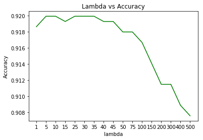


## 4c Composition of Weight Vector


```python
# YOUR CODE HERE
plt.plot(sum_w,'g')
plt.xlabel('lambda')
plt.ylabel('sum of weights')
plt.xticks(range(17),lambdas)
plt.title('sum of weights vs Accuracy')
```


    Text(0.5,1,'sum of weights vs Accuracy')


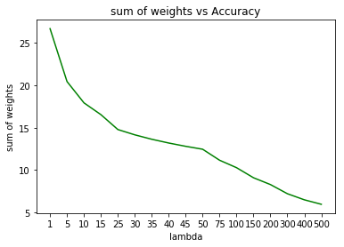


# 5 Exploration (optional)

## 5 b Bias


```python
X_bias = Xz - 0.5
wz_b, vz_b, ez_b = optimize(gd(y, X_bias), w0, nepochs=500)
```


```python

```

### 5 Exploration: PyTorch


```python
# if you want to experiment, here is an implementation of logistic
# regression in PyTorch
import math
import torch
import torch.nn as nn
import torch.utils.data
import torch.nn.functional as F

# prepare the data
Xztorch = torch.FloatTensor(Xz)
ytorch = torch.LongTensor(y)
train = torch.utils.data.TensorDataset(Xztorch, ytorch)


# manual implementation of logistic regression (without bias)
class LogisticRegression(nn.Module):
    def __init__(self, D, C):
        super(LogisticRegression, self).__init__()
        self.weights = torch.nn.Parameter(
            torch.randn(D, C) / math.sqrt(D)
        )  # xavier initialization
        self.register_parameter("W", self.weights)

    def forward(self, x):
        out = torch.matmul(x, self.weights)
        out = F.log_softmax(out)
        return out


# define the objective and update function. here we ignore the learning rates
# and parameters given to us by optimize (they are stored in the PyTorch model
# and optimizer, resp., instead)
def opt_pytorch():
    model = LogisticRegression(D, 2)
    criterion = nn.NLLLoss(reduction="sum")
    # change the next line to try different optimizers
    optimizer = torch.optim.SGD(model.parameters(), lr=learning_rate)
    #optimizer = torch.optim.Adam(model.parameters(), lr=learning_rate)

    def objective(_):
        outputs = model(Xztorch)
        return criterion(outputs, ytorch)

    def update(_1, _2):
        for i, (examples, labels) in enumerate(train_loader):
            outputs = model(examples)
            loss = criterion(outputs, labels)
            optimizer.zero_grad()
            loss.backward()
            optimizer.step()

        W = model.state_dict()["W"]
        w = W[:, 1] - W[:, 0]
        return w

    return (objective, update)
```


```python
# run the optimizer
#**************************SGD*************************************
learning_rate = 0.01
batch_size = 100  # number of data points to sample for gradient estimate
shuffle = True  # sample with replacement (false) or without replacement (true)

train_loader = torch.utils.data.DataLoader(train, batch_size, shuffle=True)
wz_t, vz_t, _ = optimize(opt_pytorch(), None, nepochs=100, eps0=None, verbose=True)
```

    C:\Users\sudha\Anaconda3\lib\site-packages\ipykernel_launcher.py:26: UserWarning: Implicit dimension choice for log_softmax has been deprecated. Change the call to include dim=X as an argument.
    

    Epoch   0: f=  1938.269, eps=       nan
    Epoch   1: f=   747.916, eps=       nan
    Epoch   2: f=   719.993, eps=       nan
    Epoch   3: f=   707.057, eps=       nan
    Epoch   4: f=   697.385, eps=       nan
    Epoch   5: f=   697.401, eps=       nan
    Epoch   6: f=   690.738, eps=       nan
    Epoch   7: f=   690.230, eps=       nan
    Epoch   8: f=   682.759, eps=       nan
    Epoch   9: f=   694.725, eps=       nan
    Epoch  10: f=   691.453, eps=       nan
    Epoch  11: f=   683.423, eps=       nan
    Epoch  12: f=   704.985, eps=       nan
    Epoch  13: f=   690.835, eps=       nan
    Epoch  14: f=   690.418, eps=       nan
    Epoch  15: f=   693.445, eps=       nan
    Epoch  16: f=   704.391, eps=       nan
    Epoch  17: f=   683.344, eps=       nan
    Epoch  18: f=   683.954, eps=       nan
    Epoch  19: f=   692.797, eps=       nan
    Epoch  20: f=   681.050, eps=       nan
    Epoch  21: f=   707.782, eps=       nan
    Epoch  22: f=   689.149, eps=       nan
    Epoch  23: f=   682.135, eps=       nan
    Epoch  24: f=   690.890, eps=       nan
    Epoch  25: f=   689.976, eps=       nan
    Epoch  26: f=   692.478, eps=       nan
    Epoch  27: f=   695.354, eps=       nan
    Epoch  28: f=   702.071, eps=       nan
    Epoch  29: f=   690.596, eps=       nan
    Epoch  30: f=   683.962, eps=       nan
    Epoch  31: f=   684.649, eps=       nan
    Epoch  32: f=   684.722, eps=       nan
    Epoch  33: f=   704.497, eps=       nan
    Epoch  34: f=   683.101, eps=       nan
    Epoch  35: f=   688.462, eps=       nan
    Epoch  36: f=   687.715, eps=       nan
    Epoch  37: f=   684.551, eps=       nan
    Epoch  38: f=   684.371, eps=       nan
    Epoch  39: f=   711.602, eps=       nan
    Epoch  40: f=   685.171, eps=       nan
    Epoch  41: f=   698.381, eps=       nan
    Epoch  42: f=   679.671, eps=       nan
    Epoch  43: f=   688.796, eps=       nan
    Epoch  44: f=   686.946, eps=       nan
    Epoch  45: f=   700.645, eps=       nan
    Epoch  46: f=   727.821, eps=       nan
    Epoch  47: f=   695.754, eps=       nan
    Epoch  48: f=   691.313, eps=       nan
    Epoch  49: f=   688.082, eps=       nan
    Epoch  50: f=   680.713, eps=       nan
    Epoch  51: f=   695.231, eps=       nan
    Epoch  52: f=   685.509, eps=       nan
    Epoch  53: f=   695.080, eps=       nan
    Epoch  54: f=   687.624, eps=       nan
    Epoch  55: f=   699.428, eps=       nan
    Epoch  56: f=   681.985, eps=       nan
    Epoch  57: f=   685.162, eps=       nan
    Epoch  58: f=   676.149, eps=       nan
    Epoch  59: f=   676.262, eps=       nan
    Epoch  60: f=   701.609, eps=       nan
    Epoch  61: f=   680.063, eps=       nan
    Epoch  62: f=   681.614, eps=       nan
    Epoch  63: f=   695.499, eps=       nan
    Epoch  64: f=   675.619, eps=       nan
    Epoch  65: f=   684.549, eps=       nan
    Epoch  66: f=   704.809, eps=       nan
    Epoch  67: f=   693.247, eps=       nan
    Epoch  68: f=   694.512, eps=       nan
    Epoch  69: f=   679.903, eps=       nan
    Epoch  70: f=   679.366, eps=       nan
    Epoch  71: f=   688.423, eps=       nan
    Epoch  72: f=   677.691, eps=       nan
    Epoch  73: f=   692.930, eps=       nan
    Epoch  74: f=   687.917, eps=       nan
    Epoch  75: f=   682.828, eps=       nan
    Epoch  76: f=   675.680, eps=       nan
    Epoch  77: f=   696.803, eps=       nan
    Epoch  78: f=   684.789, eps=       nan
    Epoch  79: f=   681.295, eps=       nan
    Epoch  80: f=   698.984, eps=       nan
    Epoch  81: f=   680.192, eps=       nan
    Epoch  82: f=   686.329, eps=       nan
    Epoch  83: f=   691.488, eps=       nan
    Epoch  84: f=   672.809, eps=       nan
    Epoch  85: f=   678.536, eps=       nan
    Epoch  86: f=   679.326, eps=       nan
    Epoch  87: f=   669.646, eps=       nan
    Epoch  88: f=   693.931, eps=       nan
    Epoch  89: f=   681.888, eps=       nan
    Epoch  90: f=   711.307, eps=       nan
    Epoch  91: f=   692.427, eps=       nan
    Epoch  92: f=   675.540, eps=       nan
    Epoch  93: f=   681.867, eps=       nan
    Epoch  94: f=   673.886, eps=       nan
    Epoch  95: f=   703.484, eps=       nan
    Epoch  96: f=   694.479, eps=       nan
    Epoch  97: f=   677.788, eps=       nan
    Epoch  98: f=   680.039, eps=       nan
    Epoch  99: f=   685.285, eps=       nan
    Result after 100 epochs: f=679.766357421875
    


```python
# run the optimizer
#**************************ADAM*************************************
learning_rate = 0.01
batch_size = 100  # number of data points to sample for gradient estimate
shuffle = True  # sample with replacement (false) or without replacement (true)

train_loader = torch.utils.data.DataLoader(train, batch_size, shuffle=True)
wz_t, vz_t, _ = optimize(opt_pytorch(), None, nepochs=100, eps0=None, verbose=True)
```

    C:\Users\sudha\Anaconda3\lib\site-packages\ipykernel_launcher.py:26: UserWarning: Implicit dimension choice for log_softmax has been deprecated. Change the call to include dim=X as an argument.
    

    Epoch   0: f=  2750.183, eps=       nan
    Epoch   1: f=   903.434, eps=       nan
    Epoch   2: f=   796.314, eps=       nan
    Epoch   3: f=   755.787, eps=       nan
    Epoch   4: f=   732.484, eps=       nan
    Epoch   5: f=   718.604, eps=       nan
    Epoch   6: f=   708.447, eps=       nan
    Epoch   7: f=   701.469, eps=       nan
    Epoch   8: f=   696.826, eps=       nan
    Epoch   9: f=   692.931, eps=       nan
    Epoch  10: f=   689.850, eps=       nan
    Epoch  11: f=   687.617, eps=       nan
    Epoch  12: f=   685.476, eps=       nan
    Epoch  13: f=   683.742, eps=       nan
    Epoch  14: f=   682.260, eps=       nan
    Epoch  15: f=   681.143, eps=       nan
    Epoch  16: f=   681.184, eps=       nan
    Epoch  17: f=   679.354, eps=       nan
    Epoch  18: f=   679.703, eps=       nan
    Epoch  19: f=   678.326, eps=       nan
    Epoch  20: f=   678.121, eps=       nan
    Epoch  21: f=   677.245, eps=       nan
    Epoch  22: f=   676.374, eps=       nan
    Epoch  23: f=   676.092, eps=       nan
    Epoch  24: f=   676.331, eps=       nan
    Epoch  25: f=   674.934, eps=       nan
    Epoch  26: f=   675.086, eps=       nan
    Epoch  27: f=   674.299, eps=       nan
    Epoch  28: f=   674.764, eps=       nan
    Epoch  29: f=   674.443, eps=       nan
    Epoch  30: f=   673.802, eps=       nan
    Epoch  31: f=   673.725, eps=       nan
    Epoch  32: f=   673.724, eps=       nan
    Epoch  33: f=   673.395, eps=       nan
    Epoch  34: f=   672.815, eps=       nan
    Epoch  35: f=   672.342, eps=       nan
    Epoch  36: f=   672.322, eps=       nan
    Epoch  37: f=   672.277, eps=       nan
    Epoch  38: f=   671.653, eps=       nan
    Epoch  39: f=   672.188, eps=       nan
    Epoch  40: f=   672.086, eps=       nan
    Epoch  41: f=   671.426, eps=       nan
    Epoch  42: f=   671.009, eps=       nan
    Epoch  43: f=   671.386, eps=       nan
    Epoch  44: f=   671.197, eps=       nan
    Epoch  45: f=   671.678, eps=       nan
    Epoch  46: f=   670.526, eps=       nan
    Epoch  47: f=   672.259, eps=       nan
    Epoch  48: f=   670.287, eps=       nan
    Epoch  49: f=   669.576, eps=       nan
    Epoch  50: f=   669.359, eps=       nan
    Epoch  51: f=   669.299, eps=       nan
    Epoch  52: f=   669.436, eps=       nan
    Epoch  53: f=   669.304, eps=       nan
    Epoch  54: f=   669.035, eps=       nan
    Epoch  55: f=   668.551, eps=       nan
    Epoch  56: f=   668.632, eps=       nan
    Epoch  57: f=   669.513, eps=       nan
    Epoch  58: f=   669.025, eps=       nan
    Epoch  59: f=   667.877, eps=       nan
    Epoch  60: f=   668.396, eps=       nan
    Epoch  61: f=   667.536, eps=       nan
    Epoch  62: f=   667.358, eps=       nan
    Epoch  63: f=   667.612, eps=       nan
    Epoch  64: f=   668.107, eps=       nan
    Epoch  65: f=   669.366, eps=       nan
    Epoch  66: f=   668.013, eps=       nan
    Epoch  67: f=   666.494, eps=       nan
    Epoch  68: f=   667.641, eps=       nan
    Epoch  69: f=   666.740, eps=       nan
    Epoch  70: f=   667.384, eps=       nan
    Epoch  71: f=   666.417, eps=       nan
    Epoch  72: f=   666.493, eps=       nan
    Epoch  73: f=   665.837, eps=       nan
    Epoch  74: f=   666.320, eps=       nan
    Epoch  75: f=   666.160, eps=       nan
    Epoch  76: f=   666.498, eps=       nan
    Epoch  77: f=   665.920, eps=       nan
    Epoch  78: f=   666.389, eps=       nan
    Epoch  79: f=   665.230, eps=       nan
    Epoch  80: f=   664.828, eps=       nan
    Epoch  81: f=   666.402, eps=       nan
    Epoch  82: f=   664.704, eps=       nan
    Epoch  83: f=   664.091, eps=       nan
    Epoch  84: f=   665.329, eps=       nan
    Epoch  85: f=   664.169, eps=       nan
    Epoch  86: f=   664.900, eps=       nan
    Epoch  87: f=   663.868, eps=       nan
    Epoch  88: f=   664.593, eps=       nan
    Epoch  89: f=   663.599, eps=       nan
    Epoch  90: f=   663.822, eps=       nan
    Epoch  91: f=   663.799, eps=       nan
    Epoch  92: f=   663.300, eps=       nan
    Epoch  93: f=   663.294, eps=       nan
    Epoch  94: f=   662.747, eps=       nan
    Epoch  95: f=   662.493, eps=       nan
    Epoch  96: f=   663.742, eps=       nan
    Epoch  97: f=   662.578, eps=       nan
    Epoch  98: f=   662.751, eps=       nan
    Epoch  99: f=   661.892, eps=       nan
    Result after 100 epochs: f=662.300048828125
    


```python

```
